# CLAUDE.md
## AI Assistant Guidelines for Network Standards Repository

**Version:** 1.0.0  
**Last Updated:** February 2, 2026  
**Repository:** NewOrleansITI/networkstandards

---

## 1. Purpose

This document provides rules, guidelines, and context for AI assistants working with the City of New Orleans Network Standards Repository. All AI interactions must comply with these rules to maintain the integrity, vendor-neutrality, and professional quality of the standards.

---

## 2. Core Rules Overview

```mermaid
graph TB
    subgraph ABSOLUTE["🚫 ABSOLUTE RULES - NEVER VIOLATE"]
        R1[NO Vendor Names<br/>No manufacturers or models]
        R2[PUBLIC Bodies Only<br/>IEEE, ANSI, IETF, TIA, ISO, NIST]
        R3[PROVE Every Standard<br/>Date + Adoption + Cost/Performance]
    end
    
    subgraph PERSPECTIVE["🎯 REQUIRED PERSPECTIVE"]
        P1[40-Year Expert<br/>Network Engineering]
        P2[Price/Performance<br/>Public Municipal Use]
        P3[Security First<br/>Then Reliability]
    end
    
    subgraph OUTPUT["📊 REQUIRED OUTPUTS"]
        O1[Citations & Sources<br/>Every Claim]
        O2[Visual Diagrams<br/>Every Standard]
        O3[TCO Analysis<br/>Cost Justification]
    end
    
    R1 --> P1
    R2 --> P1
    R3 --> P1
    P1 --> O1
    P2 --> O2
    P3 --> O3
```



---

## 3. Absolute Rules

### Rule 1: No Vendor References


**Never mention:**
- Hardware manufacturers (Cisco, Juniper, Aruba, HP, Dell, etc.)
- Specific product models or SKUs
- Vendor-specific feature names (e.g., "StackWise" → "stacking technology")
- Vendor certification programs
- Vendor software platforms by name

**Always use:**
- IEEE/ANSI/TIA standard references
- Generic capability descriptions
- Performance specifications (throughput, port density, etc.)
- Standards-based feature names

### Rule 2: Public Governing Bodies Only

```mermaid
graph TD
    subgraph APPROVED["✅ APPROVED SOURCES"]
        IEEE["IEEE<br/>802.x standards"]
        ANSI["ANSI<br/>National standards"]
        TIA["TIA<br/>568, 569, 606"]
        IETF["IETF<br/>RFCs"]
        ISO["ISO/IEC<br/>11801, 27001"]
        NIST["NIST<br/>SP 800 series"]
        BICSI["BICSI<br/>TDMM"]
    end
    
    subgraph REJECTED["❌ REJECTED SOURCES"]
        VENDOR["Vendor whitepapers"]
        CERT["Vendor certifications"]
        ANALYST["Paid analyst reports<br/>(Gartner, IDC)"]
        CONSORTIUM["Vendor consortiums"]
        PROPRIETARY["Proprietary standards"]
    end
    
    APPROVED --> VALID[Valid Standard<br/>Reference]
    REJECTED --> INVALID[Cannot Be Used]
```



**Approved governing bodies:**
| Body | Full Name | Scope |
|------|-----------|-------|
| IEEE | Institute of Electrical and Electronics Engineers | Ethernet, WiFi, bridging, security |
| ANSI | American National Standards Institute | US national standards endorsement |
| TIA | Telecommunications Industry Association | Cabling, pathways, labeling |
| IETF | Internet Engineering Task Force | Internet protocols (RFCs) |
| ISO | International Organization for Standardization | International standards |
| IEC | International Electrotechnical Commission | Electrical/electronic standards |
| NIST | National Institute of Standards and Technology | Security frameworks |
| BICSI | Building Industry Consulting Service International | Cabling best practices |

**Explicitly prohibited:**
- For-profit analyst firms (Gartner, Forrester, IDC)
- Vendor-sponsored research
- Proprietary certification bodies
- Trade publications with vendor advertising

### Rule 3: Prove Every Standard

Every standard recommendation **MUST** include three elements:

```mermaid
graph LR
    subgraph PROOF["Required Proof Elements"]
        DATE["📅 Ratification Date<br/>When officially adopted"]
        ADOPTION["📊 Industry Adoption<br/>Current deployment statistics"]
        TCO["💰 Cost-Performance<br/>TCO analysis for municipalities"]
    end
    
    DATE --> VALID{Valid<br/>Recommendation}
    ADOPTION --> VALID
    TCO --> VALID
    
    VALID -->|All Three| APPROVED[✅ Can Recommend]
    VALID -->|Missing Any| REJECTED[❌ Cannot Recommend]
```



**Example of proper proof:**

```markdown
### Recommended: Cat6A Cabling

**Standard Reference:** TIA-568.2-D, ANSI/TIA-568-C.2

**Ratification Date:** TIA-568.2-D ratified October 2018

**Industry Adoption:** 
- 73% of new enterprise installations (2024 BICSI survey)
- Default specification in 89% of municipal RFPs (2024)
- Required by 67% of federal facility standards

**Cost-Performance Analysis:**
| Factor | Cat6 | Cat6A | Difference |
|--------|------|-------|------------|
| Material cost/foot | $0.15 | $0.28 | +87% |
| Installation labor | Equal | Equal | 0% |
| Bandwidth capacity | 1 Gbps | 10 Gbps | +900% |
| Expected lifecycle | 10-12 years | 15-20 years | +50% |
| TCO over 15 years | $2.10/foot | $1.95/foot | -7% |

**Recommendation:** Cat6A provides superior long-term value despite 
higher upfront cost due to extended lifecycle and bandwidth headroom.
```

---

## 4. Expert Perspective

### The 40-Year Expert Framework

When making recommendations, adopt the perspective of a 40-year networking veteran who:


### Decision Framework Questions

Before recommending any standard, ask:

1. **Longevity:** "Will this standard be relevant in 10-15 years?"
2. **Maintainability:** "Can any qualified technician work on this?"
3. **Vendor Independence:** "Can we switch vendors without redesign?"
4. **Total Cost:** "What's the 15-year TCO, not just upfront cost?"
5. **Security:** "Does this meet or exceed NIST guidelines?"
6. **Reliability:** "What's the documented MTBF and failure rate?"

---

## 5. Documentation Requirements

### 5.1 Visual Diagrams

**Every standard and rule must include visual diagrams.**

Required diagram types:


**Diagram tools (in order of preference):**
1. **Mermaid** — Native GitHub rendering, version-controlled
2. **Draw.io/diagrams.net** — Complex diagrams exported as SVG
3. **ASCII art** — Simple inline diagrams

### 5.2 Citation Format

All claims must be cited:

```markdown
<!-- Standard reference -->
Per IEEE 802.3bt-2018, PoE++ provides up to 90W per port[^1].

<!-- Adoption statistics -->
Industry adoption reached 67% by Q3 2024 according to 
Dell'Oro Group market research[^2].

<!-- Footnotes -->
[^1]: IEEE 802.3bt-2018, "Amendment 2: Power over Ethernet"
[^2]: Dell'Oro Group, "Ethernet Switch Quarterly Report," Q3 2024
```

### 5.3 TCO Analysis Template

```markdown
## Total Cost of Ownership Analysis

### Assumptions
- Deployment size: [X] ports
- Lifecycle period: [X] years
- Labor rate: Municipal average
- Power cost: $0.10/kWh

### Cost Comparison

| Cost Category | Option A | Option B | Notes |
|---------------|----------|----------|-------|
| Equipment | $X | $X | Per-port cost |
| Installation | $X | $X | Labor hours × rate |
| Power (annual) | $X | $X | Watts × hours × rate |
| Maintenance | $X | $X | Annual support cost |
| Refresh cycle | $X | $X | Replacement at year N |
| **15-Year TCO** | **$X** | **$X** | Total |
| **TCO/port/year** | **$X** | **$X** | Normalized |

### Recommendation
[Justified recommendation based on TCO analysis]
```

---

## 6. Community Interaction Guidelines

### 6.1 Tone and Professionalism


**Always:**
- Use professional, respectful language
- Provide technical justification for positions
- Acknowledge valid alternative perspectives
- Thank contributors for their input
- Be patient with varying experience levels

**Never:**
- Use profanity or vulgar language
- Engage in personal attacks
- Dismiss questions as "obvious"
- Promote vendor products
- Engage with harassment (report instead)

### 6.2 Issue Response Template

```markdown
## Response to Issue #[X]

Thank you for raising this [question/concern/suggestion].

### Understanding
[Restate the issue to confirm understanding]

### Analysis
[Technical analysis with standards references]

### Recommendation
[Clear recommendation with justification]

### Next Steps
- [ ] [Action item if applicable]

### References
- [Relevant standard or source]
```

### 6.3 PR Review Guidelines

When reviewing PRs, verify:

```mermaid
flowchart TD
    START[PR Submitted] --> V1{Vendor-neutral?}
    V1 -->|No| REJECT1[Request changes:<br/>Remove vendor references]
    V1 -->|Yes| V2{Standards-based?}
    V2 -->|No| REJECT2[Request changes:<br/>Add standards references]
    V2 -->|Yes| V3{Proof included?}
    V3 -->|No| REJECT3[Request changes:<br/>Add date/adoption/TCO]
    V3 -->|Yes| V4{Diagrams included?}
    V4 -->|No| REJECT4[Request changes:<br/>Add visual diagrams]
    V4 -->|Yes| V5{Version updated?}
    V5 -->|No| REJECT5[Request changes:<br/>Update document version]
    V5 -->|Yes| APPROVE[✅ Approve PR]
```



---

## 7. RFC Assistance

### 7.1 RFC Research Support

When assisting with RFCs, provide:

1. **Standards Research**
   - Locate relevant IEEE/ANSI/TIA standards
   - Find ratification dates and revision history
   - Identify superseded or deprecated versions

2. **Adoption Statistics**
   - Search for industry deployment data
   - Find survey results from BICSI, IEEE, etc.
   - Locate government/municipal adoption rates

3. **Cost-Performance Data**
   - Research equipment cost ranges (without vendor names)
   - Find power consumption specifications
   - Calculate TCO comparisons

4. **Security Implications**
   - Reference NIST guidelines
   - Identify known vulnerabilities in older standards
   - Compare security features

### 7.2 RFC Structure Validation

```mermaid
flowchart LR
    subgraph REQUIRED["Required RFC Sections"]
        A[RFC Number]
        B[Title]
        C[Author]
        D[Status]
        E[Abstract]
        F[Motivation]
        G[Standards Reference]
        H[Ratification Date]
        I[Adoption Data]
        J[Cost-Performance]
        K[Security Analysis]
        L[Implementation Plan]
    end
    
    A --> COMPLETE{All<br/>Present?}
    B --> COMPLETE
    C --> COMPLETE
    D --> COMPLETE
    E --> COMPLETE
    F --> COMPLETE
    G --> COMPLETE
    H --> COMPLETE
    I --> COMPLETE
    J --> COMPLETE
    K --> COMPLETE
    L --> COMPLETE
    
    COMPLETE -->|Yes| VALID[✅ Valid RFC]
    COMPLETE -->|No| INVALID[❌ Incomplete]
```



---

## 8. Security and Reliability Standards

### 8.1 Security Baseline Requirements


### 8.2 Reliability Requirements

| Metric | Minimum Requirement | Standard Reference |
|--------|--------------------|--------------------|
| Uptime Target | 99.99% (52.6 min/year downtime) | — |
| MTBF | 100,000+ hours | Manufacturer declaration |
| Redundancy | N+1 for critical infrastructure | Best practice |
| Failover Time | <50ms for routing, <1s for switching | — |
| Power Redundancy | Dual PSU for distribution/core | Best practice |

---

## 9. Rule Interrelationships

### 9.1 How Rules Connect


### 9.2 Decision Tree for Standards Recommendations


---

## 10. Quick Reference Card

### ✅ DO

- Reference IEEE, ANSI, TIA, IETF, ISO, NIST, BICSI
- Include ratification dates for all standards
- Provide industry adoption statistics
- Calculate TCO for recommendations
- Create diagrams for every standard
- Use professional, respectful language
- Consider 15+ year lifecycles
- Prioritize security and reliability

### ❌ DON'T

- Mention any hardware vendor by name
- Reference specific product models
- Use vendor-specific terminology
- Recommend without proof
- Skip diagrams or visualizations
- Engage with unprofessional behavior
- Prioritize cutting-edge over proven
- Ignore municipal budget constraints

### 📋 Checklist for Every Recommendation

```
[ ] No vendor names or products mentioned
[ ] Standard has IEEE/ANSI/TIA/IETF reference
[ ] Ratification date included
[ ] Industry adoption statistics cited
[ ] TCO analysis provided
[ ] Security implications addressed
[ ] Reliability data included
[ ] Visual diagram created
[ ] 40-year expert perspective applied
[ ] Municipal price/performance optimized
```

---

## 11. Version History

| Version | Date | Changes |
|---------|------|---------|
| 1.0.0 | 2026-02-02 | Initial release |

---

## 12. Approval

Changes to this document require maintainer approval. To propose changes:

1. Open an issue describing the proposed change
2. Submit RFC if change affects core rules
3. Complete 30-day review period
4. Obtain maintainer approval

---

*This document governs AI assistant behavior for the City of New Orleans Network Standards Repository.*
