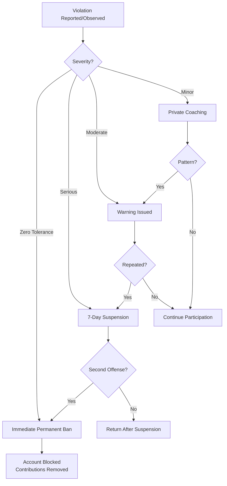

# Code of Conduct

## City of New Orleans Network Standards Repository

**Version:** 1.0.0  
**Effective Date:** February 2, 2026

---

## Our Commitment

The City of New Orleans Network Standards Repository is committed to providing a professional, respectful, and harassment-free environment for everyone participating in our community. We expect all participants to uphold the highest standards of professional conduct.

This Code of Conduct applies to all repository spaces, including issues, pull requests, discussions, and any other communication channels associated with this project.

---

## Professional Standards

### Expected Behavior

All community members are expected to:

#### Specifically:

1. **Use Professional Language**
   - Communicate clearly and respectfully
   - Avoid slang, jargon, or colloquialisms that may confuse non-native speakers
   - Write as if your communications will be read by your employer

2. **Provide Constructive Feedback**
   - Critique ideas, not people
   - Offer specific, actionable suggestions
   - Acknowledge strengths before addressing weaknesses

3. **Focus on Technical Merit**
   - Evaluate contributions based on standards compliance and quality
   - Support positions with evidence and references
   - Remain objective in technical discussions

4. **Respect Differing Viewpoints**
   - Acknowledge that reasonable people can disagree
   - Engage thoughtfully with alternative perspectives
   - Seek common ground where possible

5. **Welcome All Experience Levels**
   - Be patient with those learning
   - Provide helpful guidance to newcomers
   - Never dismiss questions as "obvious" or "basic"

---

## Prohibited Conduct

The following behaviors are strictly prohibited and will result in immediate moderation action:

### Zero Tolerance Violations

### Serious Violations

| Violation | Description | First Offense |
|-----------|-------------|---------------|
| **Profanity** | Use of vulgar, obscene, or offensive language | 7-day suspension |
| **Harassment** | Repeated unwelcome contact or attention | 7-day suspension |
| **Personal attacks** | Insulting or demeaning individuals | 7-day suspension |
| **Discrimination** | Bias based on protected characteristics | Permanent ban |
| **Trolling** | Deliberately inflammatory or disruptive posts | Warning → Ban |
| **Spam** | Unsolicited promotional content | Immediate removal |
| **Vendor promotion** | Marketing specific products or services | Warning → Ban |

### Moderate Violations

| Violation | Description | Action |
|-----------|-------------|--------|
| **Off-topic discussions** | Derailing technical threads | Warning, post removal |
| **Unconstructive criticism** | Complaints without solutions | Coaching |
| **Dismissive responses** | Belittling legitimate questions | Warning |
| **Excessive self-promotion** | Repeated references to personal work | Warning |

---

## Scope of Application

This Code of Conduct applies to:

- **GitHub Repository**
  - Issues and issue comments
  - Pull requests and PR reviews
  - Discussions
  - Commit messages
  - Wiki pages

- **Associated Platforms**
  - Any official project communication channels
  - Project-related social media accounts
  - Conference presentations about this project

- **Public Representation**
  - When speaking on behalf of the project
  - When identified as a project contributor in professional settings

---

## Enforcement

### Enforcement Process

### Enforcement Actions

| Level | Action | Duration | Appeal |
|-------|--------|----------|--------|
| **Coaching** | Private feedback on behavior | N/A | N/A |
| **Warning** | Public or private notice | Documented | N/A |
| **Suspension** | Temporary participation ban | 7-30 days | After 48 hours |
| **Permanent Ban** | Permanent exclusion | Indefinite | After 6 months |

### Reporting Violations

To report a Code of Conduct violation:

1. **GitHub Issues** — For public violations, open an issue with the `code-of-conduct` label
2. **Email** — For sensitive matters, email networkingteam@nola.gov with subject line "CoC Report"
3. **Direct Message** — Contact the maintainer directly on GitHub

**Report should include:**
- Description of the incident
- Link to the offending content (if applicable)
- Any additional context
- Your preferred resolution (optional)

**Response Timeline:**
- Acknowledgment within 48 hours
- Initial assessment within 7 days
- Resolution within 14 days (complex cases may take longer)

---

## Appeals

### Appeal Process

Participants who have been sanctioned may appeal by:

1. Waiting the required period (48 hours for suspensions, 6 months for bans)
2. Emailing networkingteam@nola.gov with:
   - The original violation
   - Why you believe the decision was incorrect
   - What steps you've taken to prevent recurrence
3. Awaiting review by the maintainer (within 14 days)

Appeals are reviewed by the maintainer with input from the reviewer team. Decisions are final.

---

## Contributor Responsibilities

### All Contributors

- Read and understand this Code of Conduct
- Follow the guidelines in all project spaces
- Report violations when observed
- Accept enforcement decisions gracefully

### Reviewers

- Model exemplary professional conduct
- Apply enforcement fairly and consistently
- Escalate serious violations to the maintainer
- Protect reporter confidentiality

### Maintainer

- Final authority on enforcement decisions
- Ensure consistent application of standards
- Review appeals fairly
- Update this Code of Conduct as needed

---

## Acknowledgment

This Code of Conduct is adapted from:
- [Contributor Covenant](https://www.contributor-covenant.org/) v2.1
- [Django Code of Conduct](https://www.djangoproject.com/conduct/)
- Federal workplace conduct standards

---

## Version History

| Version | Date | Changes |
|---------|------|---------|
| 1.0.0 | 2026-02-02 | Initial release |

---

## Contact

- **Maintainer:** Christopher, City of New Orleans ITI
- **Email:** networkingteam@nola.gov
- **Response Time:** Within 48 hours for Code of Conduct matters

---

*By participating in this project, you agree to abide by this Code of Conduct.*
