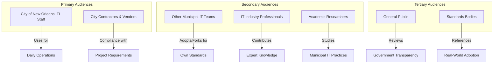
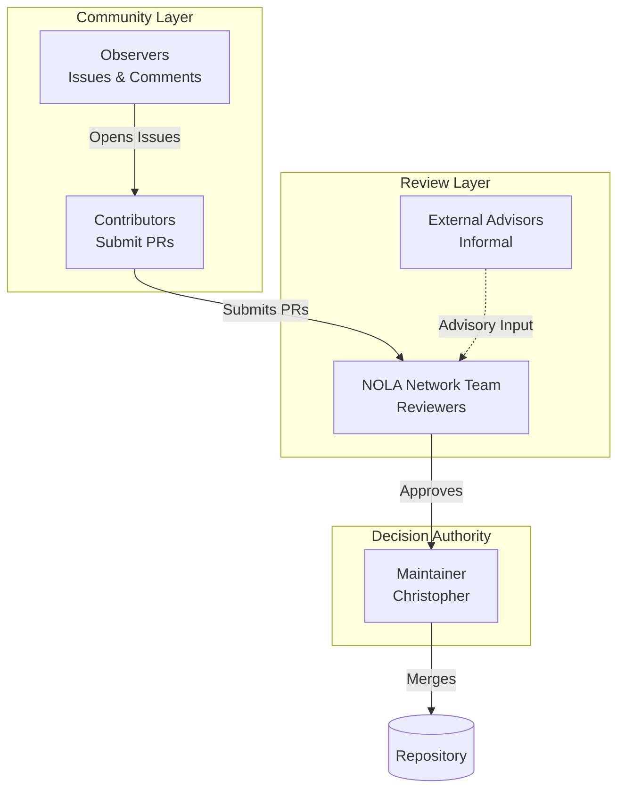
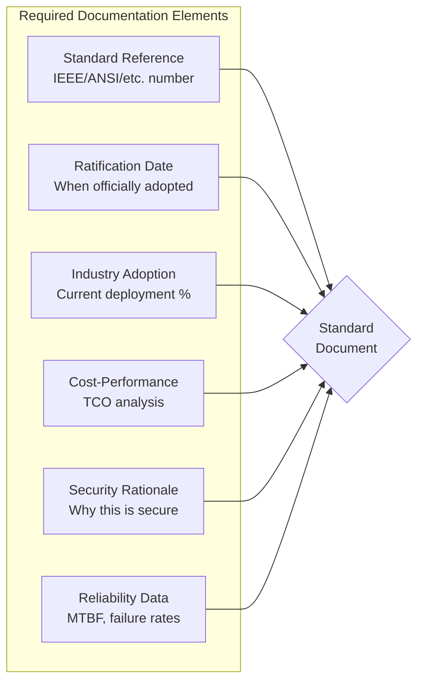
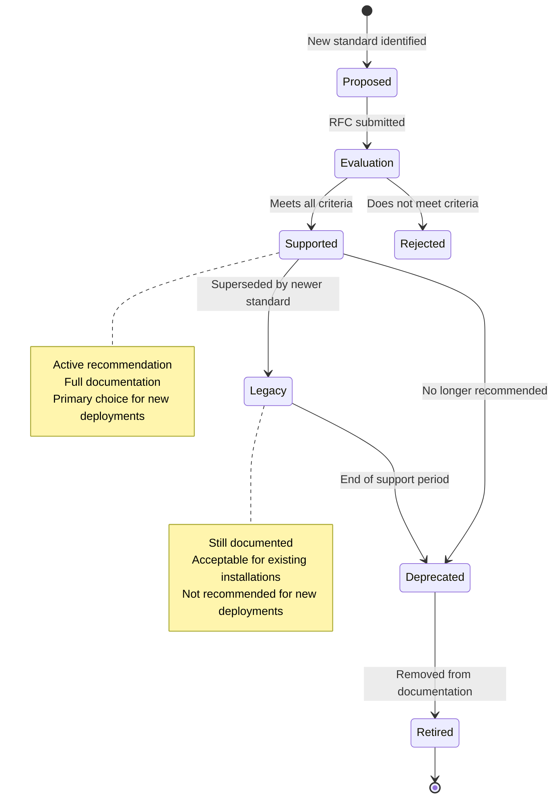
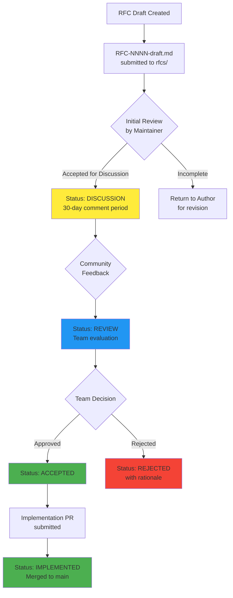
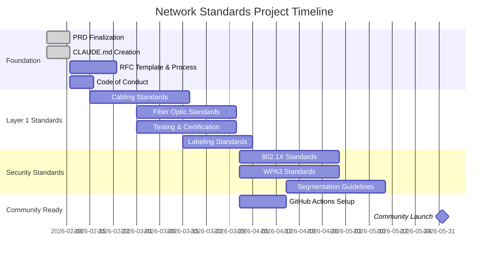

# Product Requirements Document
## City of New Orleans Network Standards Repository

**Version:** 1.0.0  
**Last Updated:** February 2, 2026  
**Document Owner:** Christopher, City of New Orleans ITI Networking Team  
**Target Completion:** June 1, 2026

---

## 1. Executive Summary

The City of New Orleans Network Standards Repository is a public, open-source initiative to establish vendor-neutral wired and wireless networking standards for municipal infrastructure. This project serves dual purposes: standardizing internal city network deployments and creating a collaborative resource for IT professionals, other municipalities, and the general public to contribute to and adopt.

All standards are derived exclusively from public governing bodies (IEEE, ANSI, IETF, TIA, ISO) and are argued from the perspective of a 40-year networking expert optimizing price-to-performance ratios for public municipal use.

---

## 2. Vision & Goals

### 2.1 Vision Statement

To create the definitive open-source reference for municipal network infrastructure standards that maximizes security, reliability, and cost-effectiveness while remaining completely vendor-neutral.

### 2.2 Primary Goals

| Goal | Description | Success Metric |
|------|-------------|----------------|
| Internal Standardization | Establish authoritative standards for all City of New Orleans network deployments | 100% of new city projects reference these standards |
| Community Collaboration | Build a vibrant community of municipal IT professionals sharing best practices | Stars, forks, issues, and PRs from external contributors |
| Municipal Adoption | Become a template for other cities and government entities | Number of municipalities forking or citing the repository |
| Industry Recognition | Establish New Orleans ITI as a thought leader in municipal networking | Conference citations, press coverage, expert engagement |

### 2.3 Non-Goals

- Recommending specific hardware vendors or product models
- Creating proprietary or licensed standards
- Providing network design services or consulting
- Hosting operational network configurations or credentials

---

## 3. Target Audiences



---

## 4. Scope

### 4.1 In-Scope

#### Layer 1 (Physical) — **HIGHEST PRIORITY**
- Structured cabling categories (Cat6, Cat6A, Cat7, fiber)
- Cable testing and certification requirements (compliance with TIA-568 standards)
- Pathway and conduit specifications
- Labeling and documentation requirements
- Fiber optic types (single-mode, multi-mode: OM3, OM4, OS2)
- Physical security of network infrastructure

#### Layer 2 (Data Link)
- Switching standards and port configurations
- VLAN architecture and segmentation
- Spanning Tree Protocol configurations
- Link aggregation standards (IEEE 802.3ad/802.1AX)

#### Layer 3 (Network)
- IP addressing schemes and allocation
- Routing protocol standards
- Subnetting guidelines
- Inter-VLAN routing

#### Layers 4-7 (Transport/Application)
- Network services (DNS, DHCP, NTP)
- Quality of Service (QoS) policies
- Traffic management

#### Security (Cross-Layer)
- 802.1X port-based authentication
- WPA3-Enterprise for wireless
- Network segmentation (IoT isolation, guest networks)
- Certificate management
- NAC integration requirements

#### Wireless
- Access point placement guidelines
- SSID naming and security standards
- Wireless survey requirements
- Roaming and coverage standards

### 4.2 Out-of-Scope

- Specific vendor product recommendations
- Proprietary configuration templates
- Operational credentials or live network data
- Network monitoring tool selection
- Cloud service provider standards

---

## 5. Governance Model

### 5.1 Organizational Structure



### 5.2 Contributor Roles

| Role | Permissions | Responsibilities |
|------|-------------|------------------|
| **Maintainer** | Merge PRs, manage releases, admin settings | Final approval authority, release management, community health |
| **Reviewer** | Approve PRs, triage issues | Technical review, standards compliance verification |
| **Contributor** | Submit PRs, participate in RFCs | Propose changes, engage in technical discussions |
| **Observer** | Open issues, comment on discussions | Report errors, suggest improvements, ask questions |

### 5.3 External Advisory

External networking experts (academics, IETF participants, municipal CIOs) may be invited on an informal, per-RFC basis to provide advisory input on major standards changes. This is not a formal board structure.

---

## 6. Standards Framework

### 6.1 Governing Bodies

All standards must be derived from the following non-profit, public governing bodies:

| Organization | Scope | Key Standards |
|--------------|-------|---------------|
| **IEEE** | Ethernet, WiFi, bridging | 802.3, 802.11, 802.1Q, 802.1X |
| **ANSI** | US national standards | Endorses TIA/EIA standards |
| **TIA** | Telecommunications infrastructure | TIA-568, TIA-569, TIA-606 |
| **IETF** | Internet protocols | RFCs for IP, DNS, DHCP, etc. |
| **ISO** | International standards | ISO/IEC 11801 (generic cabling) |
| **NIST** | Security frameworks | SP 800 series, cybersecurity guidelines |
| **BICSI** | Cabling best practices | TDMM, installer certifications |

**Explicitly excluded:** For-profit agencies, vendor consortiums, proprietary certification bodies.

### 6.2 Standards Documentation Requirements

Every standard documented in this repository **MUST** include:



### 6.3 Standards Lifecycle



| Status | Definition | Documentation |
|--------|------------|---------------|
| **Supported** | Actively recommended for new deployments | Full documentation, TCO analysis |
| **Legacy** | Acceptable for existing installations, not for new | Maintained docs, migration guidance |
| **Deprecated** | Should be replaced when possible | Sunset timeline, replacement path |
| **Retired** | No longer documented or supported | Archived for historical reference |

### 6.4 Amendment Evaluation Process

When IEEE or other governing bodies release new amendments:

1. **Monitor** — Track new standard publication
2. **Research** — Gather industry adoption statistics (minimum 18-month observation)
3. **Analyze** — Compare cost-performance against current standard
4. **RFC** — Submit formal proposal with evidence
5. **Review** — 30-day community comment period
6. **Decision** — Team evaluation and maintainer approval

---

## 7. RFC Process

### 7.1 RFC Lifecycle



### 7.2 RFC Document Structure

All RFCs must follow this template:

```
rfcs/
├── RFC-0001-title.md
├── RFC-0002-title.md
└── RFC-TEMPLATE.md
```

**RFC Template Fields:**
- RFC Number (assigned by maintainer)
- Title
- Author(s)
- Status (Draft → Discussion → Review → Accepted/Rejected → Implemented)
- Created Date
- Discussion Period End Date
- Abstract
- Motivation
- Standards Reference (IEEE/ANSI/etc.)
- Ratification Date
- Industry Adoption Data
- Cost-Performance Analysis
- Security Implications
- Reliability Considerations
- Backwards Compatibility
- Implementation Plan
- References

### 7.3 RFC Numbering

- Format: `RFC-NNNN-short-title.md`
- Numbers assigned sequentially by maintainer
- Numbers are never reused, even for rejected RFCs

---

## 8. Issue & PR Management

### 8.1 Issue Labels

| Label | Color | Description |
|-------|-------|-------------|
| `standard-proposal` | 🟢 Green | Proposal for new or modified standard |
| `clarification-needed` | 🟡 Yellow | Existing documentation needs clarification |
| `security-concern` | 🔴 Red | Security-related issue or vulnerability |
| `typo-fix` | 🔵 Blue | Minor textual correction |
| `rfc-required` | 🟣 Purple | Issue requires RFC process |
| `good-first-issue` | 🟢 Light Green | Suitable for new contributors |
| `help-wanted` | 🟠 Orange | Community assistance requested |
| `wontfix` | ⚪ Gray | Will not be addressed |

### 8.2 Service Level Guidelines

> **Note:** These are internal tracking goals, not commitments.

| Action | Target | Notes |
|--------|--------|-------|
| Issue acknowledgment | 7 days | Initial response or label |
| Triage completion | 14 days | Proper labeling and assignment |
| PR initial review | 14 days | First substantive feedback |
| RFC discussion period | 30 days | Minimum open comment period |

### 8.3 Pull Request Requirements

All PRs must:

1. Reference an existing issue or RFC
2. Pass automated checks (link validation, format)
3. Include updated version numbers if modifying standards
4. Receive at least one reviewer approval
5. Complete 30-day review period for standards changes
6. Not reference specific vendors or products

---

## 9. Versioning Strategy

### 9.1 Repository Versioning

Follows Semantic Versioning (SemVer):

- **MAJOR** (X.0.0): Breaking changes to standards structure
- **MINOR** (0.X.0): New standards added, significant updates
- **PATCH** (0.0.X): Clarifications, typo fixes, minor updates

### 9.2 Document Versioning

Each standards document maintains independent versioning:

```
docs/
├── ethernet/
│   ├── cabling-standards.md      # v2.1.0
│   ├── switch-specifications.md  # v1.3.0
│   └── port-configurations.md    # v1.1.0
└── wifi/
    ├── access-point-specs.md     # v1.2.0
    └── ssid-standards.md         # v1.0.0
```

Document headers must include:
```markdown
---
title: Cabling Standards
version: 2.1.0
status: Supported
last_updated: 2026-02-01
ieee_reference: IEEE 802.3
---
```

---

## 10. Code of Conduct

### 10.1 Core Principles

This project maintains a **strict professional standard** for all community interactions:

1. **Professionalism** — All communication must be professional, respectful, and constructive
2. **Inclusion** — Welcome participants regardless of background, experience level, or affiliation
3. **Technical Focus** — Keep discussions focused on technical merit and standards compliance
4. **Good Faith** — Assume positive intent; seek clarification before criticism

### 10.2 Prohibited Conduct

The following will result in immediate moderation action:

- Profanity, vulgar language, or offensive content
- Harassment, intimidation, or personal attacks
- Discrimination based on any protected characteristic
- Spam, self-promotion, or vendor marketing
- Disclosure of private information
- Disruptive behavior that derails technical discussion

### 10.3 Enforcement

| Violation | First Offense | Second Offense | Third Offense |
|-----------|---------------|----------------|---------------|
| Minor (tone, off-topic) | Warning | 7-day suspension | Permanent ban |
| Moderate (harassment, profanity) | 7-day suspension | Permanent ban | — |
| Severe (threats, discrimination) | Permanent ban | — | — |

Enforcement decisions are made by the Maintainer with input from the Reviewer team.

---

## 11. Technical Documentation Priorities

### 11.1 Layer 1 Documentation (Phase 1 — Highest Priority)

| Document | Priority | Target Date |
|----------|----------|-------------|
| Structured Cabling Categories | P0 | March 15, 2026 |
| Cable Testing & Certification | P0 | March 15, 2026 |
| Fiber Optic Standards | P0 | March 30, 2026 |
| Pathway & Conduit Specifications | P1 | April 15, 2026 |
| Labeling & Documentation | P1 | April 15, 2026 |

### 11.2 Security Documentation (Phase 2)

| Document | Priority | Target Date |
|----------|----------|-------------|
| 802.1X Implementation | P0 | April 30, 2026 |
| WPA3-Enterprise Standards | P0 | April 30, 2026 |
| Network Segmentation | P1 | May 15, 2026 |

### 11.3 Lifecycle Guidance

All standards should include expected lifecycle guidance based on IEEE progression patterns:

| Infrastructure Type | Expected Lifecycle | Basis |
|--------------------|--------------------|-------|
| Cat6A Cabling | 15-20 years | TIA-568 revision cycles |
| Fiber (OM4) | 20-25 years | Modal bandwidth headroom |
| Fiber (OS2) | 25+ years | Single-mode longevity |
| Wireless APs | 5-7 years | IEEE 802.11 amendment cycle |
| Switches (Enterprise) | 7-10 years | Vendor support cycles |

---

## 12. Success Metrics

### 12.1 Quantitative Metrics

| Metric | Target (Year 1) | Measurement |
|--------|-----------------|-------------|
| GitHub Stars | 50+ | Repository statistics |
| Repository Forks | 10+ | Repository statistics |
| External Contributors | 5+ | Unique PR authors outside NOLA |
| RFCs Submitted | 10+ | RFC folder count |
| Municipal Adoptions | 3+ | Documented forks/citations |

### 12.2 Qualitative Metrics

- Internal compliance: All new city network projects reference standards
- Industry recognition: Citation in conference presentations or publications
- Community health: Positive contributor feedback, minimal moderation issues
- Documentation quality: Low clarification-needed issues relative to total

---

## 13. Risk Assessment

| Risk | Likelihood | Impact | Mitigation |
|------|------------|--------|------------|
| Low community engagement | Medium | Medium | Active outreach, good-first-issue labels |
| Standards become outdated | Low | High | RFC process, amendment monitoring |
| Vendor influence attempts | Medium | High | Strict no-vendor policy, PR review |
| Maintainer availability | Medium | High | Document processes, identify backup reviewers |
| Scope creep | Medium | Medium | Clear in-scope/out-of-scope definitions |

---

## 14. Timeline



---

## 15. Appendices

### Appendix A: Interview Responses

The following responses were captured during the PRD development interview:

1. **Audience Priority:** Both internal standardization and collaborative open standard from day one
2. **Merge Authority:** Christopher (primary), with New Orleans network team review
3. **Scope:** All layers, Layer 1 highest priority
4. **Amendment Handling:** Vet against industry adoption for cost-effectiveness; Legacy vs Supported designation
5. **Cost-Performance:** Generic TCO frameworks, not specific procurement data
6. **Issue Labels:** standard-proposal, clarification-needed, security-concern, typo-fix
7. **SLAs:** Track internally, liberal targets, not publicly committed
8. **PR Review Period:** 30 days minimum
9. **RFC Process:** Required before standards PRs
10. **Contributor Tiers:** Yes (Observer, Contributor, Reviewer, Maintainer)
11. **Code of Conduct:** Strict, professional, zero tolerance for harassment
12. **External Experts:** Open to informal advisory engagement
13. **Layer 1 Priorities:** All items (cabling, testing, pathways, labeling, fiber)
14. **Security Baseline:** 802.1X, WPA3-Enterprise, full segmentation
15. **Lifecycle Guidance:** Yes, include expected service life based on IEEE patterns
16. **PRD Location:** Separate from public-facing standards
17. **CLAUDE.md Scope:** Both repo rules and community interaction guidance
18. **Documentation Format:** Keep Markdown/Jekyll, plan for future framework migration
19. **Document Versioning:** Independent version numbers per document
20. **Team Skills:** Git (basic), Markdown (basic), Actions (none), Community (basic)
21. **AI Tasks:** All proposed (drafting, research, PR review, Q&A, cost analysis)
22. **Automation:** All proposed (templates, link checking, labeling, notifications)
23. **Timeline:** June 1, 2026 deadline
24. **Success Metrics:** All proposed (adoption, engagement, compliance, recognition)
25. **RFC Location:** Dedicated folder with numbering scheme
26. **Existing Standards:** Fresh start
27. **Advisory Board:** Informal, per-RFC basis
28. **Public Communication:** Plan for it, don't count on it

### Appendix B: Glossary

| Term | Definition |
|------|------------|
| **IEEE** | Institute of Electrical and Electronics Engineers |
| **ANSI** | American National Standards Institute |
| **TIA** | Telecommunications Industry Association |
| **IETF** | Internet Engineering Task Force |
| **RFC** | Request for Comments (in this project's context) |
| **TCO** | Total Cost of Ownership |
| **SLA** | Service Level Agreement |
| **PR** | Pull Request |

---

*Document maintained by City of New Orleans Department of Information Technology and Innovation*
