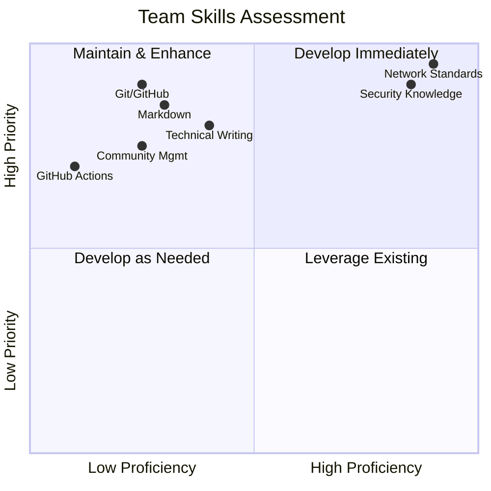
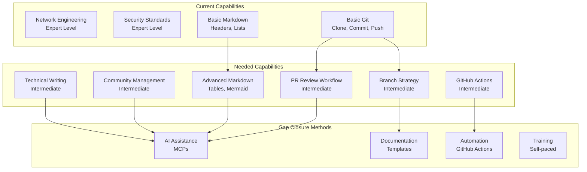
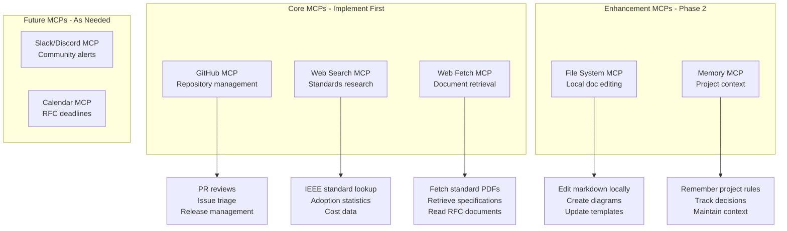
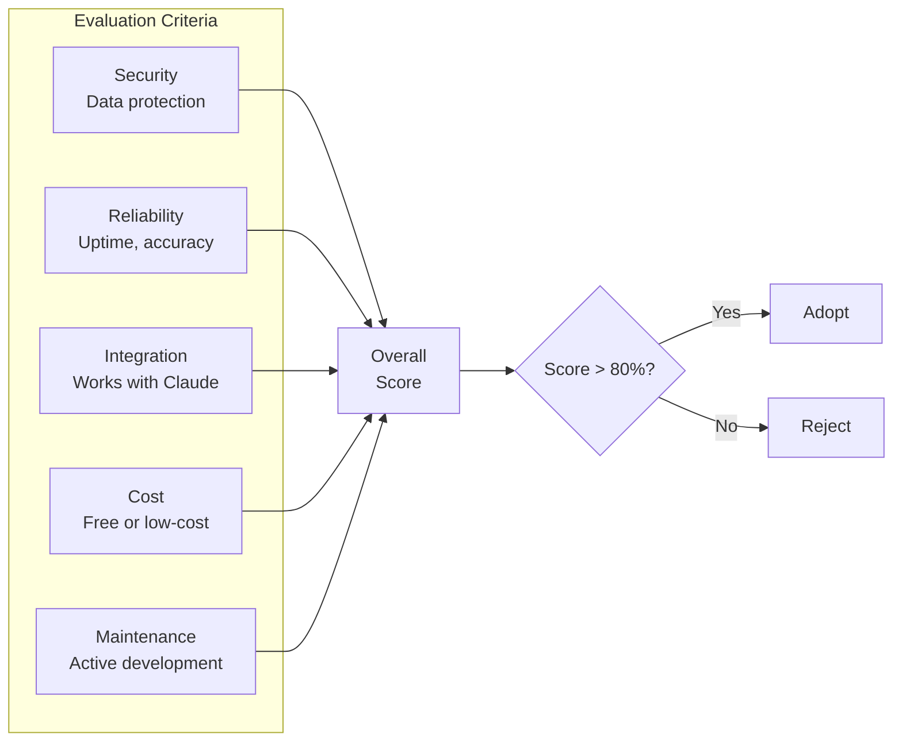
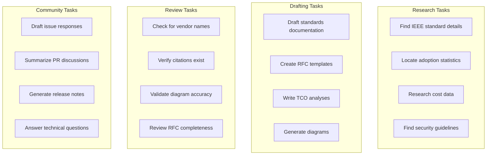

# Skills Assessment & MCP Recommendations

## City of New Orleans Network Standards Repository

**Version:** 1.0.0  
**Last Updated:** February 2, 2026  
**Purpose:** Evaluate current team capabilities and recommend tooling for AI-assisted repository management

---

## 1. Current Skills Assessment

### 1.1 Team Skills Matrix

Based on the project interview, the following skills assessment was documented:



### 1.2 Detailed Assessment

| Skill Area | Current Level | Project Need | Gap |
|------------|---------------|--------------|-----|
| **Git/GitHub** | Basic | Intermediate | 🟡 Medium |
| **Markdown Editing** | Basic | Intermediate | 🟡 Medium |
| **GitHub Actions/Automation** | None | Intermediate | 🔴 High |
| **Open Source Community Management** | Basic | Intermediate | 🟡 Medium |
| **Technical Writing** | Not assessed | High | 🟡 Medium |
| **Network Standards Knowledge** | Expert | Expert | 🟢 None |
| **Security/Compliance** | Expert | Expert | 🟢 None |

### 1.3 Skills Gap Analysis



---

## 2. Recommended Skills Development

### 2.1 Priority 1: GitHub Workflow (Weeks 1-4)

**Objective:** Enable confident management of PRs, branches, and releases.

| Topic | Resources | Time Estimate |
|-------|-----------|---------------|
| Branch strategy (main, develop, feature) | GitHub Flow Guide | 2 hours |
| PR review process | GitHub PR Tutorial | 2 hours |
| Merge strategies (squash, rebase, merge) | Git Documentation | 1 hour |
| Release tagging | GitHub Releases Guide | 1 hour |
| Protected branches | GitHub Branch Protection | 1 hour |

**Practical Exercise:** Create a test repository and practice the full PR workflow.

### 2.2 Priority 2: Advanced Markdown & Diagrams (Weeks 2-4)

**Objective:** Create professional documentation with embedded diagrams.

| Topic | Resources | Time Estimate |
|-------|-----------|---------------|
| Markdown tables | GitHub Markdown Guide | 30 min |
| Mermaid diagrams | Mermaid.js Documentation | 3 hours |
| GitHub Flavored Markdown | GFM Spec | 1 hour |
| Document structure best practices | Google Technical Writing | 2 hours |

**Practical Exercise:** Convert an existing standards document to include Mermaid diagrams.

### 2.3 Priority 3: GitHub Actions Basics (Weeks 3-6)

**Objective:** Implement basic automation for the repository.

| Topic | Resources | Time Estimate |
|-------|-----------|---------------|
| Actions concepts (workflows, jobs, steps) | GitHub Actions Docs | 2 hours |
| YAML syntax for workflows | YAML Tutorial | 1 hour |
| Common actions (checkout, labeler) | GitHub Marketplace | 2 hours |
| Secrets and environment variables | Actions Security Guide | 1 hour |

**Practical Exercise:** Implement the auto-labeling workflow (see Section 4).

### 2.4 Priority 4: Community Management (Ongoing)

**Objective:** Build and maintain a healthy contributor community.

| Topic | Resources | Time Estimate |
|-------|-----------|---------------|
| Issue triage best practices | Open Source Guides | 2 hours |
| Contributor onboarding | First Contributions Guide | 1 hour |
| Conflict resolution | Community Management Guide | 2 hours |
| Recognition and motivation | Open Source Survey Data | 1 hour |

---

## 3. MCP (Model Context Protocol) Recommendations

### 3.1 What is MCP?

MCP (Model Context Protocol) enables AI assistants like Claude to interact with external tools and data sources. For this project, MCPs can automate research, documentation, and community management tasks.

### 3.2 Recommended MCPs



### 3.3 MCP Implementation Details

#### GitHub MCP

**Purpose:** Direct interaction with the repository for issues, PRs, and releases.

**Capabilities:**
- Create, read, update issues
- Review and comment on PRs
- Create releases and tags
- Manage labels and milestones
- Search repository content

**Use Cases:**
| Task | AI Capability |
|------|---------------|
| Issue triage | Auto-label based on content analysis |
| PR compliance check | Verify no vendor names, has citations |
| RFC tracking | Monitor discussion period deadlines |
| Release notes | Generate changelog from merged PRs |

**Configuration:**
```yaml
# MCP configuration example
github:
  repository: NewOrleansITI/networkstandards
  permissions:
    - issues: read, write
    - pull_requests: read, write
    - contents: read
```

#### Web Search MCP

**Purpose:** Research IEEE/ANSI/TIA standards and industry adoption data.

**Capabilities:**
- Search for standards documents
- Find adoption statistics
- Research cost data
- Locate security advisories

**Use Cases:**
| Task | AI Capability |
|------|---------------|
| Standards research | Find ratification dates and versions |
| Adoption statistics | Locate industry survey data |
| Cost analysis | Research equipment pricing trends |
| Security updates | Monitor for standard vulnerabilities |

**Search Strategies:**
```
# Example search queries for standards research
"IEEE 802.3bt" ratification date site:ieee.org
"Cat6A adoption" survey BICSI 2024
"10GbE switch" TCO analysis municipal
"802.1X" NIST compliance requirements
```

#### Web Fetch MCP

**Purpose:** Retrieve full documents from standards bodies and research sources.

**Capabilities:**
- Fetch PDF documents
- Retrieve HTML pages
- Extract text content
- Process structured data

**Use Cases:**
| Task | AI Capability |
|------|---------------|
| Standard retrieval | Fetch IEEE standard summaries |
| Survey data | Download BICSI reports |
| Compliance docs | Retrieve NIST guidelines |
| RFC research | Fetch IETF RFCs |

### 3.4 MCP Evaluation Criteria

When evaluating MCPs for this project, use these criteria:



| Criterion | Weight | Minimum Score |
|-----------|--------|---------------|
| Security | 30% | 80% |
| Reliability | 25% | 75% |
| Integration | 20% | 70% |
| Cost | 15% | 60% |
| Maintenance | 10% | 60% |

### 3.5 Current MCP Status

| MCP | Status | Notes |
|-----|--------|-------|
| GitHub MCP | ✅ Available | Via Claude in Chrome extension |
| Web Search | ✅ Available | Built into Claude |
| Web Fetch | ✅ Available | Built into Claude |
| File System | ✅ Available | Via Claude desktop/computer use |
| Memory | ✅ Available | Claude's memory feature |

---

## 4. Recommended GitHub Actions

### 4.1 Auto-Labeling Workflow

```yaml
# .github/workflows/auto-label.yml
name: Auto Label Issues

on:
  issues:
    types: [opened, edited]

jobs:
  label:
    runs-on: ubuntu-latest
    steps:
      - uses: actions/labeler@v4
        with:
          repo-token: "${{ secrets.GITHUB_TOKEN }}"
          configuration-path: .github/labeler.yml
```

```yaml
# .github/labeler.yml
standard-proposal:
  - any:
    - body: ['propose', 'proposal', 'new standard', 'recommend']
    
security-concern:
  - any:
    - body: ['security', 'vulnerability', 'CVE', '802.1X', 'WPA3']
    
clarification-needed:
  - any:
    - body: ['unclear', 'clarify', 'explain', 'confused']
    
typo-fix:
  - any:
    - body: ['typo', 'spelling', 'grammar', 'formatting']
```

### 4.2 Link Checker Workflow

```yaml
# .github/workflows/link-check.yml
name: Check Links

on:
  pull_request:
    paths:
      - '**.md'
  schedule:
    - cron: '0 0 * * 0'  # Weekly on Sunday

jobs:
  check-links:
    runs-on: ubuntu-latest
    steps:
      - uses: actions/checkout@v4
      - uses: lycheeverse/lychee-action@v1
        with:
          args: --verbose --no-progress './**/*.md'
          fail: true
```

### 4.3 PR Template Enforcement

```yaml
# .github/workflows/pr-check.yml
name: PR Compliance Check

on:
  pull_request:
    types: [opened, edited, synchronize]

jobs:
  check-compliance:
    runs-on: ubuntu-latest
    steps:
      - uses: actions/checkout@v4
      
      - name: Check for vendor names
        run: |
          if grep -riE '(cisco|juniper|aruba|meraki|hp enterprise|dell|fortinet|palo alto)' docs/; then
            echo "::error::Vendor names detected in documentation"
            exit 1
          fi
          
      - name: Check for standards references
        run: |
          # Verify new content has IEEE/ANSI/TIA references
          echo "Checking for standards references..."
```

### 4.4 RFC Period Reminder

```yaml
# .github/workflows/rfc-reminder.yml
name: RFC Period Reminder

on:
  schedule:
    - cron: '0 9 * * 1'  # Monday 9 AM

jobs:
  check-rfcs:
    runs-on: ubuntu-latest
    steps:
      - uses: actions/checkout@v4
      
      - name: Check RFC deadlines
        run: |
          # Script to check RFC discussion period end dates
          # and create reminder issues if deadline within 7 days
          echo "Checking RFC deadlines..."
```

---

## 5. AI Task Delegation Guide

### 5.1 Tasks AI Can Perform



### 5.2 Tasks Requiring Human Approval

| Task | AI Role | Human Role |
|------|---------|------------|
| RFC decisions | Summarize feedback, recommend | Final accept/reject |
| PR merges | Review compliance | Approve and merge |
| Standard changes | Draft content, research | Verify accuracy, approve |
| Enforcement actions | Flag violations | Determine sanctions |
| Release publishing | Generate notes | Approve release |

### 5.3 Prompting Guidelines

When working with AI on this project, use these prompt patterns:

**For Standards Research:**
```
Research the IEEE [standard number] standard. Provide:
1. Official ratification date
2. Current industry adoption statistics (cite sources)
3. Cost-performance comparison with previous standard
4. Security improvements
5. Expected lifecycle

Remember: No vendor names. All claims must be cited.
```

**For Documentation Drafting:**
```
Draft a standards document for [topic] following the repository rules:
- Reference only IEEE/ANSI/TIA/IETF/NIST standards
- Include ratification date and adoption statistics
- Provide TCO analysis
- Add Mermaid diagrams
- No vendor or product names

Use the perspective of a 40-year networking expert optimizing 
for municipal price/performance.
```

**For PR Review:**
```
Review this PR for compliance with repository rules:
1. Check for any vendor or product names
2. Verify all standards have IEEE/ANSI/TIA references
3. Confirm ratification dates are included
4. Check for industry adoption statistics
5. Verify TCO analysis is present
6. Ensure diagrams are included
7. Check document version is updated

List any compliance issues found.
```

---

## 6. Implementation Roadmap

### 6.1 Phase 1: Foundation (Weeks 1-2)

- [ ] Set up GitHub Actions for auto-labeling
- [ ] Implement link checker workflow
- [ ] Configure PR template enforcement
- [ ] Train on basic Git workflow

### 6.2 Phase 2: Automation (Weeks 3-4)

- [ ] Implement vendor name detection
- [ ] Set up RFC deadline tracking
- [ ] Create issue response templates
- [ ] Train on Mermaid diagrams

### 6.3 Phase 3: AI Integration (Weeks 5-6)

- [ ] Establish AI prompting patterns
- [ ] Document task delegation guidelines
- [ ] Create review checklists
- [ ] Test AI-assisted workflows

### 6.4 Phase 4: Optimization (Ongoing)

- [ ] Refine automation based on experience
- [ ] Update AI guidelines as needed
- [ ] Add new MCPs as requirements emerge
- [ ] Continuous skills development

---

## 7. Success Metrics

| Metric | Target | Measurement |
|--------|--------|-------------|
| Automation coverage | 80% of routine tasks | Workflow execution logs |
| Response time reduction | 50% faster | Issue/PR timestamps |
| Documentation quality | Zero vendor mentions | Automated scans |
| Team skill growth | All members intermediate Git | Self-assessment |

---

*Document maintained by City of New Orleans ITI*
