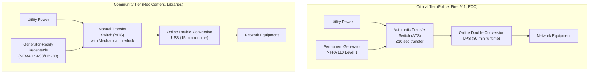
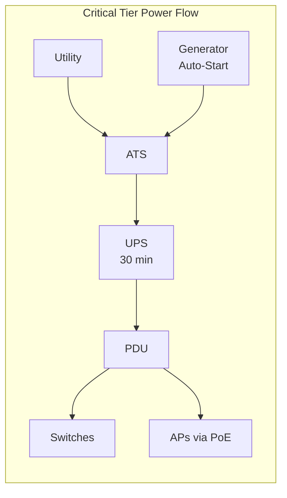
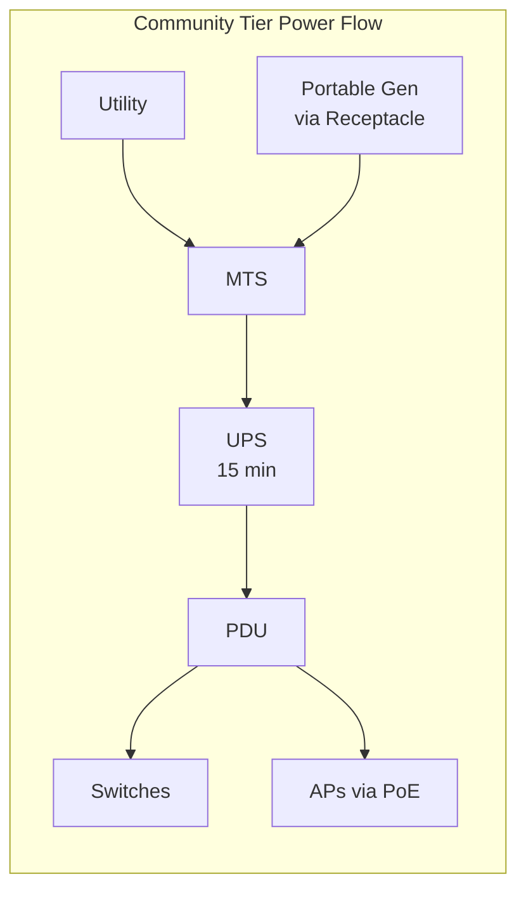

# Backup Power Standards for Network Infrastructure

## Overview

This document defines the backup power requirements for all network infrastructure deployed in municipal facilities. Municipalities in regions with elevated risk from hurricanes, tropical storms, and severe weather events can experience extended utility power outages lasting hours to weeks. Reliable backup power for network infrastructure is essential to maintain emergency communications, public safety operations, and continuity of government services during these events.

All network equipment locations — from single-IDF closets to multi-rack MDFs — must have backup power systems sized to maintain operations through utility power interruptions. This standard defines two facility tiers with different runtime and generator requirements based on operational criticality, and provides calculation methods for UPS sizing, circuit design, and generator capacity planning.

## Standards References

| Standard | Title | Edition | Scope |
|----------|-------|---------|-------|
| NEC Article 700 | Emergency Systems | 2026 | Legally required emergency power |
| NEC Article 701 | Legally Required Standby Systems | 2026 | Standby power for life safety |
| NEC Article 702 | Optional Standby Systems | 2026 | Non-required standby power |
| NEC Article 708 | Critical Operations Power Systems (COPS) | 2026 | Mission-critical facility power |
| NFPA 110 | Standard for Emergency and Standby Power Systems | 2025 | Generator installation and testing |
| NFPA 111 | Stored Electrical Energy Emergency and Standby Power Systems | 2025 | UPS and battery systems |
| IEEE 446 | Recommended Practice for Emergency and Standby Power Systems (Orange Book) | 1995 (Inactive-Reserved) | Power system design |
| IEEE 1100 | Recommended Practice for Powering and Grounding Electronic Equipment (Emerald Book) | 2005 (Inactive-Reserved) | Sensitive load protection |
| NIST SP 800-53 Rev. 5 | Security and Privacy Controls — PE-11 Emergency Power | 2020 | Federal security requirement |
| TIA-607-D | Generic Telecommunications Bonding and Grounding | 2019 | Grounding infrastructure |
| NEC Article 250 | Grounding and Bonding | 2026 | Electrical grounding |
| NFPA 780 | Standard for Installation of Lightning Protection Systems | 2026 | Lightning protection |

## Facility Tier Definitions

All municipal facilities with network infrastructure are classified into one of two tiers based on operational mission. The tier determines UPS runtime, generator requirements, and transfer switch type.

### Power Path Architecture



### Tier Comparison

| Attribute | Critical Tier | Community Tier |
|-----------|--------------|----------------|
| **Facilities** | Police stations, fire stations, 911 dispatch, Emergency Operations Center (EOC) | Recreation centers, libraries, community centers |
| **UPS runtime** | 30 minutes | 15 minutes |
| **UPS topology** | Online double-conversion | Online double-conversion |
| **Generator** | Permanent installation with automatic transfer switch (ATS) | Generator-ready receptacle with manual transfer switch (MTS) |
| **Transfer switch** | ATS — automatic, ≤10-second transfer (NEC 700.12) | MTS — manual with mechanical interlock |
| **NEC classification** | Article 700 (Emergency) / Article 708 (COPS) | Article 702 (Optional Standby) |
| **NFPA 110 classification** | Level 1 (10-second start and transfer) | Level 2 (manual start acceptable) |
| **Fuel** | Diesel or natural gas with minimum 24-hour runtime | Portable generator fuel per event |
| **Generator sizing** | 125% of calculated IT + HVAC load | Match IT load + cooling |
| **Lightning protection** | NFPA 780 integration required | SPD at panel (standard) |

## Power Budget Calculations

### Core Formula

The following formula determines UPS sizing for any IDF or MDF:

```
Switch Chassis Power + (Number of APs x 60W x 0.80 utilization)
= IT Load (watts)

IT Load x 1.25 (NEC derating)
= NEC Derated Load (watts)

NEC Derated Load / Voltage
= Circuit Amps

NEC Derated Load / 0.9 (power factor)
= UPS Rating (VA)
```

### Calculation Assumptions

| Parameter | Value | Basis |
|-----------|-------|-------|
| AP power draw (planning) | **60W** | Conservative figure covering WiFi 7 range (30-75W operational) |
| PoE port utilization | 80% | Standard planning factor for port density |
| Switch chassis power | 150W per 48-port access switch | Typical switching/management overhead |
| Core/distribution chassis | 500W per device | Higher processing and fan load |
| NEC continuous load derating | 125% (multiply by 1.25) | NEC 210.20(A) for continuous loads |
| Power factor | 0.9 | Standard UPS input power factor |
| Voltage (120V circuits) | 120V | Standard NEMA 5-15/5-20 |
| Voltage (208V circuits) | 208V | NEMA L6-20/L6-30 |

### Reference Configurations

#### Small IDF (1 Switch, 24 APs)

| Component | Quantity | Per-Unit Power | Total |
|-----------|----------|----------------|-------|
| 48-port access switch chassis | 1 | 150W | 150W |
| WiFi 7 APs (60W x 0.80 util) | 24 | 48W | 1,152W |
| **IT Load** | | | **1,302W** |
| NEC derating (x 1.25) | | | **1,628W** |
| Circuit requirement | | | 20A / 120V |
| UPS rating (/ 0.9 PF) | | | **2,000 VA** |

#### Medium IDF (2 Switches, 48 APs)

| Component | Quantity | Per-Unit Power | Total |
|-----------|----------|----------------|-------|
| 48-port access switch chassis | 2 | 150W | 300W |
| WiFi 7 APs (60W x 0.80 util) | 48 | 48W | 2,304W |
| **IT Load** | | | **2,604W** |
| NEC derating (x 1.25) | | | **3,255W** |
| Circuit requirement | | | 30A / 120V or 20A / 208V |
| UPS rating (/ 0.9 PF) | | | **4,000 VA** |

#### Large IDF/MDF (4 Switches + Core, 96 APs)

| Component | Quantity | Per-Unit Power | Total |
|-----------|----------|----------------|-------|
| 48-port access switch chassis | 4 | 150W | 600W |
| Core/distribution switch | 1 | 500W | 500W |
| WiFi 7 APs (60W x 0.80 util) | 96 | 48W | 4,608W |
| **IT Load** | | | **5,708W** |
| NEC derating (x 1.25) | | | **7,135W** |
| Circuit requirement | | | 40A / 208V |
| UPS rating (/ 0.9 PF) | | | **8,000-10,000 VA** |

## UPS Requirements

### UPS Topology Mandate

> **All network infrastructure UPS installations must use online double-conversion topology.** Line-interactive and standby UPS are not approved for network equipment.

### UPS Requirements Table

| Requirement | Specification | Standard Reference |
|-------------|---------------|-------------------|
| Topology | Online double-conversion | IEEE 1100, NFPA 111 |
| Transfer time | 0 ms (no transfer — continuous inverter) | IEEE 446 |
| Runtime (Critical tier) | 30 minutes at calculated load | NIST SP 800-53 PE-11 |
| Runtime (Community tier) | 15 minutes at calculated load | NIST SP 800-53 PE-11 |
| Output waveform | Pure sine wave | IEEE 1100 |
| Battery type | Valve-regulated lead-acid (VRLA) or lithium-ion | NFPA 111 |
| Monitoring | SNMP v3 with network management integration | RFC 3411 |
| Efficiency | ≥94% at rated load | — |
| Input voltage range | ±20% without battery | — |
| Hot-swap batteries | Required — battery replacement without load interruption | NFPA 111 |
| Bypass | Internal automatic + maintenance bypass | — |
| Form factor | Rack-mount (2U-6U) or tower | Per installation |

### UPS Topology Comparison

| Topology | Transfer Time | Power Conditioning | Efficiency | Network Use |
|----------|--------------|-------------------|------------|-------------|
| **Online double-conversion** | **0 ms** | **Full — continuous inverter** | **94-96%** | **Required** |
| Line-interactive | 2-4 ms | Partial — voltage regulation | 95-98% | Not approved |
| Standby (offline) | 5-12 ms | None | 98-99% | Not approved |

**Justification:** Network switches and access points are sensitive to power quality and transfer-time gaps. Even brief (2-12 ms) power interruptions during line-interactive or standby UPS transfers can cause switch reboots, PoE cycling, and AP restarts. Online double-conversion provides continuous conditioned power with zero transfer time, eliminating these risks.

### UPS Sizing by Configuration and Tier

| Configuration | IT Load | UPS VA | Critical Runtime | Community Runtime |
|---------------|---------|--------|-----------------|-------------------|
| Small IDF | 1,302W | 2,000 VA | 30 min | 15 min |
| Medium IDF | 2,604W | 4,000 VA | 30 min | 15 min |
| Large IDF/MDF | 5,708W | 8,000-10,000 VA | 30 min | 15 min |

## Generator and Transfer Switch Requirements

### Requirements by Tier

| Requirement | Critical Tier | Community Tier |
|-------------|--------------|----------------|
| Generator type | Permanent installation | Generator-ready receptacle |
| Fuel type | Diesel or natural gas | Portable generator fuel |
| Minimum runtime | 24 hours at rated load | Per event duration |
| NFPA 110 classification | Level 1 — 10-second start | Level 2 — manual start |
| Transfer switch | Automatic Transfer Switch (ATS) | Manual Transfer Switch (MTS) |
| Transfer time | ≤10 seconds (NEC 700.12) | Manual operation |
| Sizing | 125% of IT + HVAC load | Match IT load + cooling |
| Enclosure (outdoor) | Weather-rated per site conditions | N/A (portable) |
| Fuel management | Automatic fuel monitoring | Manual |
| Testing | Monthly exercise under load | Annual verification |

### Critical Tier: ATS Specifications

| Specification | Requirement | Standard Reference |
|---------------|-------------|-------------------|
| Transfer time | ≤10 seconds from utility loss | NEC 700.12 |
| Sensing | Undervoltage, overvoltage, frequency deviation | IEEE 446 |
| Retransfer delay | Adjustable, minimum 5-minute delay | IEEE 446 |
| Exercise clock | Built-in weekly exercise timer | NFPA 110 |
| Bypass | Manual bypass for maintenance | — |
| Monitoring | Remote status (utility available, generator running, load on gen) | NFPA 110 |
| Enclosure | NEMA 3R (outdoor) or NEMA 1 (indoor) | — |

### Community Tier: Generator-Ready Receptacle Specifications

| Specification | Requirement |
|---------------|-------------|
| Receptacle type | NEMA L14-30 (120/240V, 30A) or NEMA L21-30 (208V, 30A) |
| Interlock | Mechanical interlock on transfer switch — prevents backfeed |
| Transfer switch | Manual Transfer Switch (MTS) with visible disconnect |
| Location | Exterior wall, labeled "GENERATOR CONNECTION" |
| Circuit | Dedicated circuit to network equipment panel |
| Grounding | Bonded to building ground per NEC 250 |
| Signage | Placarded per NEC 702.7 with generator connection instructions |

### Power Flow Diagrams





## Circuit and Feed Specifications

### Dedicated Circuit Requirements

| Requirement | Specification | Standard Reference |
|-------------|---------------|-------------------|
| Circuit dedication | Network equipment on dedicated circuits — no shared loads | NEC 210.23 |
| Circuit breaker | Listed for continuous load (100% rated) or standard breaker with 125% derating | NEC 210.20(A) |
| Voltage options | 120V (small IDF) or 208V (medium/large IDF/MDF) | — |
| Receptacle (120V) | NEMA 5-20R (20A) | NEC 210.21 |
| Receptacle (208V) | NEMA L6-20R (20A) or NEMA L6-30R (30A) | NEC 210.21 |
| Branch circuit | 20A minimum per IDF; 30A or 40A for medium/large | Per load calculation |
| Panelboard | Dedicated or sub-panel for network equipment preferred | IEEE 1100 |

### Wire Sizing

| Circuit Rating | Wire Gauge (Copper) | Conduit Size (Minimum) | NEC Reference |
|---------------|---------------------|----------------------|---------------|
| 20A / 120V | 12 AWG | 3/4" EMT | NEC 310.16 |
| 30A / 120V | 10 AWG | 3/4" EMT | NEC 310.16 |
| 20A / 208V | 12 AWG | 3/4" EMT | NEC 310.16 |
| 30A / 208V | 10 AWG | 3/4" EMT | NEC 310.16 |
| 40A / 208V | 8 AWG | 1" EMT | NEC 310.16 |

### Circuit Labeling

| Label Location | Required Information |
|---------------|---------------------|
| Panelboard directory | "NETWORK EQUIPMENT — [IDF/MDF identifier]" |
| Circuit breaker | "NET-[Building]-[IDF#]" |
| Receptacle faceplate | "NETWORK POWER — DO NOT DISCONNECT" |
| UPS input | Circuit number and panel identifier |

## Surge Protection and Grounding Integration

### Surge Protective Devices (SPD)

| Requirement | Specification | Standard Reference |
|-------------|---------------|-------------------|
| SPD location | Type 2 SPD at network equipment panel | NEC 285, IEEE 1100 |
| Clamping voltage | ≤600V (120V circuits) / ≤1000V (208V circuits) | UL 1449 |
| Surge rating | ≥50 kA per mode | IEEE C62.41.2-2025 |
| Indicator | Visual status indicator (protection active/failed) | UL 1449 |
| Monitoring | Dry contact or SNMP alarm for SPD failure | — |

### Grounding Integration

| Requirement | Specification | Standard Reference |
|-------------|---------------|-------------------|
| UPS bonding | UPS chassis bonded to Telecommunications Grounding Busbar (TGB) | TIA-607-D |
| TGB connection | #6 AWG minimum copper conductor to TGB | TIA-607-D |
| TGB to building ground | Per building grounding electrode system | NEC 250 |
| Generator grounding | Generator frame bonded per NEC 250.30 (separately derived system) | NEC 250.30 |
| SPD grounding | Short, direct connection to TGB or equipment ground | NEC 285 |

> **Cross-Reference:** For complete grounding infrastructure specifications including TGB installation, bonding conductor sizing, and lightning protection integration, see [Structured Cabling Standards — Surge Protection and Grounding](cabling-standards.md#surge-protection-and-grounding).

### Lightning Protection (Critical Tier)

Critical tier facilities (police, fire, 911, EOC) require NFPA 780 lightning protection system integration:

| Requirement | Specification |
|-------------|---------------|
| Lightning protection system | Per NFPA 780 risk assessment |
| SPD coordination | Type 1 at service entrance + Type 2 at network panel |
| Bonding | Lightning protection system bonded to TGB per TIA-607-D |
| Outdoor cable protection | Surge protection at both ends per [Cabling Standards](cabling-standards.md#surge-protection-and-grounding) |

## Testing and Maintenance Schedule

### Monthly Testing

| Test | Procedure | Tier | Documentation |
|------|-----------|------|---------------|
| UPS self-test | Initiate UPS self-test via management interface; verify battery status | Both | Log date, result, battery health |
| Generator exercise (Critical) | Run generator under load for 30 minutes minimum | Critical | Log date, runtime, fuel level, voltage/frequency |
| ATS test (Critical) | Simulate utility failure; verify automatic transfer ≤10 seconds | Critical | Log date, transfer time, retransfer |

### Annual Testing

| Test | Procedure | Tier | Documentation |
|------|-----------|------|---------------|
| UPS battery runtime | Discharge test to verify rated runtime at actual load | Both | Log date, load (watts), runtime achieved, battery age |
| Generator load bank test | Full-load test per NFPA 110 for minimum 2 hours | Critical | Log date, load level, voltage, frequency, fuel consumption |
| Ground resistance | Test grounding electrode resistance (target ≤5 ohms) | Both | Log date, measurement, location |
| MTS/portable generator test | Connect portable generator, transfer load, verify operation | Community | Log date, generator model, transfer verification |
| SPD inspection | Verify SPD status indicators, replace if failed | Both | Log date, status, replacement if applicable |

### Documentation Requirements

| Record | Retention | Location |
|--------|-----------|----------|
| UPS test logs | 3 years | Building maintenance file |
| Generator test logs | 5 years (per NFPA 110) | Building maintenance file |
| Battery replacement records | Life of UPS | Asset management system |
| Ground resistance measurements | 5 years | Building maintenance file |
| ATS/MTS test records | 5 years | Building maintenance file |

## NIST SP 800-53 Alignment

| Control ID | Control Name | Implementation |
|------------|--------------|----------------|
| **PE-11** | **Emergency Power** | UPS for all network equipment; generator for Critical tier |
| PE-11(1) | Emergency Power — Long-Term Alternate Power | Permanent generator with 24-hour fuel for Critical tier |
| PE-9 | Power Equipment and Cabling | Dedicated circuits, labeled panels, conduit protection |
| PE-10 | Emergency Shutoff | UPS bypass and emergency power-off (EPO) per NEC 645.10 |
| CP-7 | Alternate Processing Site | Generator-ready receptacles enable portable power at Community tier |
| CP-8 | Telecommunications Services | UPS maintains network continuity during power transitions |

## Industry Adoption Data

### Backup Power Adoption Statistics

| Practice | Adoption Rate | Source | Year |
|----------|---------------|--------|------|
| UPS for network closets (enterprise) | 89% | Ponemon Institute | 2024 |
| UPS for network closets (municipal) | 72% | Municipal IT Survey | 2024 |
| Generator backup (critical facilities) | 94% | ASIS International | 2024 |
| Online double-conversion UPS | 67% of enterprise deployments | Omdia Power Report | 2025 |
| SNMP-monitored UPS | 58% | EMA Network Management | 2025 |
| Monthly generator testing | 81% of generator-equipped facilities | NFPA Compliance Survey | 2024 |

### Municipal Deployment Patterns

| Configuration | Adoption | Notes |
|---------------|----------|-------|
| UPS in every IDF | 64% | Growing; driven by PoE and VoIP dependence |
| Permanent generator at public safety | 91% | Near universal for police/fire |
| Generator-ready receptacles | 45% | Increasing for community facilities |
| Online double-conversion for network | 52% | Higher for new deployments |

## Cost-Performance Analysis

### TCO by IDF Size (7-Year Model)

#### Assumptions
- UPS replacement: Year 5 (batteries) or Year 7 (unit)
- Generator maintenance: $500/year (Critical tier)
- Electricity cost for UPS inefficiency: $0.10/kWh
- Battery replacement: 1 cycle during 7-year period

| Cost Category | Small IDF (2 kVA) | Medium IDF (4 kVA) | Large MDF (10 kVA) |
|---------------|-------------------|--------------------|--------------------|
| UPS equipment | $1,800 | $3,500 | $8,000 |
| Installation (electrical) | $800 | $1,200 | $2,500 |
| Battery replacement (Year 4-5) | $400 | $800 | $2,000 |
| Annual maintenance | $100 | $200 | $400 |
| 7-year power overhead | $200 | $400 | $1,000 |
| **7-Year UPS TCO** | **$3,900** | **$7,300** | **$16,300** |
| Generator (Critical only) | +$15,000-30,000 | +$15,000-30,000 | +$25,000-50,000 |
| ATS (Critical only) | +$3,000-5,000 | +$3,000-5,000 | +$5,000-8,000 |
| Generator-ready (Community) | +$1,500-2,500 | +$1,500-2,500 | +$2,000-3,500 |

### Cost-of-Downtime Justification

| Facility Type | Hourly Downtime Cost | 4-Hour Outage Cost | UPS Investment | Payback |
|---------------|---------------------|--------------------|--------------:|---------|
| 911 dispatch center | $50,000+ (public safety risk) | $200,000+ | $16,300 | Immediate |
| Police station | $10,000-25,000 | $40,000-100,000 | $7,300 | <1 outage |
| Main Campus | $5,000-15,000 | $20,000-60,000 | $7,300 | <1 outage |
| Library/rec center | $500-2,000 | $2,000-8,000 | $3,900 | 1-2 outages |

**Key insight:** Even at community facilities, a single extended outage (4+ hours) costs more in lost productivity and service disruption than the entire 7-year UPS investment. For Critical tier facilities, the public safety implications make backup power a non-negotiable requirement.

## Procurement Pass/Fail Checklist

Use this checklist to evaluate UPS, generator, and transfer switch equipment before purchase. Every **Required** item must pass. If any Required item fails, the equipment is **not approved** for procurement.

### Backup Power Equipment Procurement Checklist

| # | Requirement | Required | Pass | Fail |
|---|-------------|----------|------|------|
| 1 | UPS topology is online double-conversion (0 ms transfer) | **Yes** | ☐ | ☐ |
| 2 | UPS VA rating meets or exceeds calculated load (per Power Budget section) | **Yes** | ☐ | ☐ |
| 3 | UPS runtime meets tier requirement (Critical: 30 min / Community: 15 min) | **Yes** | ☐ | ☐ |
| 4 | UPS supports SNMPv3 network monitoring | **Yes** | ☐ | ☐ |
| 5 | UPS output is pure sine wave | **Yes** | ☐ | ☐ |
| 6 | Generator meets NFPA 110 Level 1 classification (Critical tier) | **Conditional** | ☐ | ☐ |
| 7 | Transfer switch type matches tier (ATS for Critical / MTS for Community) | **Yes** | ☐ | ☐ |
| 8 | ATS transfer time ≤10 seconds (Critical tier) | **Conditional** | ☐ | ☐ |
| 9 | Type 2 SPD installed at network equipment panel | **Yes** | ☐ | ☐ |
| 10 | UPS batteries are hot-swappable (replacement without load interruption) | **Yes** | ☐ | ☐ |

### Results

| Outcome | Action |
|---------|--------|
| All Required items pass | **Approved for procurement** |
| Any Required item fails | **Not approved — do not purchase** |
| Questions about a specific product | Contact Network Engineering (ITI Networking Team) |

### How to Verify Requirements

| Checklist Item | Where to Find |
|----------------|---------------|
| Online double-conversion topology | UPS datasheet, topology description |
| VA rating | UPS datasheet, rated capacity |
| Runtime at load | UPS datasheet runtime charts, battery configuration |
| SNMPv3 support | UPS management card specifications, network features |
| Pure sine wave output | UPS datasheet, output specifications |
| NFPA 110 Level 1 | Generator datasheet, NFPA 110 compliance statement |
| Transfer switch type | ATS/MTS datasheet, transfer mechanism description |
| ATS transfer time | ATS datasheet, performance specifications |
| Type 2 SPD | SPD datasheet, UL 1449 listing, installation location |
| Hot-swap batteries | UPS datasheet, battery replacement procedure |

## Cross-References

| Document | Relationship |
|----------|--------------|
| [Switch Specifications](switch-specifications.md) | PoE budget drives UPS sizing; switch chassis power consumption |
| [Access Point Specifications](../wifi/access-point-specs.md) | AP power draw (30-75W) determines PoE load for UPS calculations |
| [Structured Cabling Standards](cabling-standards.md) | Grounding infrastructure (TGB, TIA-607-D) for UPS/generator bonding |
| [WiFi Design Standards](../wifi/design-standards.md) | Power budget as design deliverable |
| [Deployment Procedures](../wifi/deployment-procedures.md) | UPS capacity verification in pre-installation checklist |
| [Network Segmentation](../security/network-segmentation.md) | UPS SNMP management interfaces on Management VLAN (VLAN 999) |

## Document History

| Version | Date | Changes |
|---------|------|---------|
| 1.0.0 | 2026-02-04 | Initial release — facility tiers, power budget calculations, UPS/generator requirements, procurement checklist |

## References

1. NFPA 70 (NEC), "National Electrical Code," National Fire Protection Association, 2026.
2. NFPA 110, "Standard for Emergency and Standby Power Systems," National Fire Protection Association, 2025.
3. NFPA 111, "Stored Electrical Energy Emergency and Standby Power Systems," National Fire Protection Association, 2025.
4. NFPA 780, "Standard for the Installation of Lightning Protection Systems," National Fire Protection Association, 2026.
5. IEEE 446-1995, "IEEE Recommended Practice for Emergency and Standby Power Systems for Industrial and Commercial Applications (Orange Book)," IEEE, 1995 (reaffirmed 2000; Inactive-Reserved 2021 — no successor published; remains widely referenced in power engineering).
6. IEEE 1100-2005, "IEEE Recommended Practice for Powering and Grounding Electronic Equipment (Emerald Book)," IEEE, 2005 (Inactive-Reserved 2021 — no successor published; remains widely referenced in power engineering).
7. NIST SP 800-53 Rev. 5, "Security and Privacy Controls for Information Systems and Organizations," NIST, September 2020.
8. TIA-607-D, "Generic Telecommunications Bonding and Grounding (Earthing) for Customer Premises," TIA, August 2019.
9. UL 1449, "Standard for Surge Protective Devices," 5th Edition, Underwriters Laboratories, 2021.
10. IEEE C62.41.2-2025, "IEEE Recommended Practice on Characterization of Surges in Low-Voltage AC Power Circuits," IEEE, 2025.

---

*For questions about these standards, open an issue or contact the ITI Networking Team.*
