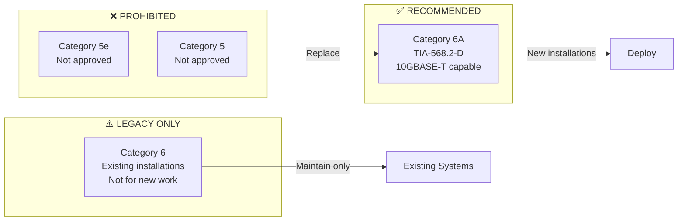
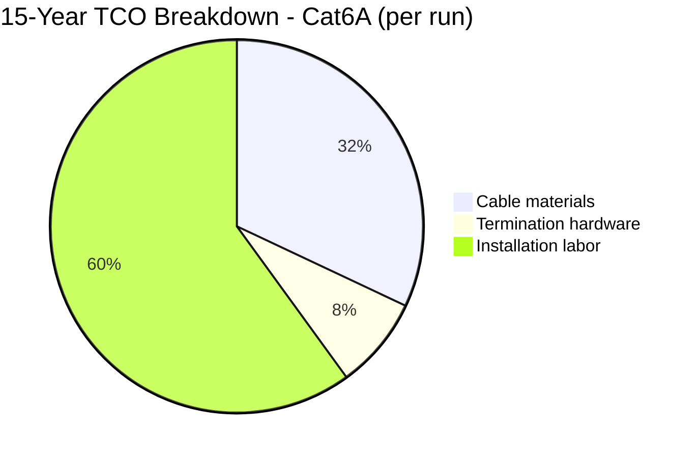
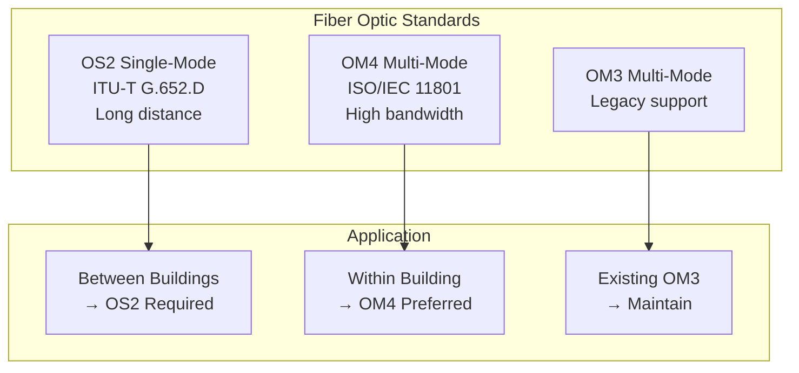
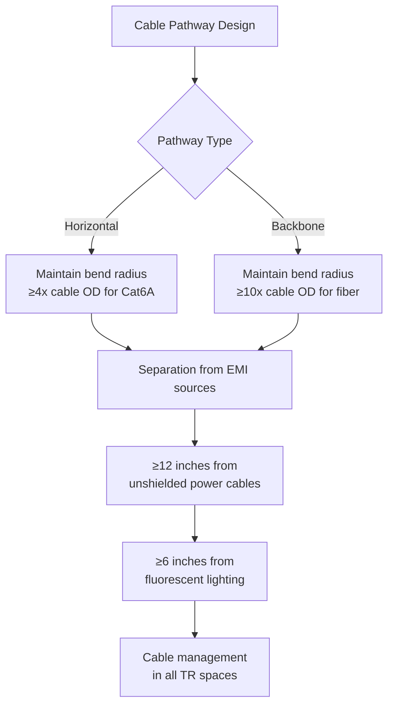
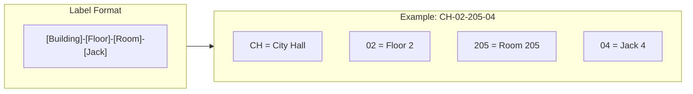
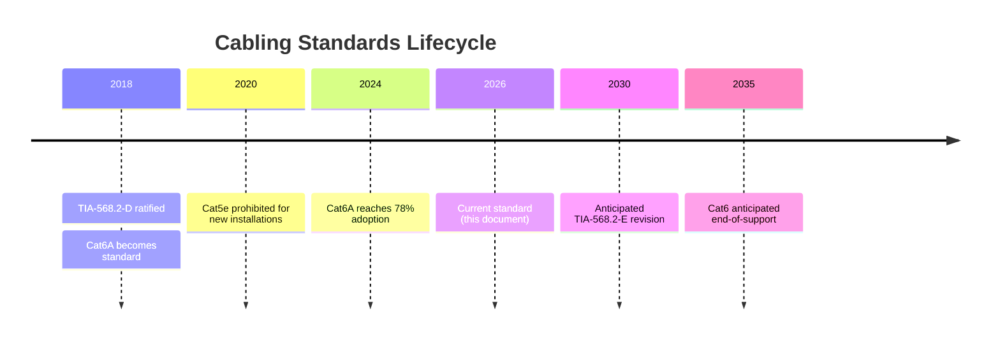

# Structured Cabling Standards

## Overview

This document defines the structured cabling standards for all wired network infrastructure in City of New Orleans facilities. All recommendations are derived from TIA, ISO/IEC, and BICSI standards with proven industry adoption and favorable total cost of ownership for municipal deployments.

## Standards References

| Standard | Title | Ratification Date | Scope |
|----------|-------|-------------------|-------|
| TIA-568.2-D | Balanced Twisted-Pair Telecommunications Cabling and Components | August 2018 | Copper cabling specifications |
| TIA-568.3-D | Optical Fiber Cabling and Components | June 2016 | Fiber optic specifications |
| TIA-569-E | Telecommunications Pathways and Spaces | June 2019 | Pathway design and capacity |
| TIA-606-C | Administration Standard for Telecommunications Infrastructure | February 2017 | Labeling and documentation |
| ISO/IEC 11801-1 | Generic Cabling - Part 1: General Requirements | November 2017 | International cabling standard |
| ANSI/NECA/BICSI 568 | Installing Commercial Building Telecommunications Cabling | 2016 | Installation best practices |
| TIA-607-D | Generic Telecommunications Bonding and Grounding | August 2019 | Grounding infrastructure |
| NFPA 780 | Standard for Installation of Lightning Protection Systems | 2023 | Lightning protection (public safety) |
| IEC 60529 | Degrees of Protection Provided by Enclosures (IP Code) | 2013 | Outdoor enclosure ratings |

## Approved Cable Types

### Horizontal Cabling (Workstation to Telecommunications Room)

| Category | Standard | Max Frequency | Max Distance | Multi-Gig/10GBASE-T Support | Status |
|----------|----------|---------------|--------------|----------------------------|--------|
| Cat6A | TIA-568.2-D | 500 MHz | 100 meters | 2.5G/5G/10G full (100m) | **Required** |
| Cat6 | TIA-568.2-D | 250 MHz | 100 meters | 2.5G/5G limited (55m), 10G (55m) | Legacy |
| Cat5e | — | 100 MHz | 100 meters | No multi-gig support | Prohibited |

### WiFi 7 Backhaul Requirements

**Critical:** WiFi 7 access points require multi-gigabit backhaul (2.5 Gbps minimum) to avoid throughput bottlenecks. Cat6A is **mandatory** for all new AP drops.

| WiFi 7 Configuration | Required Backhaul | Cable Requirement |
|---------------------|-------------------|-------------------|
| Standard (160 MHz) | 2.5 GbE | Cat6A (100m) or Cat6 (55m max) |
| High-Density (320 MHz) | 5 GbE | Cat6A required |
| 8x8 MIMO | 10 GbE | Cat6A required |

**Note:** Cat6 is not approved for new AP installations due to distance limitations for multi-gig speeds.

### Multi-Gig Switch Port Support

Cat6A cabling infrastructure is **required** to support the [Multi-Gig Port Mandate](switch-specifications.md#multi-gig-port-mandate-effective-2026). All new switch access ports must operate at 2.5 Gbps minimum, with many deployments requiring 5 Gbps or 10 Gbps.

| Switch Port Speed | Cat6 Support | Cat6A Support |
|-------------------|--------------|---------------|
| 2.5GBASE-T | ≤55m | 100m |
| 5GBASE-T | ≤55m | 100m |
| 10GBASE-T | ≤55m | 100m |

**Cabling implications:**
- All new horizontal runs **must** use Cat6A to support mandatory 2.5G+ switch ports at full 100m distance
- Existing Cat6 runs limit multi-gig speeds to 55m maximum
- Cat5e cannot support multi-gig speeds and must be replaced

### Industry Adoption

| Source | Cat6A Adoption Rate | Year |
|--------|---------------------|------|
| BICSI ICT Trends Report | 78% of new enterprise installations | 2025 |
| Cabling Installation & Maintenance Survey | 82% specify Cat6A for new construction | 2024 |
| Federal Facilities Standard (GSA P100) | Required for new federal buildings | 2023 |

### Cost-Performance Analysis: Cat6A vs Cat6

#### Assumptions
- Deployment size: 500 cable runs
- Lifecycle period: 15 years
- Installation labor: $45/hour municipal rate
- Labor time: Equal for Cat6 and Cat6A installation

#### Total Cost of Ownership Comparison

| Cost Category | Cat6 | Cat6A | Difference |
|---------------|------|-------|------------|
| Cable cost ($/foot) | $0.18 | $0.32 | +78% |
| Average run length | 150 ft | 150 ft | — |
| Cable cost per run | $27 | $48 | +$21 |
| Termination hardware | $8 | $12 | +$4 |
| Installation labor | $90 | $90 | $0 |
| **Per-run initial cost** | **$125** | **$150** | **+$25 (+20%)** |
| Expected lifecycle | 10-12 years | 15-20 years | +5-8 years |
| Bandwidth capacity | 1 Gbps practical | 10 Gbps | +900% |
| Mid-cycle replacement (Year 10) | $125 | $0 | -$125 |
| **15-Year TCO per run** | **$250** | **$150** | **-$100 (-40%)** |

**Recommendation:** Cat6A provides 40% lower 15-year TCO due to extended lifecycle and elimination of mid-cycle replacement. The multi-gig (2.5G/5G/10G) capability is **required** for the mandatory 2.5 GbE minimum switch port standard (see [Multi-Gig Port Mandate](switch-specifications.md#multi-gig-port-mandate-effective-2026)) and WiFi 7 access point backhaul, ensuring compatibility with evolving standards through 2040+.

### Backbone Cabling (Between Telecommunications Rooms)

| Fiber Type | Standard | Core/Cladding | Max Distance (10GbE) | Status |
|------------|----------|---------------|----------------------|--------|
| OS2 Single-mode | ITU-T G.652.D | 9/125 μm | 10+ km | **Supported** |
| OM4 Multi-mode | ISO/IEC 11801 | 50/125 μm | 400 m | **Supported** |
| OM3 Multi-mode | ISO/IEC 11801 | 50/125 μm | 300 m | Legacy |
| OM1/OM2 | — | 62.5/125 μm | — | Prohibited |

#### Fiber Selection Guidelines

| Scenario | Required Fiber | Rationale |
|----------|----------------|-----------|
| Inter-building links | OS2 single-mode | Distance capability, 25+ year lifespan |
| Intra-building backbone | OM4 multi-mode | Cost-effective, supports 40/100GbE short reach |
| Data center interconnects | OS2 single-mode | Future 400GbE compatibility |

## Installation Requirements

### Cable Routing

Per TIA-569-E pathway requirements:

| Requirement | Standard | Specification |
|-------------|----------|---------------|
| Bend radius (Cat6A) | TIA-568.2-D | ≥4× cable outside diameter |
| Bend radius (fiber) | TIA-568.3-D | ≥10× cable outside diameter under no load |
| Separation from power | TIA-569-E | ≥305 mm (12 in) from unshielded power |
| Fill ratio (conduit) | TIA-569-E | ≤40% for 3+ cables |
| Fill ratio (cable tray) | TIA-569-E | ≤50% usable depth |

### Termination Standards

| Component | Standard | Requirement |
|-----------|----------|-------------|
| Jack wiring | TIA-568.2-D | T568B pattern (all city facilities) |
| Patch panels | TIA-568.2-D | 110-style IDC or tool-less keystone |
| Fiber connectors | TIA-568.3-D | LC duplex (preferred) or MPO for high-density |
| Cable certification | TIA-1152-A | Permanent link or channel testing |

### Labeling Requirements

Per TIA-606-C Administration Standard:

| Component | Label Location | Content Required |
|-----------|----------------|------------------|
| Outlet/jack | Faceplate | Jack identifier |
| Patch panel port | Front and rear | Port identifier |
| Cable (both ends) | Within 12 inches of termination | Unique cable ID |
| Pathway | Every 15 feet and at transitions | Pathway identifier |

## Testing and Certification

### Required Tests

Per TIA-1152-A Field Testing Standard:

| Test Parameter | Cat6A Requirement | Pass Criteria |
|----------------|-------------------|---------------|
| Wire map | Required | All pairs correct, no opens/shorts |
| Length | Required | ≤100 m permanent link |
| Insertion loss | Required | Per TIA-568.2-D limits |
| NEXT | Required | Per TIA-568.2-D limits |
| PS-NEXT | Required | Per TIA-568.2-D limits |
| ACR-F (ELFEXT) | Required | Per TIA-568.2-D limits |
| Return loss | Required | Per TIA-568.2-D limits |
| TCL | Required for Cat6A | Per TIA-568.2-D limits |
| ELTCTL | Required for Cat6A | Per TIA-568.2-D limits |

### Certification Requirements

- All cable runs must be tested with a Level IV field tester (per TIA-1152-A)
- Test results must be provided in electronic format
- Failed runs must be re-terminated and re-tested
- Permanent link testing preferred; channel testing acceptable

## Outdoor Installation Requirements

This section defines requirements for low-voltage cabling pathways serving outdoor-mounted devices including wireless access points, IP cameras, access control devices, intercoms, emergency call stations, and public address speakers.

See [Outdoor Cabling Design](../plans/2026-02-02-outdoor-cabling-design.md) for complete specifications including inspection checklists and installation details.

### Installation Classifications

| Classification | Definition | Pathway Requirement |
|----------------|------------|---------------------|
| **Permanent** | All outdoor installations not meeting temporary criteria | Conduit with hardened security standard |
| **Temporary** | Event-based deployments only (festivals, construction, seasonal) | IP67 weatherproof jack enclosure; 6-month maximum |

**Contractor Requirement:** All permanent outdoor installations must be performed by or inspected by a licensed low-voltage contractor who certifies NEC compliance.

### Conduit Requirements (Permanent Installations)

| Application | Required Conduit | NEC Article |
|-------------|------------------|-------------|
| Exposed runs below 12 ft, public areas | Rigid Metal Conduit (RMC) or IMC | 344 / 342 |
| Exposed runs at/above 12 ft, pole mounts | Schedule 80 PVC with metal transition at device | 352 |
| Protected runs (inside walls to penetration) | EMT with compression fittings | 358 |
| Direct burial segments | Schedule 80 PVC or RMC (18" / 6" depth) | 352 / 344 |

**Fitting Requirements:**
- Metallic conduit: Compression or threaded only; set-screw fittings prohibited outdoors
- PVC conduit: Solvent-welded or gasketed mechanical fittings
- All PVC runs require metal transition (LFMC) at device connection

### Wall Penetration Sealing

| Requirement | Specification |
|-------------|---------------|
| Seal type | Modular mechanical seal (Link-Seal, Thunderline, or equivalent) |
| Water resistance | Watertight to 15 psi minimum |
| Fire rating | Match wall assembly rating; firestop at interior face |
| Drip loop | Required below all penetrations |

**Prohibited:** Silicone caulk as sole seal, spray foam, unsealed sleeves with putty.

### Surge Protection and Grounding

Outdoor cable runs require surge protection at **both ends**:

| Location | Device Type | Specification |
|----------|-------------|---------------|
| Device end (outdoor) | Inline PoE surge protector | IEEE 802.3bt; Cat6A; IP66+ if exposed |
| Panel end (indoor) | Rack-mount or inline surge protector | IEEE 802.3bt; Cat6A; bonded to TGB |

**Surge Protector Minimums:** ≤50V clamping, ≥10 kA capacity, ≤1ns response, 10 Gbps data rate.

**Grounding:** Per NEC Article 250 and TIA-607-D. Public safety facilities (police, fire, 911) require NFPA 780 lightning protection system integration.

### Outdoor Cable Requirements

| Requirement | Specification |
|-------------|---------------|
| Cable category | Cat6A minimum |
| Jacket rating | CMX, CMXT, or direct burial (outdoor-rated required even inside conduit) |
| Temperature rating | -40°C to +75°C minimum |
| Water resistance | Gel-filled or dry water-blocking tape |

**Prohibited for outdoor runs:** CMR (riser), CMP (plenum), standard CM jackets.

### Temporary Installation Requirements

| Requirement | Specification |
|-------------|---------------|
| Enclosure rating | IP67 minimum |
| Maximum duration | 6 months; convert to permanent conduit if extended |
| Surge protection | Required at both ends (same as permanent) |
| Wall penetrations | Must use proper seal system; no temporary methods |

### Physical Security

| Requirement | Specification |
|-------------|---------------|
| Security fasteners | Torx or hex-socket screws on all accessible junction boxes and enclosures |
| Mounting height | Document height; RMC/IMC required below 12 ft in public areas |
| Conduit routing | Route to minimize accessibility where architecturally feasible |
| Weatherproof fittings | Wet-location rated hubs at all device entries |

### Documentation Requirements

All permanent outdoor installations require:

- Photo documentation (pre-installation, pathway, penetrations, surge protectors, grounding, final)
- Signed inspection checklist
- Cable test results
- As-built drawings updated with pathway routing
- Contractor code compliance certification

### Code References

| Code/Standard | Application |
|---------------|-------------|
| NEC Articles 725, 800, 820 | Low-voltage circuit classifications |
| NEC Articles 342, 344, 352, 358 | Conduit types and installation |
| NEC Article 250 | Grounding and bonding |
| TIA-607-D | Telecommunications bonding and grounding |
| NFPA 780 | Lightning protection (public safety facilities) |
| IEC 60529 | IP enclosure ratings |

## Security Considerations

### Physical Security (per NIST SP 800-53)

| Control | Implementation |
|---------|----------------|
| PE-4: Access Control for Transmission | Telecommunications rooms must have controlled access |
| PE-9: Power Equipment and Cabling | Protect cabling from damage and unauthorized access |
| SC-8: Transmission Confidentiality | Consider shielded cabling (Cat6A F/UTP) for sensitive areas |

### Recommended Practices

- Secure all telecommunications rooms with key card or key access
- Use lockable patch panels for sensitive connections
- Document all cable paths for security audits
- Consider shielded (F/UTP) Cat6A in areas with high EMI or security requirements

## Reliability Data

| Metric | Cat6A Copper | OM4 Fiber | OS2 Fiber |
|--------|--------------|-----------|-----------|
| Expected service life | 15-20 years | 20-25 years | 25+ years |
| Typical failure modes | Connector wear, jacket damage | Connector contamination, bend stress | Connector contamination |
| Environmental tolerance | -20°C to 60°C | -40°C to 75°C | -40°C to 75°C |
| Maintenance frequency | Low | Very low (clean connectors) | Very low |

## Lifecycle and Deprecation

| Category | Status | New Installations | Existing Systems | Planned Deprecation |
|----------|--------|-------------------|------------------|---------------------|
| Cat6A | Supported | ✅ Required | ✅ Maintain | — |
| Cat6 | Legacy | ❌ Not approved | ✅ Maintain | 2035 |
| Cat5e | Deprecated | ❌ Prohibited | ⚠️ Replace when possible | Immediate |
| OM4 | Supported | ✅ Approved | ✅ Maintain | — |
| OM3 | Legacy | ❌ Not approved | ✅ Maintain | 2030 |
| OS2 | Supported | ✅ Required for inter-building | ✅ Maintain | — |

## Procurement Pass/Fail Checklist

Use this checklist to evaluate cabling materials and components before purchase. Every **Required** item must pass. If any Required item fails, the material is **not approved** for procurement.

### Cabling Materials Procurement Checklist

| # | Requirement | Required | Pass | Fail |
|---|-------------|----------|------|------|
| 1 | Cable rated Category 6A per TIA-568.2-D (500 MHz) | **Yes** | ☐ | ☐ |
| 2 | Outdoor cable has outdoor-rated jacket (CMX, CMXT, or direct burial) | **Conditional** | ☐ | ☐ |
| 3 | Outdoor cable temperature rating -40°C to +75°C minimum | **Conditional** | ☐ | ☐ |
| 4 | Surge protection at both ends for outdoor runs (≤50V clamping, ≥10 kA) | **Conditional** | ☐ | ☐ |
| 5 | Conduit type compliant with NEC articles (RMC/IMC/Schedule 80 PVC per application) | **Conditional** | ☐ | ☐ |
| 6 | Wall penetration uses modular mechanical seal (watertight to 15 psi) | **Conditional** | ☐ | ☐ |
| 7 | Backbone fiber is OS2 single-mode (inter-building) or OM4 multi-mode (intra-building) | **Yes** | ☐ | ☐ |
| 8 | Field tester is Level IV per TIA-1152-A | **Yes** | ☐ | ☐ |

### Results

| Outcome | Action |
|---------|--------|
| All Required items pass | **Approved for procurement** |
| Any Required item fails | **Not approved — do not purchase** |
| Questions about a specific product | Contact Network Engineering (ITI Networking Team) |

### How to Verify Requirements

| Checklist Item | Where to Find |
|----------------|---------------|
| Cat6A rating (500 MHz) | Manufacturer spec sheet, TIA verification listing |
| Outdoor jacket rating | Cable jacket print, manufacturer datasheet |
| Temperature rating | Manufacturer spec sheet |
| Surge protection specs | Surge protector datasheet, IEEE 802.3bt compatibility listing |
| Conduit NEC compliance | Product labeling, UL listing, NEC article reference |
| Mechanical seal rating | Manufacturer spec sheet, pressure test certification |
| Fiber type (OS2/OM4) | Fiber spec sheet, ITU-T G.652.D / ISO/IEC 11801 compliance |
| Level IV field tester | Tester certification label, TIA-1152-A compliance documentation |

## References

1. TIA-568.2-D, "Balanced Twisted-Pair Telecommunications Cabling and Components Standard," Telecommunications Industry Association, August 2018.
2. TIA-568.3-D, "Optical Fiber Cabling and Components Standard," Telecommunications Industry Association, June 2016.
3. TIA-569-E, "Telecommunications Pathways and Spaces," Telecommunications Industry Association, June 2019.
4. TIA-606-C, "Administration Standard for Telecommunications Infrastructure," Telecommunications Industry Association, February 2017.
5. TIA-607-D, "Generic Telecommunications Bonding and Grounding (Earthing) for Customer Premises," Telecommunications Industry Association, August 2019.
6. TIA-1152-A, "Requirements for Field Test Instruments and Measurements for Balanced Twisted-Pair Cabling," Telecommunications Industry Association, 2016.
7. ISO/IEC 11801-1:2017, "Information technology — Generic cabling for customer premises — Part 1: General requirements," International Organization for Standardization, November 2017.
8. BICSI TDMM, 14th Edition, "Telecommunications Distribution Methods Manual," BICSI, 2018.
9. NIST SP 800-53 Rev. 5, "Security and Privacy Controls for Information Systems and Organizations," National Institute of Standards and Technology, September 2020.
10. NFPA 780, "Standard for the Installation of Lightning Protection Systems," National Fire Protection Association, 2023.
11. IEC 60529, "Degrees of Protection Provided by Enclosures (IP Code)," International Electrotechnical Commission, 2013.
12. NFPA 70 (NEC), "National Electrical Code," National Fire Protection Association, 2023.

---

*For questions about these standards, open an issue or contact the ITI Networking Team.*
