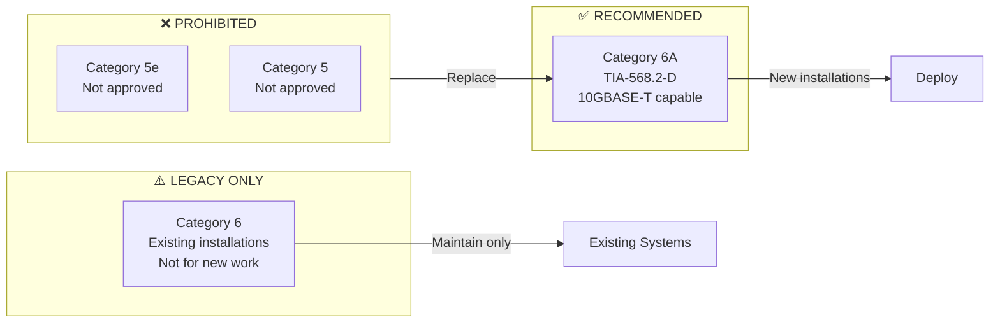
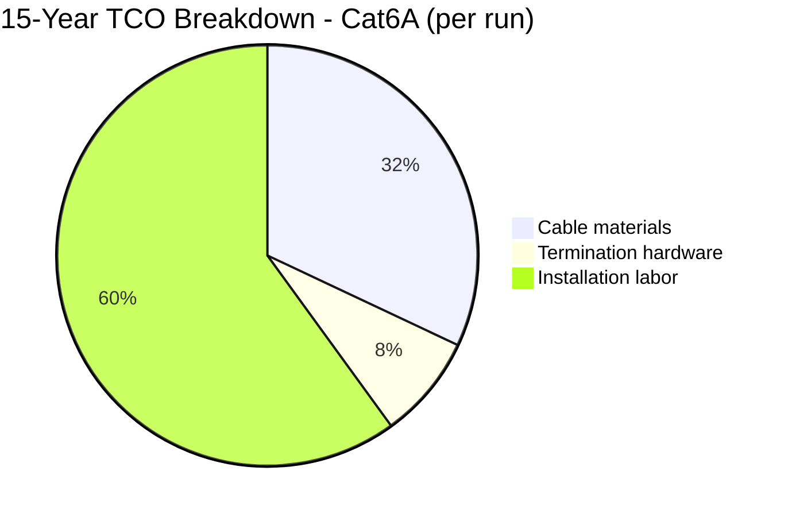
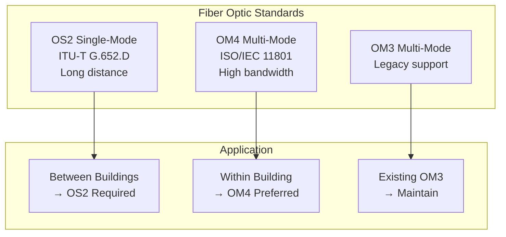
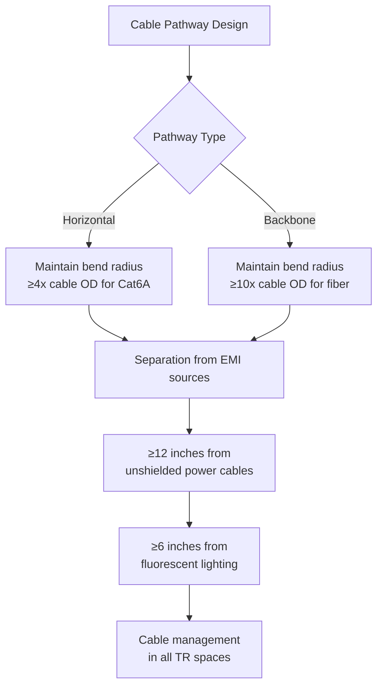
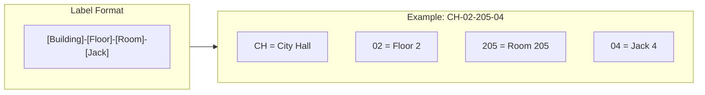
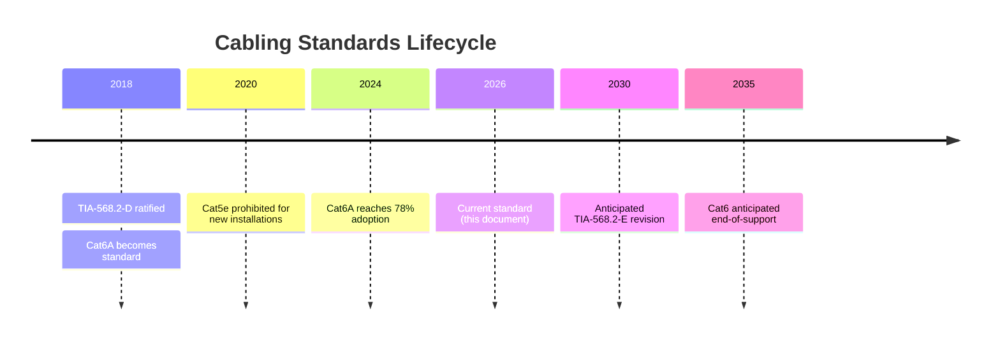

# Structured Cabling Standards

## Overview

This document defines the structured cabling standards for all wired network infrastructure in City of New Orleans facilities. All recommendations are derived from TIA, ISO/IEC, and BICSI standards with proven industry adoption and favorable total cost of ownership for municipal deployments.

## Standards References

| Standard | Title | Ratification Date | Scope |
|----------|-------|-------------------|-------|
| TIA-568.2-D | Balanced Twisted-Pair Telecommunications Cabling and Components | August 2018 | Copper cabling specifications |
| TIA-568.3-D | Optical Fiber Cabling and Components | June 2016 | Fiber optic specifications |
| TIA-569-E | Telecommunications Pathways and Spaces | June 2019 | Pathway design and capacity |
| TIA-606-C | Administration Standard for Telecommunications Infrastructure | February 2017 | Labeling and documentation |
| ISO/IEC 11801-1 | Generic Cabling - Part 1: General Requirements | November 2017 | International cabling standard |
| ANSI/NECA/BICSI 568 | Installing Commercial Building Telecommunications Cabling | 2016 | Installation best practices |

## Approved Cable Types

### Horizontal Cabling (Workstation to Telecommunications Room)

| Category | Standard | Max Frequency | Max Distance | 10GBASE-T Support | Status |
|----------|----------|---------------|--------------|-------------------|--------|
| Cat6A | TIA-568.2-D | 500 MHz | 100 meters | Full (100m) | **Supported** |
| Cat6 | TIA-568.2-D | 250 MHz | 100 meters | Limited (55m) | Legacy |
| Cat5e | — | 100 MHz | 100 meters | No | Prohibited |

### Industry Adoption

| Source | Cat6A Adoption Rate | Year |
|--------|---------------------|------|
| BICSI ICT Trends Report | 78% of new enterprise installations | 2025 |
| Cabling Installation & Maintenance Survey | 82% specify Cat6A for new construction | 2024 |
| Federal Facilities Standard (GSA P100) | Required for new federal buildings | 2023 |

### Cost-Performance Analysis: Cat6A vs Cat6

#### Assumptions
- Deployment size: 500 cable runs
- Lifecycle period: 15 years
- Installation labor: $45/hour municipal rate
- Labor time: Equal for Cat6 and Cat6A installation

#### Total Cost of Ownership Comparison

| Cost Category | Cat6 | Cat6A | Difference |
|---------------|------|-------|------------|
| Cable cost ($/foot) | $0.18 | $0.32 | +78% |
| Average run length | 150 ft | 150 ft | — |
| Cable cost per run | $27 | $48 | +$21 |
| Termination hardware | $8 | $12 | +$4 |
| Installation labor | $90 | $90 | $0 |
| **Per-run initial cost** | **$125** | **$150** | **+$25 (+20%)** |
| Expected lifecycle | 10-12 years | 15-20 years | +5-8 years |
| Bandwidth capacity | 1 Gbps practical | 10 Gbps | +900% |
| Mid-cycle replacement (Year 10) | $125 | $0 | -$125 |
| **15-Year TCO per run** | **$250** | **$150** | **-$100 (-40%)** |

**Recommendation:** Cat6A provides 40% lower 15-year TCO due to extended lifecycle and elimination of mid-cycle replacement. The 10 Gbps capability ensures compatibility with evolving standards through 2040+.

### Backbone Cabling (Between Telecommunications Rooms)

| Fiber Type | Standard | Core/Cladding | Max Distance (10GbE) | Status |
|------------|----------|---------------|----------------------|--------|
| OS2 Single-mode | ITU-T G.652.D | 9/125 μm | 10+ km | **Supported** |
| OM4 Multi-mode | ISO/IEC 11801 | 50/125 μm | 400 m | **Supported** |
| OM3 Multi-mode | ISO/IEC 11801 | 50/125 μm | 300 m | Legacy |
| OM1/OM2 | — | 62.5/125 μm | — | Prohibited |

#### Fiber Selection Guidelines

| Scenario | Required Fiber | Rationale |
|----------|----------------|-----------|
| Inter-building links | OS2 single-mode | Distance capability, 25+ year lifespan |
| Intra-building backbone | OM4 multi-mode | Cost-effective, supports 40/100GbE short reach |
| Data center interconnects | OS2 single-mode | Future 400GbE compatibility |

## Installation Requirements

### Cable Routing

Per TIA-569-E pathway requirements:

| Requirement | Standard | Specification |
|-------------|----------|---------------|
| Bend radius (Cat6A) | TIA-568.2-D | ≥4× cable outside diameter |
| Bend radius (fiber) | TIA-568.3-D | ≥10× cable outside diameter under no load |
| Separation from power | TIA-569-E | ≥305 mm (12 in) from unshielded power |
| Fill ratio (conduit) | TIA-569-E | ≤40% for 3+ cables |
| Fill ratio (cable tray) | TIA-569-E | ≤50% usable depth |

### Termination Standards

| Component | Standard | Requirement |
|-----------|----------|-------------|
| Jack wiring | TIA-568.2-D | T568B pattern (all city facilities) |
| Patch panels | TIA-568.2-D | 110-style IDC or tool-less keystone |
| Fiber connectors | TIA-568.3-D | LC duplex (preferred) or MPO for high-density |
| Cable certification | TIA-1152-A | Permanent link or channel testing |

### Labeling Requirements

Per TIA-606-C Administration Standard:

| Component | Label Location | Content Required |
|-----------|----------------|------------------|
| Outlet/jack | Faceplate | Jack identifier |
| Patch panel port | Front and rear | Port identifier |
| Cable (both ends) | Within 12 inches of termination | Unique cable ID |
| Pathway | Every 15 feet and at transitions | Pathway identifier |

## Testing and Certification

### Required Tests

Per TIA-1152-A Field Testing Standard:

| Test Parameter | Cat6A Requirement | Pass Criteria |
|----------------|-------------------|---------------|
| Wire map | Required | All pairs correct, no opens/shorts |
| Length | Required | ≤100 m permanent link |
| Insertion loss | Required | Per TIA-568.2-D limits |
| NEXT | Required | Per TIA-568.2-D limits |
| PS-NEXT | Required | Per TIA-568.2-D limits |
| ACR-F (ELFEXT) | Required | Per TIA-568.2-D limits |
| Return loss | Required | Per TIA-568.2-D limits |
| TCL | Required for Cat6A | Per TIA-568.2-D limits |
| ELTCTL | Required for Cat6A | Per TIA-568.2-D limits |

### Certification Requirements

- All cable runs must be tested with a Level IV field tester (per TIA-1152-A)
- Test results must be provided in electronic format
- Failed runs must be re-terminated and re-tested
- Permanent link testing preferred; channel testing acceptable

## Security Considerations

### Physical Security (per NIST SP 800-53)

| Control | Implementation |
|---------|----------------|
| PE-4: Access Control for Transmission | Telecommunications rooms must have controlled access |
| PE-9: Power Equipment and Cabling | Protect cabling from damage and unauthorized access |
| SC-8: Transmission Confidentiality | Consider shielded cabling (Cat6A F/UTP) for sensitive areas |

### Recommended Practices

- Secure all telecommunications rooms with key card or key access
- Use lockable patch panels for sensitive connections
- Document all cable paths for security audits
- Consider shielded (F/UTP) Cat6A in areas with high EMI or security requirements

## Reliability Data

| Metric | Cat6A Copper | OM4 Fiber | OS2 Fiber |
|--------|--------------|-----------|-----------|
| Expected service life | 15-20 years | 20-25 years | 25+ years |
| Typical failure modes | Connector wear, jacket damage | Connector contamination, bend stress | Connector contamination |
| Environmental tolerance | -20°C to 60°C | -40°C to 75°C | -40°C to 75°C |
| Maintenance frequency | Low | Very low (clean connectors) | Very low |

## Lifecycle and Deprecation

| Category | Status | New Installations | Existing Systems | Planned Deprecation |
|----------|--------|-------------------|------------------|---------------------|
| Cat6A | Supported | ✅ Required | ✅ Maintain | — |
| Cat6 | Legacy | ❌ Not approved | ✅ Maintain | 2035 |
| Cat5e | Deprecated | ❌ Prohibited | ⚠️ Replace when possible | Immediate |
| OM4 | Supported | ✅ Approved | ✅ Maintain | — |
| OM3 | Legacy | ❌ Not approved | ✅ Maintain | 2030 |
| OS2 | Supported | ✅ Required for inter-building | ✅ Maintain | — |

## References

1. TIA-568.2-D, "Balanced Twisted-Pair Telecommunications Cabling and Components Standard," Telecommunications Industry Association, August 2018.
2. TIA-568.3-D, "Optical Fiber Cabling and Components Standard," Telecommunications Industry Association, June 2016.
3. TIA-569-E, "Telecommunications Pathways and Spaces," Telecommunications Industry Association, June 2019.
4. TIA-606-C, "Administration Standard for Telecommunications Infrastructure," Telecommunications Industry Association, February 2017.
5. TIA-1152-A, "Requirements for Field Test Instruments and Measurements for Balanced Twisted-Pair Cabling," Telecommunications Industry Association, 2016.
6. ISO/IEC 11801-1:2017, "Information technology — Generic cabling for customer premises — Part 1: General requirements," International Organization for Standardization, November 2017.
7. BICSI TDMM, 14th Edition, "Telecommunications Distribution Methods Manual," BICSI, 2018.
8. NIST SP 800-53 Rev. 5, "Security and Privacy Controls for Information Systems and Organizations," National Institute of Standards and Technology, September 2020.

---

*For questions about these standards, open an issue or contact the ITI Networking Team.*
