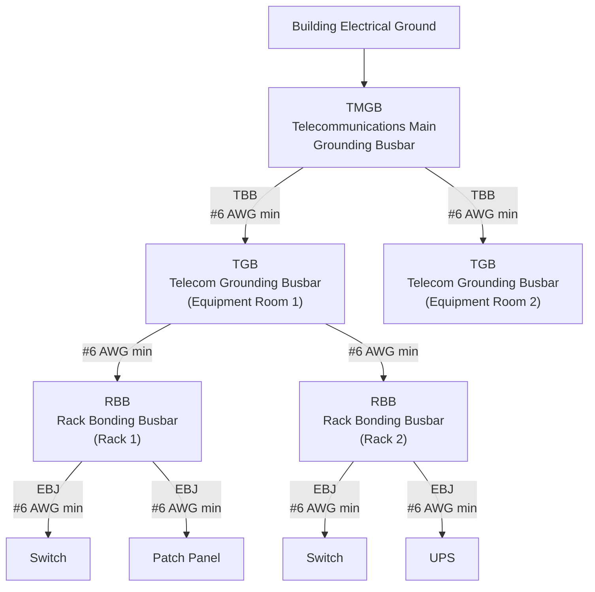

# Equipment Mounting and Infrastructure Standards

## Overview

This document establishes the physical mounting, enclosure, cable management, and environmental requirements for all telecommunications equipment deployed in municipal facilities. It covers indoor telecom closets, mid-size equipment rooms, and outdoor installations including street cabinets and pole-mounted enclosures.

All equipment mounting decisions must follow the priority order: security > reliability > cost-effectiveness > features. Every rack, enclosure, and mounting location must provide adequate physical protection, thermal management, grounding, and cable management to support the expected equipment load throughout its lifecycle.

## Standards References

| Standard | Title | Edition | Scope |
|----------|-------|---------|-------|
| EIA/ECA-310-E | Cabinets, Racks, Panels, and Associated Equipment | 2005 | 19-inch rack dimensions and mounting |
| IEC 60297-3-110 | Mechanical Structures for Electronic Equipment (482.6 mm Series) | 2018 | International rack dimensions |
| UL 2416 | Audio/Video, ICT Equipment Cabinet, Enclosure and Rack Systems | 2025 (revised) | Rack and enclosure safety listing |
| TIA-569-E | Telecommunications Pathways and Spaces | 2019 | Telecom room design, clearances, environmental |
| TIA-568.2-E | Balanced Twisted-Pair Telecommunications Cabling and Components | 2024 | Cable bend radius, performance |
| TIA-607-E | Generic Telecommunications Bonding and Grounding | 2024 | Rack grounding, bonding infrastructure |
| TIA-942-C | Telecommunications Infrastructure Standard for Data Centers | 2024 | Floor loading, data center infrastructure |
| BICSI TDMM | Telecommunications Distribution Methods Manual | 15th Ed. (2024) | Design guidance (not a standard) |
| ASHRAE TC 9.9 | Thermal Guidelines for Data Processing Environments | 2024 | Temperature and humidity ranges |
| NFPA 75 | Fire Protection of Information Technology Equipment | 2024 | Fire protection for IT areas |
| NEC (NFPA 70) | National Electrical Code — Article 645 | 2026 | IT equipment room wiring |
| NEMA 250 | Enclosures for Electrical Equipment (1,000V Maximum) | 2020 | Enclosure type ratings |
| IEC 60529 | Degrees of Protection Provided by Enclosures (IP Code) | 2020 | Ingress protection ratings |
| NEMA VE 1 | Metal Cable Tray Systems | 6th Ed. (2017) | Cable tray load and span classes |
| NEMA VE 2 | Cable Tray Installation Guidelines | 4th Ed. (2018) | Cable tray installation methods |
| ASCE/SEI 7-22 | Minimum Design Loads and Associated Criteria | 2022 | Seismic and structural loading |
| ASTM E84 / UL 723 | Surface Burning Characteristics of Building Materials | Current | Flame spread rating (backboards) |

## Telecommunications Space Classifications

All municipal telecommunications spaces fall into one of three types. The type determines rack style, environmental controls, and clearance requirements.

### Space Type Summary

| Attribute | Type A: Telecom Closet | Type B: Equipment Room | Type C: Outdoor Installation |
|-----------|----------------------|----------------------|----------------------------|
| **Served area** | Under 5,000 sq ft | 5,000+ sq ft | External / right-of-way |
| **Typical use** | Single IDF, branch office | MDF, multi-rack deployment | Street cabinet, pole mount, kiosk |
| **Rack style** | Wall-mount enclosure or 2-post rack | Floor-standing 4-post racks | NEMA-rated outdoor cabinet |
| **Minimum room size** | 6 ft x 8 ft (per TIA-569-E) | 10 ft x 8 ft minimum | N/A (cabinet-based) |
| **Front clearance** | 3 ft (0.9 m) | 3 ft (0.9 m) | Per cabinet door swing |
| **Rear clearance** | 0 ft (wall-mount) | 2 ft (0.6 m) minimum | N/A (front-access) |
| **HVAC** | Ventilation or passive cooling | Dedicated 24/7 HVAC | Vented, fan-cooled, or AC unit |
| **Backboard** | Required on minimum 1 wall | Required on minimum 2 walls | N/A |
| **Enclosure rating** | NEMA 1 (indoor general) | NEMA 1 (indoor general) | NEMA 4X minimum (exposed) |
| **Fire protection** | Per building code | NFPA 75 | Per enclosure listing |

### Type A: Telecom Closet

Telecom closets serve small areas with limited equipment — typically one or two switches and a patch panel. These spaces are commonly found in library branches, recreation centers, fire stations, and small municipal offices.

**Requirements:**

| Requirement | Specification | Standard |
|-------------|---------------|----------|
| Minimum room size | 6 ft x 8 ft | TIA-569-E |
| Door | Minimum 36 inches wide, outward swing, lockable | TIA-569-E |
| Ceiling height | Minimum 8 ft 6 in (2.6 m) | TIA-569-E |
| Front clearance | 3 ft (0.9 m) from equipment face | TIA-569-E |
| Lighting | Minimum 50 foot-candles at equipment level | TIA-569-E |
| Power | Minimum 2 dedicated 120V/20A non-switched duplex outlets | TIA-569-E |
| Flooring | Sealed concrete or tile (no carpet) | TIA-569-E |
| Ceiling | No drop ceiling tiles directly over equipment | TIA-569-E |

### Type B: Equipment Room

Equipment rooms house multiple racks with core/distribution switches, servers, or UPS systems. These exist at main campuses, police headquarters, 911 centers, and large facilities.

**Requirements:**

| Requirement | Specification | Standard |
|-------------|---------------|----------|
| Minimum room size | 10 ft x 8 ft (scales with rack count) | TIA-569-E |
| Door | Minimum 36 inches wide, outward swing, lockable | TIA-569-E |
| Ceiling height | Minimum 8 ft 6 in (2.6 m) | TIA-569-E |
| Front clearance | 3 ft (0.9 m) | TIA-569-E |
| Rear clearance | 2 ft (0.6 m) minimum | TIA-569-E |
| Lighting | Minimum 50 foot-candles at equipment level | TIA-569-E |
| HVAC | Dedicated 24/7 cooling, separate from building HVAC | TIA-569-E, NFPA 75 |
| Power | Dedicated panelboard or sub-panel for network equipment | NEC Article 645 |
| Floor loading | 100 psf (4.8 kPa) minimum | ASCE 7-22, TIA-942-C |
| Fire protection | Per NFPA 75 (detection, suppression, separation) | NFPA 75 |
| Emergency disconnect | Emergency power-off per NEC 645.10 | NEC 2026 |

### Type C: Outdoor Installation

Outdoor installations include street-level cabinets for fiber distribution, pole-mounted wireless enclosures, park kiosks, and event-venue equipment boxes.

**Requirements:**

| Requirement | Specification | Standard |
|-------------|---------------|----------|
| Enclosure rating (exposed) | NEMA 4X / IP66 minimum | NEMA 250, IEC 60529 |
| Enclosure rating (sheltered) | NEMA 3R / IP54 minimum | NEMA 250, IEC 60529 |
| Corrosion resistance | Stainless steel or powder-coated aluminum for coastal environments | NEMA 250 |
| Thermal management | Vented, fan-cooled, or thermostatically controlled AC unit | ASHRAE TC 9.9 |
| Mounting height (pole) | Equipment enclosure bottom edge minimum 10 ft above grade | — |
| Physical security | Tamper-resistant fasteners, padlock or electronic lock | NIST PE-3 |
| Lightning protection | SPD at enclosure entry, bonded to grounding electrode | TIA-607-E, NEC 800 |

## Backboard Requirements

Plywood backboards provide a universal mounting surface for patch panels, cable management, small UPS units, and low-voltage equipment in telecom closets and equipment rooms.

### Backboard Specifications

| Specification | Requirement | Standard |
|---------------|-------------|----------|
| Material | Void-free A/C grade plywood | TIA-569-E, BICSI TDMM |
| Thickness | 3/4 inch (20 mm) minimum | TIA-569-E |
| Fire treatment | Fire-retardant treated (FRT) per ASTM E84 | ASTM E84 / UL 723 |
| Flame spread index | 25 or less | ASTM E84 |
| Coverage (Type A) | Minimum 1 wall, floor to ceiling or 8 ft height | TIA-569-E |
| Coverage (Type B) | Minimum 2 walls, floor to ceiling or 8 ft height | TIA-569-E |
| Mounting height | Bottom edge 6 inches above finished floor | BICSI TDMM |
| Orientation | Longest dimension vertical (floor to ceiling) | TIA-569-E |
| Grade orientation | A-side facing room interior | BICSI TDMM |
| Painting | Do not paint FRT plywood; paint standard plywood with 2 coats fire-retardant paint on all 6 surfaces before installation | BICSI TDMM |
| Fastening | Screw-mounted to wall studs or structural backing at 16-inch intervals | TIA-569-E |

> **Note:** Fire-retardant treatment requirements vary by jurisdiction. Verify with the local Authority Having Jurisdiction (AHJ) whether FRT plywood or fire-retardant-painted standard plywood is required.

## Rack and Enclosure Standards

### General Requirements

All racks and enclosures must comply with EIA/ECA-310-E for 19-inch mounting compatibility.

| Requirement | Specification | Standard |
|-------------|---------------|----------|
| Rail width | 19 inches (482.6 mm) between vertical rail centers (18.3125 in / 465.1 mm between mounting holes) | EIA/ECA-310-E |
| Rack unit (1U) | 1.75 inches (44.45 mm) | EIA/ECA-310-E |
| Mounting hole pattern | Repeating 1/2 in – 5/8 in – 5/8 in within each 1U | EIA/ECA-310-E |
| Hole type | Square hole (tool-less) preferred; round hole and threaded hole acceptable | EIA/ECA-310-E |
| Safety listing | UL 2416 listed recommended | UL 2416 |
| Locking | Locking front and rear doors required | NIST PE-3 |
| Grounding | Rack Bonding Busbar (RBB) required on every rack | TIA-607-E |

### Wall-Mount Enclosures (Type A Spaces)

| Specification | Requirement |
|---------------|-------------|
| Height | 6U to 18U based on equipment count plus 25-50% growth |
| Depth | 15 to 24 inches (select based on deepest equipment plus cable clearance) |
| Standard depths | 12, 15, 18, 24 inches |
| Mounting | Attach to wall studs or structural blocking with load-rated lag screws or through-bolts |
| Weight rating | Must exceed total equipment weight by 50% safety margin |
| Access | Swing-out frame or removable side panels for cable access |
| Ventilation | Perforated top and bottom panels; active fan for loads exceeding 500W |
| Rail type | EIA-310-E compliant 19-inch adjustable rails |

### Floor-Standing Racks (Type B Spaces)

| Specification | Requirement |
|---------------|-------------|
| Height | 42U or 48U standard |
| Width | 24 inches (600 mm) or 30 inches (750 mm) |
| Depth | 36 to 48 inches (select based on equipment depth plus cable management) |
| Frame type | 4-post with front and rear mounting rails |
| Weight rating | 2,000 lbs minimum static load capacity |
| Casters | Optional for initial placement; remove and bolt to floor for permanent installation |
| Floor anchoring | Minimum 4 floor anchors (one per corner) for racks exceeding 200 lbs loaded weight |
| Side panels | Removable, tool-less preferred |
| Doors | Perforated front and rear doors (63%+ open area for airflow); locking |
| Top panel | Cable entry with brush grommets or split foam gaskets |
| Cable entry | Top and bottom cable access |

### 2-Post Open-Frame Racks (Type A or Type B)

| Specification | Requirement |
|---------------|-------------|
| Use case | Patch panels, cable management, lightweight switches |
| Height | 7 ft (45U) standard |
| Weight rating | 800 lbs minimum for 45U |
| Mounting | Floor-anchored (4 anchors minimum) |
| Depth adjustment | Adjustable rail depth for varying equipment |
| Limitation | Not suitable for heavy equipment (servers, large UPS) — use 4-post |

### Outdoor Cabinets (Type C Spaces)

| Specification | Requirement |
|---------------|-------------|
| Enclosure rating | NEMA 4X / IP66 minimum (weather-exposed); NEMA 3R / IP54 (sheltered) |
| Material | 316 stainless steel, marine-grade aluminum, or fiberglass for coastal locations |
| Mounting | Pad-mount, pole-mount, or wall-mount per installation site |
| Internal rails | EIA-310-E 19-inch compatible |
| Thermal management | Thermostatically controlled: vented louvers (low heat), forced-air fans (medium), or AC unit (high heat) |
| Operating temperature | -40°F to 140°F (-40°C to 60°C) with thermal management active |
| Internal height | 6U to 20U based on equipment requirements |
| Cable entry | Weatherproof cable glands or conduit entry points at bottom |
| Drainage | Condensation drain at lowest point |

## NEMA and IP Enclosure Cross-Reference

| NEMA Type | Protection | IP Approximate | Municipal Use |
|-----------|-----------|----------------|---------------|
| 1 | Indoor general purpose | IP20 | Type A and B spaces (indoor) |
| 3R | Rain, sleet, external ice | IP24 | Sheltered outdoor (under eave, covered walkway) |
| 3X | Rain, sleet, dust, ice, corrosion | IP56 | Outdoor with corrosion risk |
| 4 | Rain, sleet, dust, splashing water, hose-directed water | IP66 | Outdoor general |
| **4X** | **All Type 4 plus corrosion resistance** | **IP66** | **Outdoor standard for municipal telecom** |
| 6P | Submersion, corrosion | IP68 | Flood-prone areas (evaluate case by case) |

> **Note:** NEMA and IP ratings are not directly interchangeable. NEMA ratings include additional requirements for corrosion resistance, gasket aging, and environmental endurance beyond the IP code. When both ratings are specified, the equipment must meet both independently.

## Cable Management

### Horizontal Cable Management

Horizontal cable managers organize cables at the front of racks between patch panels and switches.

| Requirement | Specification | Standard |
|-------------|---------------|----------|
| Placement | 1U or 2U horizontal manager between each patch panel | BICSI TDMM |
| Type | D-ring, finger-duct, or brush-strip based on cable density | BICSI TDMM |
| Sizing | Width must accommodate all cables at that position without compression | TIA-569-E |
| Cover | Hinged cover recommended for clean appearance and cable retention | BICSI TDMM |

### Vertical Cable Management

Vertical cable managers run the full height of the rack on one or both sides, routing cables between horizontal managers and equipment.

| Requirement | Specification | Standard |
|-------------|---------------|----------|
| Width | Sized for anticipated cable volume plus 25% growth | BICSI TDMM |
| Standard widths | 6 in, 8 in, 10 in, 12 in | — |
| Placement | Both sides of rack for 4-post racks; single side for 2-post | BICSI TDMM |
| Type | Finger-duct with hinged cover preferred | BICSI TDMM |
| Depth | Match or exceed rack depth to prevent cable pinching at rear | — |

### Cable Bend Radius

All cable installations must maintain minimum bend radius to preserve performance.

| Cable Type | Minimum Bend Radius | Standard |
|------------|---------------------|----------|
| U/UTP (Cat5e, Cat6, Cat6A) | 4x outer cable diameter | TIA-568.2-E |
| F/UTP or S/FTP (shielded) | 8x outer cable diameter | TIA-568.2-E |
| Multi-pair backbone cable | 10x outer cable diameter | TIA-568.2-E |
| 2-4 fiber premises cable (installed, no tension) | 25 mm (1 in) | TIA-568.3-E |
| 2-4 fiber premises cable (under tension) | 50 mm (2 in) | TIA-568.3-E |

### Cable Securing

| Requirement | Specification |
|-------------|---------------|
| Binding type | Hook-and-loop (Velcro) straps preferred; nylon cable ties prohibited for horizontal cabling |
| Binding tension | Loose enough to slide along cable jacket — no jacket deformation |
| Binding interval | Every 12-18 inches in cable managers; irregularly spaced to distribute stress |
| Service loops | Provide sufficient slack for one full rack pull-out (floor-standing) or one enclosure swing-out (wall-mount) |
| Labeling | Cables labeled at both ends per TIA-606-D |

### Pathway Fill Ratios

| Pathway Type | Maximum Fill Ratio | Standard |
|--------------|--------------------|----------|
| Conduit (1 cable) | 53% | TIA-569-E |
| Conduit (2 cables) | 31% | TIA-569-E |
| Conduit (3+ cables) | 40% | TIA-569-E |
| Cable tray | 50% cross-sectional area | TIA-569-E |
| Horizontal cable manager | 50% usable area | BICSI TDMM |
| Vertical cable manager | 50% usable area | BICSI TDMM |

### Cable Tray Systems

Cable trays support horizontal cable runs above racks and between telecom spaces.

| Requirement | Specification | Standard |
|-------------|---------------|----------|
| Type | Ladder, wire mesh, or solid bottom per application | NEMA VE 1 |
| Load class | Match anticipated cable weight per linear foot (50, 75, or 100 lbs) | NEMA VE 1 |
| Support span | 8 ft or 12 ft centers depending on load class | NEMA VE 1 |
| Fill ratio | 50% maximum cross-sectional area | TIA-569-E |
| Bonding | Electrically continuous; bonded to TGB per TIA-607-E | TIA-607-E |
| Installation | Per NEMA VE 2 for support, attachment, and maintenance access | NEMA VE 2 |
| Separation from power | Minimum 5 inches from 480V; 2 inches from 120/208V with barrier | TIA-569-E |

## Rack Grounding

Every rack and cabinet must be bonded to the building telecommunications grounding infrastructure per TIA-607-E. Proper grounding prevents ground loops, reduces electromagnetic interference, and protects equipment from electrical faults.

### Grounding Infrastructure Hierarchy

### Rack Grounding Requirements

| Requirement | Specification | Standard |
|-------------|---------------|----------|
| Rack Bonding Busbar (RBB) | Required on every rack and cabinet | TIA-607-E |
| RBB to TGB conductor | #6 AWG minimum copper | TIA-607-E |
| Equipment Bonding Jumper (EBJ) | #6 AWG minimum copper from each device chassis to RBB | TIA-607-E |
| Conductor insulation | Green or green-with-yellow-stripe | TIA-607-E |
| Conductor routing | Continuous — no splices within conduit | TIA-607-E |
| Bonded components | Racks, enclosures, patch panels, cable trays, ladder racks, all active equipment | TIA-607-E |
| Cable tray bonding | Bonding jumper across each joint; continuous to TGB | TIA-607-E |
| Outdoor enclosure bonding | Bonded to grounding electrode via #6 AWG minimum | TIA-607-E, NEC 800 |

> **Cross-Reference:** For the complete TMGB/TBB/TGB hierarchy, lightning protection bonding, and surge protection grounding, see [Structured Cabling Standards — Surge Protection and Grounding](cabling-standards.md#surge-protection-and-grounding).

## Environmental Requirements

### Indoor Temperature and Humidity

| Parameter | Type A (Closet) | Type B (Equipment Room) | Standard |
|-----------|----------------|------------------------|----------|
| Operating temperature | 64-75°F (18-24°C) | 64-75°F (18-24°C) | TIA-569-E |
| Recommended range | 64-80°F (18-27°C) | 64-80°F (18-27°C) | ASHRAE TC 9.9 Class A1 |
| Allowable range | 59-90°F (15-32°C) | 59-90°F (15-32°C) | ASHRAE TC 9.9 Class A1 |
| Relative humidity | 30-55% | 30-55% | TIA-569-E |
| Maximum rate of change | 9°F (5°C) per hour | 9°F (5°C) per hour | ASHRAE TC 9.9 |

### HVAC Requirements by Space Type

| Space Type | Cooling Requirement | Sizing Basis |
|------------|-------------------|--------------|
| Type A (under 500W IT load) | Passive ventilation or building HVAC sufficient | Room volume and heat load |
| Type A (500W+ IT load) | Active ventilation fan or dedicated split unit | 1.5x IT load in BTU/hr |
| Type B (any load) | Dedicated 24/7 HVAC, separate from building system | IT load + lighting + personnel + envelope gain |
| Type C (outdoor) | Vented louvers (under 200W), forced fan (200-500W), or AC unit (500W+) | Equipment heat dissipation + solar gain |

**PoE Heat Dissipation:** When sizing HVAC for telecom spaces, include PoE power dissipated as heat within the room. Switches delivering PoE to remote APs dissipate the switch chassis power (not PoE pass-through) as heat. Switches with all PoE ports loaded will generate significant heat from internal power supplies. Use the 60W per-AP planning figure from [Backup Power Standards](backup-power-standards.md) to calculate total PoE load for HVAC sizing.

### Fire Protection (Type B Equipment Rooms)

| Requirement | Specification | Standard |
|-------------|---------------|----------|
| Fire detection | Smoke detection (early warning / VESDA recommended for large rooms) | NFPA 75 |
| Fire suppression | Clean agent (FM-200, Novec 1230) or pre-action sprinkler | NFPA 75 |
| Fire-rated separation | 1-hour fire-rated walls, floor, and ceiling from adjacent spaces | NFPA 75 |
| HVAC shutdown | Automatic HVAC shutdown on fire detection | NFPA 75, NEC 645 |
| Emergency power-off | EPO button at each exit, clearly labeled | NEC 645.10 |
| Signage | "TELECOMMUNICATIONS EQUIPMENT ROOM — AUTHORIZED PERSONNEL ONLY" | — |

## Outdoor Enclosure Thermal Management

Outdoor enclosures face solar heat gain, humidity, and wide temperature swings that indoor spaces do not.

| Condition | Solution | Notes |
|-----------|----------|-------|
| Low heat load (under 200W) | Vented louvers with filtered intake | Filtered to prevent insects and debris |
| Medium heat load (200-500W) | Thermostatically controlled exhaust fans | Set to activate at 95°F (35°C) |
| High heat load (500W+) | Thermoelectric cooler or compressor-based AC unit | Required for sealed NEMA 4X enclosures |
| Humidity (coastal) | Internal desiccant packs or dehumidifier | Replace desiccant on maintenance schedule |
| Condensation | Drain hole at enclosure bottom; condensation heater in cold climates | Heater prevents internal frost |
| Solar gain | Light-colored enclosure (white or light gray); sun shield on south-facing installations | Can reduce internal temperature 15-20°F |

## Seismic and Structural Considerations

### Seismic Design Category

New Orleans is classified as **ASCE/SEI 7-22 Seismic Design Category B** (low seismic risk). This means:

- Equipment under 400 lbs does **not** require seismic anchorage by code
- Standard floor anchoring (per the rack specifications above) is sufficient for normal installations
- All floor-standing racks should still be bolted to the floor as a best practice for stability during hurricane wind events and incidental contact

### When Seismic Anchorage Is Required

Seismic-rated rack anchoring per ASCE 7-22 and/or NEBS GR-63-CORE is required when:

| Condition | Action Required |
|-----------|----------------|
| Equipment weight exceeds 400 lbs per rack | Seismic-rated floor anchors and overhead bracing |
| Facility is in Seismic Design Category C, D, E, or F | Full seismic anchorage per ASCE 7-22 Chapter 13 |
| Equipment center of gravity exceeds 4 ft above floor | Overhead bracing to structural element |
| Facility classified as Risk Category IV (essential facility) | Component Importance Factor Ip = 1.5 per ASCE 7-22 |

### Floor Loading

| Space Type | Minimum Floor Loading | Standard |
|------------|----------------------|----------|
| Type A (Telecom Closet) | Standard building floor loading (typically 40-50 psf) | Local building code |
| Type B (Equipment Room) | 100 psf (4.8 kPa) minimum | ASCE 7-22, TIA-942-C |
| Type B (high-density racks) | 150 psf (7.2 kPa) recommended | TIA-942-C |

> **Note:** Verify floor loading capacity with a structural engineer before installing racks exceeding 1,000 lbs total loaded weight, especially in buildings not originally designed for equipment room use.

## Industry Adoption Data

### Equipment Mounting Practice Adoption

| Practice | Adoption Rate | Source | Year |
|----------|---------------|--------|------|
| 19-inch EIA-310 rack standard | 99% | Data center industry | 2024 |
| Wall-mount enclosures in small IDF closets | 78% | BICSI survey | 2024 |
| FRT plywood backboards | 85% of new construction | BICSI survey | 2024 |
| Dedicated HVAC for equipment rooms | 71% (enterprise); 54% (municipal) | EMA Network Report | 2024 |
| NEMA 4X for outdoor telecom | 82% of outdoor deployments | NEMA member data | 2024 |
| Cable management (horizontal + vertical) | 91% of enterprise racks | Cabling Installation & Maintenance | 2024 |
| Rack grounding per TIA-607 | 76% | BICSI survey | 2024 |

### Municipal Deployment Patterns

| Configuration | Adoption | Notes |
|---------------|----------|-------|
| Wall-mount enclosures in IDF closets | 68% | Growing with PoE switch deployments |
| Floor-standing racks in MDF | 94% | Standard practice |
| Outdoor NEMA-rated cabinets | 47% | Increasing with smart city initiatives |
| Full cable management (H+V) per rack | 52% | Enterprise practice migrating to municipal |
| Rack bonding busbars | 41% | Low adoption; frequently overlooked |

## Cost-Performance Analysis

### Equipment Cost Ranges (per rack/installation)

| Component | Budget | Mid-Range | Enterprise | Notes |
|-----------|--------|-----------|------------|-------|
| Wall-mount enclosure (12U) | $200 | $400 | $800 | Swing-out frame at mid-range |
| Floor-standing rack (42U, 4-post) | $400 | $1,200 | $3,000 | UL 2416 listed at enterprise |
| 2-post open rack (45U) | $150 | $350 | $600 | Patch-only applications |
| Outdoor cabinet (NEMA 4X, 12U) | $1,500 | $3,500 | $8,000 | Includes thermal management |
| Horizontal cable manager (1U) | $25 | $60 | $120 | Per unit |
| Vertical cable manager (42U) | $80 | $200 | $400 | Per side |
| Rack Bonding Busbar kit | $50 | $100 | $150 | Includes busbar and hardware |
| FRT plywood backboard (4x8 sheet) | $80 | $120 | $120 | FRT treatment adds ~50% |
| Floor anchor kit (4 anchors) | $30 | $60 | $100 | Seismic-rated at enterprise |

### 10-Year TCO Comparison

| Approach | Initial Cost | Annual Maintenance | 10-Year TCO | Risk |
|----------|-------------|-------------------|-------------|------|
| **Proper mounting (per this standard)** | $2,500-5,000 per location | $200/year | $4,500-7,000 | Low |
| Minimal mounting (rack only, no management) | $500-1,000 | $500/year (troubleshooting, rework) | $5,500-6,000 | Medium |
| No standard (ad hoc) | $200-500 | $1,000+/year (cable failures, thermal issues) | $10,200-10,500 | High |

**Key insight:** The upfront cost of proper cable management, grounding, and environmental controls is recovered within 3-5 years through reduced troubleshooting, fewer cable failures, and lower equipment replacement from thermal damage.

## NIST SP 800-53 Alignment

| Control ID | Control Name | Implementation in This Document |
|------------|--------------|--------------------------------|
| PE-9 | Power Equipment and Cabling | Cable protection via conduit, trays, and enclosed pathways |
| PE-14 | Environmental Controls | Temperature and humidity monitoring per ASHRAE/TIA-569-E |
| PE-14(2) | Monitoring with Alarms | Temperature alarms for Type B rooms and outdoor cabinets |
| PE-15 | Water Damage Protection | Sealed concrete floors, condensation drains in outdoor enclosures |
| PE-18 | Location of System Components | Equipment placement in controlled spaces with appropriate clearances |

## Troubleshooting Guide

| Symptom | Likely Cause | Resolution |
|---------|--------------|------------|
| Thermal shutdown / high temperature alarms | Inadequate HVAC, blocked airflow, failed fan | Verify HVAC operation; check door perforations not blocked; replace failed fans |
| Intermittent link errors | Excessive cable bend at patch panel or manager | Inspect bend radius at all cable transitions; reroute violating cables |
| Ground loop / hum on analog circuits | Missing or improper rack grounding | Verify RBB-to-TGB bonding conductor; check for multiple ground paths |
| Cable congestion prevents maintenance | Undersized cable managers, no service loops | Install larger vertical managers; add service loops at patch panels |
| Outdoor enclosure corrosion | Incorrect NEMA rating for environment | Replace with NEMA 4X (stainless or aluminum) for coastal deployments |
| Condensation inside outdoor cabinet | No drain or dehumidification | Add drain hole at lowest point; install desiccant packs or heater |
| Wall-mount enclosure sagging or pulling from wall | Overloaded beyond mounting capacity | Verify equipment weight vs. enclosure rating; reinforce with structural blocking |
| Rack instability / tipping risk | Not floor-anchored | Install floor anchors at all four corners; remove casters |

## Procurement Pass/Fail Checklist

Use this checklist to evaluate racks, enclosures, cable management, and mounting materials before purchase. Every **Required** item must pass. If any Required item fails, the equipment is **not approved** for procurement.

### Equipment Mounting Procurement Checklist

| # | Requirement | Required | Pass | Fail |
|---|-------------|----------|------|------|
| 1 | Rack/enclosure meets EIA/ECA-310-E 19-inch standard | **Yes** | ☐ | ☐ |
| 2 | Locking front door | **Yes** | ☐ | ☐ |
| 3 | Locking rear door or panel (4-post racks) | **Yes** | ☐ | ☐ |
| 4 | Weight rating exceeds planned equipment load by 50% | **Yes** | ☐ | ☐ |
| 5 | Perforated doors with ≥63% open area (floor-standing racks) | **Yes** | ☐ | ☐ |
| 6 | Floor anchor provisions (bolt-down holes in base) | **Yes** | ☐ | ☐ |
| 7 | Rack Bonding Busbar mounting point or included kit | **Yes** | ☐ | ☐ |
| 8 | UL 2416 safety listing | Recommended | ☐ | ☐ |
| 9 | Outdoor enclosure rated NEMA 4X / IP66 or higher (Type C only) | **Conditional** | ☐ | ☐ |
| 10 | Outdoor enclosure corrosion-resistant material (coastal sites) | **Conditional** | ☐ | ☐ |
| 11 | Thermal management included or available (outdoor enclosures) | **Conditional** | ☐ | ☐ |
| 12 | Backboard plywood is FRT or fire-retardant painted, 3/4 inch A/C grade | **Yes** | ☐ | ☐ |
| 13 | Cable managers (horizontal and vertical) included in rack order | **Yes** | ☐ | ☐ |

### Results

| Outcome | Action |
|---------|--------|
| All Required items pass | **Approved for procurement** |
| Any Required item fails | **Not approved — do not purchase** |
| Questions about a specific product | Contact Network Engineering (ITI Networking Team) |

### How to Verify Requirements

| Checklist Item | Where to Find |
|----------------|---------------|
| EIA-310-E compliance | Rack datasheet, product specifications |
| Locking doors | Product description, accessories list |
| Weight rating | Rack datasheet, static load capacity |
| Door perforation percentage | Product datasheet, airflow specifications |
| Floor anchor provisions | Product datasheet, base design, installation guide |
| Rack Bonding Busbar | Product accessories, grounding options |
| UL 2416 listing | Product certification, UL product database |
| NEMA/IP rating | Enclosure datasheet, environmental rating |
| FRT plywood certification | Material data sheet, ASTM E84 test report |

## References

1. EIA/ECA-310-E, "Cabinets, Racks, Panels, and Associated Equipment," ECIA, 2005.
2. IEC 60297-3-110, "Mechanical Structures for Electronic Equipment — Dimensions of Mechanical Structures of the 482.6 mm (19 in) Series," IEC, 2018.
3. UL 2416, "Standard for Audio/Video, Information and Communication Technology Equipment Cabinet, Enclosure and Rack Systems," UL, 2025 (revised).
4. ANSI/TIA-569-E, "Telecommunications Pathways and Spaces," TIA, May 2019.
5. ANSI/TIA-568.2-E, "Balanced Twisted-Pair Telecommunications Cabling and Components," TIA, October 2024.
6. ANSI/TIA-607-E, "Generic Telecommunications Bonding and Grounding (Earthing) for Customer Premises," TIA, May 2024.
7. ANSI/TIA-942-C, "Telecommunications Infrastructure Standard for Data Centers," TIA, May 2024.
8. BICSI, "Telecommunications Distribution Methods Manual (TDMM)," 15th Edition, January 2024.
9. ASHRAE TC 9.9, "Thermal Guidelines for Data Processing Environments," ASHRAE Datacom Encyclopedia, 2024.
10. NFPA 75, "Standard for the Fire Protection of Information Technology Equipment," 2024 Edition.
11. NFPA 70, "National Electrical Code (NEC)," 2026 Edition.
12. ANSI/NEMA 250-2020, "Enclosures for Electrical Equipment (1,000 Volts Maximum)," NEMA, 2020.
13. IEC 60529, "Degrees of Protection Provided by Enclosures (IP Code)," Edition 2.2, 2020.
14. NEMA VE 1-2017, "Metal Cable Tray Systems," 6th Edition, NEMA, 2017.
15. NEMA VE 2-2018, "Cable Tray Installation Guidelines," 4th Edition, NEMA, 2018.
16. ASCE/SEI 7-22, "Minimum Design Loads and Associated Criteria for Buildings and Other Structures," ASCE, 2022.
17. ASTM E84 / UL 723, "Standard Test Method for Surface Burning Characteristics of Building Materials," ASTM International, current edition.
18. NIST SP 800-53 Rev. 5, "Security and Privacy Controls for Information Systems and Organizations," NIST, September 2020.

## Cross-References

| Document | Relationship |
|----------|--------------|
| [Structured Cabling Standards](cabling-standards.md) | TMGB/TBB/TGB grounding hierarchy, pathway fill ratios, cable separation from power |
| [Backup Power Standards](backup-power-standards.md) | UPS rack mounting, 60W AP planning figure for thermal sizing, circuit specifications |
| [Switch Specifications](switch-specifications.md) | Switch chassis dimensions and weight for rack planning |
| [Deployment Procedures](../wifi/deployment-procedures.md) | AP mounting methods (T-bar, wall, pole, outdoor bracket) |
| [Physical Security Standards](../security/physical-security-standards.md) | Physical access controls, locks, port blanking, surveillance for telecom spaces |
| [Network Segmentation](../security/network-segmentation.md) | Management VLAN for environmental monitoring systems |

---

*For questions about these standards, open an issue or contact the ITI Networking Team.*
