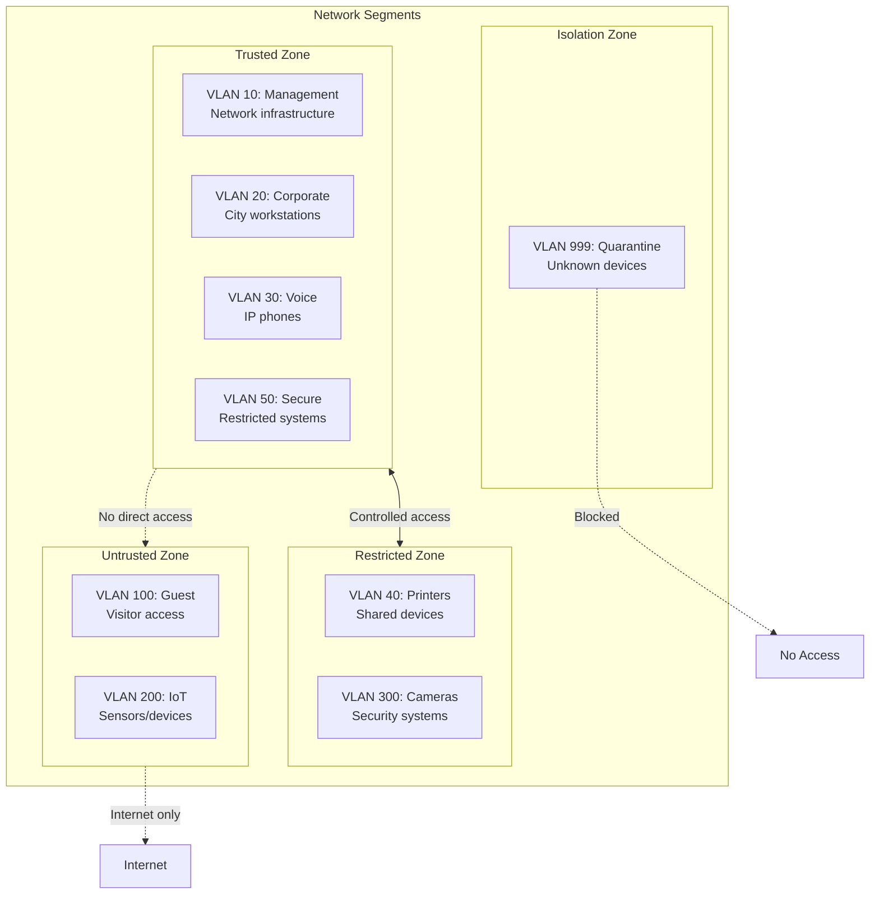
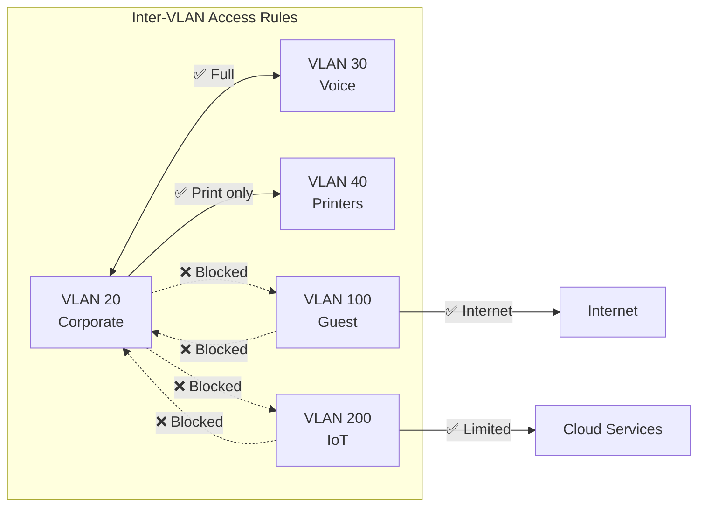
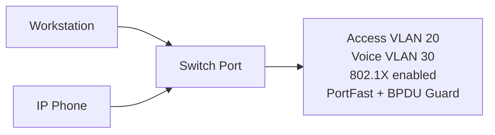
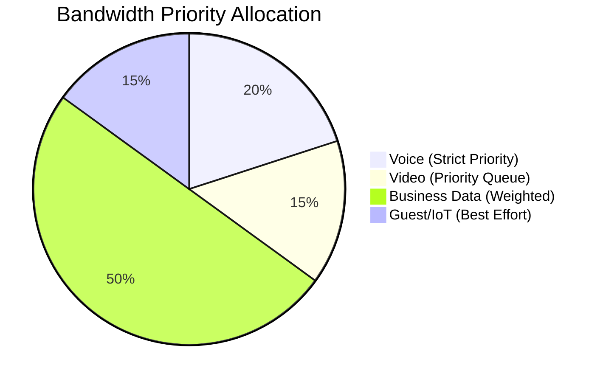
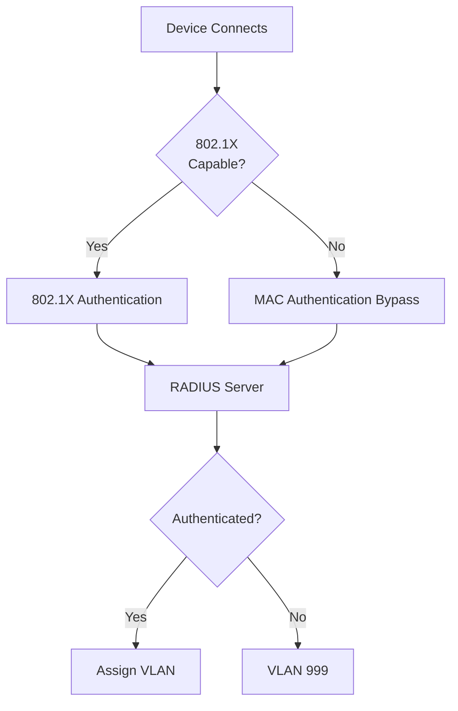

# Port Configurations and VLAN Standards

## Overview

This document defines standard VLAN assignments, port configurations, and naming conventions for network switch ports across City of New Orleans facilities. All configurations implement IEEE 802.1Q VLAN tagging and IEEE 802.1X port-based access control.

## Standards References

| Standard | Title | Ratification Date | Scope |
|----------|-------|-------------------|-------|
| IEEE 802.1Q-2022 | Bridges and Bridged Networks | December 2022 | VLAN tagging, QoS |
| IEEE 802.1X-2020 | Port-Based Network Access Control | February 2020 | Authentication |
| IEEE 802.1p | Traffic Class Expediting | 1998 (now part of 802.1Q) | QoS prioritization |
| IEEE 802.1AB-2016 | LLDP | March 2016 | Device discovery |
| IEEE 802.1w-2001 | Rapid Spanning Tree | July 2001 | Loop prevention |
| IETF RFC 5765 | RADIUS Extensions for VLAN Assignment | April 2010 | Dynamic VLAN |

## Network Segmentation Architecture



## VLAN Assignments

### Standard VLAN Table

| VLAN ID | Name | Purpose | Security Zone | 802.1X Required |
|---------|------|---------|---------------|-----------------|
| 1 | default | **Unused - Disabled** | — | — |
| 10 | MGMT | Network device management | Trusted | Yes (admin only) |
| 20 | CORP | Corporate workstations | Trusted | Yes |
| 30 | VOIP | Voice over IP phones | Trusted | LLDP-MED |
| 40 | PRINT | Printers and MFPs | Restricted | MAB |
| 50 | SECURE | High-security systems | Trusted | Yes + certificates |
| 100 | GUEST | Guest/visitor WiFi breakout | Untrusted | Captive portal |
| 200 | IOT | IoT devices and sensors | Untrusted | MAB |
| 300 | CAMERA | Security cameras | Restricted | MAB |
| 999 | QUARANTINE | Unknown/unauthorized devices | Isolation | N/A |

### VLAN Security Matrix



### Industry Adoption: Network Segmentation

| Practice | Adoption Rate | Source | Year |
|----------|---------------|--------|------|
| VLAN segmentation | 97% of enterprise networks | EMA Network Segmentation Report | 2024 |
| IoT isolation VLAN | 78% of organizations | Ponemon IoT Security Study | 2024 |
| Guest network isolation | 94% implementation | Gartner Network Security Survey | 2023 |
| 802.1X deployment | 84% of enterprises | EMA Network Management Report | 2024 |

## Port Configuration Templates

> **Note:** Configuration examples use generic pseudocode. Actual CLI syntax varies by platform. Refer to vendor documentation for specific implementation.

### Standard Workstation Port



**Configuration requirements:**

| Setting | Value | Standard |
|---------|-------|----------|
| Mode | Access | IEEE 802.1Q |
| Data VLAN | 20 (CORP) | — |
| Voice VLAN | 30 (VOIP) | IEEE 802.1Q |
| Authentication | 802.1X | IEEE 802.1X-2020 |
| Spanning Tree | PortFast enabled | IEEE 802.1w |
| BPDU Guard | Enabled | Best practice |
| Port security | Max 3 MAC addresses | Best practice |

**Generic configuration:**

```
INTERFACE access-port
  DESCRIPTION "[Building]-[Room]-[Jack]"
  MODE access
  ACCESS-VLAN 20
  VOICE-VLAN 30
  SPANNING-TREE portfast ENABLE
  SPANNING-TREE bpduguard ENABLE
  PORT-SECURITY maximum 3
  PORT-SECURITY violation restrict
  DOT1X port-control auto
  DOT1X timeout tx-period 5
```

### VoIP Phone Only

For dedicated phone ports without PC passthrough.

| Setting | Value |
|---------|-------|
| Mode | Access |
| VLAN | 30 (VOIP) |
| Authentication | LLDP-MED or 802.1X |
| Port security | Max 1 MAC |

```
INTERFACE phone-port
  DESCRIPTION "VOIP-[Building]-[Room]"
  MODE access
  ACCESS-VLAN 30
  SPANNING-TREE portfast ENABLE
  SPANNING-TREE bpduguard ENABLE
  PORT-SECURITY maximum 1
  LLDP-MED enable
```

### Printer Port

For network printers and multifunction devices.

| Setting | Value | Rationale |
|---------|-------|-----------|
| Mode | Access | Single VLAN |
| VLAN | 40 (PRINT) | Isolated from workstations |
| Authentication | MAB (MAC Authentication Bypass) | Printers lack 802.1X |
| Port security | Sticky MAC | Prevent unauthorized moves |

```
INTERFACE printer-port
  DESCRIPTION "PRINT-[Building]-[Room]"
  MODE access
  ACCESS-VLAN 40
  SPANNING-TREE portfast ENABLE
  SPANNING-TREE bpduguard ENABLE
  PORT-SECURITY maximum 1
  PORT-SECURITY mac-address sticky
  DOT1X mab ENABLE
```

### Access Point Port

For wireless access points requiring multiple VLANs.


| Setting | Value | Rationale |
|---------|-------|-----------|
| Mode | Trunk | Multiple SSIDs need multiple VLANs |
| Native VLAN | 10 (MGMT) | AP management traffic |
| Allowed VLANs | 10, 20, 30, 100, 200 | Corp, Voice, Guest, IoT |
| PortFast | Trunk mode | Fast AP boot |

```
INTERFACE ap-port
  DESCRIPTION "AP-[Building]-[Location]"
  MODE trunk
  TRUNK native-vlan 10
  TRUNK allowed-vlan 10,20,30,100,200
  SPANNING-TREE portfast trunk ENABLE
  SPANNING-TREE bpduguard ENABLE
  POE priority high
```

### Security Camera Port

For IP security cameras.

| Setting | Value | Rationale |
|---------|-------|-----------|
| Mode | Access | Single VLAN |
| VLAN | 300 (CAMERA) | Isolated security network |
| Authentication | MAB | Cameras lack 802.1X |
| PoE | Enabled, high priority | Ensure camera uptime |

```
INTERFACE camera-port
  DESCRIPTION "CAM-[Building]-[Location]"
  MODE access
  ACCESS-VLAN 300
  SPANNING-TREE portfast ENABLE
  SPANNING-TREE bpduguard ENABLE
  PORT-SECURITY maximum 1
  PORT-SECURITY mac-address sticky
  DOT1X mab ENABLE
  POE priority high
```

### IoT Device Port

For sensors, displays, and smart devices.

| Setting | Value | Rationale |
|---------|-------|-----------|
| Mode | Access | Single VLAN |
| VLAN | 200 (IOT) | Isolated from corporate |
| Authentication | MAB | Most IoT lacks 802.1X |
| Traffic shaping | Rate limited | Prevent IoT abuse |

```
INTERFACE iot-port
  DESCRIPTION "IOT-[Building]-[Device-Type]"
  MODE access
  ACCESS-VLAN 200
  SPANNING-TREE portfast ENABLE
  SPANNING-TREE bpduguard ENABLE
  PORT-SECURITY maximum 1
  DOT1X mab ENABLE
  QOS rate-limit input 10mbps
  QOS rate-limit output 5mbps
```

### Uplink Port (to Distribution)

For inter-switch connections.

| Setting | Value | Rationale |
|---------|-------|-----------|
| Mode | Trunk | All VLANs |
| Allowed VLANs | Per design | Limit VLAN scope |
| Link aggregation | LACP (if multiple links) | IEEE 802.1AX |
| Root Guard | Enabled | Protect STP topology |

```
INTERFACE uplink-port
  DESCRIPTION "UPLINK-[Destination-Switch]"
  MODE trunk
  TRUNK allowed-vlan all
  CHANNEL-GROUP [X] mode active
  SPANNING-TREE guard root
  STORM-CONTROL broadcast level 10
  STORM-CONTROL multicast level 10
```

### Unused Port (Security Hardened)

**All unused ports must be secured:**


```
INTERFACE unused-port
  DESCRIPTION "UNUSED"
  MODE access
  ACCESS-VLAN 999
  SHUTDOWN
  SPANNING-TREE bpduguard ENABLE
```

## Port Naming Convention

### Description Format

```
[Type]-[Building]-[Location/Room]-[Detail]
```

### Type Codes

| Code | Device Type | Example |
|------|-------------|---------|
| WS | Workstation | WS-CH-205-04 |
| VOIP | Voice phone | VOIP-CH-205 |
| PRINT | Printer | PRINT-CH-205 |
| AP | Access point | AP-LIB-MAIN-LOBBY |
| CAM | Security camera | CAM-CH-NORTH-ENTRANCE |
| IOT | IoT device | IOT-PARK-SENSOR-01 |
| UPLINK | Uplink to distribution | UPLINK-CH-MDF-SW01 |
| ISL | Inter-switch link | ISL-CH-IDF2-SW02 |
| UNUSED | Unused port | UNUSED |

### Building Codes

| Code | Facility |
|------|----------|
| CH | City Hall |
| LIB | Library |
| PD | Police Department |
| FD | Fire Department |
| REC | Recreation Center |

## Quality of Service (QoS)

### Traffic Classification (per IEEE 802.1p)

| Priority | Traffic Type | VLAN | DSCP | 802.1p CoS |
|----------|--------------|------|------|------------|
| Highest | Voice bearer | 30 | EF (46) | 5 |
| High | Voice signaling | 30 | AF31 (26) | 3 |
| Medium | Video | — | AF41 (34) | 4 |
| Normal | Data | 20, 40, 50 | 0 | 0 |
| Low | Guest/IoT | 100, 200 | 0 | 1 |

### Bandwidth Allocation



## Security Considerations

### IEEE 802.1X Deployment



### NIST SP 800-53 Control Mapping

| Control | Implementation |
|---------|----------------|
| AC-3: Access Enforcement | VLAN segmentation, ACLs |
| AC-4: Information Flow Enforcement | Inter-VLAN routing policies |
| AU-12: Audit Generation | 802.1X authentication logging |
| IA-3: Device Identification | 802.1X and MAB |
| SC-7: Boundary Protection | Quarantine VLAN for unknown devices |

## Cost-Performance Analysis

### VLAN Segmentation ROI

Implementing proper VLAN segmentation provides measurable security and operational benefits:

| Benefit | Estimated Value | Basis |
|---------|-----------------|-------|
| Reduced breach impact | 60% containment improvement | Ponemon 2024 |
| Simplified troubleshooting | 25% reduction in MTTR | Industry average |
| Compliance alignment | Required for PCI-DSS, HIPAA | Regulatory |
| Guest network isolation | Liability reduction | Legal best practice |

### Implementation Effort

| Task | Effort (per switch) | One-time |
|------|---------------------|----------|
| VLAN configuration | 30 minutes | Yes |
| Port template deployment | 15 minutes per template | Yes |
| 802.1X integration | 4 hours (with RADIUS) | Yes |
| Documentation | 1 hour | Yes |

## References

1. IEEE 802.1Q-2022, "IEEE Standard for Local and Metropolitan Area Networks—Bridges and Bridged Networks," IEEE, December 2022.
2. IEEE 802.1X-2020, "IEEE Standard for Local and Metropolitan Area Networks—Port-Based Network Access Control," IEEE, February 2020.
3. IEEE 802.1AB-2016, "IEEE Standard for Local and Metropolitan Area Networks—Station and Media Access Control Connectivity Discovery," IEEE, March 2016.
4. IETF RFC 5765, "Security Issues and Solutions in Peer-to-Peer Systems for Realtime Communications," IETF, April 2010.
5. NIST SP 800-53 Rev. 5, "Security and Privacy Controls for Information Systems and Organizations," NIST, September 2020.
6. BICSI TDMM, 14th Edition, "Telecommunications Distribution Methods Manual," BICSI, 2018.

---

*For questions about these standards, open an issue or contact the ITI Networking Team.*
