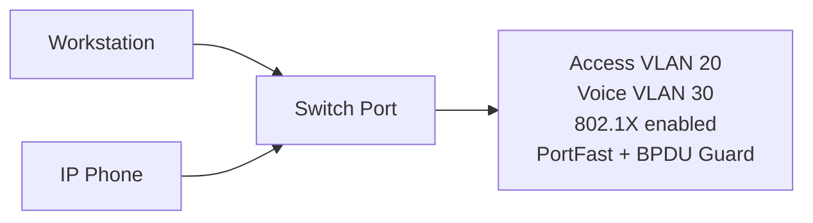
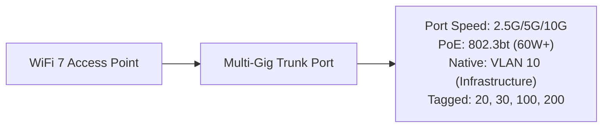
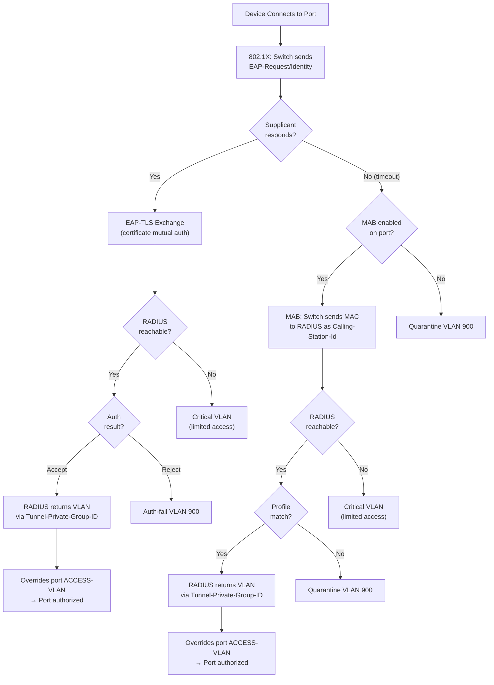

# Port Configurations and VLAN Standards

## Overview

This document defines standard VLAN assignments, port configurations, and naming conventions for network switch ports across municipal facilities. All configurations implement IEEE 802.1Q VLAN tagging and IEEE 802.1X port-based access control.

## Standards References

| Standard | Title | Ratification Date | Scope |
|----------|-------|-------------------|-------|
| IEEE 802.1Q-2022 | Bridges and Bridged Networks | December 2022 | VLAN tagging, QoS |
| IEEE 802.1X-2020 | Port-Based Network Access Control | February 2020 | Authentication |
| IEEE 802.1p | Traffic Class Expediting | 1998 (now part of 802.1Q) | QoS prioritization |
| IEEE 802.1AB-2016 | LLDP | March 2016 | Device discovery |
| IEEE 802.1w-2001 | Rapid Spanning Tree | July 2001 | Loop prevention |
| IETF RFC 2868 | RADIUS Attributes for Tunnel Protocol Support | June 2000 | Dynamic VLAN |

## Network Segmentation Architecture


## VLAN Assignments

The authoritative VLAN allocation is defined in [Network Segmentation — VLAN Allocation Table](../security/network-segmentation.md#vlan-allocation-table). The VLANs most relevant to port configurations are:

| VLAN ID | Name | Port Usage | Authentication |
|---------|------|-----------|----------------|
| 10 | Infrastructure | AP trunk native, switch uplinks | Admin only |
| 20 | Corporate | Workstation access ports | 802.1X required |
| 30 | VoIP | IP phone ports (LLDP-MED) | LLDP-MED |
| 40 | Servers | Server and shared-device ports | MAB |
| 50 | Secure | High-security system ports | 802.1X + certificates |
| 100 | Guest | Guest WiFi breakout | Captive portal |
| 200 | Building | IoT device ports | MAB |
| 210 | Cameras | Security camera ports | MAB |
| 900 | Quarantine | Auth-fail / unknown devices | N/A |
| 999 | Management | Network device management | Admin only |

### VLAN Security Matrix


### Industry Adoption: Network Segmentation

| Practice | Adoption Rate | Source | Year |
|----------|---------------|--------|------|
| VLAN segmentation | 97% of enterprise networks | EMA Network Segmentation Report | 2024 |
| IoT isolation VLAN | 78% of organizations | Ponemon IoT Security Study | 2024 |
| Guest network isolation | 94% implementation | Gartner Network Security Survey | 2023 |
| 802.1X deployment | 84% of enterprises | EMA Network Management Report | 2024 |

## Port Speed Requirements (Multi-Gig Mandate)

> **Policy: All new switch access ports must be 2.5 Gbps minimum. 1 GbE-only switches are prohibited for new deployments.**

This mandate ensures infrastructure readiness for WiFi 7, USB4/Thunderbolt 4 devices, and high-bandwidth applications. See [Switch Specifications](switch-specifications.md#multi-gig-port-mandate-effective-2026) for full policy details.

### Minimum Port Speed by Device Type

| Port Type | Minimum Speed | Recommended Speed | Standard |
|-----------|---------------|-------------------|----------|
| Workstation | 2.5 Gbps | 2.5 Gbps | IEEE 802.3bz-2016 |
| VoIP Phone | 2.5 Gbps | 2.5 Gbps | IEEE 802.3bz-2016 |
| Printer | 2.5 Gbps | 2.5 Gbps | IEEE 802.3bz-2016 |
| Security Camera | 2.5 Gbps | 5 Gbps | IEEE 802.3bz-2016 |
| IoT Device | 2.5 Gbps | 2.5 Gbps | IEEE 802.3bz-2016 |
| WiFi 7 AP | 2.5 Gbps | 5/10 Gbps | IEEE 802.3bz-2016 |

**Auto-negotiation required:** All multi-gig ports must auto-negotiate to support legacy 1 GbE devices during the transition period.

## Port Configuration Templates

> **Note:** Configuration examples use generic pseudocode. Actual CLI syntax varies by platform. Refer to vendor documentation for specific implementation.

### Standard Workstation Port



**Configuration requirements:**

| Setting | Value | Standard |
|---------|-------|----------|
| Port speed | 2.5 Gbps (auto-negotiate) | IEEE 802.3bz-2016 |
| Mode | Access | IEEE 802.1Q |
| Data VLAN | 20 (CORP) | — |
| Voice VLAN | 30 (VOIP) | IEEE 802.1Q |
| Authentication | 802.1X | IEEE 802.1X-2020 |
| Spanning Tree | PortFast enabled | IEEE 802.1w |
| BPDU Guard | Enabled | Best practice |
| Port security | Max 3 MAC addresses | Best practice |

**Generic configuration:**

> **VLAN note:** `ACCESS-VLAN 20` is a default. If 802.1X authentication succeeds, the RADIUS server may return a different VLAN via `Tunnel-Private-Group-ID`, which overrides this value. See [802.1X Implementation](../security/802.1x-implementation.md#radius-attributes-for-policy-enforcement).

```
INTERFACE access-port
  DESCRIPTION "[Building]-[Room]-[Jack]"
  SPEED auto 2500 1000
  MODE access
  ACCESS-VLAN 20
  VOICE-VLAN 30
  SPANNING-TREE portfast ENABLE
  SPANNING-TREE bpduguard ENABLE
  PORT-SECURITY maximum 3
  PORT-SECURITY violation restrict
  DOT1X port-control auto
  DOT1X timeout tx-period 5
```

### VoIP Phone Only

For dedicated phone ports without PC passthrough.

| Setting | Value | Standard |
|---------|-------|----------|
| Port speed | 2.5 Gbps (auto-negotiate) | IEEE 802.3bz-2016 |
| Mode | Access | IEEE 802.1Q |
| VLAN | 30 (VOIP) | — |
| Authentication | LLDP-MED or 802.1X | IEEE 802.1AB-2016 |
| Port security | Max 1 MAC | Best practice |

> **VLAN note:** `ACCESS-VLAN 30` is the LLDP-MED default for dedicated phone ports. On 802.1X-enabled ports, RADIUS may override this assignment via `Tunnel-Private-Group-ID`. See [802.1X Implementation](../security/802.1x-implementation.md#radius-attributes-for-policy-enforcement).

```
INTERFACE phone-port
  DESCRIPTION "VOIP-[Building]-[Room]"
  SPEED auto 2500 1000
  MODE access
  ACCESS-VLAN 30
  SPANNING-TREE portfast ENABLE
  SPANNING-TREE bpduguard ENABLE
  PORT-SECURITY maximum 1
  LLDP-MED enable
```

### Printer Port

For network printers and multifunction devices.

| Setting | Value | Rationale |
|---------|-------|-----------|
| Port speed | 2.5 Gbps (auto-negotiate) | IEEE 802.3bz-2016 |
| Mode | Access | Single VLAN |
| VLAN | 40 (Servers) | Isolated from workstations |
| Authentication | 802.1X with MAB fallback | Device lacks supplicant; 802.1X times out, then MAB |
| Port security | Sticky MAC | Prevent unauthorized moves |

> **VLAN note:** `ACCESS-VLAN 40` is a default. If MAB authentication succeeds, the RADIUS server may return a different VLAN via `Tunnel-Private-Group-ID`, which overrides this value. See [802.1X Implementation](../security/802.1x-implementation.md#radius-attributes-for-policy-enforcement).

```
INTERFACE printer-port
  DESCRIPTION "PRT-[Building]-[Room]"
  SPEED auto 2500 1000
  MODE access
  ACCESS-VLAN 40
  SPANNING-TREE portfast ENABLE
  SPANNING-TREE bpduguard ENABLE
  PORT-SECURITY maximum 1
  PORT-SECURITY mac-address sticky
  DOT1X mab ENABLE
```

### Access Point Port (WiFi 7)

For WiFi 7 wireless access points requiring multiple VLANs and high-power PoE.

**Critical Requirements for WiFi 7:**
- 802.3bt PoE (60-90W) — PoE+ is insufficient
- Multi-gig port (2.5GbE minimum) — 1GbE bottlenecks WiFi 7 throughput
- Trunk with all wireless VLANs including 6 GHz SSIDs



| Setting | Value | Rationale |
|---------|-------|-----------|
| Port speed | 2.5 GbE minimum (5/10 GbE preferred) | WiFi 7 throughput exceeds 1 Gbps |
| Mode | Trunk | Multiple SSIDs need multiple VLANs |
| Native VLAN | 10 (Infrastructure) | AP management traffic |
| Allowed VLANs | 10, 20, 30, 100, 200 | Corp, Voice, Guest, IoT |
| PortFast | Trunk mode | Fast AP boot |
| PoE class | 802.3bt Type 3/4 | WiFi 7 requires 30-50W typical |
| PoE priority | Critical | Ensure AP power during budget constraints |

```
INTERFACE ap-port
  DESCRIPTION "AP-[Building]-[Location]"
  SPEED auto 2500 5000 10000
  MODE trunk
  TRUNK native-vlan 10
  TRUNK allowed-vlan 10,20,30,100,200
  SPANNING-TREE portfast trunk ENABLE
  SPANNING-TREE bpduguard ENABLE
  POE priority critical
  POE limit class 6
```

#### WiFi 7 AP Port Verification Checklist

| Check | Requirement | Verified |
|-------|-------------|----------|
| Port speed | Negotiated 2.5G or higher | ☐ |
| PoE allocation | 60W+ allocated | ☐ |
| LLDP | AP detected with correct power class | ☐ |
| All VLANs | Traffic passing on all SSIDs | ☐ |

### Security Camera Port

For IP security cameras.

| Setting | Value | Rationale |
|---------|-------|-----------|
| Port speed | 2.5 Gbps (5 Gbps recommended) | IEEE 802.3bz-2016, 4K cameras |
| Mode | Access | Single VLAN |
| VLAN | 210 (Cameras) | Isolated security network |
| Authentication | 802.1X with MAB fallback | Device lacks supplicant; 802.1X times out, then MAB |
| PoE | Enabled, high priority | Ensure camera uptime |

> **VLAN note:** `ACCESS-VLAN 210` is a default. If MAB authentication succeeds, the RADIUS server may return a different VLAN via `Tunnel-Private-Group-ID`, which overrides this value. See [802.1X Implementation](../security/802.1x-implementation.md#radius-attributes-for-policy-enforcement).

```
INTERFACE camera-port
  DESCRIPTION "CAM-[Building]-[Location]"
  SPEED auto 2500 1000
  MODE access
  ACCESS-VLAN 210
  SPANNING-TREE portfast ENABLE
  SPANNING-TREE bpduguard ENABLE
  PORT-SECURITY maximum 1
  PORT-SECURITY mac-address sticky
  DOT1X mab ENABLE
  POE priority high
```

#### Outdoor Camera Installation Requirements

Outdoor cameras must comply with the [Outdoor Installation Requirements](cabling-standards.md#outdoor-installation-requirements). Key requirements:

- **Conduit pathway** required from building interior to camera location
- **Surge protection at both ends** (camera and switch/panel)
- **Outdoor-rated cable** (CMX/CMXT) even inside conduit
- **Modular mechanical seal** at wall penetration
- **Security hardware** (Torx/hex-socket) on accessible junction boxes
- **Licensed low-voltage contractor** required for installation

### IoT Device Port

For sensors, displays, and smart devices.

| Setting | Value | Rationale |
|---------|-------|-----------|
| Port speed | 2.5 Gbps (auto-negotiate) | IEEE 802.3bz-2016 |
| Mode | Access | Single VLAN |
| VLAN | 200 (IOT) | Isolated from corporate |
| Authentication | 802.1X with MAB fallback | Device lacks supplicant; 802.1X times out, then MAB |
| Traffic shaping | Rate limited | Prevent IoT abuse |

> **VLAN note:** `ACCESS-VLAN 200` is a default. If MAB authentication succeeds, the RADIUS server may return a different VLAN via `Tunnel-Private-Group-ID`, which overrides this value. See [802.1X Implementation](../security/802.1x-implementation.md#radius-attributes-for-policy-enforcement).

```
INTERFACE iot-port
  DESCRIPTION "IOT-[Building]-[Device-Type]"
  SPEED auto 2500 1000
  MODE access
  ACCESS-VLAN 200
  SPANNING-TREE portfast ENABLE
  SPANNING-TREE bpduguard ENABLE
  PORT-SECURITY maximum 1
  DOT1X mab ENABLE
  QOS rate-limit input 10mbps
  QOS rate-limit output 5mbps
```

### Uplink Port (to Distribution)

For inter-switch connections.

| Setting | Value | Rationale |
|---------|-------|-----------|
| Mode | Trunk | All VLANs |
| Allowed VLANs | Per design | Limit VLAN scope |
| Link aggregation | LACP (if multiple links) | IEEE 802.1AX |
| Root Guard | Enabled | Protect STP topology |

```
INTERFACE uplink-port
  DESCRIPTION "UPLINK-[Destination-Switch]"
  MODE trunk
  TRUNK allowed-vlan all
  CHANNEL-GROUP [X] mode active
  SPANNING-TREE guard root
  STORM-CONTROL broadcast level 10
  STORM-CONTROL multicast level 10
```

### Unused Port (Security Hardened)

**All unused ports must be secured:**


```
INTERFACE unused-port
  DESCRIPTION "UNUSED"
  MODE access
  ACCESS-VLAN 900
  SHUTDOWN
  SPANNING-TREE bpduguard ENABLE
```

## Port Naming Convention

### Description Format

```
[Type]-[Building]-[Location/Room]-[Detail]
```

### Type Codes

| Code | Device Type | Example |
|------|-------------|---------|
| WS | Workstation | WS-MC-205-04 |
| VOIP | Voice phone | VOIP-MC-205 |
| PRT | Printer | PRT-MC-205 |
| AP | Access point | AP-LIB-MAIN-LOBBY |
| CAM | Security camera | CAM-MC-NORTH-ENTRANCE |
| IOT | IoT device | IOT-PARK-SENSOR-01 |
| UPLINK | Uplink to distribution | UPLINK-MC-MDF-SW01 |
| ISL | Inter-switch link | ISL-MC-IDF2-SW02 |
| UNUSED | Unused port | UNUSED |

### Building Codes

| Code | Facility |
|------|----------|
| MC | Main Campus |
| LIB | Library |
| PS | Public Safety |
| FD | Fire Department |
| REC | Recreation Center |

## Quality of Service (QoS)

### Traffic Classification (per IEEE 802.1p)

| Priority | Traffic Type | VLAN | DSCP | 802.1p CoS |
|----------|--------------|------|------|------------|
| Highest | Voice bearer | 30 | EF (46) | 5 |
| High | Voice signaling | 30 | AF31 (26) | 3 |
| Medium | Video | — | AF41 (34) | 4 |
| Normal | Data | 20, 40, 50 | 0 | 0 |
| Low | Guest/IoT | 100, 200 | 0 | 1 |

## Security Considerations

### Authentication and VLAN Assignment Precedence

The `ACCESS-VLAN` configured on a port template is a **default/fallback**, not the enforced VLAN assignment. When a device authenticates — whether via 802.1X (EAP-TLS) or MAB — the RADIUS server returns VLAN assignment attributes (`Tunnel-Private-Group-ID`, RFC 2868) that **override** the static port VLAN. This means the port template determines what device type is *expected* on that port, but RADIUS determines the *actual* VLAN based on the device's authenticated identity. A camera plugged into a "printer port" will still be placed on the camera VLAN if RADIUS identifies it correctly. See [802.1X Implementation — RADIUS Attributes](../security/802.1x-implementation.md#radius-attributes-for-policy-enforcement) for attribute details.

### IEEE 802.1X / MAB Authentication Flow



### "What Happens When..." Scenarios

These scenarios clarify the interaction between port templates and RADIUS-based VLAN assignment:

| # | Scenario | Result |
|---|----------|--------|
| 1 | Camera plugged into printer port | 802.1X times out (no supplicant), MAB sends MAC to RADIUS, RADIUS identifies camera and assigns VLAN 210 (overrides port's VLAN 40) |
| 2 | Printer plugged into camera port | 802.1X times out (no supplicant), MAB sends MAC to RADIUS, RADIUS identifies printer and assigns VLAN 40 (overrides port's VLAN 210) |
| 3 | Managed laptop plugged into any port | 802.1X/EAP-TLS succeeds, RADIUS assigns VLAN 20 regardless of port template |
| 4 | Unknown device on any port | Both 802.1X and MAB fail — device placed on Quarantine VLAN 900 |
| 5 | Valid device, RADIUS unreachable | Critical VLAN (limited access), network team alerted |
| 6 | Device with expired/revoked certificate | 802.1X rejected; MAB fallback attempted if enabled on the port |
| 7 | Personal laptop (no cert, no MAB entry) | 802.1X fails (no valid certificate), MAB fails (MAC not registered) — Quarantine VLAN 900 |

### NIST SP 800-53 Control Mapping

| Control | Implementation |
|---------|----------------|
| AC-3: Access Enforcement | VLAN segmentation, ACLs |
| AC-4: Information Flow Enforcement | Inter-VLAN routing policies |
| AU-12: Audit Generation | 802.1X authentication logging |
| IA-3: Device Identification | 802.1X and MAB |
| SC-7: Boundary Protection | Quarantine VLAN for unknown devices |

## Cost-Performance Analysis

### VLAN Segmentation ROI

Implementing proper VLAN segmentation provides measurable security and operational benefits:

| Benefit | Estimated Value | Basis |
|---------|-----------------|-------|
| Reduced breach impact | 60% containment improvement | Ponemon 2024 |
| Simplified troubleshooting | 25% reduction in MTTR | Industry average |
| Compliance alignment | Required for PCI-DSS, HIPAA | Regulatory |
| Guest network isolation | Liability reduction | Legal best practice |

### Implementation Effort

| Task | Effort (per switch) | One-time |
|------|---------------------|----------|
| VLAN configuration | 30 minutes | Yes |
| Port template deployment | 15 minutes per template | Yes |
| 802.1X integration | 4 hours (with RADIUS) | Yes |
| Documentation | 1 hour | Yes |

## Infrastructure Readiness Pass/Fail Checklist

Use this checklist to verify switch port configuration readiness before deployment. Every **Required** item must pass. If any Required item fails, the switch is **not ready for deployment**.

### Port Configuration Readiness Checklist

| # | Requirement | Required | Pass | Fail |
|---|-------------|----------|------|------|
| 1 | Access ports configured for 2.5 Gbps minimum | **Yes** | ☐ | ☐ |
| 2 | 802.1X port-based authentication enabled | **Yes** | ☐ | ☐ |
| 3 | 802.1Q VLAN trunking configured on uplinks | **Yes** | ☐ | ☐ |
| 4 | PortFast and BPDU Guard enabled on access ports | **Yes** | ☐ | ☐ |
| 5 | QoS (802.1p / DSCP) marking configured | **Yes** | ☐ | ☐ |
| 6 | 802.3bt Type 3 PoE enabled on AP-designated ports | **Yes** | ☐ | ☐ |
| 7 | Unused ports shut down and assigned to VLAN 900 | **Yes** | ☐ | ☐ |

### Results

| Outcome | Action |
|---------|--------|
| All Required items pass | **Approved for deployment** |
| Any Required item fails | **Not approved — resolve before proceeding** |
| Questions about a specific requirement | Contact Network Engineering (ITI Networking Team) |

### How to Verify Requirements

| Checklist Item | Where to Find |
|----------------|---------------|
| 2.5 Gbps access ports | Switch port speed configuration, interface status |
| 802.1X authentication | dot1x configuration, RADIUS server connectivity |
| 802.1Q trunking | Trunk port configuration, allowed VLAN list |
| PortFast + BPDU Guard | Spanning-tree configuration, port settings |
| QoS marking | QoS policy configuration, DSCP/CoS trust settings |
| 802.3bt Type 3 PoE | PoE interface status, power allocation |
| Unused ports VLAN 900 | Interface configuration, VLAN assignment audit |

## References

1. IEEE 802.1Q-2022, "IEEE Standard for Local and Metropolitan Area Networks—Bridges and Bridged Networks," IEEE, December 2022.
2. IEEE 802.1X-2020, "IEEE Standard for Local and Metropolitan Area Networks—Port-Based Network Access Control," IEEE, February 2020.
3. IEEE 802.1AB-2016, "IEEE Standard for Local and Metropolitan Area Networks—Station and Media Access Control Connectivity Discovery," IEEE, March 2016.
4. IETF RFC 2868, "RADIUS Attributes for Tunnel Protocol Support," IETF, June 2000.
5. NIST SP 800-53 Rev. 5, "Security and Privacy Controls for Information Systems and Organizations," NIST, September 2020.
6. BICSI TDMM, 15th Edition, "Telecommunications Distribution Methods Manual," BICSI, 2024.

## Cross-References

| Document | Relationship |
|----------|--------------|
| [802.1X Implementation](../security/802.1x-implementation.md) | RADIUS attributes for dynamic VLAN assignment |
| [Network Segmentation](../security/network-segmentation.md) | **Authoritative VLAN allocation table**, security zone definitions |
| [Switch Specifications](switch-specifications.md) | Multi-gig port mandate and PoE configuration |
| [Cabling Standards](cabling-standards.md) | Physical layer requirements for outdoor port installations |
| [SSID Standards](../wifi/ssid-standards.md) | Wireless VLAN mappings per SSID |

---

*For questions about these standards, open an issue or contact the ITI Networking Team.*
