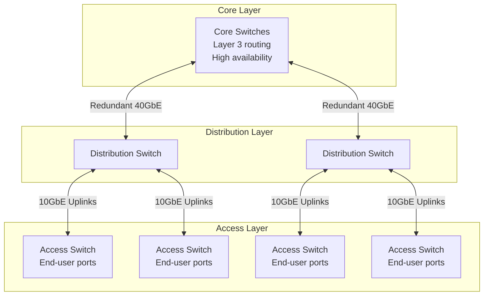
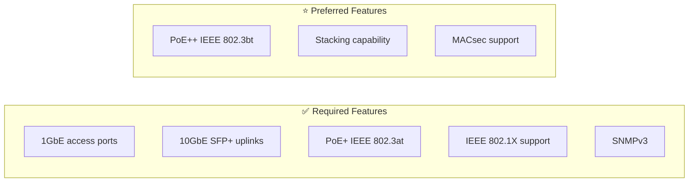
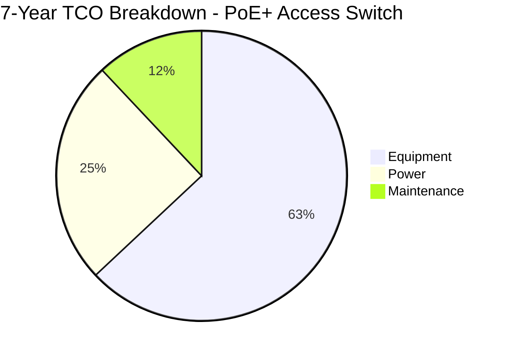
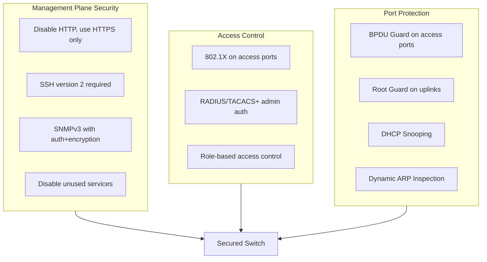
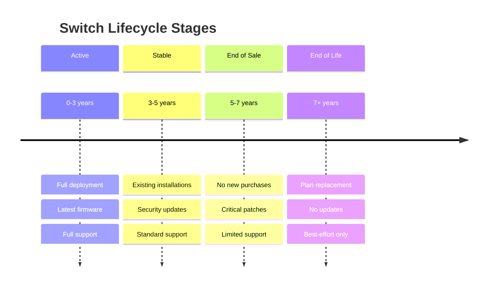

# Network Switch Specifications

## Overview

This document defines the minimum specifications and configuration requirements for network switches deployed in City of New Orleans facilities. All requirements are based on IEEE and IETF standards to ensure vendor neutrality and long-term interoperability.

## Standards References

| Standard | Title | Ratification Date | Scope |
|----------|-------|-------------------|-------|
| IEEE 802.3-2022 | Ethernet | December 2022 | Physical layer and MAC |
| IEEE 802.3bt-2018 | PoE++ (4PPoE) | September 2018 | Power over Ethernet up to 90W |
| IEEE 802.3at-2009 | PoE+ | September 2009 | Power over Ethernet up to 30W |
| IEEE 802.1Q-2022 | VLANs and Bridging | December 2022 | VLAN tagging and bridging |
| IEEE 802.1X-2020 | Port-Based NAC | February 2020 | Network access control |
| IEEE 802.1AX-2020 | Link Aggregation | May 2020 | LACP bonding |
| IEEE 802.1D-2004 | Spanning Tree | June 2004 | Loop prevention (STP) |
| IEEE 802.1w-2001 | Rapid Spanning Tree | July 2001 | RSTP fast convergence |
| IETF RFC 3411 | SNMPv3 Architecture | December 2002 | Secure management |
| IETF RFC 5905 | NTPv4 | June 2010 | Time synchronization |

## Switch Tier Architecture



## Minimum Specifications by Tier

### Access Layer Switches

Required for end-user connectivity in IDFs and workspaces.



| Specification | Minimum Requirement | Standard Reference |
|---------------|---------------------|-------------------|
| Access port speed | 1 Gbps (IEEE 802.3ab) | IEEE 802.3-2022 |
| Uplink port speed | 10 Gbps SFP+ | IEEE 802.3-2022 |
| PoE capability | PoE+ 30W/port (IEEE 802.3at) | IEEE 802.3at-2009 |
| PoE budget | ≥740W for 48-port | IEEE 802.3at-2009 |
| VLAN support | IEEE 802.1Q, 4094 VLANs | IEEE 802.1Q-2022 |
| Spanning tree | RSTP/MSTP | IEEE 802.1w / 802.1s |
| Link aggregation | LACP (IEEE 802.1AX) | IEEE 802.1AX-2020 |
| Port security | IEEE 802.1X-2020 | IEEE 802.1X-2020 |
| Management | SNMPv3, SSH, HTTPS | RFC 3411, RFC 4253 |
| Switching capacity | ≥176 Gbps (48-port) | Non-blocking |
| MAC address table | ≥16,000 entries | — |
| Jumbo frames | 9,216 bytes | — |

#### High-Power PoE Requirements

For deployments with PTZ cameras, wireless access points, or other high-power devices:

| Specification | Requirement | Standard Reference |
|---------------|-------------|-------------------|
| PoE capability | PoE++ 60-90W/port | IEEE 802.3bt-2018 |
| PoE budget | ≥1440W for 48-port | IEEE 802.3bt-2018 |

### Distribution Layer Switches

Required for aggregation in MDFs and larger facilities.

| Specification | Minimum Requirement | Standard Reference |
|---------------|---------------------|-------------------|
| Port speed | 10 Gbps / 25 Gbps | IEEE 802.3-2022 |
| Uplink speed | 40 Gbps or 100 Gbps | IEEE 802.3-2022 |
| Layer 3 routing | OSPF, BGP, static | RFC 2328, RFC 4271 |
| VLAN interfaces | ≥256 SVIs | — |
| Routing table | ≥32,000 IPv4 routes | — |
| Redundancy | Dual power supplies | — |
| Failover | <50ms convergence | — |
| Stacking/VSS | Hardware-based HA | Vendor-specific |

### Core Layer Switches

Required for main distribution facilities and data centers.

| Specification | Minimum Requirement | Standard Reference |
|---------------|---------------------|-------------------|
| Port speed | 40 Gbps / 100 Gbps | IEEE 802.3-2022 |
| Throughput | ≥2 Tbps | Non-blocking |
| Layer 3 routing | Full BGP table support | RFC 4271 |
| Redundancy | Dual supervisors | — |
| Power redundancy | N+1 or 2N | — |
| Hot-swap | All field-replaceable units | — |
| Uptime target | 99.999% (5.26 min/year) | — |

## Industry Adoption Data

### Enterprise Switch Standards Adoption

| Feature | Adoption Rate | Source | Year |
|---------|---------------|--------|------|
| IEEE 802.3bt (PoE++) | 67% of new deployments | 650 Group Enterprise Survey | 2025 |
| IEEE 802.1X port authentication | 84% of enterprise networks | EMA Network Management Report | 2024 |
| SNMPv3 (vs v1/v2c) | 71% enterprise adoption | Ponemon Institute | 2024 |
| 10GbE uplinks (access layer) | 89% of new installations | Dell'Oro Group | 2025 |

### Municipal Deployment Patterns

| Configuration | Municipal Adoption | Rationale |
|---------------|-------------------|-----------|
| 48-port access switches | 76% | Optimal density for office IDFs |
| PoE+ minimum | 92% | VoIP and wireless AP support |
| Stacking deployments | 64% | Simplified management |

## Cost-Performance Analysis

### Access Switch TCO Comparison

#### Assumptions
- Deployment: 20 switches (48-port access layer)
- Lifecycle: 7 years
- Power cost: $0.10/kWh
- Support: 24x7x4 coverage

#### TCO Comparison: PoE+ vs PoE++ Switches

| Cost Category | PoE+ (802.3at) | PoE++ (802.3bt) | Difference |
|---------------|----------------|-----------------|------------|
| Equipment cost (per switch) | $3,200 | $4,800 | +$1,600 |
| 20-switch equipment total | $64,000 | $96,000 | +$32,000 |
| Annual power (per switch) | $175 | $210 | +$35 |
| Annual maintenance | $640 | $960 | +$320 |
| **7-Year TCO (20 switches)** | **$100,800** | **$145,600** | **+$44,800** |
| **Per-port 7-year cost** | **$105** | **$152** | **+$47** |



**Recommendation:** Deploy PoE+ (IEEE 802.3at) switches as the standard. Specify PoE++ (IEEE 802.3bt) only where high-power devices (PTZ cameras, WiFi 6E APs) are planned. This targeted approach saves approximately $44,800 per 20-switch deployment while ensuring capability where needed.

## Configuration Requirements

### Security Baseline

All switches must implement the following security controls:



#### Required Security Settings

| Setting | Requirement | Rationale |
|---------|-------------|-----------|
| Management protocol | HTTPS/SSH only | Encrypted management |
| SNMP version | SNMPv3 with authPriv | Authenticated and encrypted |
| Unused ports | Disabled, VLAN 999 | Prevent unauthorized access |
| Console access | Password + timeout | Physical security |
| Password complexity | ≥12 chars, complexity required | NIST SP 800-63B |
| Session timeout | ≤10 minutes idle | Prevent session hijacking |
| Login banner | Legal warning text | Compliance requirement |

#### Example Configuration (Generic Pseudocode)

> **Note:** Actual CLI syntax varies by platform. The following represents required functionality:

```
! Management plane hardening
DISABLE http-server
ENABLE https-server
SET ssh-version 2
DISABLE telnet
DISABLE finger
DISABLE bootp-server
DISABLE cdp (or equivalent discovery protocol on untrusted ports)

! SNMP security
SET snmp-version 3
SET snmp-auth SHA
SET snmp-priv AES-128

! Access port security baseline
INTERFACE access-port
  SET port-security max-mac 3
  SET port-security violation restrict
  SET spanning-tree portfast ENABLE
  SET spanning-tree bpduguard ENABLE
  SET 802.1x port-control auto
```

### VLAN Configuration

See [Port Configurations](port-configurations.md) for standard VLAN assignments.

### Spanning Tree

| Setting | Requirement | Standard |
|---------|-------------|----------|
| Mode | Rapid PVST+ or MST | IEEE 802.1w / 802.1s |
| Root bridge | Core/distribution layer | Best practice |
| BPDU Guard | All access ports | Prevents rogue switches |
| Root Guard | Distribution uplinks | Prevents root bridge changes |
| Loop Guard | All trunk ports | Prevents unidirectional link failures |

## Management Requirements

| Requirement | Standard | Implementation |
|-------------|----------|----------------|
| Management VLAN | Dedicated VLAN | Isolated from user traffic |
| Out-of-band management | Preferred | Separate management network |
| SNMP | v3 only | RFC 3414 (USM) |
| Syslog | TLS-secured | RFC 5424, RFC 5425 |
| NTP | Authenticated NTPv4 | RFC 5905 |
| Configuration backup | Automated daily | Version-controlled |
| Firmware updates | Quarterly review | Security patches |

## Reliability Requirements

| Metric | Access Layer | Distribution | Core |
|--------|--------------|--------------|------|
| MTBF target | ≥200,000 hours | ≥300,000 hours | ≥500,000 hours |
| Uptime target | 99.9% | 99.99% | 99.999% |
| Max annual downtime | 8.76 hours | 52.6 minutes | 5.26 minutes |
| Redundancy | Optional stacking | Dual PSU required | Dual everything |
| Failover time | N/A | <1 second | <50ms |

## Lifecycle Management



| Phase | Timeframe | New Deployments | Support Level |
|-------|-----------|-----------------|---------------|
| Active | 0-3 years | ✅ Approved | Full vendor support |
| Stable | 3-5 years | ✅ Approved | Security updates |
| End of Sale | 5-7 years | ❌ Not approved | Critical patches only |
| End of Life | 7+ years | ❌ Prohibited | Replace immediately |

## Security Considerations (NIST Alignment)

| NIST SP 800-53 Control | Implementation |
|------------------------|----------------|
| AC-17: Remote Access | SSH/HTTPS only, MFA for admin |
| AU-2: Audit Events | Syslog all authentication and config changes |
| CM-7: Least Functionality | Disable unused services and ports |
| IA-2: Identification and Authentication | RADIUS/TACACS+ with MFA |
| SC-8: Transmission Confidentiality | SNMPv3, syslog over TLS |
| SI-2: Flaw Remediation | Quarterly firmware review |

## References

1. IEEE 802.3-2022, "IEEE Standard for Ethernet," IEEE, December 2022.
2. IEEE 802.3bt-2018, "IEEE Standard for Ethernet Amendment 2: Power over Ethernet over 4 Pairs," IEEE, September 2018.
3. IEEE 802.1Q-2022, "IEEE Standard for Local and Metropolitan Area Networks—Bridges and Bridged Networks," IEEE, December 2022.
4. IEEE 802.1X-2020, "IEEE Standard for Local and Metropolitan Area Networks—Port-Based Network Access Control," IEEE, February 2020.
5. IEEE 802.1AX-2020, "IEEE Standard for Local and Metropolitan Area Networks—Link Aggregation," IEEE, May 2020.
6. IETF RFC 3411, "An Architecture for Describing SNMP Management Frameworks," IETF, December 2002.
7. IETF RFC 5905, "Network Time Protocol Version 4," IETF, June 2010.
8. NIST SP 800-53 Rev. 5, "Security and Privacy Controls for Information Systems and Organizations," NIST, September 2020.

---

*For questions about these standards, open an issue or contact the ITI Networking Team.*
