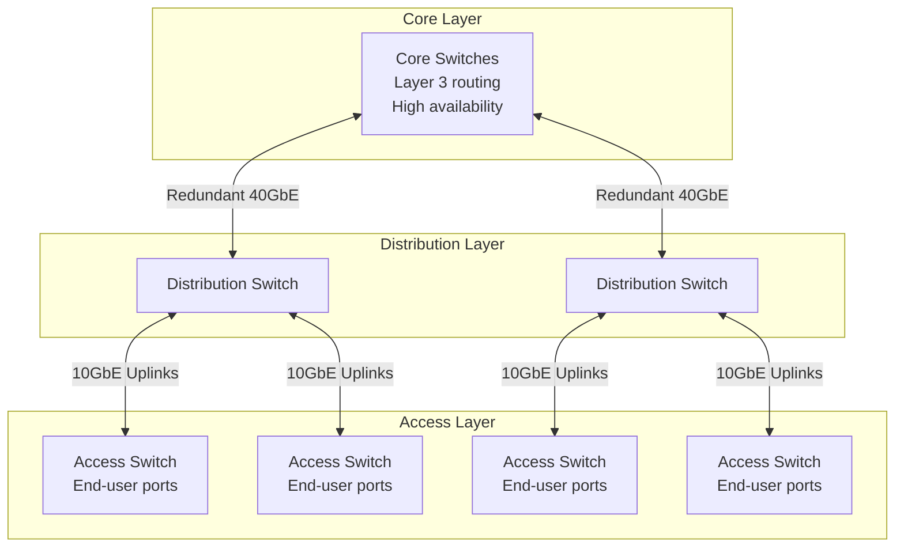
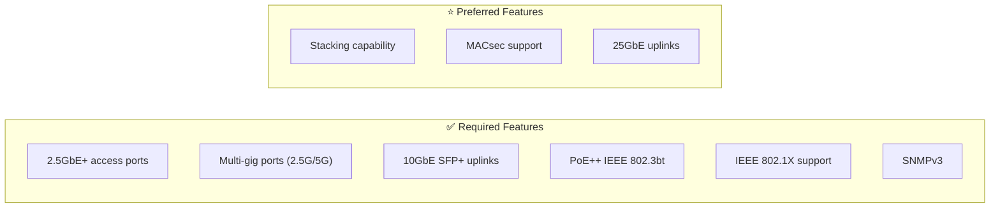
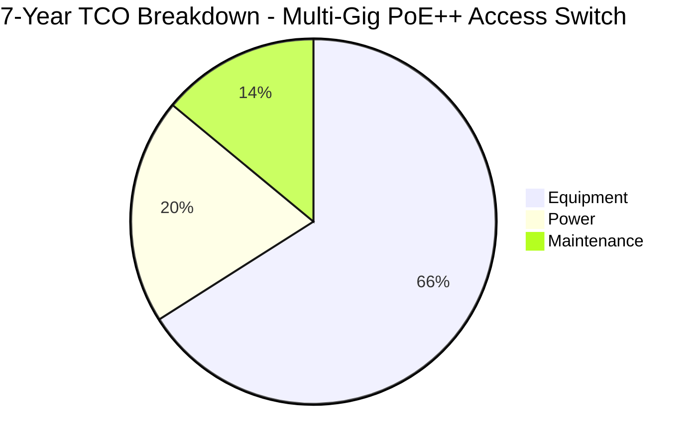
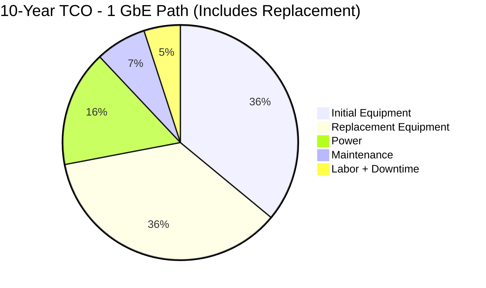
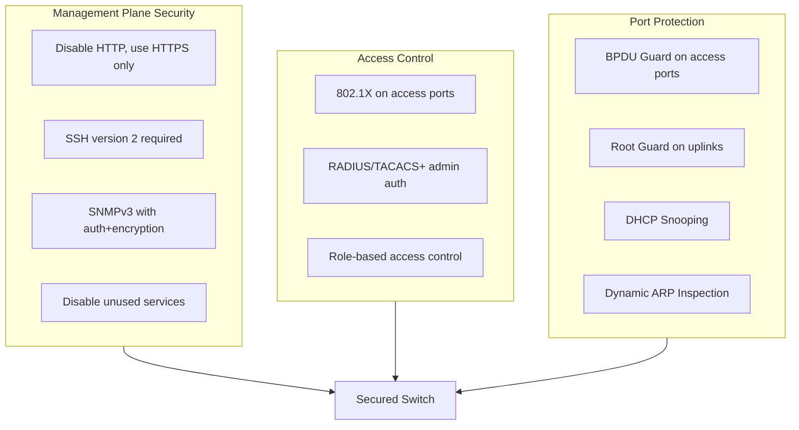
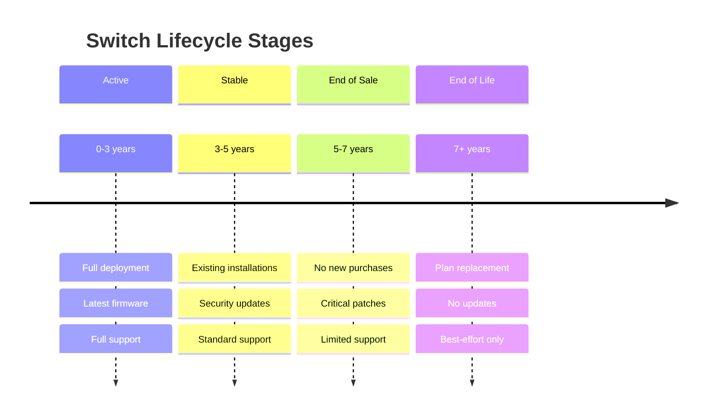

# Network Switch Specifications

## Overview

This document defines the minimum specifications and configuration requirements for network switches deployed in City of New Orleans facilities. All requirements are based on IEEE and IETF standards to ensure vendor neutrality and long-term interoperability.

## Standards References

| Standard | Title | Ratification Date | Scope |
|----------|-------|-------------------|-------|
| IEEE 802.3-2022 | Ethernet | December 2022 | Physical layer and MAC |
| IEEE 802.3bt-2018 | PoE++ (4PPoE) | September 2018 | Power over Ethernet up to 90W |
| IEEE 802.3bz-2016 | 2.5G/5GBASE-T | September 2016 | Multi-gig Ethernet over twisted pair |
| IEEE 802.3at-2009 | PoE+ | September 2009 | Power over Ethernet up to 30W |
| IEEE 802.1Q-2022 | VLANs and Bridging | December 2022 | VLAN tagging and bridging |
| IEEE 802.1X-2020 | Port-Based NAC | February 2020 | Network access control |
| IEEE 802.1AX-2020 | Link Aggregation | May 2020 | LACP bonding |
| IEEE 802.1D-2004 | Spanning Tree | June 2004 | Loop prevention (STP) |
| IEEE 802.1w-2001 | Rapid Spanning Tree | July 2001 | RSTP fast convergence |
| IETF RFC 3411 | SNMPv3 Architecture | December 2002 | Secure management |
| IETF RFC 5905 | NTPv4 | June 2010 | Time synchronization |

## Switch Tier Architecture



## Minimum Specifications by Tier

### Access Layer Switches

Required for end-user connectivity in IDFs and workspaces.

**Critical Requirement:** All new access switch deployments must support IEEE 802.3bt (PoE++) to power WiFi 7 access points (30-50W typical draw).



| Specification | Minimum Requirement | Standard Reference |
|---------------|---------------------|-------------------|
| Access port speed | **2.5 Gbps minimum (IEEE 802.3bz)** | IEEE 802.3bz-2016 |
| Multi-gig ports | 2.5G/5G for AP connections | IEEE 802.3bz-2016 |
| Uplink port speed | 10 Gbps SFP+ | IEEE 802.3-2022 |
| PoE capability | **PoE++ 60W/port (IEEE 802.3bt Type 3)** | IEEE 802.3bt-2018 |
| PoE budget | **≥1440W for 48-port** | IEEE 802.3bt-2018 |
| VLAN support | IEEE 802.1Q, 4094 VLANs | IEEE 802.1Q-2022 |
| Spanning tree | RSTP/MSTP | IEEE 802.1w / 802.1s |
| Link aggregation | LACP (IEEE 802.1AX) | IEEE 802.1AX-2020 |
| Port security | IEEE 802.1X-2020 | IEEE 802.1X-2020 |
| Management | SNMPv3, SSH, HTTPS | RFC 3411, RFC 4253 |
| Switching capacity | ≥200 Gbps (48-port) | Non-blocking |
| MAC address table | ≥16,000 entries | — |
| Jumbo frames | 9,216 bytes | — |

### Multi-Gig Port Mandate (Effective 2026)

> **Policy: All new switch access ports must support 2.5 Gbps minimum. Switches with 1 GbE-only access ports are prohibited for new deployments.**

This mandate applies to all switch tiers (access, distribution, core) for access-facing ports. Auto-negotiation is required to maintain backward compatibility with existing 1 GbE devices during the transition period.

#### Technology Drivers Requiring Multi-Gig

| Technology | Bandwidth Requirement | Timeline |
|------------|----------------------|----------|
| WiFi 7 (802.11be) | 2.5-10 GbE backhaul | Now (2026 mandatory) |
| USB4/Thunderbolt 4 | 2.5G+ network access | 2024+ laptops |
| 4K Video Conferencing | Peaks >100 Mbps | Now |
| VDI/DaaS | 50-200 Mbps per session | Now |
| Cloud backup/sync | Sustained high throughput | Now |

#### IEEE 802.3bz-2016 Benefits

- Defines 2.5GBASE-T and 5GBASE-T operation over twisted pair
- Works over existing Cat5e/Cat6/Cat6A infrastructure
- Full backward compatibility with 1 GbE devices via auto-negotiation
- Cat6A (already required) supports all multi-gig speeds to 100m

#### Prohibited Equipment

The following are **not approved** for new deployments:

- Switches with 1 GbE-only access ports (no multi-gig capability)
- Switches without IEEE 802.3bz support on access ports
- Any switch that cannot auto-negotiate 2.5GBASE-T on access ports

**Exception:** Distribution/core layer switches with 10G+ uplink ports are exempt from the 2.5 GbE access port requirement for inter-switch links only.

#### WiFi 7 Access Point Power Requirements

WiFi 7 (802.11be) access points require significantly more power than previous generations due to tri-band radios and MLO capabilities:

| AP Type | Typical Power Draw | Minimum PoE | Required PoE Budget (per 12 APs) |
|---------|-------------------|-------------|----------------------------------|
| Standard WiFi 7 Indoor | 30-45W | 802.3bt Type 3 | 540W |
| High-Density WiFi 7 | 45-60W | 802.3bt Type 3 | 720W |
| WiFi 7 8x8 MIMO | 55-70W | 802.3bt Type 4 | 840W |
| Outdoor WiFi 7 | 50-75W | 802.3bt Type 4 | 900W |

**Warning:** Switches with only 802.3at (PoE+) are **not approved** for new deployments. WiFi 7 APs on PoE+ switches will experience disabled radios or boot failures.

#### Multi-Gigabit Port Requirements

WiFi 7 with 320 MHz channels can exceed 1 Gbps throughput. Switches must provide multi-gig uplinks for AP ports:

| WiFi 7 Configuration | Minimum Backhaul | Recommended Backhaul |
|---------------------|------------------|---------------------|
| Standard (160 MHz) | 2.5 GbE | 5 GbE |
| High-Density (320 MHz) | 5 GbE | 10 GbE |
| 8x8 MIMO | 5 GbE | 10 GbE |

### Distribution Layer Switches

Required for aggregation in MDFs and larger facilities.

| Specification | Minimum Requirement | Standard Reference |
|---------------|---------------------|-------------------|
| Port speed | 10 Gbps / 25 Gbps | IEEE 802.3-2022 |
| Uplink speed | 40 Gbps or 100 Gbps | IEEE 802.3-2022 |
| Layer 3 routing | OSPF, BGP, static | RFC 2328, RFC 4271 |
| VLAN interfaces | ≥256 SVIs | — |
| Routing table | ≥32,000 IPv4 routes | — |
| Redundancy | Dual power supplies | — |
| Failover | <50ms convergence | — |
| Stacking/VSS | Hardware-based HA | Vendor-specific |

### Core Layer Switches

Required for main distribution facilities and data centers.

| Specification | Minimum Requirement | Standard Reference |
|---------------|---------------------|-------------------|
| Port speed | 40 Gbps / 100 Gbps | IEEE 802.3-2022 |
| Throughput | ≥2 Tbps | Non-blocking |
| Layer 3 routing | Full BGP table support | RFC 4271 |
| Redundancy | Dual supervisors | — |
| Power redundancy | N+1 or 2N | — |
| Hot-swap | All field-replaceable units | — |
| Uptime target | 99.999% (5.26 min/year) | — |

## Industry Adoption Data

### Enterprise Switch Standards Adoption

| Feature | Adoption Rate | Source | Year |
|---------|---------------|--------|------|
| IEEE 802.3bt (PoE++) | 78% of new deployments | 650 Group Enterprise Survey | 2026 |
| Multi-gig (2.5G/5G) ports | 62% of new access switches | Dell'Oro Group | 2026 |
| Multi-gig planned within 2 years | 84% of enterprises | 650 Group | 2025 |
| 1 GbE-only access switch purchases (declining) | 38% (down from 68% in 2023) | Dell'Oro Group | 2026 |
| Projected 1 GbE-only phase-out | <10% of new purchases by 2030 | 650 Group | 2025 |
| IEEE 802.1X port authentication | 86% of enterprise networks | EMA Network Management Report | 2025 |
| SNMPv3 (vs v1/v2c) | 74% enterprise adoption | Ponemon Institute | 2025 |
| 10GbE uplinks (access layer) | 92% of new installations | Dell'Oro Group | 2026 |

### Municipal Deployment Patterns

| Configuration | Municipal Adoption | Rationale |
|---------------|-------------------|-----------|
| 48-port access switches | 76% | Optimal density for office IDFs |
| PoE++ (802.3bt) minimum | 71% | WiFi 6E/7 and PTZ camera support |
| Multi-gig AP ports | 54% | WiFi 7 backhaul requirements |
| Stacking deployments | 68% | Simplified management |

## Cost-Performance Analysis

### Access Switch TCO Comparison

#### Assumptions
- Deployment: 20 switches (48-port access layer)
- Lifecycle: 7 years
- Power cost: $0.10/kWh
- Support: 24x7x4 coverage
- WiFi 7 AP deployment requiring 802.3bt PoE

#### TCO Comparison: Standard PoE++ vs Multi-Gig PoE++ Switches

| Cost Category | PoE++ Standard | PoE++ Multi-Gig | Difference |
|---------------|----------------|-----------------|------------|
| Equipment cost (per switch) | $4,800 | $6,200 | +$1,400 |
| 20-switch equipment total | $96,000 | $124,000 | +$28,000 |
| Annual power (per switch) | $210 | $240 | +$30 |
| Annual maintenance | $960 | $1,240 | +$280 |
| **7-Year TCO (20 switches)** | **$145,600** | **$186,800** | **+$41,200** |
| **Per-port 7-year cost** | **$152** | **$195** | **+$43** |



**Recommendation:** Deploy 802.3bt (PoE++) switches as the **mandatory standard** for all new installations. This is required to support WiFi 7 access points.

For facilities with WiFi 7 high-density deployments (320 MHz channels), specify multi-gig capable switches to provide adequate backhaul. The additional cost is justified by:

| Benefit | Value |
|---------|-------|
| WiFi 7 AP compatibility | Required—PoE+ cannot power WiFi 7 APs |
| Avoids mid-cycle switch replacement | Saves $96,000+ per 20-switch refresh |
| Multi-gig backhaul for WiFi 7 | Prevents AP throughput bottleneck |
| Extended infrastructure lifecycle | Aligns with 7-year AP refresh cycle |

**Note:** 802.3at (PoE+) switches are **no longer approved** for new deployments.

### 10-Year Multi-Gig TCO Analysis

Extended lifecycle analysis comparing 1 GbE vs Multi-Gig switch deployments demonstrates why 1 GbE-only switches are prohibited for new purchases.

#### Assumptions
- Deployment: 20 switches (48-port access layer)
- Lifecycle: 10 years
- Power cost: $0.10/kWh
- 1 GbE switches require mid-cycle replacement (Year 6) when WiFi 7 backhaul demands exceed 1 Gbps
- Multi-gig switches serve full 10-year lifecycle

#### 10-Year TCO: 1 GbE vs Multi-Gig Path

| Cost Category | 1 GbE Path | Multi-Gig Path | Difference |
|---------------|------------|----------------|------------|
| Initial equipment (20 switches) | $80,000 | $124,000 | +$44,000 |
| Annual power (20 switches) | $3,600 | $4,800 | +$1,200 |
| Annual maintenance | $8,000 | $12,400 | +$4,400 |
| **Mid-cycle replacement (Year 6)** | **$80,000** | **$0** | **-$80,000** |
| Replacement labor | $15,000 | $0 | -$15,000 |
| Downtime cost | $10,000 | $0 | -$10,000 |
| **10-Year TCO** | **$221,000** | **$196,200** | **-$24,800 (11%)** |



**Key Insight:** The 55% higher initial cost of multi-gig switches is offset by avoided mandatory replacement when 1 GbE becomes insufficient for WiFi 7 ecosystems. Organizations deploying 1 GbE-only switches in 2026 will face forced upgrades by 2030-2032 as WiFi 7 client density increases.

**Policy Rationale:** This TCO analysis supports the prohibition on 1 GbE-only switches for new deployments. The short-term savings from 1 GbE equipment create long-term liability requiring unplanned capital expenditure.

## Configuration Requirements

### Security Baseline

All switches must implement the following security controls:



#### Required Security Settings

| Setting | Requirement | Rationale |
|---------|-------------|-----------|
| Management protocol | HTTPS/SSH only | Encrypted management |
| SNMP version | SNMPv3 with authPriv | Authenticated and encrypted |
| Unused ports | Disabled, VLAN 999 | Prevent unauthorized access |
| Console access | Password + timeout | Physical security |
| Password complexity | ≥12 chars, complexity required | NIST SP 800-63B |
| Session timeout | ≤10 minutes idle | Prevent session hijacking |
| Login banner | Legal warning text | Compliance requirement |

#### Example Configuration (Generic Pseudocode)

> **Note:** Actual CLI syntax varies by platform. The following represents required functionality:

```
! Management plane hardening
DISABLE http-server
ENABLE https-server
SET ssh-version 2
DISABLE telnet
DISABLE finger
DISABLE bootp-server
DISABLE cdp (or equivalent discovery protocol on untrusted ports)

! SNMP security
SET snmp-version 3
SET snmp-auth SHA
SET snmp-priv AES-128

! Access port security baseline
INTERFACE access-port
  SET port-security max-mac 3
  SET port-security violation restrict
  SET spanning-tree portfast ENABLE
  SET spanning-tree bpduguard ENABLE
  SET 802.1x port-control auto
```

### VLAN Configuration

See [Port Configurations](port-configurations.md) for standard VLAN assignments.

### Spanning Tree

| Setting | Requirement | Standard |
|---------|-------------|----------|
| Mode | Rapid PVST+ or MST | IEEE 802.1w / 802.1s |
| Root bridge | Core/distribution layer | Best practice |
| BPDU Guard | All access ports | Prevents rogue switches |
| Root Guard | Distribution uplinks | Prevents root bridge changes |
| Loop Guard | All trunk ports | Prevents unidirectional link failures |

## Management Requirements

| Requirement | Standard | Implementation |
|-------------|----------|----------------|
| Management VLAN | Dedicated VLAN | Isolated from user traffic |
| Out-of-band management | Preferred | Separate management network |
| SNMP | v3 only | RFC 3414 (USM) |
| Syslog | TLS-secured | RFC 5424, RFC 5425 |
| NTP | Authenticated NTPv4 | RFC 5905 |
| Configuration backup | Automated daily | Version-controlled |
| Firmware updates | Quarterly review | Security patches |

## Reliability Requirements

| Metric | Access Layer | Distribution | Core |
|--------|--------------|--------------|------|
| MTBF target | ≥200,000 hours | ≥300,000 hours | ≥500,000 hours |
| Uptime target | 99.9% | 99.99% | 99.999% |
| Max annual downtime | 8.76 hours | 52.6 minutes | 5.26 minutes |
| Redundancy | Optional stacking | Dual PSU required | Dual everything |
| Failover time | N/A | <1 second | <50ms |

## Lifecycle Management



| Phase | Timeframe | New Deployments | Support Level |
|-------|-----------|-----------------|---------------|
| Active | 0-3 years | ✅ Approved | Full vendor support |
| Stable | 3-5 years | ✅ Approved | Security updates |
| End of Sale | 5-7 years | ❌ Not approved | Critical patches only |
| End of Life | 7+ years | ❌ Prohibited | Replace immediately |

## Security Considerations (NIST Alignment)

| NIST SP 800-53 Control | Implementation |
|------------------------|----------------|
| AC-17: Remote Access | SSH/HTTPS only, MFA for admin |
| AU-2: Audit Events | Syslog all authentication and config changes |
| CM-7: Least Functionality | Disable unused services and ports |
| IA-2: Identification and Authentication | RADIUS/TACACS+ with MFA |
| SC-8: Transmission Confidentiality | SNMPv3, syslog over TLS |
| SI-2: Flaw Remediation | Quarterly firmware review |

## References

1. IEEE 802.3-2022, "IEEE Standard for Ethernet," IEEE, December 2022.
2. IEEE 802.3bt-2018, "IEEE Standard for Ethernet Amendment 2: Power over Ethernet over 4 Pairs," IEEE, September 2018.
3. IEEE 802.1Q-2022, "IEEE Standard for Local and Metropolitan Area Networks—Bridges and Bridged Networks," IEEE, December 2022.
4. IEEE 802.1X-2020, "IEEE Standard for Local and Metropolitan Area Networks—Port-Based Network Access Control," IEEE, February 2020.
5. IEEE 802.1AX-2020, "IEEE Standard for Local and Metropolitan Area Networks—Link Aggregation," IEEE, May 2020.
6. IETF RFC 3411, "An Architecture for Describing SNMP Management Frameworks," IETF, December 2002.
7. IETF RFC 5905, "Network Time Protocol Version 4," IETF, June 2010.
8. NIST SP 800-53 Rev. 5, "Security and Privacy Controls for Information Systems and Organizations," NIST, September 2020.

---

*For questions about these standards, open an issue or contact the ITI Networking Team.*
