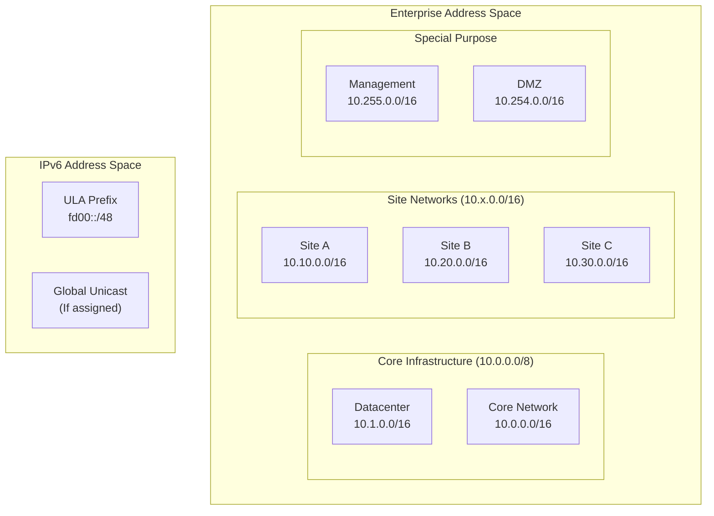
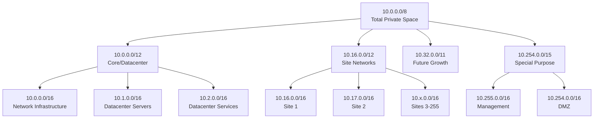
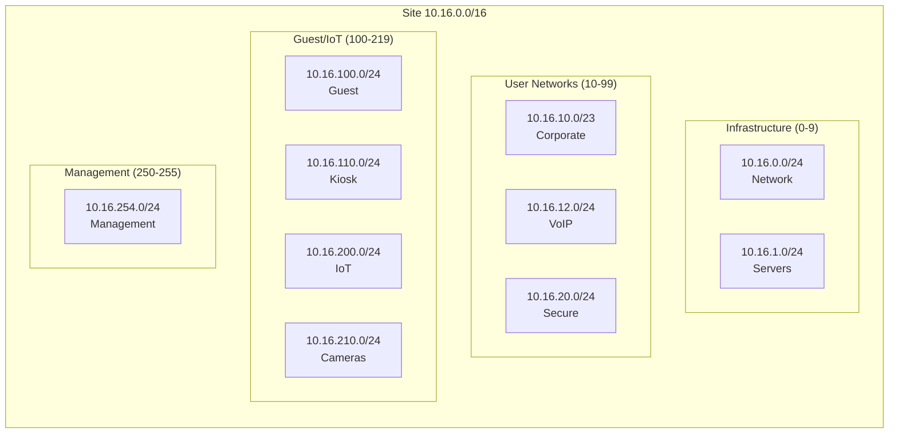
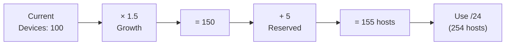
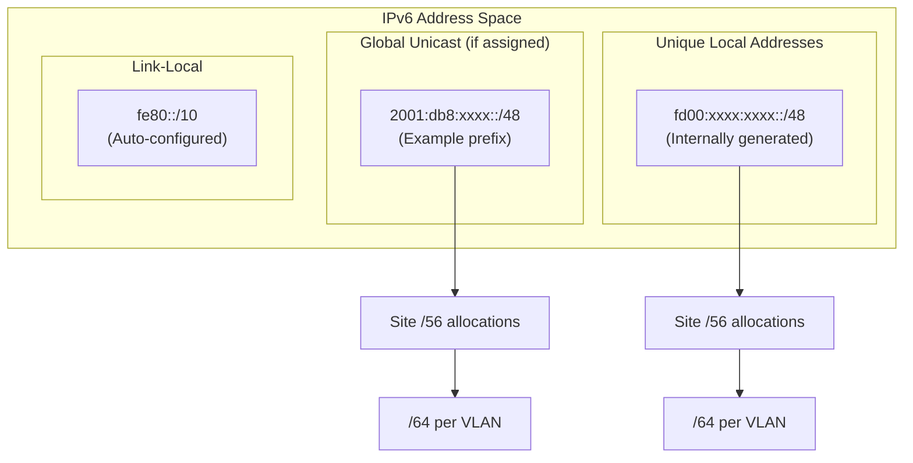
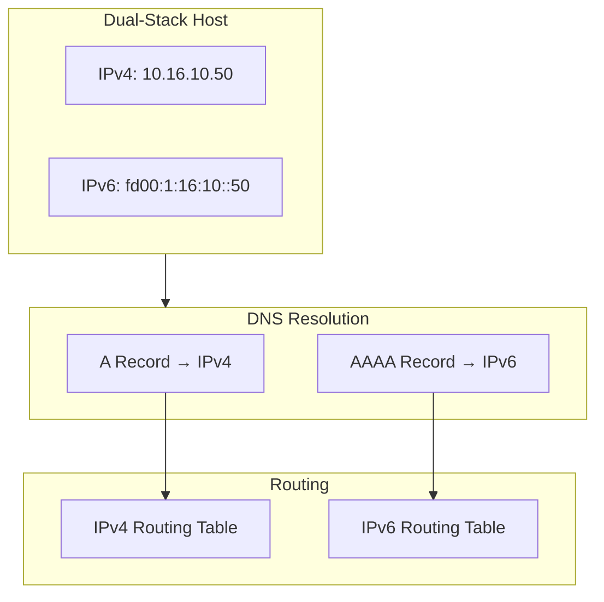
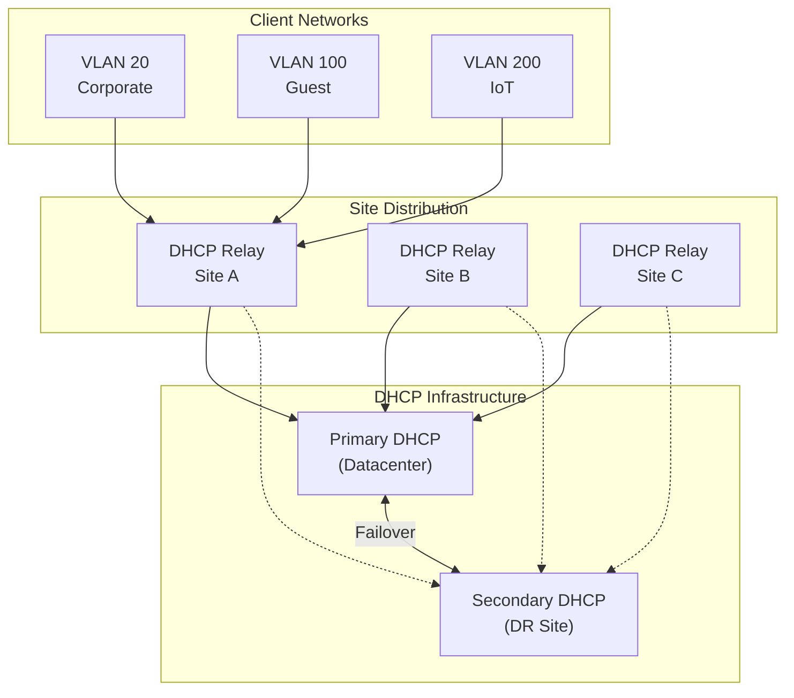
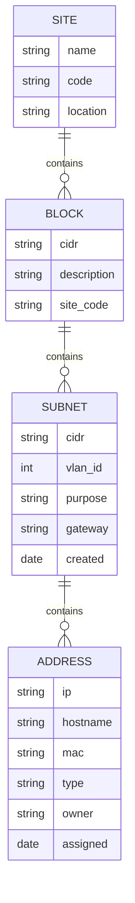
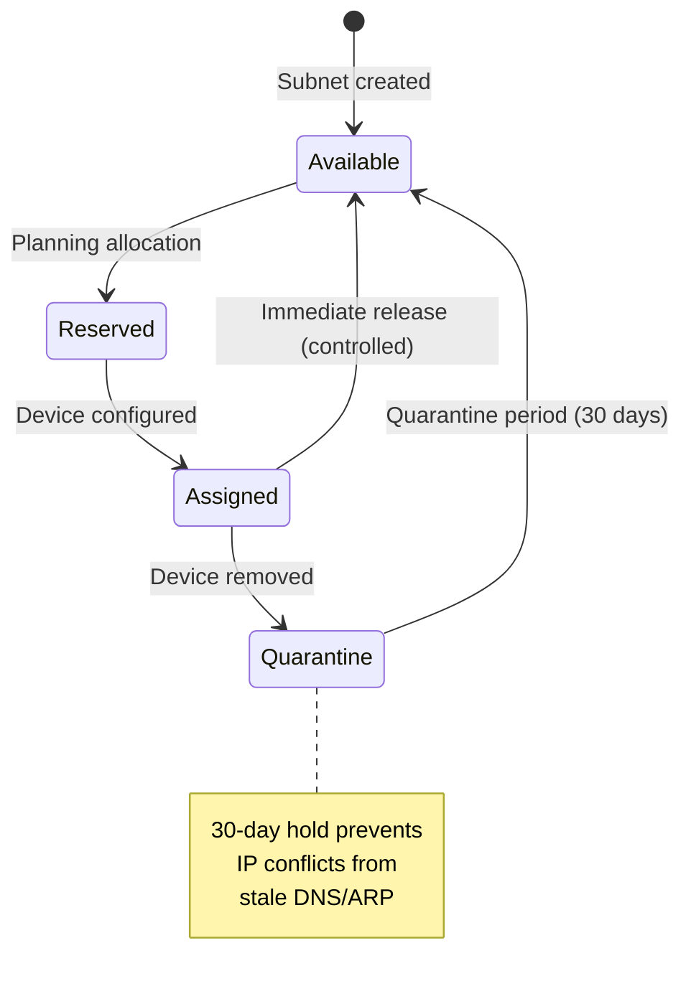

# IP Addressing and Subnetting Standards

## Overview

This document establishes the City of New Orleans standards for IP address allocation, subnetting, and address management across municipal network infrastructure. Proper IP addressing is foundational to network scalability, security segmentation, and operational efficiency.

## Standards References

| Standard | Title | Ratification Date | Scope |
|----------|-------|-------------------|-------|
| IETF RFC 791 | Internet Protocol | September 1981 | IPv4 specification |
| IETF RFC 8200 | IPv6 Specification | July 2017 | IPv6 specification |
| IETF RFC 1918 | Private Address Space | February 1996 | Private IPv4 ranges |
| IETF RFC 4193 | Unique Local IPv6 Addresses | October 2005 | Private IPv6 (ULA) |
| IETF RFC 4632 | CIDR | August 2006 | Classless addressing |
| IETF RFC 6890 | Special-Purpose IP Addresses | April 2013 | Reserved address blocks |
| IETF RFC 4291 | IPv6 Addressing Architecture | February 2006 | IPv6 address structure |
| IETF RFC 3021 | /31 Point-to-Point Links | December 2000 | Link addressing |
| IETF RFC 6598 | Shared Address Space (CGN) | April 2012 | 100.64.0.0/10 |
| NIST SP 800-53 Rev. 5 | Security Controls | September 2020 | Address management controls |

## IP Address Architecture

### Address Space Hierarchy



### Address Allocation Model



## IPv4 Address Standards

### Private Address Ranges (RFC 1918)

| Range | CIDR | Total Addresses | Recommended Use |
|-------|------|-----------------|-----------------|
| 10.0.0.0 – 10.255.255.255 | 10.0.0.0/8 | 16,777,216 | Primary enterprise range |
| 172.16.0.0 – 172.31.255.255 | 172.16.0.0/12 | 1,048,576 | Secondary/isolated networks |
| 192.168.0.0 – 192.168.255.255 | 192.168.0.0/16 | 65,536 | Small sites, labs only |

### Address Block Allocation

| Block | Purpose | Example Allocation |
|-------|---------|-------------------|
| 10.0.0.0/16 | Core network infrastructure | Routers, core switches |
| 10.1.0.0/16 | Datacenter servers | Application servers |
| 10.2.0.0/16 | Datacenter services | DNS, DHCP, NTP, AD |
| 10.16.0.0/16 – 10.250.0.0/16 | Site allocations | One /16 per major site |
| 10.254.0.0/16 | DMZ networks | Public-facing services |
| 10.255.0.0/16 | Management networks | Out-of-band management |

### Site Subnet Allocation Template

Each site receives a /16 block subdivided as follows:

| Subnet | CIDR | Hosts | Purpose | VLAN |
|--------|------|-------|---------|------|
| x.x.0.0/24 | /24 | 254 | Network infrastructure | 10 |
| x.x.1.0/24 | /24 | 254 | Server/application | 40 |
| x.x.2.0/24 | /24 | 254 | Reserved | — |
| x.x.10.0/23 | /23 | 510 | Corporate workstations | 20 |
| x.x.12.0/24 | /24 | 254 | VoIP/Unified Comms | 30 |
| x.x.20.0/24 | /24 | 254 | Restricted/secure | 50 |
| x.x.100.0/24 | /24 | 254 | Guest wireless | 100 |
| x.x.110.0/24 | /24 | 254 | Public kiosks | 110 |
| x.x.200.0/24 | /24 | 254 | Building IoT | 200 |
| x.x.210.0/24 | /24 | 254 | Cameras/surveillance | 210 |
| x.x.254.0/24 | /24 | 254 | Management | 999 |
| x.x.255.0/24 | /24 | 254 | Reserved for expansion | — |

### Subnet Visualization



## Subnetting Standards

### CIDR Reference

| CIDR | Subnet Mask | Hosts | Typical Use |
|------|-------------|-------|-------------|
| /30 | 255.255.255.252 | 2 | Point-to-point links (legacy) |
| /31 | 255.255.255.254 | 2 | Point-to-point links (RFC 3021) |
| /29 | 255.255.255.248 | 6 | Small server groups |
| /28 | 255.255.255.240 | 14 | Small departments |
| /27 | 255.255.255.224 | 30 | Medium departments |
| /26 | 255.255.255.192 | 62 | Large departments |
| /25 | 255.255.255.128 | 126 | Building floors |
| /24 | 255.255.255.0 | 254 | Standard subnet |
| /23 | 255.255.254.0 | 510 | Large user groups |
| /22 | 255.255.252.0 | 1,022 | Campus segments |
| /16 | 255.255.0.0 | 65,534 | Site allocation |

### Subnetting Guidelines

| Scenario | Recommended Size | Rationale |
|----------|------------------|-----------|
| Point-to-point router links | /31 | RFC 3021 compliant, no waste |
| Loopback addresses | /32 | Single host |
| Server VLANs | /24 or /25 | Room for growth |
| User VLANs | /23 or /24 | Based on user count + 50% |
| Voice VLANs | /24 | Phone count + 30% |
| Guest networks | /24 | Limit broadcast domain |
| IoT networks | /24 | Isolation, limit scope |
| Management | /24 | Small, controlled access |

### Subnet Sizing Formula

```
Required Size = (Current Devices × Growth Factor) + Reserved Addresses

Growth Factor = 1.5 (50% growth over 5 years)
Reserved = Network + Broadcast + Gateway + HSRP/VRRP (typically 4-5)
```



## IPv6 Standards

### IPv6 Addressing Strategy



### IPv6 Address Allocation

| Prefix Length | Use | Example |
|---------------|-----|---------|
| /32 or /48 | Organization allocation | Assigned by ISP/RIR |
| /56 | Site allocation | One per physical site |
| /64 | Subnet (VLAN) | Minimum subnet size |
| /128 | Host address | Loopbacks, specific hosts |

### IPv6 Transition Approach

| Phase | Approach | Timeline |
|-------|----------|----------|
| **Current** | IPv4-only internal, IPv6 at edge | Now |
| **Near-term** | Dual-stack for servers and critical services | 1-2 years |
| **Mid-term** | Dual-stack for user networks | 3-5 years |
| **Long-term** | IPv6-preferred, IPv4 for legacy | 5+ years |

### Dual-Stack Configuration



## Special Address Ranges

### Reserved Addresses

| Range | Purpose | Reference |
|-------|---------|-----------|
| 0.0.0.0/8 | This network | RFC 791 |
| 10.0.0.0/8 | Private use | RFC 1918 |
| 100.64.0.0/10 | Shared/CGN | RFC 6598 |
| 127.0.0.0/8 | Loopback | RFC 1122 |
| 169.254.0.0/16 | Link-local | RFC 3927 |
| 172.16.0.0/12 | Private use | RFC 1918 |
| 192.0.2.0/24 | Documentation | RFC 5737 |
| 192.168.0.0/16 | Private use | RFC 1918 |
| 224.0.0.0/4 | Multicast | RFC 5771 |
| 240.0.0.0/4 | Reserved | RFC 1112 |
| 255.255.255.255/32 | Broadcast | RFC 919 |

### Standard Host Assignments

| Address (within subnet) | Assignment | Example (10.16.10.0/24) |
|------------------------|------------|-------------------------|
| .1 | Primary gateway (HSRP/VRRP VIP) | 10.16.10.1 |
| .2 | Primary router physical | 10.16.10.2 |
| .3 | Secondary router physical | 10.16.10.3 |
| .4-.9 | Reserved for network services | 10.16.10.4-9 |
| .10-.250 | DHCP pool | 10.16.10.10-250 |
| .251-.254 | Static assignments | 10.16.10.251-254 |

## DHCP Standards

### DHCP Scope Configuration

| Parameter | Standard Value | Notes |
|-----------|---------------|-------|
| Lease time (wired) | 8 hours (28800 seconds) | Balance between efficiency and tracking |
| Lease time (wireless) | 4 hours (14400 seconds) | Mobile devices roam |
| Lease time (guest) | 4 hours (14400 seconds) | Temporary access |
| Lease time (IoT) | 24 hours (86400 seconds) | Stable devices |
| DNS servers | Site-local, then central | Redundancy |
| Default gateway | HSRP/VRRP VIP | High availability |
| Domain name | Appropriate domain | Per network zone |

### DHCP Architecture



### DHCP Option Standards

| Option | Number | Purpose | Standard Value |
|--------|--------|---------|----------------|
| Subnet Mask | 1 | Network mask | Per subnet |
| Router | 3 | Default gateway | HSRP/VRRP VIP |
| DNS Servers | 6 | Name resolution | Primary, Secondary |
| Domain Name | 15 | DNS suffix | Per zone |
| NTP Servers | 42 | Time sync | Internal NTP servers |
| TFTP Server | 66 | Boot server | For IP phones, APs |
| Bootfile | 67 | Boot image | Device-specific |

## IP Address Management (IPAM)

### IPAM Requirements

| Requirement | Implementation |
|-------------|----------------|
| Centralized tracking | IPAM database (required) |
| Subnet documentation | All subnets registered |
| Assignment tracking | Static IPs documented |
| DNS integration | Automatic A/PTR records |
| DHCP integration | Scope visibility |
| Change history | Audit trail |
| Conflict detection | Real-time monitoring |

### IPAM Data Model



### Address Lifecycle



## Industry Adoption Data

### IPv4/IPv6 Statistics

| Metric | Value | Source | Year |
|--------|-------|--------|------|
| RFC 1918 usage (enterprise) | 99% | Industry standard | 2024 |
| CIDR adoption | 100% | Universal | 2024 |
| IPv6 capable networks | 89% | APNIC Labs | 2024 |
| IPv6 traffic (global) | 43% | Google IPv6 Stats | 2024 |
| Dual-stack enterprise | 67% | EMA Network Survey | 2024 |
| IPAM tool adoption | 78% | Gartner | 2024 |

### Municipal/Government Adoption

| Practice | Adoption | Notes |
|----------|----------|-------|
| Structured IPv4 allocation | 92% | Well established |
| IPv6 deployment | 45% | Growing, federal mandate |
| Centralized IPAM | 71% | Increasing requirement |
| Automated DNS/DHCP | 84% | Standard practice |

## Cost-Performance Analysis

### IPAM Implementation Costs

| Component | Initial Cost | Annual Cost | Notes |
|-----------|--------------|-------------|-------|
| IPAM software | $0-50,000 | $0-15,000 | Open source to enterprise |
| DNS/DHCP servers | $0-10,000 | $2,000 | Often bundled |
| Design/documentation | $5,000-15,000 | — | One-time |
| Staff training | $2,000-5,000 | $1,000 | Initial + ongoing |
| **Total** | **$7,000-80,000** | **$3,000-18,000** | — |

### Cost of Poor Address Management

| Issue | Estimated Cost | Prevention |
|-------|----------------|------------|
| IP conflicts (per incident) | $500-2,000 | IPAM tracking |
| Subnet exhaustion redesign | $10,000-50,000 | Proper planning |
| Security incident (flat network) | $50,000-500,000 | Proper segmentation |
| Failed audit (documentation) | $5,000-25,000 | IPAM records |

## NIST Alignment

### NIST SP 800-53 Control Mapping

| Control ID | Control Name | IP Addressing Implementation |
|------------|--------------|------------------------------|
| CM-8 | System Component Inventory | IPAM tracks all IP assignments |
| IA-3 | Device Identification | Static IPs for managed devices |
| SC-7 | Boundary Protection | Subnet-based segmentation |
| SC-22 | Architecture and Provisioning | Documented address plan |
| AU-12 | Audit Record Generation | DHCP/IPAM logging |
| PL-8 | Security Architecture | Address hierarchy documentation |

## Implementation Checklist

### Address Plan Development

- [ ] Document total address requirements (5-year projection)
- [ ] Select primary private range (10.0.0.0/8 recommended)
- [ ] Define site allocation scheme
- [ ] Define standard subnet template
- [ ] Document all special-purpose ranges
- [ ] Plan IPv6 strategy (ULA at minimum)
- [ ] Implement IPAM system
- [ ] Configure DHCP scopes
- [ ] Verify DNS integration

### Ongoing Operations

- [ ] Review address utilization quarterly
- [ ] Audit IPAM accuracy annually
- [ ] Update documentation with changes
- [ ] Monitor for IP conflicts
- [ ] Track IPv6 readiness

## Procurement Pass/Fail Checklist

Use this checklist to evaluate any IPAM (IP Address Management) platform before purchase. Every **Required** item must pass. If any Required item fails, the platform is **not approved** for procurement.

### IPAM Platform Procurement Checklist

| # | Requirement | Required | Pass | Fail |
|---|-------------|----------|------|------|
| 1 | IPv4 and IPv6 dual-stack management | **Yes** | ☐ | ☐ |
| 2 | CIDR and VLSM subnet management | **Yes** | ☐ | ☐ |
| 3 | DHCP server integration (scope/pool sync) | **Yes** | ☐ | ☐ |
| 4 | DNS integration (forward and reverse zones) | **Yes** | ☐ | ☐ |
| 5 | IP address conflict detection | **Yes** | ☐ | ☐ |
| 6 | Full audit trail with user attribution | **Yes** | ☐ | ☐ |
| 7 | REST API for automation and integration | **Yes** | ☐ | ☐ |

### Results

| Outcome | Action |
|---------|--------|
| All Required items pass | **Approved for procurement** |
| Any Required item fails | **Not approved — do not purchase** |
| Questions about a specific device | Contact Network Engineering (ITI Networking Team) |

### How to Verify Requirements

| Checklist Item | Where to Find |
|----------------|---------------|
| IPv4 + IPv6 dual-stack | Product datasheet, protocol support documentation |
| CIDR / VLSM | Subnet management features, addressing documentation |
| DHCP integration | Integration guide, DHCP server compatibility list |
| DNS integration | Integration guide, DNS zone management features |
| Conflict detection | IP scanning features, conflict resolution documentation |
| Audit trail | Logging and reporting features, compliance documentation |
| REST API | API documentation, developer guide |

## References

1. IETF RFC 791, "Internet Protocol," IETF, September 1981.
2. IETF RFC 8200, "Internet Protocol, Version 6 (IPv6) Specification," IETF, July 2017.
3. IETF RFC 1918, "Address Allocation for Private Internets," IETF, February 1996.
4. IETF RFC 4193, "Unique Local IPv6 Unicast Addresses," IETF, October 2005.
5. IETF RFC 4632, "Classless Inter-domain Routing (CIDR)," IETF, August 2006.
6. IETF RFC 6890, "Special-Purpose IP Address Registries," IETF, April 2013.
7. IETF RFC 3021, "Using 31-Bit Prefixes on IPv4 Point-to-Point Links," IETF, December 2000.
8. IETF RFC 2131, "Dynamic Host Configuration Protocol," IETF, March 1997.
9. NIST SP 800-53 Rev. 5, "Security and Privacy Controls for Information Systems and Organizations," NIST, September 2020.

---

*For questions about these standards, open an issue or contact the ITI Networking Team.*
