# Routing Protocol Standards

## Overview

This document establishes the City of New Orleans standards for routing protocols, route management, and Layer 3 network design. These standards ensure consistent, resilient, and secure routing across municipal infrastructure while maintaining operational simplicity.

## Standards References

| Standard | Title | Ratification Date | Scope |
|----------|-------|-------------------|-------|
| IETF RFC 2328 | OSPF Version 2 | April 1998 | Interior routing (IPv4) |
| IETF RFC 5340 | OSPF for IPv6 (OSPFv3) | July 2008 | Interior routing (IPv6) |
| IETF RFC 4271 | BGP-4 | January 2006 | Exterior routing |
| IETF RFC 4456 | BGP Route Reflection | April 2006 | iBGP scaling |
| IETF RFC 5765 | Security for BGP | February 2010 | BGP security |
| IETF RFC 7454 | BGP Operations and Security | February 2015 | BGP best practices |
| IETF RFC 2281 | HSRP | March 1998 | First-hop redundancy |
| IETF RFC 5798 | VRRP Version 3 | March 2010 | First-hop redundancy |
| IETF RFC 7868 | EIGRP | May 2016 | Interior routing (informational) |
| IETF RFC 8402 | Segment Routing | July 2018 | Modern routing architecture |
| NIST SP 800-53 Rev. 5 | Security Controls | September 2020 | Routing security |

## Routing Architecture

### Hierarchical Design

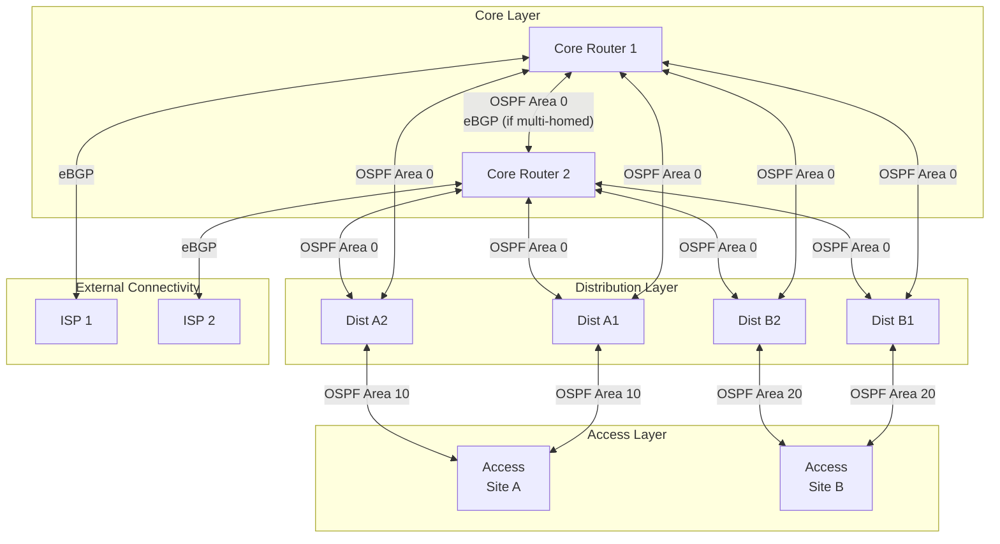

### Routing Domain Boundaries

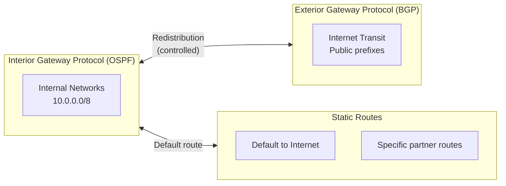

## Protocol Selection

### Protocol Decision Matrix

| Scenario | Recommended Protocol | Rationale |
|----------|---------------------|-----------|
| Internal routing (primary) | OSPF | Open standard, fast convergence |
| Internet connectivity | eBGP | Standard for inter-AS routing |
| Multi-datacenter | iBGP or OSPF | Scale and policy requirements |
| Small remote sites | OSPF stub areas | Simplified routing table |
| WAN backup links | OSPF with cost tuning | Automatic failover |
| Partner connectivity | eBGP | Policy control |

### Protocol Comparison

| Feature | OSPF | BGP | Static |
|---------|------|-----|--------|
| Type | Link-state IGP | Path-vector EGP | Manual |
| Convergence | Fast (sub-second) | Slower (tunable) | Manual |
| Scalability | Thousands of routes | Internet scale | Limited |
| Policy control | Limited | Extensive | Per-route |
| Configuration | Moderate | Complex | Simple |
| CPU/Memory | Moderate | Higher | Minimal |
| Standards | RFC 2328/5340 | RFC 4271 | N/A |

### Protocol Selection Flowchart

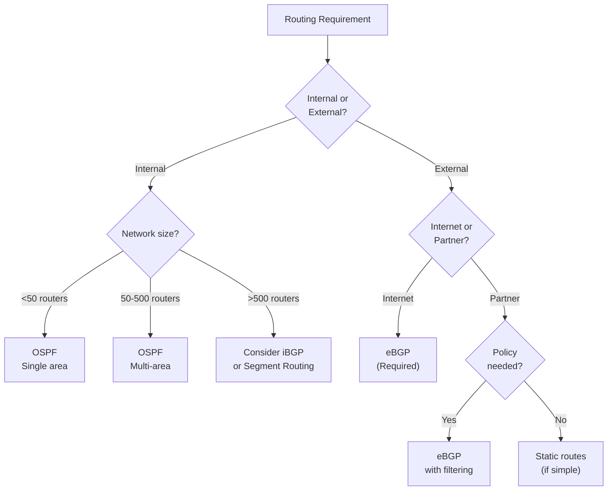

## OSPF Standards

### OSPF Area Design

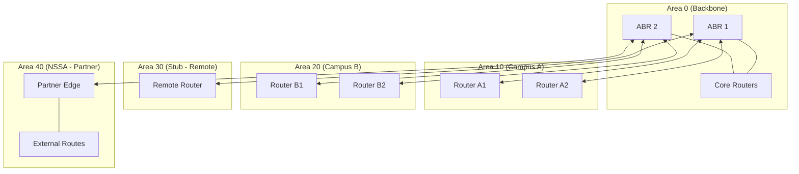

### OSPF Area Types

| Area Type | LSA Types | Use Case | External Routes |
|-----------|-----------|----------|-----------------|
| **Normal** | 1, 2, 3, 4, 5 | Standard areas | Full visibility |
| **Stub** | 1, 2, 3 | Remote sites | Default route only |
| **Totally Stubby** | 1, 2 | Simple remote sites | Default route only |
| **NSSA** | 1, 2, 3, 7 | External connections | Type 7 → Type 5 at ABR |
| **Backbone (0)** | 1, 2, 3, 4, 5 | Core interconnect | Required |

### OSPF Configuration Standards

| Parameter | Standard Value | Rationale |
|-----------|---------------|-----------|
| Hello interval | 10 seconds (default) | Balance between detection and overhead |
| Dead interval | 40 seconds (default) | 4× hello interval |
| Reference bandwidth | 100 Gbps | Accommodate modern link speeds |
| Cost calculation | Auto (based on bandwidth) | Consistent path selection |
| Authentication | MD5 or SHA (required) | Prevent route injection |
| Passive interfaces | All non-routing interfaces | Security best practice |
| Router ID | Loopback IP | Stability |

### OSPF Cost Reference

| Link Speed | Default Cost (1Gbps ref) | Recommended Cost (100Gbps ref) |
|------------|-------------------------|-------------------------------|
| 10 Mbps | 10 | 10000 |
| 100 Mbps | 1 | 1000 |
| 1 Gbps | 1 | 100 |
| 10 Gbps | 1 | 10 |
| 25 Gbps | 1 | 4 |
| 40 Gbps | 1 | 2 |
| 100 Gbps | 1 | 1 |

### OSPF Security Requirements

| Requirement | Implementation |
|-------------|----------------|
| Authentication | MD5 or SHA-256 on all OSPF interfaces |
| Passive interfaces | Enable on all access/user-facing interfaces |
| Route filtering | Filter at redistribution points |
| Max-LSA | Configure per-area LSA limits |
| SPF throttling | Reasonable timers (1s initial, 5s hold, 5s max) |

## BGP Standards

### BGP Architecture

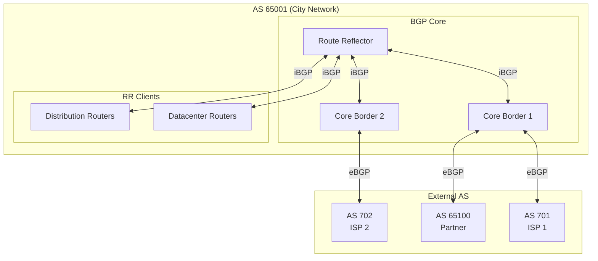

### BGP Session Types

| Session Type | Use Case | Configuration |
|--------------|----------|---------------|
| eBGP (external) | ISP peering | Different AS numbers |
| iBGP (internal) | Internal BGP mesh | Same AS number |
| Route reflector | iBGP scaling | Reduces full mesh requirement |
| Confederation | Large networks | Sub-AS structure |

### BGP Configuration Standards

| Parameter | eBGP Value | iBGP Value | Notes |
|-----------|------------|------------|-------|
| Keepalive | 60 seconds | 60 seconds | Default, adjust if needed |
| Hold time | 180 seconds | 180 seconds | 3× keepalive |
| TTL (eBGP) | 1 (default) | 255 | eBGP multihop if needed |
| Authentication | MD5 (required) | MD5 (required) | Prevent session hijacking |
| Maximum prefixes | Per-peer limit | Per-peer limit | Protect against route leaks |
| Soft reconfiguration | Inbound enabled | Inbound enabled | Policy changes without reset |
| BFD | Enabled | Enabled | Fast failure detection |

### BGP Security Requirements

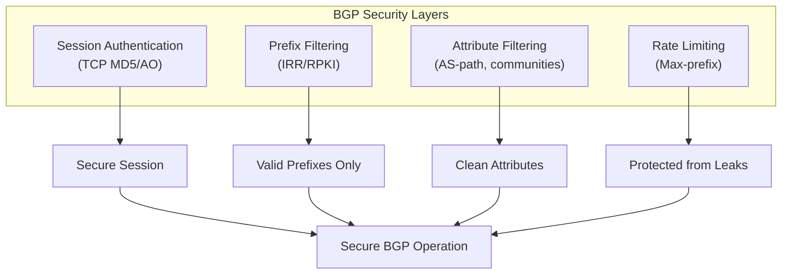

| Security Control | Implementation | Standard |
|------------------|----------------|----------|
| TCP authentication | MD5 or TCP-AO | RFC 5925 |
| Prefix filtering | IRR-based or manual | RFC 7454 |
| RPKI validation | Origin validation | RFC 6811 |
| Max-prefix limits | Per-peer configured | Operational |
| AS-path filtering | Reject invalid paths | RFC 7454 |
| Bogon filtering | Block RFC 5735 ranges | RFC 7454 |
| GTSM (TTL security) | TTL=255 for eBGP | RFC 5082 |

### BGP Prefix Filtering

| Direction | Filter Type | Purpose |
|-----------|-------------|---------|
| Inbound (from ISP) | Deny bogons, deny own prefixes | Prevent hijacking |
| Outbound (to ISP) | Permit only owned prefixes | Prevent leaking |
| Inbound (from peer) | Permit agreed prefixes only | Policy enforcement |
| Outbound (to peer) | Permit agreed prefixes only | Policy enforcement |

### Bogon Prefix List

| Prefix | Description |
|--------|-------------|
| 0.0.0.0/8 | "This" network |
| 10.0.0.0/8 | Private (RFC 1918) |
| 100.64.0.0/10 | Shared address space |
| 127.0.0.0/8 | Loopback |
| 169.254.0.0/16 | Link-local |
| 172.16.0.0/12 | Private (RFC 1918) |
| 192.0.0.0/24 | IETF protocol assignments |
| 192.0.2.0/24 | TEST-NET-1 |
| 192.168.0.0/16 | Private (RFC 1918) |
| 198.18.0.0/15 | Benchmarking |
| 198.51.100.0/24 | TEST-NET-2 |
| 203.0.113.0/24 | TEST-NET-3 |
| 224.0.0.0/4 | Multicast |
| 240.0.0.0/4 | Reserved |

## First-Hop Redundancy

### FHRP Comparison

| Protocol | Standard | Virtual MAC | Preemption | Load Sharing |
|----------|----------|-------------|------------|--------------|
| VRRP | RFC 5798 | 00-00-5e-00-01-XX | Configurable | Multiple groups |
| HSRP | RFC 2281 | 00-00-0c-07-ac-XX | Configurable | Multiple groups |
| GLBP | Proprietary | Multiple | Yes | Native |

**Recommendation:** VRRP (open standard) or HSRP based on equipment capabilities.

### FHRP Architecture

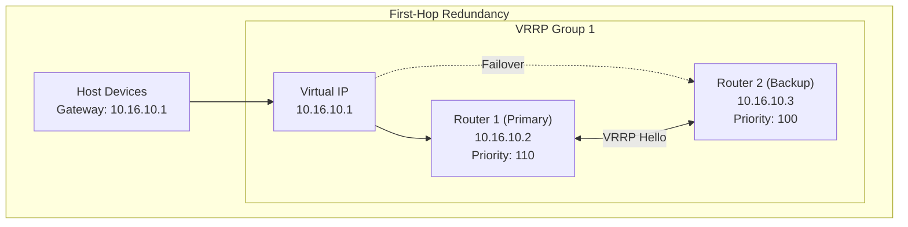

### FHRP Configuration Standards

| Parameter | Standard Value | Rationale |
|-----------|---------------|-----------|
| Virtual IP | .1 in each subnet | Consistent gateway |
| Primary priority | 110 | Higher than default |
| Backup priority | 100 (default) | Lower than primary |
| Preemption | Enabled | Restore preferred path |
| Hello interval | 1 second | Fast detection |
| Hold time | 3 seconds | 3× hello |
| Authentication | MD5 (if supported) | Prevent spoofing |
| Tracking | Track uplinks | Failover on upstream loss |

### FHRP Tracking

```mermaid
flowchart TD
    R1["Router 1<br/>Priority: 110"] --> TRACK{Track Object<br/>(Uplink status)}

    TRACK -->|"Uplink UP"| ACTIVE["Priority: 110<br/>(Active)"]
    TRACK -->|"Uplink DOWN"| DECREMENT["Priority: 110 - 20 = 90<br/>(Standby)"]

    R2["Router 2<br/>Priority: 100"] --> COMPARE{Compare<br/>Priority}

    ACTIVE --> COMPARE
    DECREMENT --> COMPARE

    COMPARE -->|"R1 > R2"| R1_ACTIVE["R1 Active"]
    COMPARE -->|"R1 < R2"| R2_ACTIVE["R2 Active"]
```

## Static Routing Standards

### When to Use Static Routes

| Scenario | Recommendation | Rationale |
|----------|----------------|-----------|
| Stub networks (single exit) | Acceptable | Simple, no overhead |
| Backup paths | Floating static (high AD) | Failover only |
| Default route | Acceptable at edge | Simple internet exit |
| Complex networks | Avoid | Use dynamic routing |
| Temporary connections | Acceptable | Short-term solution |

### Static Route Configuration

| Parameter | Standard |
|-----------|----------|
| Administrative distance | Default (1) for primary, higher for backup |
| Floating static AD | 250 (backup) |
| Next-hop specification | IP address preferred over interface |
| Null routes | Use for blackholing |
| Documentation | Required comment for each static route |

### Floating Static Example

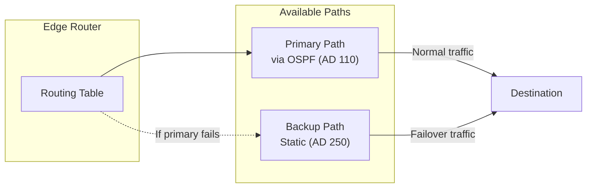

## Route Summarization

### Summarization Strategy

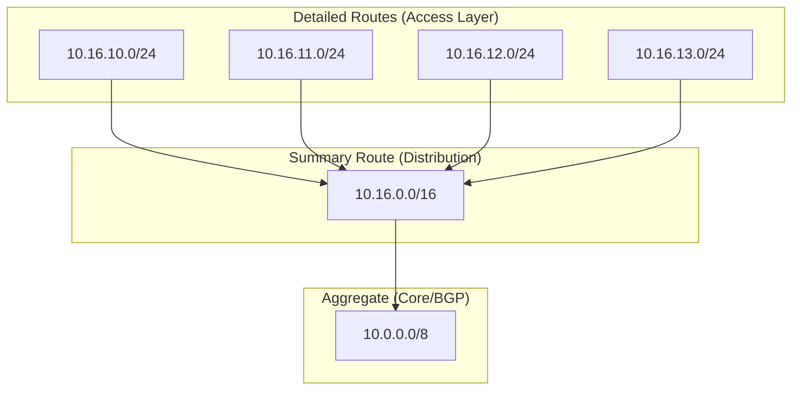

### Summarization Guidelines

| Layer | Summarization | Example |
|-------|---------------|---------|
| Access | None (specific routes) | 10.16.10.0/24 |
| Distribution | Per-site summary | 10.16.0.0/16 |
| Core | Regional summary | 10.16.0.0/12 |
| BGP (external) | Maximum aggregation | Assigned prefix only |

### Summary Route Best Practices

| Practice | Rationale |
|----------|-----------|
| Summarize at area boundaries | Reduce OSPF database size |
| Include null route for summary | Prevent routing loops |
| Avoid discontiguous summarization | Causes routing issues |
| Document all summary points | Troubleshooting clarity |

## Route Redistribution

### Redistribution Policy

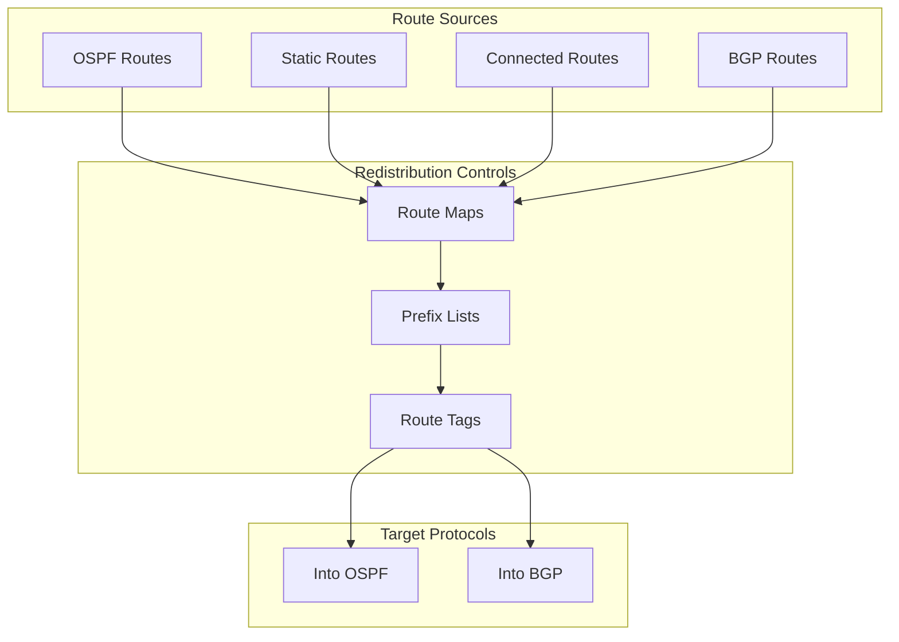

### Redistribution Standards

| Source → Target | Permitted | Controls Required |
|-----------------|-----------|-------------------|
| Connected → OSPF | Yes | Passive interface or network statement |
| Static → OSPF | Limited | Route map with prefix list |
| OSPF → BGP | Yes | Route map, tag for identification |
| BGP → OSPF | Avoid | Only specific routes if required |
| Default route | Yes | Controlled injection point |

### Redistribution Safety Rules

| Rule | Implementation |
|------|----------------|
| Never redistribute without filtering | Route maps mandatory |
| Tag redistributed routes | Identify source for loop prevention |
| Set metrics appropriately | Prevent suboptimal routing |
| Use prefix lists | Explicit permit/deny |
| Document all redistribution | Change control |

## Convergence Optimization

### Convergence Components

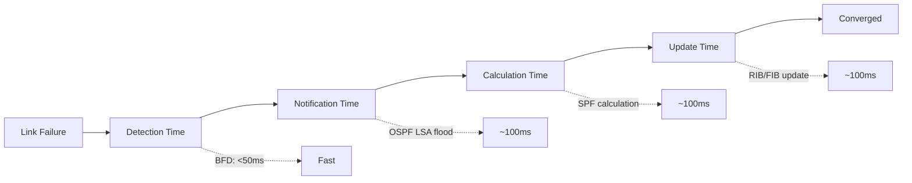

### BFD Configuration

| Parameter | Standard Value | Notes |
|-----------|---------------|-------|
| Minimum TX interval | 100 ms | Adjust for scale |
| Minimum RX interval | 100 ms | Match TX |
| Multiplier | 3 | Failures before down |
| Detection time | 300 ms | TX × multiplier |

### Convergence Targets

| Network Type | Target Convergence | Method |
|--------------|-------------------|--------|
| Core/datacenter | <500 ms | BFD + fast timers |
| Campus | <1 second | BFD + default timers |
| WAN | <3 seconds | Adjusted timers |
| Internet edge | <5 seconds | BGP tuning |

## Industry Adoption Data

### Protocol Usage Statistics

| Protocol | Enterprise Adoption | Source | Year |
|----------|---------------------|--------|------|
| OSPF | 78% | EMA Network Survey | 2024 |
| BGP (any) | 89% | Internet routing data | 2024 |
| EIGRP | 34% | Limited to specific vendors | 2024 |
| IS-IS | 12% | Large SP/enterprise | 2024 |
| Static only | 8% | Small networks | 2024 |
| BFD adoption | 67% | Industry benchmark | 2024 |
| VRRP/HSRP | 94% | Nearly universal | 2024 |

### Municipal/Government Adoption

| Practice | Adoption | Notes |
|----------|----------|-------|
| Dynamic routing (OSPF) | 85% | Standard practice |
| BGP for internet | 72% | Multi-homed sites |
| Route authentication | 64% | Growing requirement |
| BFD for fast failover | 48% | Increasing |

## Cost-Performance Analysis

### Routing Infrastructure Costs

| Component | Initial Cost | Annual Cost | Notes |
|-----------|--------------|-------------|-------|
| Core routers (2x HA) | $50,000-200,000 | $10,000-30,000 | Capacity dependent |
| Distribution routers | $10,000-50,000 each | $2,000-8,000 | Per site |
| Route reflector (if needed) | $0 (software) | $0 | On existing hardware |
| BGP transit (2x ISP) | — | $2,000-20,000/mo | Bandwidth dependent |
| Staff training | $5,000-10,000 | $2,000 | Routing expertise |

### Value of Proper Routing Design

| Benefit | Estimated Value |
|---------|-----------------|
| Reduced outage duration | $10,000-100,000/year |
| Automated failover | $25,000-250,000/incident avoided |
| Simplified troubleshooting | $5,000-20,000/year |
| Scalability (avoid redesign) | $50,000-200,000 |

## NIST Alignment

### NIST SP 800-53 Control Mapping

| Control ID | Control Name | Routing Implementation |
|------------|--------------|----------------------|
| AC-4 | Information Flow Enforcement | Route filtering between zones |
| AU-12 | Audit Record Generation | Routing protocol logging |
| CP-8 | Telecommunications Services | Redundant routing paths |
| SC-5 | Denial of Service Protection | BGP max-prefix, rate limiting |
| SC-7 | Boundary Protection | Edge router filtering |
| SC-8 | Transmission Confidentiality | Routing authentication |
| SC-20 | Secure Name/Address Resolution | RPKI for BGP |
| SI-4 | System Monitoring | Route monitoring/alerting |

## Troubleshooting Guide

### Common Issues

| Symptom | Likely Cause | Resolution |
|---------|--------------|------------|
| OSPF neighbor not forming | Authentication mismatch, area mismatch | Verify config both sides |
| BGP session flapping | MTU issues, instability | Check path, increase hold time |
| Asymmetric routing | Cost/metric mismatch | Verify costs match |
| Black hole after summary | Missing null route | Add null route for summary |
| Slow convergence | BFD not enabled | Enable BFD |
| Route not in table | Filtering, redistribution | Check route maps |

### Diagnostic Commands Reference

| Task | General Approach |
|------|------------------|
| View routing table | Show IP route (with protocol filter) |
| OSPF neighbor status | Show OSPF neighbors |
| OSPF database | Show OSPF database (by LSA type) |
| BGP summary | Show BGP summary |
| BGP routes from peer | Show BGP routes from neighbor |
| BFD status | Show BFD neighbors |

## Procurement Pass/Fail Checklist

Use this checklist to evaluate any router or Layer 3 switch before purchase. Every **Required** item must pass. If any Required item fails, the device is **not approved** for procurement.

### Router Procurement Checklist

| # | Requirement | Required | Pass | Fail |
|---|-------------|----------|------|------|
| 1 | OSPFv2 and OSPFv3 routing protocol support | **Yes** | ☐ | ☐ |
| 2 | BGP-4 with max-prefix limiting | **Yes** | ☐ | ☐ |
| 3 | BFD (Bidirectional Forwarding Detection) support | **Yes** | ☐ | ☐ |
| 4 | VRRP or HSRP first-hop redundancy | **Yes** | ☐ | ☐ |
| 5 | Route summarization / aggregation support | **Yes** | ☐ | ☐ |
| 6 | OSPF authentication (MD5 or SHA-256) | **Yes** | ☐ | ☐ |
| 7 | BGP session security (TCP-AO or MD5) | **Yes** | ☐ | ☐ |
| 8 | BGP max-prefix limits per peer | **Yes** | ☐ | ☐ |
| 9 | Bogon and Martian route filtering | **Yes** | ☐ | ☐ |

### Results

| Outcome | Action |
|---------|--------|
| All Required items pass | **Approved for procurement** |
| Any Required item fails | **Not approved — do not purchase** |
| Questions about a specific device | Contact Network Engineering (ITI Networking Team) |

### How to Verify Requirements

| Checklist Item | Where to Find |
|----------------|---------------|
| OSPFv2 + OSPFv3 | Router datasheet, routing protocol feature list |
| BGP-4 max-prefix | BGP configuration guide, prefix limiting documentation |
| BFD support | Protocol feature list, BFD configuration guide |
| VRRP / HSRP | First-hop redundancy documentation, FHRP feature list |
| Route summarization | Routing configuration guide, aggregation features |
| OSPF authentication | Security configuration guide, OSPF auth documentation |
| BGP TCP-AO / MD5 | BGP security documentation, session protection features |
| Max-prefix per peer | BGP neighbor configuration, prefix limit settings |
| Bogon filtering | Route filtering documentation, prefix list features |

## References

1. IETF RFC 2328, "OSPF Version 2," IETF, April 1998.
2. IETF RFC 5340, "OSPF for IPv6," IETF, July 2008.
3. IETF RFC 4271, "A Border Gateway Protocol 4 (BGP-4)," IETF, January 2006.
4. IETF RFC 4456, "BGP Route Reflection," IETF, April 2006.
5. IETF RFC 7454, "BGP Operations and Security," IETF, February 2015.
6. IETF RFC 5798, "Virtual Router Redundancy Protocol (VRRP) Version 3," IETF, March 2010.
7. IETF RFC 5880, "Bidirectional Forwarding Detection (BFD)," IETF, June 2010.
8. IETF RFC 5765, "Security Considerations for BGP," IETF, February 2010.
9. IETF RFC 6811, "BGP Prefix Origin Validation," IETF, January 2013.
10. NIST SP 800-53 Rev. 5, "Security and Privacy Controls for Information Systems and Organizations," NIST, September 2020.

---

*For questions about these standards, open an issue or contact the ITI Networking Team.*
