# Network Segmentation Standards

## Overview

This document establishes the City of New Orleans standards for network segmentation, defining how municipal networks are divided into security zones to contain threats, enforce access policies, and meet compliance requirements. Proper segmentation is foundational to defense-in-depth and zero trust architecture.

## Standards References

| Standard | Title | Ratification Date | Scope |
|----------|-------|-------------------|-------|
| IEEE 802.1Q-2022 | Bridges and Bridged Networks | December 2022 | VLAN tagging and bridging |
| IEEE 802.1X-2020 | Port-Based Network Access Control | February 2020 | Dynamic VLAN assignment |
| IEEE 802.1Qbv-2015 | Enhancements for Scheduled Traffic | March 2016 | Time-sensitive networking |
| IETF RFC 4364 | BGP/MPLS IP VPNs | February 2006 | VRF-based segmentation |
| IETF RFC 7432 | EVPN | February 2015 | Ethernet VPN |
| NIST SP 800-53 Rev. 5 | Security Controls | September 2020 | Federal security requirements |
| NIST SP 800-125B | Secure Virtual Network Configuration | March 2016 | Virtual network security |
| NIST SP 800-207 | Zero Trust Architecture | August 2020 | Zero trust principles |
| CISA Zero Trust Maturity Model | ZT Guidance | April 2023 | Federal zero trust |
| PCI DSS v4.0 | Payment Card Industry Standards | March 2022 | Cardholder data isolation |

## Segmentation Architecture

### Zone-Based Network Model

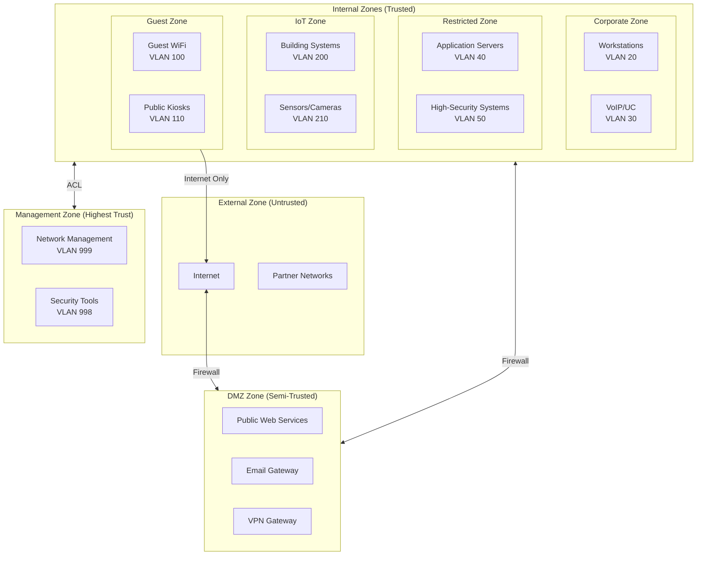

### VLAN Architecture

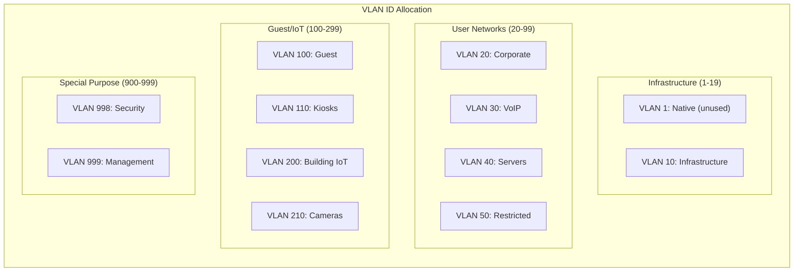

## VLAN Standards

### VLAN Allocation Table

| VLAN ID | Name | Purpose | Security Zone | DHCP | 802.1X |
|---------|------|---------|---------------|------|--------|
| 1 | Native | Unused (disabled) | N/A | No | No |
| 10 | Infrastructure | Switch-to-switch links | Management | No | No |
| 20 | Corporate | City employee workstations | Corporate | Yes | Required |
| 30 | VoIP | IP phones and UC devices | Corporate | Yes | Required |
| 40 | Servers | Application servers | Restricted | No | MAB |
| 50 | Secure | High-security systems | Restricted | No | Required |
| 100 | Guest | Visitor wireless | Guest | Yes | Portal |
| 110 | Kiosk | Public access terminals | Guest | Yes | MAB |
| 200 | Building | HVAC, lighting, access control | IoT | Yes | MAB |
| 210 | Cameras | Surveillance systems | IoT | Yes | MAB |
| 998 | Security | SIEM, IDS/IPS, scanners | Management | No | Required |
| 999 | Management | Network device management | Management | No | Required |

### VLAN Design Principles

| Principle | Requirement | Rationale |
|-----------|-------------|-----------|
| Native VLAN | Disabled or unused | Prevent VLAN hopping |
| VLAN 1 | Never used for traffic | Security best practice |
| User VLANs | Separate by function/trust | Limit blast radius |
| IoT isolation | Dedicated VLANs | Contain compromised devices |
| Management VLAN | Restricted access | Protect control plane |
| Voice VLAN | QoS-enabled, separate | Ensure call quality |

## Security Zone Definitions

### Zone Trust Levels

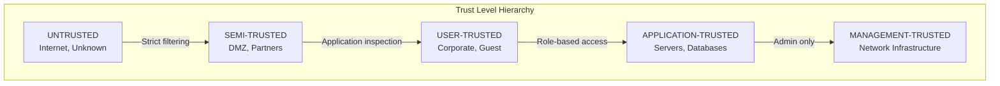

### Zone Specifications

#### External Zone (Untrusted)

| Attribute | Value |
|-----------|-------|
| Trust level | None |
| Traffic sources | Internet, unknown networks |
| Allowed inbound | Explicitly permitted services only |
| Inspection | Full (IPS, malware, DLP) |
| Logging | All traffic |

#### DMZ Zone (Semi-Trusted)

| Attribute | Value |
|-----------|-------|
| Trust level | Limited |
| Purpose | Public-facing services |
| Hosts | Web servers, email gateways, VPN concentrators |
| Internal access | Specific ports to specific hosts only |
| Internet access | Outbound restricted to required services |

#### Corporate Zone (Trusted)

| Attribute | Value |
|-----------|-------|
| Trust level | Standard |
| Purpose | Employee workstations and productivity |
| Access granted | Internal applications, internet (filtered) |
| Access denied | Direct server admin, management networks |
| 802.1X | Required |

#### Restricted Zone (High Trust)

| Attribute | Value |
|-----------|-------|
| Trust level | Elevated |
| Purpose | Sensitive applications and data |
| Access granted | Authorized users and applications only |
| Access denied | General corporate, guest, IoT |
| Additional controls | MFA, enhanced logging, DLP |

#### IoT Zone (Limited Trust)

| Attribute | Value |
|-----------|-------|
| Trust level | Minimal |
| Purpose | Connected devices (cameras, HVAC, sensors) |
| Access granted | Specific cloud services, management systems |
| Access denied | Corporate networks, internet (general) |
| Isolation | Client isolation enabled |

#### Guest Zone (Minimal Trust)

| Attribute | Value |
|-----------|-------|
| Trust level | Minimal |
| Purpose | Visitor internet access |
| Wireless security | **OWE (Enhanced Open)** — Mandatory 2026 |
| Encryption | AES-CCMP-128 (per-client unique keys) |
| Access granted | Internet only (filtered) |
| Access denied | All internal networks |
| Isolation | Full client isolation |

**OWE Requirement:** Guest wireless networks must use OWE (Opportunistic Wireless Encryption) to protect visitors from passive eavesdropping. See [OWE Enhanced Open Standards](owe-enhanced-open.md) for implementation details.

#### Management Zone (Maximum Trust)

| Attribute | Value |
|-----------|-------|
| Trust level | Maximum |
| Purpose | Network and security infrastructure |
| Access granted | Administrators only |
| Access denied | All non-admin traffic |
| Access method | Jump host or PAM required |

**UPS Management Interfaces:** All UPS SNMP management cards and network-connected power management devices must be placed on the Management VLAN (VLAN 999). UPS monitoring traffic must not traverse user or guest networks. See [Backup Power Standards](../ethernet/backup-power-standards.md) for UPS SNMP monitoring requirements.

## Inter-Zone Traffic Policies

### Traffic Flow Matrix

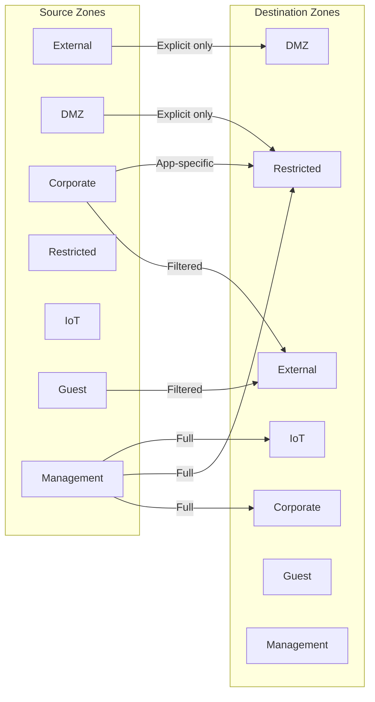

### Inter-Zone Access Control Matrix

| Source → Dest | External | DMZ | Corporate | Restricted | IoT | Guest | Management |
|---------------|----------|-----|-----------|------------|-----|-------|------------|
| **External** | — | Explicit | Deny | Deny | Deny | Deny | Deny |
| **DMZ** | Limited | — | Deny | Explicit | Deny | Deny | Deny |
| **Corporate** | Filtered | Explicit | Allow | Explicit | Deny | Deny | Deny |
| **Restricted** | Limited | Limited | Explicit | Allow | Deny | Deny | Deny |
| **IoT** | Explicit | Deny | Deny | Deny | Isolated | Deny | Deny |
| **Guest** | Filtered | Deny | Deny | Deny | Deny | Isolated | Deny |
| **Management** | Limited | Allow | Allow | Allow | Allow | Allow | Allow |

**Legend:**
- **Allow**: Traffic permitted with basic ACL
- **Explicit**: Traffic permitted only for defined services/ports
- **Filtered**: Traffic permitted through content inspection
- **Limited**: Minimal outbound only
- **Isolated**: No inter-client communication
- **Deny**: All traffic blocked

### Firewall Rule Framework

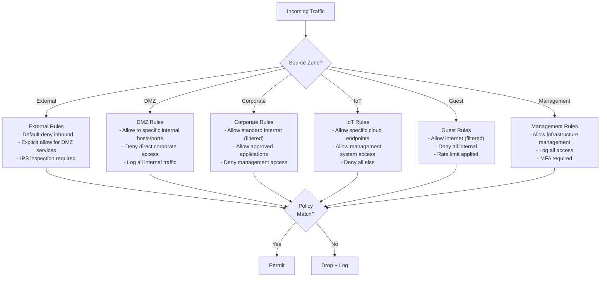

## Layer 3 Segmentation

### Inter-VLAN Routing Architecture

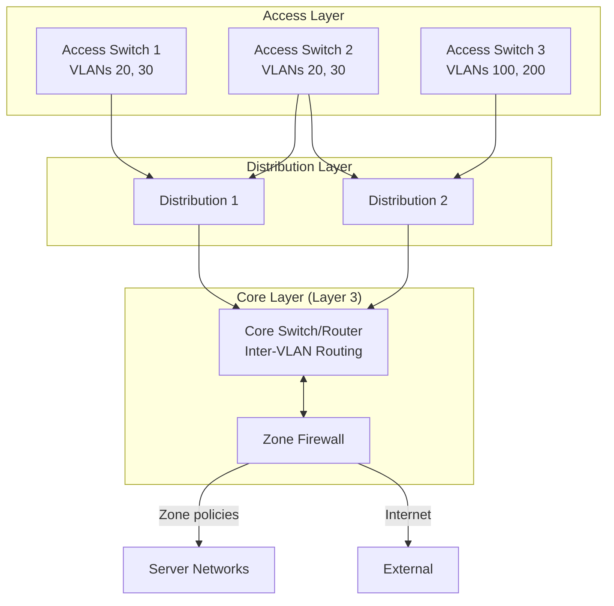

### Routing Security Requirements

| Requirement | Implementation | Rationale |
|-------------|----------------|-----------|
| Route filtering | Prefix lists on all L3 interfaces | Prevent route injection |
| Routing authentication | MD5/SHA for OSPF/BGP | Prevent route spoofing |
| Null routes | Bogon and RFC 1918 at edge | Block invalid sources |
| URPF | Strict mode where possible | Anti-spoofing |
| ACLs on SVIs | Permit only authorized traffic | Inter-VLAN control |

### VRF Segmentation (Advanced)

For environments requiring stronger isolation:

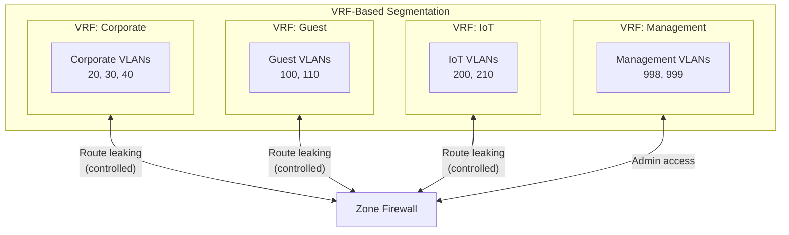

| VRF | Purpose | Route Leaking |
|-----|---------|---------------|
| Corporate | Business operations | To/from internet, restricted servers |
| Guest | Visitor access | To internet only |
| IoT | Device networks | To specific cloud services |
| Management | Infrastructure | To all VRFs (admin) |

## Microsegmentation

### Microsegmentation Architecture

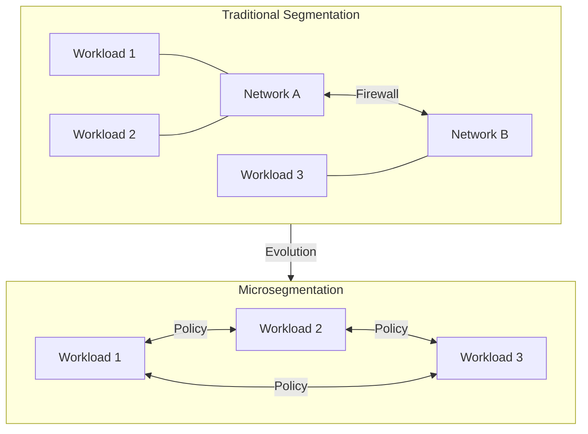

### Microsegmentation Approaches

| Approach | Implementation | Use Case | Complexity |
|----------|----------------|----------|------------|
| Network-based | ACLs per host/port | Physical servers | Medium |
| Hypervisor-based | Distributed firewall | Virtual workloads | Medium |
| Agent-based | Host firewall agents | Mixed environments | High |
| Identity-based | User/device identity policies | Zero trust | High |

### Microsegmentation Policy Example

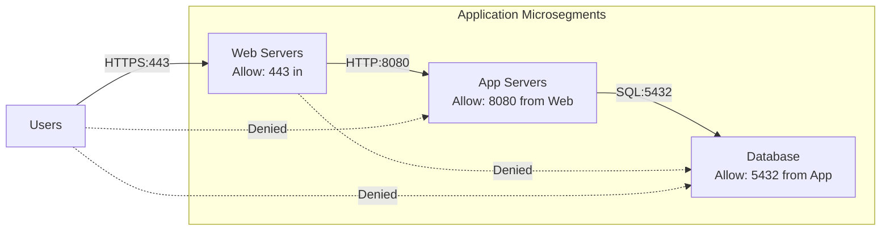

## IoT Segmentation

### IoT Network Architecture

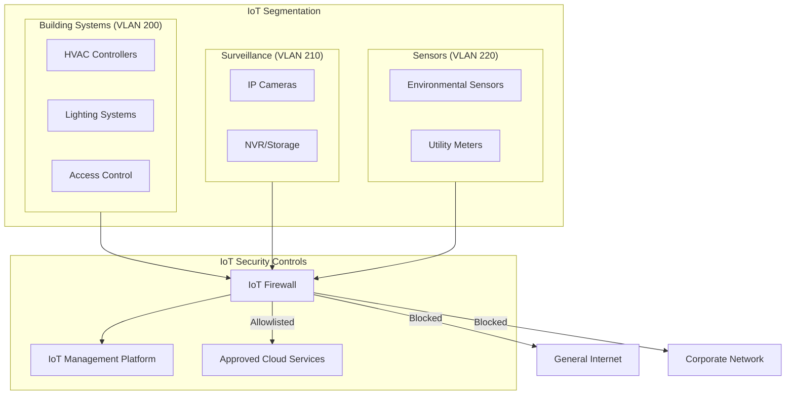

### IoT Segmentation Requirements

| Requirement | Implementation | Standard Reference |
|-------------|----------------|-------------------|
| Dedicated VLANs | Separate VLAN per IoT category | IEEE 802.1Q |
| Client isolation | No device-to-device communication | — |
| Internet restriction | Allowlist-only outbound | NIST SP 800-183 |
| Protocol restriction | Allow only required protocols | — |
| Bandwidth limits | QoS rate limiting | IEEE 802.1Qav |
| MAC binding | Static MAC-to-port (critical devices) | — |
| Network monitoring | Full traffic visibility | NIST 800-53 SI-4 |

### IoT Traffic Policies

| IoT Category | Allowed Destinations | Blocked | Protocols |
|--------------|---------------------|---------|-----------|
| Building systems | Management platform, vendor cloud | Internet, corporate | HTTPS, MQTT |
| Cameras | NVR, management platform | All external | RTSP, HTTPS |
| Sensors | IoT platform, time servers | All other | HTTPS, NTP |
| Access control | Directory services, management | Internet | LDAPS, HTTPS |

## Guest Network Segmentation

### Guest Network Architecture

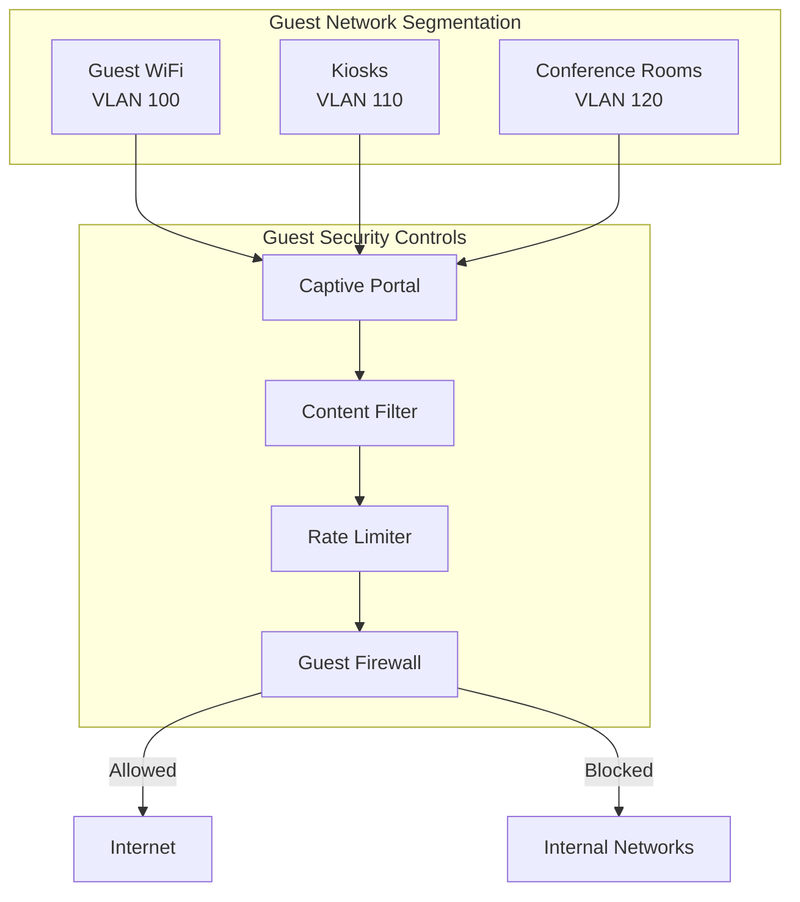

### Guest Network Requirements

| Requirement | Implementation | Rationale |
|-------------|----------------|-----------|
| Wireless security | **OWE (Enhanced Open)** — see [OWE Enhanced Open Standards](owe-enhanced-open.md) | Protect against eavesdropping (2026 mandate) |
| Network isolation | Separate VRF or firewall zone | Prevent internal access |
| Client isolation | Layer 2 isolation enabled | Prevent client-to-client attacks |
| Captive portal | Terms acceptance required | Legal liability |
| Content filtering | Block malware, phishing | Security hygiene |
| Bandwidth limits | Fair use policy (10/5 Mbps) | Prevent abuse |
| Session timeout | 8 hours | Force re-acceptance |
| DNS filtering | Malicious domain blocking | Threat prevention |

**Note:** OWE encryption, PMF, and per-client key details are defined in [OWE Enhanced Open Standards](owe-enhanced-open.md). The captive portal provides terms acceptance at Layer 3, while OWE encryption operates at Layer 2.

## Implementation Standards

### VLAN Configuration Checklist

- [ ] Native VLAN changed from 1 (or disabled)
- [ ] VLAN 1 not used for any traffic
- [ ] All VLANs documented with purpose
- [ ] Unused ports in dedicated unused VLAN
- [ ] Trunk ports explicitly configured (no DTP)
- [ ] VLAN pruning enabled on trunks
- [ ] Voice VLAN configured for phone ports
- [ ] Private VLANs for isolation where needed

### Firewall Rule Standards

| Rule Element | Requirement |
|--------------|-------------|
| Default policy | Deny all (implicit) |
| Rule specificity | Most specific first |
| Source/destination | Named objects (not IPs) |
| Service definition | Named services (not port numbers) |
| Logging | All denies, critical permits |
| Rule documentation | Comment on every rule |
| Review frequency | Quarterly minimum |
| Unused rules | Remove after 90 days |

### Change Management

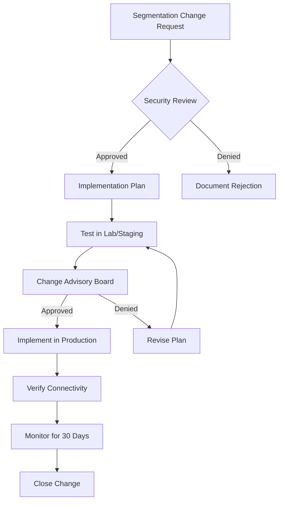

## Industry Adoption Data

### Segmentation Deployment Statistics

| Metric | Value | Source | Year |
|--------|-------|--------|------|
| Organizations using VLANs | 97% | EMA Network Report | 2024 |
| Formal zone-based architecture | 78% | SANS Security Survey | 2024 |
| IoT network segmentation | 76% | Ponemon IoT Study | 2024 |
| Guest network isolation | 94% | Industry benchmark | 2024 |
| Microsegmentation adoption | 42% | Forrester Research | 2024 |
| Zero trust network initiatives | 67% | Gartner Security Survey | 2024 |

### Municipal/Government Adoption

| Segmentation Practice | Adoption Rate | Notes |
|-----------------------|---------------|-------|
| Basic VLAN segmentation | 95% | Nearly universal |
| DMZ architecture | 89% | Standard practice |
| IoT isolation | 71% | Growing rapidly |
| Microsegmentation | 28% | Early adoption |
| Zero trust architecture | 45% | Federal mandate driving |

## Cost-Performance Analysis

### Implementation Costs

| Component | Initial Cost | Annual Cost | Notes |
|-----------|--------------|-------------|-------|
| Network redesign (consulting) | $10,000-50,000 | — | One-time |
| Firewall (zone-based) | $15,000-100,000 | $3,000-15,000 | Size dependent |
| Switch upgrades (if needed) | $0-50,000 | — | Most support VLANs |
| Microsegmentation platform | $20,000-150,000 | $15,000-75,000 | Optional |
| Staff training | $5,000-10,000 | $2,000 | Initial + ongoing |
| Documentation/procedures | $5,000 | $1,000 | Critical investment |
| **Total (medium network)** | **$55,000-365,000** | **$21,000-93,000** | — |

### Risk Reduction Value

| Risk Mitigated | Estimated Value | Basis |
|----------------|-----------------|-------|
| Lateral movement prevention | $50,000-500,000/year | Breach containment |
| Ransomware containment | $100,000-1,000,000 | Reduced blast radius |
| IoT compromise isolation | $25,000-250,000 | Device containment |
| Compliance penalties avoided | $10,000-500,000 | PCI, HIPAA, CJIS |
| Incident response costs | $20,000-100,000 | Faster containment |

### TCO Analysis

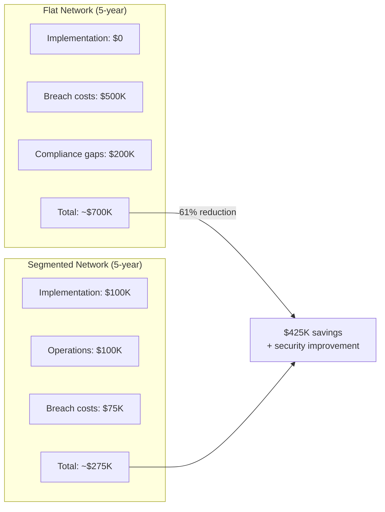

## NIST Alignment

### NIST SP 800-53 Control Mapping

| Control ID | Control Name | Segmentation Implementation |
|------------|--------------|----------------------------|
| AC-4 | Information Flow Enforcement | Zone-based firewall policies |
| AC-4(21) | Physical/Logical Separation | VLANs, VRFs, separate infrastructure |
| CA-3 | Information Exchange | Inter-zone policy enforcement |
| SC-7 | Boundary Protection | Zone firewalls, ACLs |
| SC-7(5) | Deny by Default | Default-deny firewall rules |
| SC-7(9) | Restrict Threatening Traffic | IPS at zone boundaries |
| SC-7(21) | Isolation of System Components | Microsegmentation |
| SC-32 | System Partitioning | Security zone architecture |
| SI-4 | System Monitoring | Inter-zone traffic logging |

### NIST SP 800-207 Zero Trust Alignment

| Zero Trust Principle | Segmentation Implementation |
|---------------------|----------------------------|
| All resources secured | Every zone has explicit policies |
| Least privilege | Minimum necessary access between zones |
| Inspect and log all traffic | Zone boundary logging |
| Dynamic, continuous validation | 802.1X + NAC integration |
| Assume breach | Microsegmentation limits blast radius |

### CISA Zero Trust Maturity Model

| Pillar | Segmentation Contribution |
|--------|--------------------------|
| Identity | 802.1X dynamic VLAN assignment |
| Devices | IoT segmentation, device profiling |
| Networks | Zone architecture, microsegmentation |
| Applications | Application-aware firewall rules |
| Data | Data classification zone alignment |

## Troubleshooting Guide

### Common Issues

| Symptom | Likely Cause | Resolution |
|---------|--------------|------------|
| No inter-VLAN connectivity | Missing route or ACL | Check routing table, ACLs |
| Partial connectivity | Firewall rule missing | Review zone policies |
| Slow inter-zone traffic | Firewall bottleneck | Check firewall performance |
| VLAN not propagating | Trunk misconfiguration | Verify allowed VLANs on trunk |
| Guest accessing internal | Firewall rule error | Audit guest zone policies |
| IoT device offline | Overly restrictive ACL | Review IoT allowlist |

### Diagnostic Flowchart

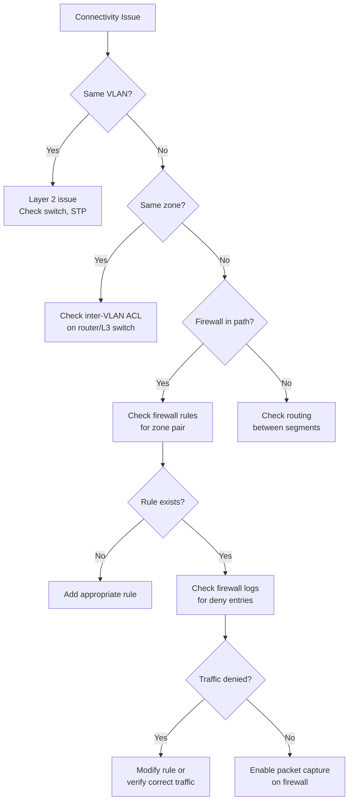

## Procurement Pass/Fail Checklist

Use this checklist to evaluate any network infrastructure component before purchase for segmentation compliance. Every **Required** item must pass. If any Required item fails, the component is **not approved** for procurement.

### Segmentation Infrastructure Procurement Checklist

| # | Requirement | Required | Pass | Fail |
|---|-------------|----------|------|------|
| 1 | IEEE 802.1Q VLAN support (4094 VLANs minimum) | **Yes** | ☐ | ☐ |
| 2 | Inter-VLAN ACL / access control list support | **Yes** | ☐ | ☐ |
| 3 | VLAN trunk pruning support | **Yes** | ☐ | ☐ |
| 4 | Zone-based firewall with default-deny policy | **Yes** | ☐ | ☐ |
| 5 | VRF (Virtual Routing and Forwarding) support | **Conditional** | ☐ | ☐ |
| 6 | Dynamic VLAN assignment via 802.1X RADIUS attributes | **Yes** | ☐ | ☐ |
| 7 | Microsegmentation / host-level policy enforcement | **Conditional** | ☐ | ☐ |
| 8 | Private VLAN (PVLAN) support | **Yes** | ☐ | ☐ |

### Results

| Outcome | Action |
|---------|--------|
| All Required items pass | **Approved for procurement** |
| Any Required item fails | **Not approved — do not purchase** |
| Questions about a specific device | Contact Network Engineering (ITI Networking Team) |

### How to Verify Requirements

| Checklist Item | Where to Find |
|----------------|---------------|
| 802.1Q VLAN support | Switch datasheet, configuration guide |
| Inter-VLAN ACLs | Feature list, CLI/management reference |
| Trunk pruning | Configuration guide, VLAN management section |
| Zone-based firewall | Firewall datasheet, security feature list |
| VRF support | Router/L3 switch datasheet, routing feature list |
| Dynamic VLAN via 802.1X | 802.1X configuration guide, RADIUS integration docs |
| Microsegmentation | Software-defined networking features, policy engine docs |
| Private VLANs | Switch datasheet, L2 feature list |

## References

1. IEEE 802.1Q-2022, "Bridges and Bridged Networks," IEEE, December 2022.
2. IEEE 802.1X-2020, "Port-Based Network Access Control," IEEE, February 2020.
3. IETF RFC 4364, "BGP/MPLS IP Virtual Private Networks (VPNs)," IETF, February 2006.
4. NIST SP 800-53 Rev. 5, "Security and Privacy Controls for Information Systems and Organizations," NIST, September 2020.
5. NIST SP 800-125B, "Secure Virtual Network Configuration for Virtual Machine (VM) Protection," NIST, March 2016.
6. NIST SP 800-207, "Zero Trust Architecture," NIST, August 2020.
7. NIST SP 800-183, "Networks of 'Things'," NIST, July 2016.
8. CISA, "Zero Trust Maturity Model Version 2.0," CISA, April 2023.
9. PCI Security Standards Council, "PCI DSS v4.0," PCI SSC, March 2022.
10. CIS Controls v8, "CIS Critical Security Controls," Center for Internet Security, May 2021.

---

*For questions about these standards, open an issue or contact the ITI Networking Team.*
