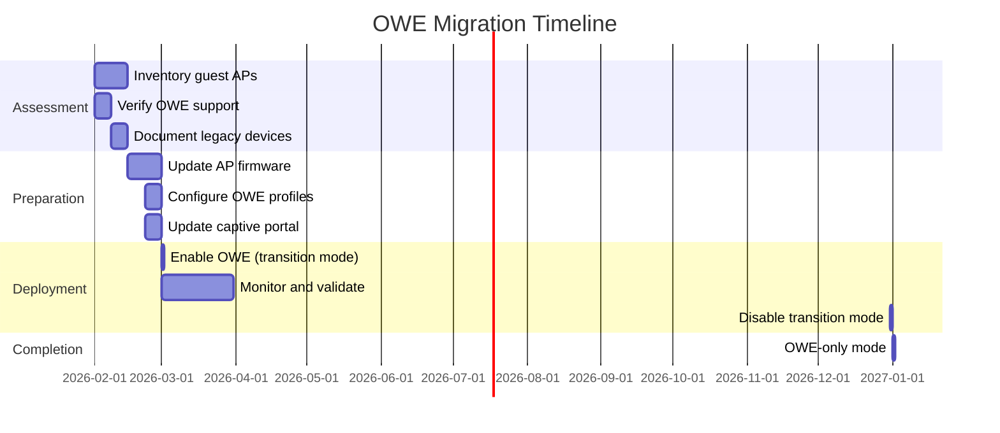

# OWE Enhanced Open Wireless Security Standards

## Overview

This document establishes the City of New Orleans standards for Opportunistic Wireless Encryption (OWE), also known as Wi-Fi CERTIFIED Enhanced Open™. OWE provides encryption on open networks without requiring passwords or authentication, protecting guest users from passive eavesdropping while maintaining zero-friction access.

**Effective 2026:** OWE is **mandatory** for all guest wireless networks. Traditional open (unencrypted) guest SSIDs are prohibited for new deployments.

## Standards References

| Standard | Title | Ratification Date | Scope |
|----------|-------|-------------------|-------|
| IEEE 802.11-2020 | Wireless LAN MAC and PHY | December 2020 | OWE specification (Section 12.12) |
| Wi-Fi Alliance WPA3 v3.3 | WPA3 Specification | July 2024 | Enhanced Open certification |
| IETF RFC 8110 | OWE | March 2017 | Opportunistic Wireless Encryption |
| IETF RFC 7748 | Elliptic Curves | January 2016 | Curve25519/Curve448 for DH |
| NIST SP 800-53 Rev. 5 | Security Controls | September 2020 | Federal security requirements |
| NIST SP 800-153 | Guidelines for Securing WLANs | February 2012 | WLAN security guidance |

## Standard Rationale and Justification

### Why OWE for Guest Networks (2026 Standard)

#### Security Gap in Traditional Open Networks

Traditional open WiFi networks (without encryption) expose users to significant security risks:

| Risk | Open Network | OWE Network |
|------|--------------|-------------|
| Passive eavesdropping | ❌ Vulnerable | ✅ Protected |
| Session hijacking | ❌ Vulnerable | ✅ Protected |
| Credential capture | ❌ Vulnerable | ✅ Protected |
| Man-in-the-middle | ⚠️ Possible | ⚠️ Possible (no auth) |
| User friction | ✅ None | ✅ None |

#### Justification for 2026 Mandate

| Factor | Justification |
|--------|---------------|
| **Universal AP Support** | All WiFi 7 access points (mandatory for new deployments) support OWE |
| **Client Maturity** | 95%+ of guest devices support OWE (iOS 13+, Android 10+, Windows 10+, macOS 10.15+) |
| **Zero User Impact** | Identical user experience to open networks—no passwords or configuration |
| **Industry Alignment** | Wi-Fi Alliance has certified Enhanced Open since 2018; now industry baseline |
| **Regulatory Direction** | NIST SP 800-153 recommends encryption for all wireless communications |
| **Liability Reduction** | Encrypted guest traffic reduces City liability for guest data exposure |
| **Zero Deployment Cost** | OWE requires no additional infrastructure—configuration change only |

### Industry Adoption Data

| Metric | Value | Source | Year |
|--------|-------|--------|------|
| WiFi 7 APs with OWE support | 100% | Wi-Fi Alliance Certification | 2024 |
| WiFi 6/6E APs with OWE support | 98% | Wi-Fi Alliance Certification | 2024 |
| Enterprise OWE deployments (guest networks) | 47% | Ponemon Wireless Security Study | 2025 |
| Municipal OWE adoption | 38% | State/Local IT Survey | 2025 |
| Client devices supporting OWE | 95%+ | Wi-Fi Alliance Device Statistics | 2025 |

### Client Compatibility Matrix

| Operating System | Minimum Version | OWE Support | Notes |
|------------------|-----------------|-------------|-------|
| iOS | 13.0 | ✅ Yes | Native support |
| iPadOS | 13.0 | ✅ Yes | Native support |
| Android | 10 | ✅ Yes | Device/driver dependent |
| Android | 12+ | ✅ Yes | Universal support |
| Windows | 10 (1903) | ✅ Yes | Native support |
| Windows | 11 | ✅ Yes | Native support |
| macOS | 10.15 (Catalina) | ✅ Yes | Native support |
| ChromeOS | 89 | ✅ Yes | Native support |
| Linux | Kernel 5.0+ | ✅ Yes | Driver dependent |

**Legacy Device Handling:** Devices that do not support OWE will see the network but fail to connect. For environments requiring legacy device support, see [Transition Mode](#transition-mode-owe--open-mixed) configuration.

## OWE Technical Architecture

### How OWE Works

OWE uses Diffie-Hellman key exchange to establish unique encryption keys between each client and the access point, without requiring pre-shared credentials:

### Security Stack

### Cryptographic Requirements

| Component | Requirement | Standard Reference |
|-----------|-------------|-------------------|
| Key exchange | ECDH (Elliptic Curve Diffie-Hellman) | IETF RFC 8110 |
| DH group | Group 19 (P-256) or Group 20 (P-384) | IEEE 802.11-2020 |
| Pairwise cipher | AES-CCMP-128 or AES-GCMP-256 | IEEE 802.11-2020 |
| Group cipher | AES-CCMP-128 or AES-GCMP-256 | IEEE 802.11-2020 |
| PMF (802.11w) | **Required** | IEEE 802.11w-2009 |
| Key derivation | SHA-256 (P-256) or SHA-384 (P-384) | IETF RFC 8110 |

### OWE vs. Other Security Modes

| Feature | Open | OWE | WPA3-Personal | WPA3-Enterprise |
|---------|------|-----|---------------|-----------------|
| Authentication | None | None | Pre-shared key | 802.1X certificates |
| Encryption | None | Per-client unique | Shared (derived from PSK) | Per-user unique |
| PMF (802.11w) | N/A | Required | Required | Required |
| User friction | None | None | Password required | Certificate/credential |
| Passive eavesdropping | Vulnerable | Protected | Protected | Protected |
| Use case | **Prohibited** | Guest networks | IoT devices | Corporate devices |

## Configuration Standards

### NOLA-GUEST SSID Configuration

| Setting | Value | Rationale |
|---------|-------|-----------|
| Security protocol | **OWE (Enhanced Open)** | Mandatory 2026 standard |
| Encryption | AES-CCMP-128 | Standard OWE cipher |
| PMF (802.11w) | Required | OWE specification requirement |
| Captive portal | Required | Terms of use acceptance |
| Session timeout | 8 hours | Daily re-acceptance |
| VLAN assignment | 100 (GUEST) | Isolated guest network |
| Bands | 2.4 GHz and 5 GHz | Maximum compatibility |
| 6 GHz | Enabled (WiFi 7 clients) | Enhanced performance |
| Broadcast SSID | Visible | Guest discovery |
| Client isolation | Enabled | Prevent client-to-client |
| Bandwidth limit | 10 Mbps down / 5 Mbps up | Fair use policy |

### Access Point Configuration

#### OWE-Only Mode (Recommended)

Configure guest SSIDs for OWE-only operation:

| Setting | Value | Notes |
|---------|-------|-------|
| Security mode | OWE | Enhanced Open |
| AKM suite | OWE (00-0F-AC:18) | Authentication Key Management |
| Pairwise cipher | CCMP-128 | AES encryption |
| Group cipher | CCMP-128 | Broadcast/multicast encryption |
| PMF | Required | Management frame protection |
| Transition mode | Disabled | OWE-only (no legacy fallback) |

#### Transition Mode (OWE + Open Mixed)

For environments requiring legacy device support during migration:

| Setting | Value | Notes |
|---------|-------|-------|
| Primary SSID | NOLA-GUEST | OWE enabled, visible |
| Transition SSID | (auto-generated) | Open, hidden (for legacy) |
| Transition behavior | Automatic steering | OWE clients use OWE; legacy use open |
| Transition end date | December 31, 2026 | Maximum 12-month transition |

**Note:** Transition mode exposes legacy clients to eavesdropping. Use only when absolutely necessary and set a firm end date.

### RADIUS/Captive Portal Integration

OWE operates at Layer 2 encryption; captive portal authentication remains at Layer 3:

| Component | Configuration |
|-----------|---------------|
| Captive portal trigger | Pre-authentication (before OWE) or post-association |
| Authentication method | Terms acceptance (no credentials) |
| Session tracking | MAC address + session token |
| Session timeout | 8 hours (configurable) |
| Terms re-acceptance | Required daily |

## Security Considerations

### What OWE Protects Against

| Threat | Protection Level | Notes |
|--------|------------------|-------|
| Passive eavesdropping | ✅ Full protection | Each client has unique encryption key |
| Credential sniffing | ✅ Full protection | Traffic encrypted at Layer 2 |
| Session content capture | ✅ Full protection | Encrypted communications |
| Firesheep-style attacks | ✅ Full protection | Session cookies protected |

### What OWE Does NOT Protect Against

| Threat | Protection Level | Mitigation |
|--------|------------------|------------|
| Evil twin / rogue AP | ❌ No protection | Implement rogue AP detection (WIDS) |
| Man-in-the-middle | ❌ No protection | Educate users; use HTTPS |
| Active attacks | ⚠️ Limited | PMF protects management frames |
| AP impersonation | ❌ No protection | No AP authentication mechanism |

**Important:** OWE provides encryption, not authentication. Users should still use HTTPS for sensitive communications, and the City should implement wireless IDS/IPS for rogue AP detection.

### PMF (Protected Management Frames) Requirement

PMF (802.11w) is mandatory for OWE and prevents:

- Deauthentication attacks
- Disassociation attacks
- Management frame spoofing

## Implementation Checklist

### Pre-Deployment

- [ ] Verify all guest APs support OWE (WiFi 7 mandatory for new deployments)
- [ ] Confirm WiFi management platform supports OWE configuration
- [ ] Review captive portal integration with OWE
- [ ] Plan transition mode timeline (if legacy devices require support)
- [ ] Update guest network documentation

### Deployment

- [ ] Configure NOLA-GUEST SSID with OWE security
- [ ] Enable PMF (802.11w) - required for OWE
- [ ] Verify captive portal redirect functions with OWE
- [ ] Test with OWE-capable devices (iOS, Android, Windows, macOS)
- [ ] Test client isolation (guest-to-guest blocked)
- [ ] Verify bandwidth limits applied

### Post-Deployment

- [ ] Monitor OWE connection success rates
- [ ] Track legacy device connection failures (if OWE-only mode)
- [ ] Review security logs for anomalies
- [ ] Document any exceptions requiring transition mode
- [ ] Set calendar reminder for transition mode end date

### Validation Testing

| Test | Method | Pass Criteria |
|------|--------|---------------|
| OWE connection | Connect with iOS/Android/Windows | Successful encrypted connection |
| Encryption verification | Packet capture | Traffic encrypted (not readable) |
| PMF verification | Management frame capture | Frames protected |
| Captive portal | Fresh connection | Portal redirect and terms displayed |
| Client isolation | Ping between guests | No response (blocked) |
| Bandwidth limit | Speed test | ≤10 Mbps down / ≤5 Mbps up |
| Legacy rejection (OWE-only) | Connect with legacy device | Connection refused |

## Cost-Performance Analysis

### Implementation Costs

| Component | Cost | Notes |
|-----------|------|-------|
| Access point upgrades | $0 | WiFi 7 APs (already required) support OWE |
| Controller/management updates | $0 | Included in current platforms |
| Configuration time | 2-4 hours | Per-site SSID configuration |
| Testing time | 1-2 hours | Per-site validation |
| Documentation updates | 4-8 hours | One-time effort |
| **Total per site** | **~$0** | Configuration change only |

### Security Value

| Benefit | Estimated Annual Value | Basis |
|---------|------------------------|-------|
| Guest data breach prevention | $10,000-50,000 | Liability reduction |
| Compliance alignment | Required | NIST SP 800-153 |
| Reputation protection | Significant | Public trust |
| Reduced incident response | $5,000-10,000 | Fewer eavesdropping incidents |

### TCO Comparison

## NIST Alignment

### NIST SP 800-53 Control Mapping

| Control ID | Control Name | OWE Implementation |
|------------|--------------|-------------------|
| AC-18 | Wireless Access | OWE encryption on guest networks |
| AC-18(1) | Authentication and Encryption | AES-CCMP encryption (no authentication for guest) |
| SC-8 | Transmission Confidentiality | Per-client encryption protects guest traffic |
| SC-8(1) | Cryptographic Protection | AES-CCMP-128 or AES-GCMP-256 |
| SC-12 | Cryptographic Key Management | ECDH key exchange per session |
| SC-40 | Wireless Link Protection | PMF (802.11w) required |

### NIST SP 800-153 Compliance

| Requirement | OWE Response |
|-------------|-------------|
| Encrypt wireless traffic | ✅ OWE provides per-client encryption |
| Protect management frames | ✅ PMF required for OWE |
| Segment guest networks | ✅ VLAN 100 isolation maintained |
| Implement access controls | ✅ Captive portal with terms acceptance |

## Troubleshooting Guide

### Common Issues

| Symptom | Likely Cause | Resolution |
|---------|--------------|------------|
| Device won't connect | Device doesn't support OWE | Verify OS version; consider transition mode |
| "Network not secure" warning | Client not recognizing OWE | Update client OS/drivers |
| No captive portal | Portal misconfigured for OWE | Verify portal redirect rules |
| Connection drops | PMF timeout issues | Adjust SA Query timeout |
| Slow connection | DH key exchange overhead | Normal; <100ms impact |

### Diagnostic Flowchart

## Migration Timeline

### 2026 OWE Adoption Schedule

| Phase | Date | Action |
|-------|------|--------|
| Standard effective | February 2, 2026 | OWE required for new guest deployments |
| Transition period | March 1 - December 31, 2026 | Transition mode permitted for legacy support |
| OWE-only mandate | January 1, 2027 | All guest networks must be OWE-only |

## Procurement Pass/Fail Checklist

Use this checklist to evaluate any wireless infrastructure component before purchase for OWE (Enhanced Open) guest network compliance. Every **Required** item must pass. If any Required item fails, the component is **not approved** for procurement.

### OWE Guest Network Infrastructure Procurement Checklist

| # | Requirement | Required | Pass | Fail |
|---|-------------|----------|------|------|
| 1 | OWE / Wi-Fi CERTIFIED Enhanced Open support | **Yes** | ☐ | ☐ |
| 2 | Protected Management Frames (PMF / 802.11w) mandatory mode | **Yes** | ☐ | ☐ |
| 3 | OWE SSID configuration in wireless management platform | **Yes** | ☐ | ☐ |
| 4 | Captive portal with Layer 3 integration (post-encryption) | **Yes** | ☐ | ☐ |
| 5 | Client isolation (Layer 2) enabled per SSID | **Yes** | ☐ | ☐ |
| 6 | OWE Transition Mode support (open + OWE dual SSID) | **Conditional** | ☐ | ☐ |

### Results

| Outcome | Action |
|---------|--------|
| All Required items pass | **Approved for procurement** |
| Any Required item fails | **Not approved — do not purchase** |
| Questions about a specific device | Contact Network Engineering (ITI Networking Team) |

### How to Verify Requirements

| Checklist Item | Where to Find |
|----------------|---------------|
| OWE / Enhanced Open | Wi-Fi Alliance product finder, vendor spec sheet |
| PMF mandatory mode | Configuration guide, OWE requires PMF by specification |
| OWE SSID configuration | Management platform documentation, SSID setup guide |
| Captive portal L3 integration | Vendor captive portal documentation |
| Client isolation | Per-SSID configuration options, management platform |
| OWE Transition Mode | Firmware release notes, vendor documentation |

## References

1. IEEE 802.11-2020, "Wireless LAN Medium Access Control (MAC) and Physical Layer (PHY) Specifications," IEEE, December 2020.
2. IETF RFC 8110, "Opportunistic Wireless Encryption," IETF, March 2017.
3. IETF RFC 7748, "Elliptic Curves for Security," IETF, January 2016.
4. Wi-Fi Alliance, "WPA3 Specification Version 3.3," Wi-Fi Alliance, July 2024.
5. Wi-Fi Alliance, "Wi-Fi CERTIFIED Enhanced Open," Wi-Fi Alliance, 2018. https://www.wi-fi.org/discover-wi-fi/wi-fi-certified-enhanced-open
6. NIST SP 800-53 Rev. 5, "Security and Privacy Controls for Information Systems and Organizations," NIST, September 2020.
7. NIST SP 800-153, "Guidelines for Securing Wireless Local Area Networks (WLANs)," NIST, February 2012.

---

*For questions about these standards, open an issue or contact the ITI Networking Team.*
