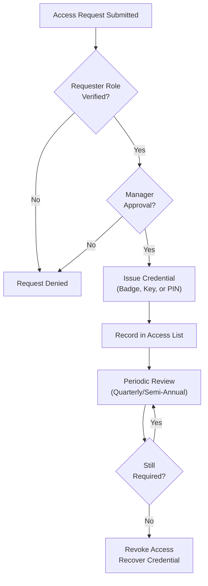
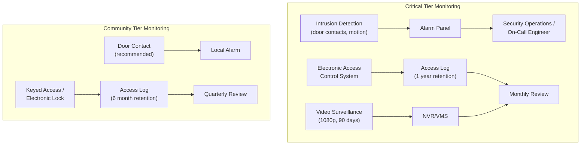

# Physical Security Standards for Telecommunications Infrastructure

## Overview

This document establishes the physical security controls for all municipal telecommunications spaces, equipment, and transmission media. Controls are aligned to NIST SP 800-53 Rev. 5 Physical and Environmental Protection (PE) control family and organized using the existing 2-tier facility model (Critical and Community) to ensure that security investments are proportional to operational risk.

Physical security is the first line of defense. Logical controls such as 802.1X port-based access control, WPA3 encryption, and network segmentation are ineffective if an attacker has unrestricted physical access to network equipment, patch panels, or cabling infrastructure.

## Standards References

| Standard | Title | Edition | Scope |
|----------|-------|---------|-------|
| NIST SP 800-53 Rev. 5 | Security and Privacy Controls | Update 1 (2021) | PE-2 through PE-6, PE-9 physical security controls |
| NIST SP 800-171 Rev. 3 | Protecting CUI in Nonfederal Systems | May 2024 | Physical protection requirements for CUI |
| TIA-569-E | Telecommunications Pathways and Spaces | 2019 | Telecom room door, lock, and access requirements |
| BICSI TDMM | Telecommunications Distribution Methods Manual | 15th Ed. (2024) | Physical security design guidance |
| CJIS Security Policy | Criminal Justice Information Services | v5.9.5 (2024) | Physical protection for CJIS data access points |

## Facility Tier Definitions

Physical security controls are assigned based on the 2-tier facility model used throughout the municipal network standards. The tier determines which NIST SP 800-53 baseline applies.

| Attribute | Critical Tier | Community Tier |
|-----------|--------------|----------------|
| **Facilities** | Police stations, fire stations, 911 dispatch, Emergency Operations Center (EOC) | Recreation centers, libraries, community centers, general municipal offices |
| **NIST baseline** | Moderate | Low |
| **Data sensitivity** | CJIS, emergency communications, sensitive municipal operations | General municipal, public access, guest services |
| **Risk profile** | High — compromise affects public safety | Standard — compromise affects municipal services |

### Control Applicability by Tier

| Control | Critical Tier | Community Tier |
|---------|--------------|----------------|
| PE-2: Physical Access Authorization | Full + enhancements | Core |
| PE-3: Physical Access Control | Electronic access control with audit | Dedicated keying |
| PE-4: Access Control for Transmission | Keyed port blockers + conduit | Snap-in port blockers |
| PE-5: Access Control for Output Devices | Console lockdown + controlled placement | Console password + controlled placement |
| PE-6: Monitoring Physical Access | Alarms + video + real-time alerts | Access logs + recommended alarms |

## PE-2: Physical Access Authorization

### Purpose

Maintain a current list of personnel authorized to access each telecommunications space. Prevent unauthorized physical access by ensuring only approved individuals can enter.

### Requirements

| Requirement | Critical Tier | Community Tier | Standard |
|-------------|--------------|----------------|----------|
| Authorized access list | Maintained per telecom space | Maintained per building | NIST PE-2 |
| List approval | Network Engineering manager | Facility manager | NIST PE-2 |
| Review frequency | Quarterly | Semi-annually | NIST PE-2 |
| Revocation timeline | Same business day upon separation or role change | Within 3 business days | NIST PE-2 |
| Credential type | Badge/card (electronic) | Key or badge | NIST PE-2 |
| Visitor policy | Escort required at all times; visitor log signed | Sign-in required; escort to telecom spaces | NIST PE-2 |
| Contractor access | Pre-approved work order required; escort or temporary credential | Pre-approved work order; escorted access | NIST PE-2 |

### Access Authorization Workflow

## PE-3: Physical Access Control

### Purpose

Enforce physical access authorizations at entry points to telecommunications spaces using appropriate locking mechanisms and access control systems.

### Telecom Room Entry Controls

| Requirement | Critical Tier | Community Tier | Standard |
|-------------|--------------|----------------|----------|
| Lock type | Electronic (card reader, PIN pad, or biometric) | Keyed deadbolt or electronic | NIST PE-3, TIA-569-E |
| Keying | Unique to each telecom space; not on building master key | Dedicated telecom key; not on building master key | TIA-569-E |
| Audit trail | Electronic access log with timestamp and credential ID | Key sign-out log or electronic log | NIST PE-3 |
| Door construction | Solid core, minimum 36 inches wide, outward swing | Solid core, minimum 36 inches wide | TIA-569-E |
| Door closer | Automatic closer required; no propping | Automatic closer required | NIST PE-3 |
| Door alarm | Contact alarm — alert on door held open >60 seconds | Recommended | NIST PE-3 |
| Signage | "AUTHORIZED PERSONNEL ONLY — NO UNESCORTED VISITORS" | "TELECOMMUNICATIONS ROOM — AUTHORIZED PERSONNEL ONLY" | — |

### Rack and Cabinet Locking

| Requirement | Critical Tier | Community Tier | Standard |
|-------------|--------------|----------------|----------|
| Front door lock | Required — keyed or combination | Required — keyed or combination | NIST PE-3(1) |
| Rear door/panel lock | Required | Required | NIST PE-3(1) |
| Lock type | Keyed different per rack, or electronic per-rack lock | Keyed alike within a facility acceptable | — |
| Key management | Inventory log; keys issued to authorized personnel only | Inventory log; keys stored in lockbox | NIST PE-3 |
| Key rotation | Rekey when personnel with access depart | Rekey when key is lost or compromised | NIST PE-3 |
| Wall-mount enclosure lock | Keyed or combination lock on enclosure door | Keyed lock on enclosure door | — |

### Access Log Requirements

| Attribute | Critical Tier | Community Tier |
|-----------|--------------|----------------|
| Log format | Electronic (access control system database) | Electronic or paper sign-in sheet |
| Retention | 1 year minimum | 6 months minimum |
| Fields captured | Date, time, credential ID, person name, duration | Date, time, person name, purpose |
| Review frequency | Monthly by Network Engineering | Quarterly by facility manager |
| Anomaly response | Investigate within 24 hours | Investigate within 1 week |

## PE-4: Access Control for Transmission

### Purpose

Control physical access to network transmission media — cabling, patch panels, switch ports, and wall jacks — to prevent unauthorized interception, tampering, or connection of rogue devices.

### Unused Port Security

> **All unused switch ports, patch panel ports, and wall jack ports in public or semi-public areas must be physically blocked.**

| Requirement | Critical Tier | Community Tier | Standard |
|-------------|--------------|----------------|----------|
| Switch port blockers | Keyed locking RJ45 blockers (require removal tool) | Snap-in RJ45 dust cover blockers | NIST PE-4 |
| Patch panel port blockers | Keyed locking blockers | Snap-in blockers | NIST PE-4 |
| Wall jack blockers (public areas) | Keyed locking blockers | Snap-in blockers | NIST PE-4 |
| Wall jack blockers (secure areas) | Snap-in blockers sufficient | Snap-in blockers | NIST PE-4 |
| Fiber port blockers | Dust caps on all unused fiber ports (LC, SC, MPO) | Dust caps on all unused fiber ports | NIST PE-4 |
| Compliance | TAA-compliant products required for government procurement | TAA-compliant recommended | — |
| Removal tool management | Tools stored in locked telecom room; issued to authorized personnel | Tools stored in locked telecom room | — |
| Inventory | Annual audit of port blocker installation | Annual audit | — |

### Port Blocker Types

| Type | Mechanism | Security Level | Use Case |
|------|-----------|----------------|----------|
| Snap-in dust cover | Friction fit; removable by hand | Basic | Community tier, interior secure spaces |
| Keyed locking blocker | Requires specific removal key/tool | Enhanced | Critical tier, all public-area wall jacks |
| Blank patch panel port | Factory-sealed blank insert | Permanent | Decommissioned ports |
| Fiber dust cap | Friction-fit protective cap | Basic (optical protection + access deterrent) | All unused fiber ports |

### Integration with Logical Port Security

Physical port blocking works in conjunction with logical access controls. Both layers are required.

| Layer | Control | Standard |
|-------|---------|----------|
| Physical | Port blockers on unused ports | NIST PE-4 (this document) |
| Logical | 802.1X port-based NAC on all active ports | IEEE 802.1X-2020 |
| Logical | MAC address limiting (maximum 1-2 per port) | — |
| Logical | BPDU Guard on all access ports | — |
| Logical | Unused ports administratively disabled | — |
| Logical | Dynamic VLAN assignment via RADIUS | IEEE 802.1X-2020 |

> **Cross-Reference:** For 802.1X configuration, RADIUS integration, and logical port security, see [802.1X Implementation](802.1x-implementation.md). For port-level VLAN assignments and switch port security settings, see [Port Configurations](../ethernet/port-configurations.md).

### Cabling Protection

| Requirement | Critical Tier | Community Tier | Standard |
|-------------|--------------|----------------|----------|
| Pathway protection | Conduit or enclosed cable tray for all horizontal runs | Conduit, cable tray, or J-hooks in secured pathways | NIST PE-4, TIA-569-E |
| Riser protection | Conduit or fire-stopped sleeves through floor/ceiling penetrations | Same | NEC 800, TIA-569-E |
| Outdoor cabling | Conduit required for permanent installations | Conduit required | NEC 800 |
| Junction boxes | Security fasteners (tamper-resistant Torx) on accessible junction boxes | Standard fasteners in secured spaces; security fasteners in public areas | NIST PE-4 |
| Cable labeling | Labels at both ends per TIA-606-D; do not label with VLAN or security zone information on visible exterior runs | Same | TIA-606-D |

## PE-5: Access Control for Output Devices

### Purpose

Control physical access to console ports, management terminals, and display devices that could expose network configuration, credentials, or operational data.

### Console Port Security

| Requirement | Critical Tier | Community Tier | Standard |
|-------------|--------------|----------------|----------|
| Console port access | Physical access restricted to locked rack; console cable removed when not in use | Physical access restricted to locked rack | NIST PE-5 |
| Console password | Required on all network devices | Required on all network devices | — |
| Console timeout | 5-minute inactivity timeout | 10-minute inactivity timeout | — |
| USB port security | Disable USB ports on network equipment unless required for operation | Disable unused USB ports | NIST PE-5 |
| Console server | Dedicated console server on Management VLAN (VLAN 999) for remote access; eliminates need for direct console cable | Recommended for multi-rack installations | — |

### Management Terminal Placement

| Requirement | Specification | Standard |
|-------------|---------------|----------|
| Location | Management workstations and terminals located inside telecom rooms or dedicated NOC spaces only | NIST PE-5 |
| Public visibility | No network management interfaces (dashboards, CLI sessions, monitoring screens) visible from public areas | NIST PE-5 |
| Screen lock | Automatic screen lock after 5 minutes of inactivity on all management terminals | — |
| Printer/output | Network diagrams, configurations, and credential printouts stored in locked cabinet; shred when no longer needed | NIST PE-5 |

## PE-6: Monitoring Physical Access

### Purpose

Monitor physical access to telecommunications spaces to detect unauthorized entry, support incident investigation, and maintain an auditable record of all access events.

### Monitoring Requirements by Tier

| Requirement | Critical Tier | Community Tier | Standard |
|-------------|--------------|----------------|----------|
| Intrusion detection | Required — door contact sensors and motion detection in telecom rooms | Recommended — door contact sensors | NIST PE-6(1) |
| Video surveillance | Required — camera covering telecom room entry point | Recommended | NIST PE-6(3) |
| Video retention | 90 days minimum | 30 days if installed | NIST PE-6(3) |
| Video resolution | Minimum 1080p; sufficient to identify individuals | Minimum 720p if installed | — |
| Real-time alerting | After-hours access triggers alert to security operations or on-call network engineer | After-hours access logged for review | NIST PE-6(1) |
| Tamper detection | Alarm on forced entry, door held open, or access control device tamper | Door-held-open alarm recommended | NIST PE-6 |
| Log review | Monthly by Network Engineering; immediate review upon anomaly alert | Quarterly by facility manager | NIST PE-6 |

### Suspicious Activity Indicators

The following physical access patterns warrant investigation:

| Indicator | Response |
|-----------|----------|
| After-hours access by non-emergency personnel | Verify with individual's supervisor within 24 hours |
| Repeated access by individual not on current access list | Investigate immediately; revoke credential if unauthorized |
| Extended duration in telecom room (> 2 hours without scheduled work) | Contact individual for justification |
| Access by terminated or transferred employee | Investigate immediately; confirm credential revocation |
| Tailgating (two entries on single credential) | Review video; reinforce anti-tailgating policy |
| Door held open alarm | Investigate; verify door secured |
| Access control device tamper alarm | Dispatch security; inspect device |

### Monitoring Architecture

## Outdoor Installation Security

Outdoor telecommunications equipment faces elevated physical security risks including vandalism, theft, unauthorized access, and environmental tampering.

### Outdoor Security Requirements

| Requirement | Specification | Standard |
|-------------|---------------|----------|
| Enclosure locking | Padlock hasp (minimum 3/8 in hardened shackle) or electronic lock | NIST PE-3 |
| Fastener type | Tamper-resistant (security Torx, pentalobe, or pin-in-hex) on all exterior screws and bolts | NIST PE-3 |
| Pole-mount height | Equipment enclosure bottom edge minimum 10 ft above grade | — |
| Anti-climb provisions | Pole climbing deterrents where equipment is mounted below 15 ft | — |
| Tamper-evident seals | Numbered tamper-evident seals on enclosure doors where electronic monitoring is not installed | NIST PE-3 |
| Seal audit | Verify seal integrity on every maintenance visit; record seal number changes | — |
| Graffiti/vandalism resistance | Anti-graffiti coating on exterior surfaces of ground-level cabinets | — |
| Lighting | Area lighting (motion-activated or dusk-to-dawn) at ground-level cabinet installations | NIST PE-6 |
| Signage | "MUNICIPAL TELECOMMUNICATIONS EQUIPMENT — UNAUTHORIZED ACCESS PROHIBITED — PENALTIES APPLY" | — |

### Outdoor Monitoring

| Monitoring Type | When Required | Notes |
|-----------------|---------------|-------|
| Tamper switch (enclosure door) | All outdoor installations | Wired or cellular alarm reporting |
| Video surveillance | High-value or high-vandalism-risk sites | Solar-powered cellular cameras available |
| GPS tracker | Portable or easily removable enclosures | Asset recovery if stolen |
| Environmental sensor | All outdoor installations | Temperature, humidity, door-open alerts via SNMP on Management VLAN |

## Industry Adoption Data

### Physical Security Practice Adoption

| Practice | Adoption Rate | Source | Year |
|----------|---------------|--------|------|
| Locked telecom rooms | 92% | BICSI survey | 2024 |
| Electronic access control on telecom rooms | 61% (enterprise); 34% (municipal) | ASIS International | 2024 |
| Port blockers on unused ports | 47% | SANS Security Survey | 2024 |
| Video surveillance of telecom rooms | 55% (enterprise); 28% (municipal) | ASIS International | 2024 |
| Rack-level locking | 68% (data center); 38% (IDF closets) | Ponemon Institute | 2024 |
| Tamper-resistant fasteners (outdoor) | 72% of outdoor deployments | Municipal IT Survey | 2024 |

### Municipal Deployment Patterns

| Security Practice | Adoption | Notes |
|-------------------|----------|-------|
| Dedicated telecom room keys (not master key) | 56% | Low; building master key common |
| Port blockers deployed | 22% | Very low; often overlooked |
| Access logs maintained | 44% | Paper logs common; electronic rare |
| CJIS-compliant physical controls at police facilities | 78% | Driven by FBI audit requirements |
| Outdoor enclosure tamper monitoring | 31% | Growing with smart city deployments |

## Cost-Performance Analysis

### Security Control Costs (Per Facility)

| Control | One-Time Cost | Annual Cost | Notes |
|---------|---------------|-------------|-------|
| Electronic access control (door) | $2,000-5,000 | $200-500 (maintenance) | Card reader + controller + software |
| Keyed deadbolt (dedicated) | $150-300 | $50 (rekeying fund) | Per door |
| Video surveillance (1 camera + NVR) | $1,000-3,000 | $100-200 | IP camera on Management VLAN |
| Intrusion detection (door + motion) | $500-1,500 | $100-300 | Wired preferred for reliability |
| Port blockers (100 ports, keyed) | $200-400 | $50 (replacements) | Keyed locking type |
| Port blockers (100 ports, snap-in) | $50-100 | $25 (replacements) | Friction-fit type |
| Rack locks (per rack) | $50-200 | $0 | Included with most enterprise racks |
| Tamper-resistant fastener kit | $100-200 | $25 (replacement bits) | Security Torx + pentalobe |
| Tamper-evident seals (100 pack) | $50-100 | $50-100 | Consumable |
| Outdoor padlock (hardened) | $30-80 | $0 | Per enclosure |

### Cost by Tier (Typical Facility)

| Cost Category | Critical Tier | Community Tier |
|---------------|--------------|----------------|
| Electronic access control | $3,500 | $0-3,500 (optional) |
| Keyed deadbolt | $0 (electronic replaces) | $200 |
| Video surveillance | $2,000 | $0 (recommended, not required) |
| Intrusion detection | $1,000 | $0-500 (recommended) |
| Port blockers (all unused ports) | $300 | $100 |
| Rack locks | $100 | $100 |
| **Total per facility** | **$6,900** | **$400-4,400** |

### Risk Reduction Value

| Threat | Annual Risk (Uncontrolled) | Annual Risk (With Controls) | Risk Reduction |
|--------|---------------------------|----------------------------|----------------|
| Unauthorized network tap / eavesdropping | $50,000-500,000 | $5,000-25,000 | 90-95% |
| Rogue device on network | $10,000-100,000 | $1,000-5,000 | 90-95% |
| Equipment theft (outdoor) | $5,000-20,000 | $1,000-5,000 | 75-80% |
| Vandalism / service disruption | $2,000-10,000 | $500-2,000 | 75-80% |
| CJIS audit failure (police facilities) | $25,000-100,000 (remediation + audit costs) | $0 (compliant) | 100% |

**Key insight:** For Critical tier facilities handling CJIS data, the cost of a single audit failure (remediation, re-audit, and potential access suspension) exceeds the entire physical security investment. For Community tier facilities, port blockers alone ($100) prevent the most common physical attack vector — plugging a rogue device into an open port.

## NIST SP 800-53 Alignment

### Control Mapping

| Control ID | Control Name | Implementation | Tier |
|------------|--------------|----------------|------|
| **PE-2** | Physical Access Authorizations | Access lists, credential issuance, periodic review | Both |
| PE-2(3) | Restrict Unescorted Access | Escort required for non-authorized visitors | Critical |
| **PE-3** | Physical Access Control | Door locks, rack locks, key management | Both |
| PE-3(1) | System Access — Rack/Cabinet Level | Individual rack locks with audit | Critical |
| PE-3(8) | Access Control Vestibules | Mantrap for highest-security spaces (911/EOC) | Critical (where feasible) |
| **PE-4** | Access Control for Transmission | Port blockers, conduit, locked closets | Both |
| **PE-5** | Access Control for Output Devices | Console security, management terminal placement | Both |
| PE-5(2) | Link to Individual Identity | Electronic access log ties access to individual | Critical |
| **PE-6** | Monitoring Physical Access | Access logs, review schedule | Both |
| PE-6(1) | Intrusion Alarms / Surveillance | Intrusion detection and alerting | Critical |
| PE-6(3) | Video Surveillance | Camera with 90-day retention | Critical |
| PE-6(4) | Monitoring Physical Access to Systems | Monitor rack/equipment access, not just room entry | Critical |
| **PE-9** | Power Equipment and Cabling | Cable protection in conduit and secured pathways | Both |

### CJIS Security Policy Alignment

Facilities processing Criminal Justice Information (CJI) must meet CJIS Security Policy physical protection requirements, which align with and in some cases exceed NIST Moderate baseline.

| CJIS Requirement | Implementation | Notes |
|------------------|----------------|-------|
| Physically secure location for CJI access | Telecom rooms at police facilities meet PE-3 Critical tier | Must pass FBI CJIS audit |
| Visitor control and escort | PE-2 visitor policy (escort at all times) | Log all visitor access |
| Secure areas during non-business hours | Electronic access control + intrusion detection | After-hours alerting required |
| Physical media protection | Port blockers, locked racks, cable protection | Prevents unauthorized CJI interception |

## Troubleshooting Guide

| Symptom | Likely Cause | Resolution |
|---------|--------------|------------|
| Access control system not logging entries | Controller offline or database full | Check controller power and network; verify database retention policy |
| Door held-open alarm false positives | Door closer too slow, or alarm delay too short | Adjust closer tension; increase held-open delay to 60 seconds |
| Port blockers missing during audit | Removed for maintenance and not replaced | Restock from inventory; add port blocker check to maintenance close-out procedure |
| Key/credential cannot be accounted for | Lost, unreported transfer, or terminated employee retention | Rekey affected locks; update access list; reinforce key management policy |
| Video surveillance gaps (no recording) | NVR storage full, camera offline, network issue | Verify NVR retention settings; check camera power and network connectivity on Management VLAN |
| Outdoor enclosure tamper seal broken | Maintenance visit without seal replacement, or unauthorized access | Check maintenance log for recent work; if no scheduled work, investigate as potential breach; replace seal |
| Electronic lock battery dead | Scheduled battery replacement missed | Replace battery; add to preventive maintenance schedule (annual replacement) |

## Procurement Pass/Fail Checklist

Use this checklist to evaluate physical security equipment before purchase. Every **Required** item must pass. If any Required item fails, the equipment is **not approved** for procurement.

### Physical Security Procurement Checklist

| # | Requirement | Required | Pass | Fail |
|---|-------------|----------|------|------|
| 1 | Electronic access control system supports audit logging with timestamp and credential ID | **Conditional** (Critical tier) | ☐ | ☐ |
| 2 | Door lock is dedicated telecom keying (not building master key) | **Yes** | ☐ | ☐ |
| 3 | Rack/cabinet includes locking front and rear doors | **Yes** | ☐ | ☐ |
| 4 | Port blockers are RJ45 compatible and do not damage port contacts | **Yes** | ☐ | ☐ |
| 5 | Port blockers are TAA-compliant (government procurement) | **Yes** | ☐ | ☐ |
| 6 | Keyed port blockers use a universal removal tool per set (not individual keys) | **Conditional** (Critical tier) | ☐ | ☐ |
| 7 | Video surveillance camera supports minimum 1080p resolution and 90-day retention | **Conditional** (Critical tier) | ☐ | ☐ |
| 8 | Intrusion detection sensors support integration with existing alarm system or SNMP alerting | **Conditional** (Critical tier) | ☐ | ☐ |
| 9 | Outdoor padlock has minimum 3/8-inch hardened shackle | **Conditional** (outdoor) | ☐ | ☐ |
| 10 | Tamper-resistant fasteners are security Torx or equivalent (not standard Phillips/hex) | **Conditional** (outdoor) | ☐ | ☐ |

### Results

| Outcome | Action |
|---------|--------|
| All applicable Required items pass | **Approved for procurement** |
| Any applicable Required item fails | **Not approved — do not purchase** |
| Questions about a specific product | Contact Network Engineering (ITI Networking Team) |

### How to Verify Requirements

| Checklist Item | Where to Find |
|----------------|---------------|
| Electronic access control audit logging | System specifications, software feature list |
| Dedicated keying | Confirm with locksmith/vendor; verify key does not operate on building master |
| Rack locking doors | Rack product datasheet, door specifications |
| Port blocker RJ45 compatibility | Product specifications, compatibility statement |
| TAA compliance | Product listing, manufacturer compliance declaration |
| Keyed port blocker removal tool | Product description, tool and key management information |
| Video resolution and retention | Camera datasheet, NVR storage calculator |
| Intrusion detection integration | Sensor specifications, protocol support (dry contact, SNMP) |
| Outdoor padlock shackle | Padlock specifications, security rating |
| Tamper-resistant fastener type | Fastener kit product description |

## References

1. NIST SP 800-53 Rev. 5, "Security and Privacy Controls for Information Systems and Organizations," NIST, September 2020 (Update 1, December 2021).
2. NIST SP 800-171 Rev. 3, "Protecting Controlled Unclassified Information in Nonfederal Systems and Organizations," NIST, May 2024.
3. ANSI/TIA-569-E, "Telecommunications Pathways and Spaces," TIA, May 2019.
4. BICSI, "Telecommunications Distribution Methods Manual (TDMM)," 15th Edition, January 2024.
5. FBI CJIS Division, "CJIS Security Policy," Version 5.9.5, 2024.
6. ASIS International, "Physical Security Professional (PSP) Body of Knowledge," 2024.

## Cross-References

| Document | Relationship |
|----------|--------------|
| [802.1X Implementation](802.1x-implementation.md) | Logical port-based access control complements physical port blocking |
| [Network Segmentation](network-segmentation.md) | Zone architecture, VLAN isolation, Management VLAN for security systems |
| [Port Configurations](../ethernet/port-configurations.md) | Switch port security settings (MAC limiting, BPDU Guard, admin shutdown) |
| [Equipment Mounting Standards](../ethernet/equipment-mounting-standards.md) | Rack locking requirements, enclosure specifications, outdoor cabinet security |
| [Backup Power Standards](../ethernet/backup-power-standards.md) | UPS for access control and surveillance systems; facility tier definitions |
| [Structured Cabling Standards](../ethernet/cabling-standards.md) | Cable pathway protection, junction box security fasteners |
| [Deployment Procedures](../wifi/deployment-procedures.md) | AP tamper-resistant mounting, outdoor installation security |

---

*For questions about these standards, open an issue or contact the ITI Networking Team.*
