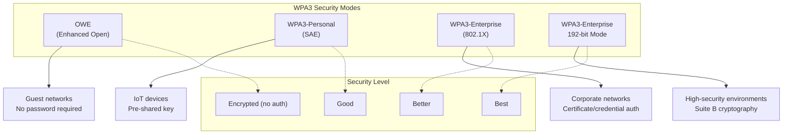
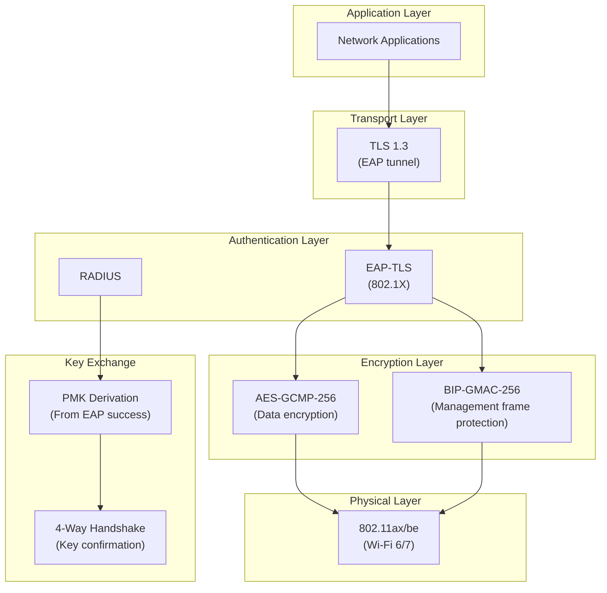
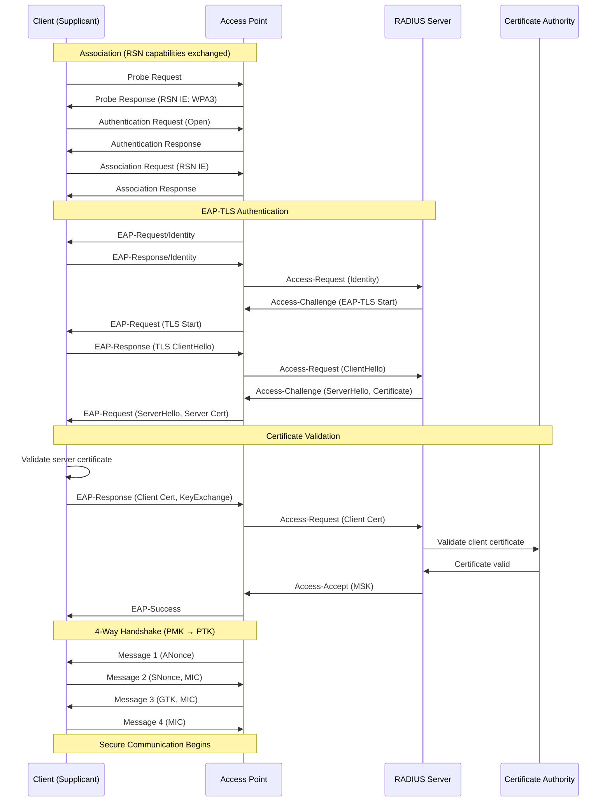
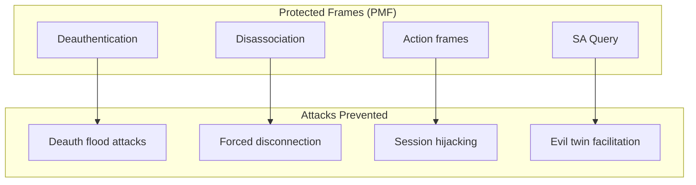
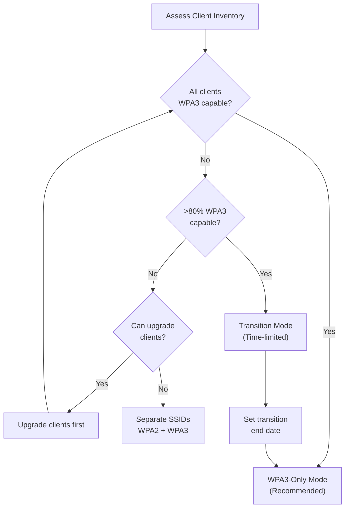
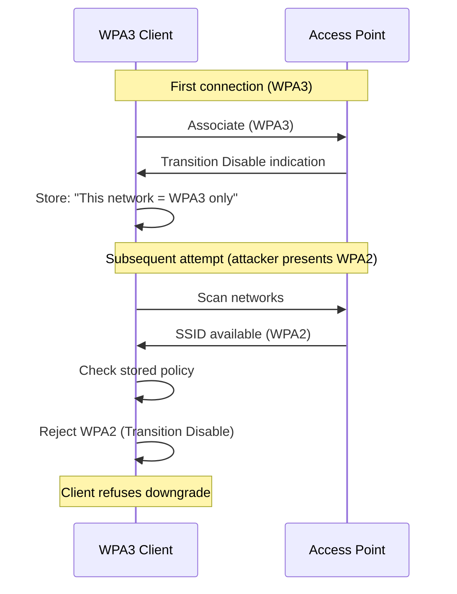
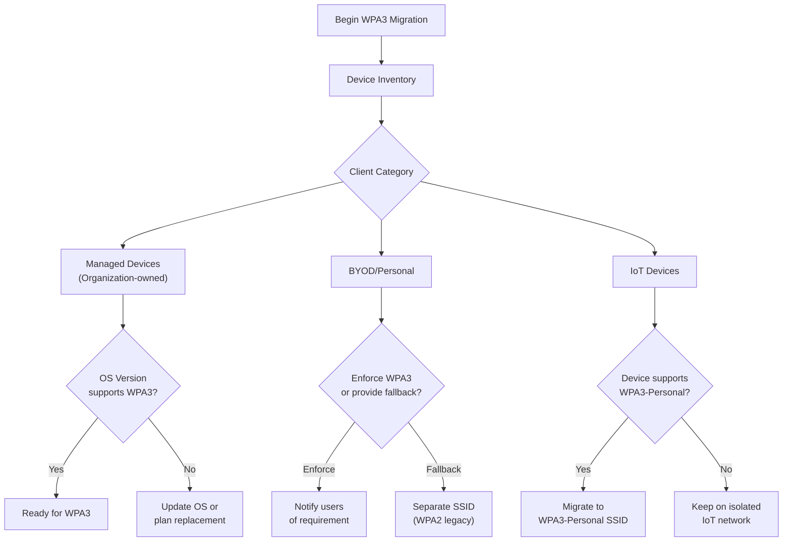
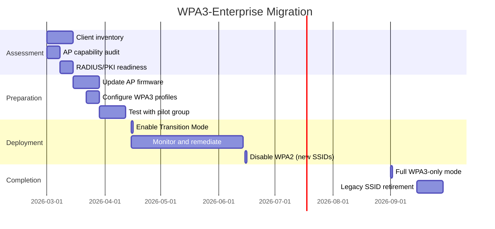
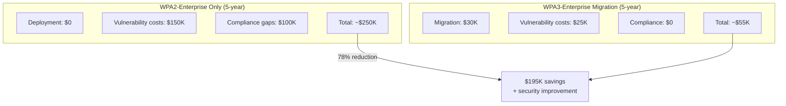
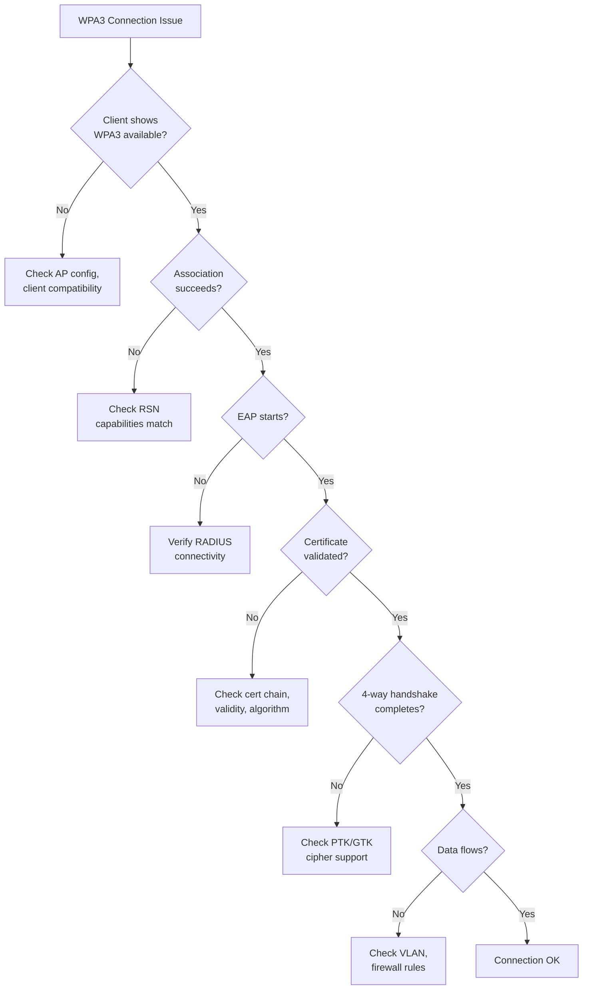

# WPA3-Enterprise Wireless Security Standards

## Overview

This document establishes the standards for WPA3-Enterprise wireless security. WPA3-Enterprise provides the highest level of wireless authentication and encryption for municipal networks, implementing 802.1X authentication with enhanced cryptographic protections.

## Standards References

| Standard | Title | Ratification Date | Scope |
|----------|-------|-------------------|-------|
| IEEE 802.11-2024 | Wireless LAN Medium Access Control | December 2020 | Consolidated wireless standard |
| IEEE 802.11i-2004 | Security Enhancements | July 2004 | RSN framework (WPA2 basis) |
| IEEE 802.11w-2009 | Protected Management Frames | September 2009 | Management frame protection |
| IEEE 802.11r-2008 | Fast BSS Transition | July 2008 | Fast roaming |
| Wi-Fi Alliance WPA3 v3.3 | WPA3 Specification | July 2024 | WPA3 certification requirements |
| IETF RFC 9190 | EAP-TLS 1.3 Authentication Protocol | February 2022 | Certificate-based EAP with TLS 1.3 |
| IETF RFC 8446 | TLS 1.3 | August 2018 | Transport security |
| NIST SP 800-53 Rev. 5 | Security Controls | September 2020 | Federal security requirements |
| NIST SP 800-153 | Guidelines for Securing WLANs | February 2012 | WLAN security guidance |
| CNSA 2.0 | Commercial NSA Suite | September 2022 | High-security cryptography |

## WPA3 Security Modes

### Mode Comparison

### Municipal Security Mode Usage

| SSID | Security Mode | Use Case | Standard Reference |
|------|---------------|----------|-------------------|
| MUNI-GUEST | **OWE (Enhanced Open)** | Visitor/public access | [OWE Standards](owe-enhanced-open.md) |
| MUNI-IOT | WPA3-Personal (SAE) | IoT devices | This document |
| MUNI-CORP | WPA3-Enterprise | Corporate devices | This document |
| MUNI-SECURE | WPA3-Enterprise 192-bit | High-security systems | This document |

### WPA3-Enterprise vs. WPA3-Enterprise 192-bit

| Feature | WPA3-Enterprise | WPA3-Enterprise 192-bit |
|---------|-----------------|------------------------|
| **Target use** | General enterprise | High-security/government |
| **Encryption** | AES-CCMP-128 or AES-GCMP-256 | AES-GCMP-256 only |
| **Key derivation** | HMAC-SHA-256 or HMAC-SHA-384 | HMAC-SHA-384 only |
| **EAP method** | Any supported (EAP-TLS recommended) | EAP-TLS only |
| **Certificate requirements** | RSA 2048+ or ECC P-256+ | ECC P-384 or RSA 3072+ |
| **TLS version** | TLS 1.3 | TLS 1.3 with Suite B ciphers |
| **PMF (802.11w)** | Required | Required (BIP-GMAC-256) |
| **CNSA compliance** | Partial | Full |

## WPA3-Enterprise Architecture

### Security Stack

### Authentication Flow

## Cryptographic Requirements

### WPA3-Enterprise Standard Mode

| Component | Requirement | Standard Reference |
|-----------|-------------|-------------------|
| Pairwise cipher | AES-CCMP-128 or AES-GCMP-256 | IEEE 802.11-2024 |
| Group cipher | AES-CCMP-128 or AES-GCMP-256 | IEEE 802.11-2024 |
| Group management cipher | BIP-CMAC-128 or BIP-GMAC-256 | IEEE 802.11w |
| Key derivation | HMAC-SHA-256 or HMAC-SHA-384 | Wi-Fi Alliance |
| EAP method | EAP-TLS only (2026 policy) | RFC 9190; see [802.1X Implementation](802.1x-implementation.md) |
| TLS version | TLS 1.3 minimum | RFC 8446 |
| Server certificate | RSA 2048+ or ECDSA P-256+ | Wi-Fi Alliance |
| Client certificate | RSA 2048+ or ECDSA P-256+ | Wi-Fi Alliance |

### WPA3-Enterprise 192-bit Mode (Recommended for High-Security)

| Component | Requirement | Standard Reference |
|-----------|-------------|-------------------|
| Pairwise cipher | AES-GCMP-256 only | IEEE 802.11-2024 |
| Group cipher | AES-GCMP-256 only | IEEE 802.11-2024 |
| Group management cipher | BIP-GMAC-256 only | IEEE 802.11w |
| Key derivation | HMAC-SHA-384 only | Wi-Fi Alliance |
| EAP method | EAP-TLS only | RFC 9190 |
| TLS ciphers | TLS_ECDHE_ECDSA_WITH_AES_256_GCM_SHA384 | RFC 8446 |
| Server certificate | ECDSA P-384 or RSA 3072+ | CNSA 2.0 |
| Client certificate | ECDSA P-384 or RSA 3072+ | CNSA 2.0 |

## Protected Management Frames (PMF/802.11w)

### PMF Overview

PMF protects 802.11 management frames from spoofing and injection attacks:

### PMF Configuration Requirements

| Setting | WPA3-Enterprise | WPA3-Enterprise 192-bit |
|---------|-----------------|------------------------|
| PMF mode | Required (mandatory) | Required (mandatory) |
| IGTK cipher | BIP-CMAC-128 or BIP-GMAC-256 | BIP-GMAC-256 only |
| SA Query timeout | 200 ms | 200 ms |
| Association comeback | Enabled | Enabled |
| Beacon protection | Recommended | Required |

## Transition Mode (WPA2/WPA3 Mixed)

### When to Use Transition Mode

Transition mode allows both WPA2 and WPA3 clients on the same SSID during migration:

### Transition Mode Configuration

| Setting | Value | Rationale |
|---------|-------|-----------|
| Authentication | WPA2-Enterprise + WPA3-Enterprise | Dual support |
| Encryption | AES-CCMP (WPA2) / AES-GCMP (WPA3) | Per-client negotiation |
| PMF | Required for WPA3, optional for WPA2 | Maintain WPA2 compatibility |
| Transition Disable | Enabled | Prevent WPA3 client downgrade |
| Timeline | Maximum 12 months | Force migration completion |

### Transition Disable Feature

Transition Disable prevents WPA3-capable clients from connecting via WPA2:

## Access Point Configuration Standards

### Radio Settings for WPA3

| Setting | Recommended Value | Standard Reference |
|---------|-------------------|-------------------|
| Security mode | WPA3-Enterprise | Wi-Fi Alliance WPA3 |
| PMF | Required | IEEE 802.11w |
| Fast BSS transition | Enabled (802.11r) | IEEE 802.11r |
| OKC (Opportunistic Key Caching) | Enabled | IEEE 802.11-2024 |
| GTK rekey interval | 86400 seconds (24 hours) | Security best practice |
| PTK rekey | On session timeout | Security best practice |
| Management frame protection | BIP-GMAC-256 | IEEE 802.11w |

### RADIUS Integration

See [802.1X Implementation — RADIUS Architecture](802.1x-implementation.md#radius-architecture) for complete RADIUS server configuration, failover, and attribute standards.

**WPA3-specific parameter:**

| Parameter | Requirement | Notes |
|-----------|-------------|-------|
| Session timeout | 28800 seconds (8 hours) | Periodic reauthentication for WPA3-Enterprise sessions |

## Migration from WPA2-Enterprise

### Migration Assessment

### Client Compatibility Matrix

| Operating System | Minimum Version | WPA3 Support | WPA3-Enterprise 192-bit |
|------------------|-----------------|--------------|------------------------|
| Windows | 10 (1903) | Yes | Yes (11+) |
| Windows | 11 | Yes | Yes |
| macOS | 10.15 (Catalina) | Yes | Yes |
| iOS | 13.0 | Yes | Yes |
| iPadOS | 13.0 | Yes | Yes |
| Android | 10 | Yes (device dependent) | Yes (12+) |
| ChromeOS | 89 | Yes | Yes |
| Linux | Kernel 5.0+ | Yes (driver dependent) | Yes |

### Migration Timeline

## Industry Adoption Data

### WPA3 Enterprise Deployment Statistics

| Metric | Value | Source | Year |
|--------|-------|--------|------|
| WPA3-Enterprise capable APs shipped | 94% | Wi-Fi Alliance | 2024 |
| Enterprise WPA3 deployments | 61% | Ponemon Wireless Security | 2024 |
| WPA3-Enterprise 192-bit usage | 12% | Federal CIO Council | 2024 |
| Transition mode deployments | 34% | EMA Network Report | 2024 |
| Full WPA3-only enterprise networks | 27% | EMA Network Report | 2024 |

### Client Support Statistics

| Platform | WPA3 Support Rate | Notes |
|----------|-------------------|-------|
| Enterprise Windows (managed) | 98% | Win10/11 fleet |
| Enterprise macOS | 96% | Catalina+ required |
| Enterprise iOS | 99% | iOS 13+ universal |
| Android (enterprise) | 87% | Fragmentation issues |
| IoT devices | 23% | Major gap |

## Cost-Performance Analysis

### Migration Costs

| Component | Cost Range | Notes |
|-----------|------------|-------|
| AP firmware updates | $0 | Included in support |
| AP hardware replacement (if needed) | $500-1,500/AP | Only for very old APs |
| RADIUS server updates | $0-5,000 | May need EAP-TLS config |
| Client updates | $0 | OS updates |
| PKI enhancements | $0-10,000 | If certificate changes needed |
| Staff training | $2,000-5,000 | WPA3 specifics |
| Testing and validation | $5,000-10,000 | Pilot program |
| **Total (100 APs, no replacement)** | **$7,000-30,000** | — |

### Security Value

| Benefit | Annual Value | Basis |
|---------|--------------|-------|
| Prevented deauth attacks | $10,000-50,000 | PMF protection |
| Reduced credential exposure | $25,000-100,000 | Stronger encryption |
| Compliance (CJIS, CMMC, HIPAA) | Required | Audit requirements |
| Extended device lifecycle | $20,000-50,000 | Security longevity |

### TCO Comparison

## NIST Alignment

### NIST SP 800-53 Control Mapping

| Control ID | Control Name | WPA3-Enterprise Implementation |
|------------|--------------|-------------------------------|
| AC-18 | Wireless Access | WPA3-Enterprise authentication |
| AC-18(1) | Authentication and Encryption | EAP-TLS + AES-GCMP-256 |
| AC-18(3) | Disable Wireless Networking | N/A (secure wireless) |
| AC-18(4) | Restrict Configurations | Centralized AP management |
| AC-18(5) | Antennas/Transmission Power | Site survey-based config |
| IA-3 | Device Identification | Device certificates |
| IA-5 | Authenticator Management | Certificate lifecycle |
| SC-8 | Transmission Confidentiality | AES-GCMP-256 encryption |
| SC-12 | Cryptographic Key Management | PMK/PTK derivation |
| SC-13 | Cryptographic Protection | FIPS 140-2 validated crypto |
| SC-40 | Wireless Link Protection | PMF (802.11w) |

### NIST SP 800-153 Compliance

| Requirement | WPA3-Enterprise Response |
|-------------|-------------------------|
| Use strong encryption | AES-GCMP-256 (192-bit mode) |
| Implement mutual authentication | EAP-TLS with certificates |
| Protect management frames | PMF required |
| Use RADIUS for authentication | 802.1X with RADIUS |
| Implement rogue AP detection | Wireless IDS/IPS |
| Segment wireless traffic | Dynamic VLAN assignment |

## Troubleshooting Guide

### Common Issues

| Symptom | Likely Cause | Resolution |
|---------|--------------|------------|
| Client won't connect to WPA3 | Unsupported OS/driver | Update client OS and drivers |
| 192-bit mode failures | Certificate algorithm mismatch | Use ECDSA P-384 certificates |
| Roaming failures | 802.11r misconfiguration | Verify FT settings on all APs |
| Intermittent disconnects | PMF timeout issues | Adjust SA Query timeout |
| RADIUS timeout | Server can't validate certificate | Check certificate chain, OCSP |
| Slow authentication | EAP-TLS full handshake | Enable OKC and 802.11r |

### Diagnostic Flowchart

## Implementation Checklist

### Pre-Deployment

- [ ] Verify all APs support WPA3-Enterprise
- [ ] Confirm RADIUS server supports required EAP methods
- [ ] Validate PKI can issue compliant certificates
- [ ] Inventory client devices for compatibility
- [ ] Plan transition mode timeline (if needed)
- [ ] Configure test SSID for validation

### Deployment

- [ ] Update AP firmware to latest version
- [ ] Configure WPA3-Enterprise security profile
- [ ] Enable PMF (required)
- [ ] Configure 802.11r for fast roaming
- [ ] Enable Transition Disable
- [ ] Set appropriate session timeout
- [ ] Configure RADIUS failover

### Post-Deployment

- [ ] Monitor authentication success rates
- [ ] Track WPA2 vs WPA3 client distribution
- [ ] Review security logs for anomalies
- [ ] Plan WPA2 deprecation date
- [ ] Document exceptions and remediation plans

## Procurement Pass/Fail Checklist

Use this checklist to evaluate any wireless infrastructure component before purchase for WPA3-Enterprise compliance. Every **Required** item must pass. If any Required item fails, the component is **not approved** for procurement.

### WPA3 Infrastructure Procurement Checklist

| # | Requirement | Required | Pass | Fail |
|---|-------------|----------|------|------|
| 1 | WPA3-Enterprise certified (Wi-Fi Alliance) | **Yes** | ☐ | ☐ |
| 2 | 192-bit security mode (CNSA suite) support | **Conditional** | ☐ | ☐ |
| 3 | Protected Management Frames (PMF / 802.11w) mandatory mode | **Yes** | ☐ | ☐ |
| 4 | TLS 1.3 (RFC 8446) for all EAP-TLS sessions | **Yes** | ☐ | ☐ |
| 5 | Transition Disable indication support | **Yes** | ☐ | ☐ |
| 6 | 802.11r (Fast BSS Transition) support | **Yes** | ☐ | ☐ |
| 7 | Configurable session timeout and reauthentication interval | **Yes** | ☐ | ☐ |
| 8 | ECDSA P-384 certificate support | **Conditional** | ☐ | ☐ |

### Results

| Outcome | Action |
|---------|--------|
| All Required items pass | **Approved for procurement** |
| Any Required item fails | **Not approved — do not purchase** |
| Questions about a specific device | Contact Network Engineering (ITI Networking Team) |

### How to Verify Requirements

| Checklist Item | Where to Find |
|----------------|---------------|
| WPA3-Enterprise certification | Wi-Fi Alliance product finder, vendor spec sheet |
| 192-bit security mode | Vendor documentation, "WPA3-Enterprise 192-bit" in spec sheet |
| PMF mandatory mode | Configuration guide, WPA3 certification includes PMF |
| TLS 1.3 | RADIUS server documentation, supplicant OS requirements |
| Transition Disable | Firmware release notes, Wi-Fi Alliance certification |
| 802.11r support | Vendor spec sheet, configuration guide |
| Session timeout / reauth | Management platform documentation |
| ECDSA P-384 certificates | PKI documentation, certificate enrollment guide |

## References

1. IEEE 802.11-2024, "Wireless LAN Medium Access Control (MAC) and Physical Layer (PHY) Specifications," IEEE, December 2020.
2. IEEE 802.11i-2004, "Amendment 6: Medium Access Control (MAC) Security Enhancements," IEEE, July 2004.
3. IEEE 802.11w-2009, "Amendment 4: Protected Management Frames," IEEE, September 2009.
4. IEEE 802.11r-2008, "Amendment 2: Fast Basic Service Set (BSS) Transition," IEEE, July 2008.
5. Wi-Fi Alliance, "WPA3 Specification Version 3.3," Wi-Fi Alliance, July 2024.
6. Wi-Fi Alliance, "WPA3 Security Considerations," Wi-Fi Alliance Technical Note, 2024.
7. IETF RFC 9190, "EAP-TLS 1.3: Using the Extensible Authentication Protocol with TLS 1.3," IETF, February 2022.
8. IETF RFC 8446, "The Transport Layer Security (TLS) Protocol Version 1.3," IETF, August 2018.
9. NIST SP 800-53 Rev. 5, "Security and Privacy Controls for Information Systems and Organizations," NIST, September 2020.
10. NIST SP 800-153, "Guidelines for Securing Wireless Local Area Networks (WLANs)," NIST, February 2012.
11. NSA, "Commercial National Security Algorithm Suite 2.0," NSA Cybersecurity, September 2022.

## Cross-References

| Document | Relationship |
|----------|--------------|
| [802.1X Implementation](802.1x-implementation.md) | RADIUS architecture and EAP-TLS authentication |
| [OWE Enhanced Open Standards](owe-enhanced-open.md) | Guest network encryption (non-enterprise SSIDs) |
| [SSID Standards](../wifi/ssid-standards.md) | Per-SSID security profile assignments |
| [Access Point Specifications](../wifi/access-point-specs.md) | AP WPA3-Enterprise hardware requirements |
| [Wireless Client Requirements](../wifi/wireless-client-requirements.md) | Client WPA3 supplicant and cipher suite requirements |
| [Network Segmentation](network-segmentation.md) | VLAN-based security zones enforced via WPA3 |

---

*For questions about these standards, open an issue or contact the ITI Networking Team.*
