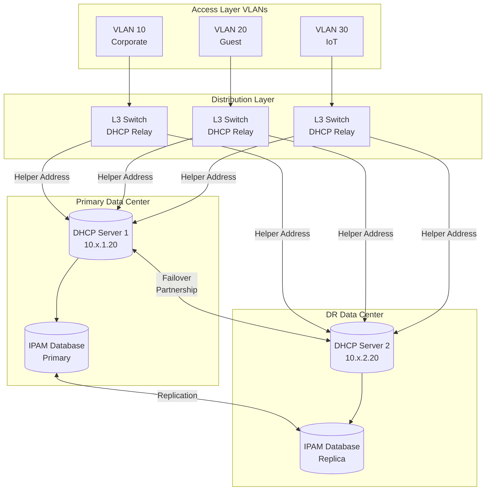
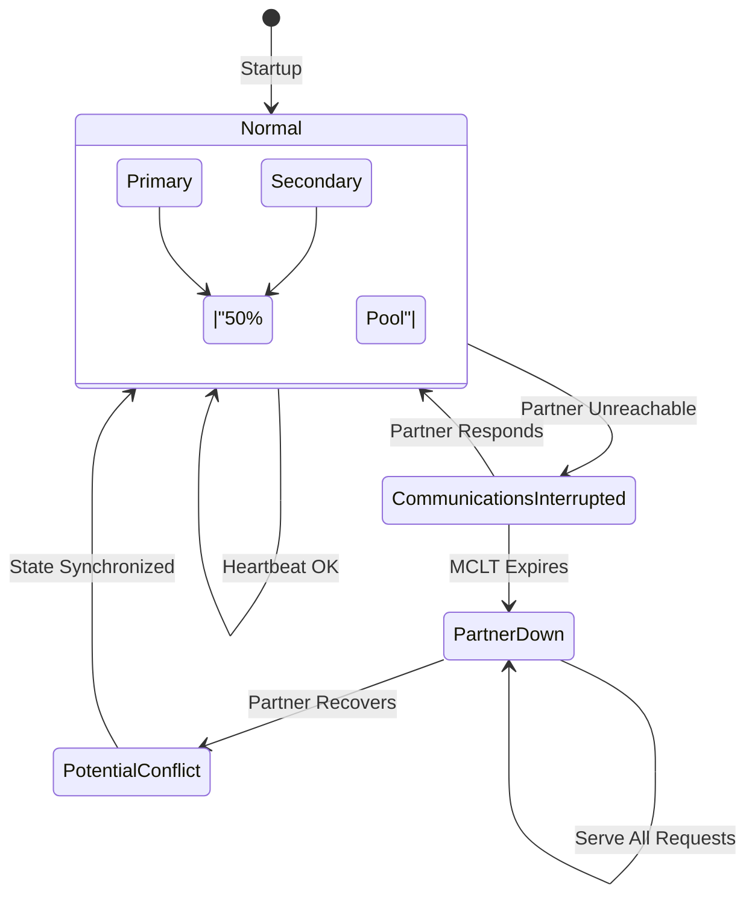
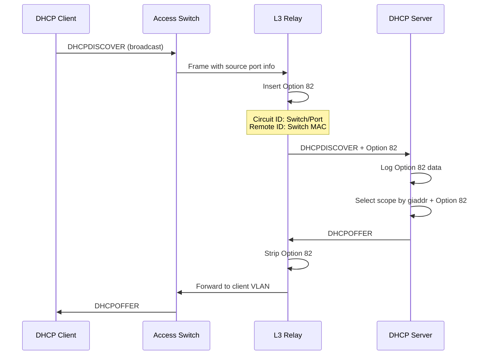
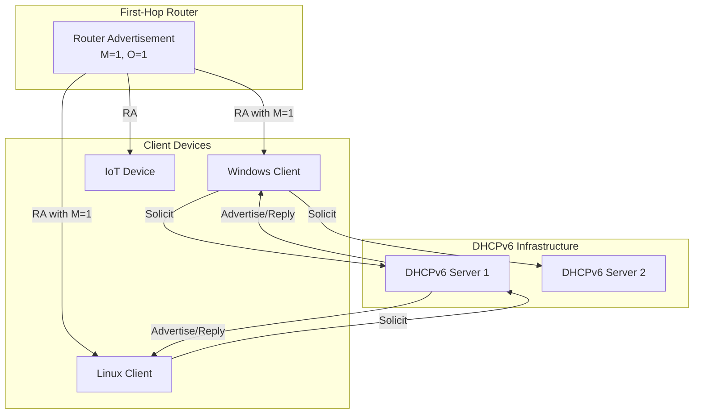
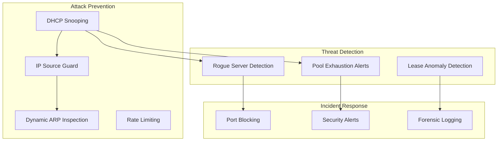
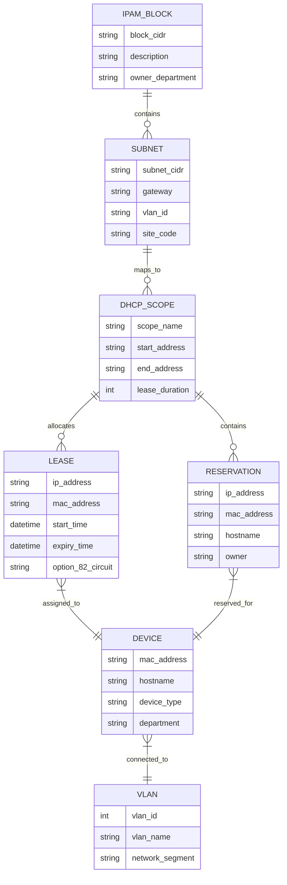
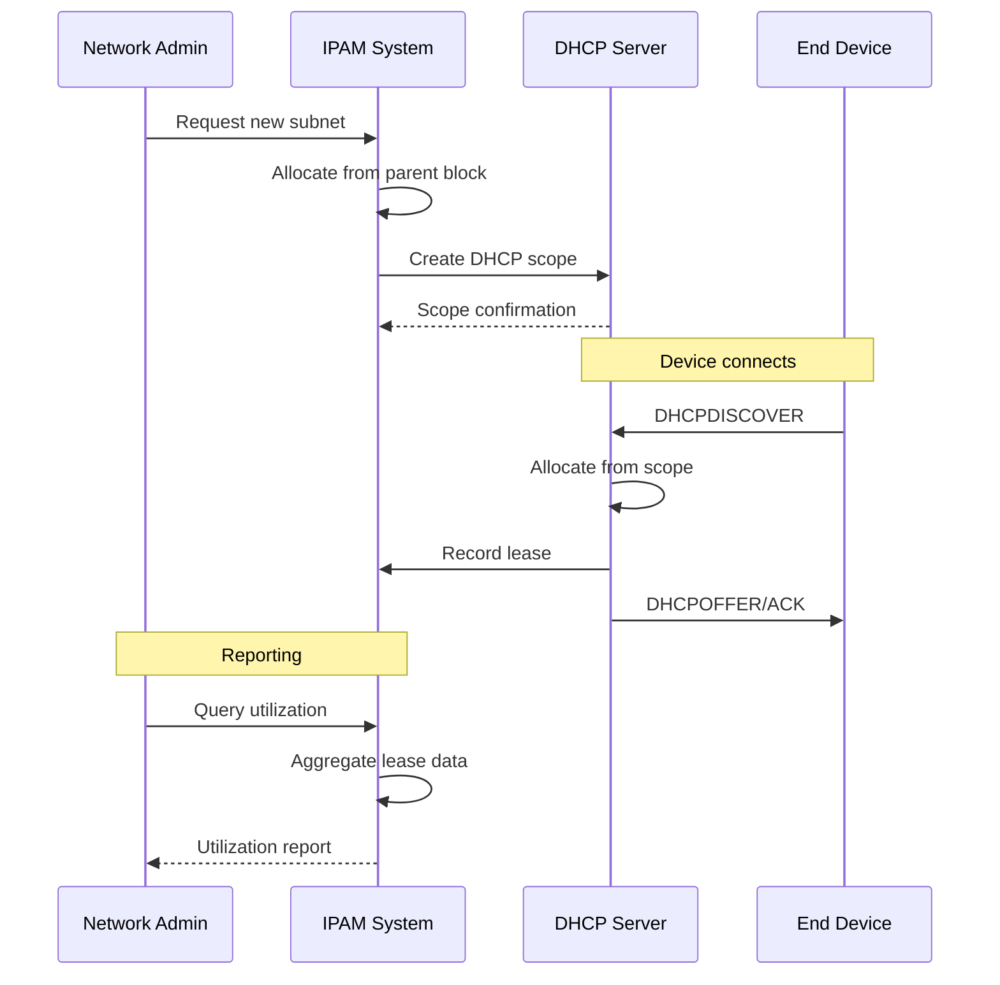
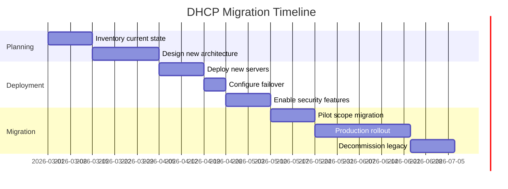

# DHCP Standards and Address Management

## Overview

This document establishes the Dynamic Host Configuration Protocol (DHCP) standards for the City of New Orleans municipal network infrastructure. DHCP automates IP address assignment and network configuration distribution, reducing administrative overhead and configuration errors while enabling centralized management of network parameters.

The City operates DHCP services for IPv4 (DHCPv4) and IPv6 (DHCPv6) address allocation across all municipal facilities. These services integrate with IP Address Management (IPAM) systems to maintain accurate inventory of address utilization and provide audit trails for security and compliance requirements.

Properly architected DHCP infrastructure is essential for network reliability—misconfigured or failed DHCP services prevent devices from obtaining network connectivity. These standards ensure high availability through redundant server deployments, scope planning aligned with network segmentation policies, and security controls to prevent unauthorized DHCP servers and address exhaustion attacks.

## Standards References

| Standard | Title | Ratification Date | Scope |
|----------|-------|-------------------|-------|
| RFC 2131 | Dynamic Host Configuration Protocol | March 1997 | Core DHCPv4 operations |
| RFC 2132 | DHCP Options and BOOTP Vendor Extensions | March 1997 | Standard DHCP options |
| RFC 3315 | Dynamic Host Configuration Protocol for IPv6 | July 2003 | DHCPv6 specification (obsoleted by RFC 8415) |
| RFC 3736 | Stateless DHCP Service for IPv6 | April 2004 | DHCPv6 information-only mode |
| RFC 4361 | Node-specific Client Identifiers for DHCPv4 | February 2006 | DUID-based client identification |
| RFC 6221 | Lightweight DHCPv6 Relay Agent | May 2011 | DHCPv6 relay operations |
| RFC 8415 | Dynamic Host Configuration Protocol for IPv6 | November 2018 | Consolidated DHCPv6 specification |
| RFC 3046 | DHCP Relay Agent Information Option | January 2001 | Option 82 for relay identification |
| RFC 7513 | Source Address Validation Improvement (SAVI) | May 2015 | DHCP snooping and validation |
| IEEE 802.1X | Port-Based Network Access Control | 2020 | Integration with network authentication |

## DHCP Architecture

### High-Availability Design

### Failover Configuration

**MCLT (Maximum Client Lead Time)**: 3600 seconds (1 hour)
- Time a server can extend a lease beyond partner's knowledge
- Prevents duplicate assignments during partner communication loss

## DHCP Server Specifications

### Server Requirements

| Specification | Requirement | Rationale |
|---------------|-------------|-----------|
| **Minimum Instances** | 2 in failover configuration | Eliminate single point of failure |
| **Geographic Separation** | Different facilities/failure domains | Survive site-level outages |
| **Failover Protocol** | DHCP Failover (RFC draft) or vendor equivalent | Coordinated address allocation |
| **MCLT Setting** | 3600 seconds | Balance availability and conflict risk |
| **Lease Database** | Persistent storage with replication | Survive restarts, sync state |
| **IPAM Integration** | Real-time synchronization | Accurate address inventory |
| **Response Time** | < 100ms DORA completion | Client timeout prevention |
| **Capacity** | 500 DORA transactions/second minimum | Handle boot storms |

### Scope Configuration Standards

| Parameter | Corporate (VLAN 10) | Guest (VLAN 20) | IoT (VLAN 30) |
|-----------|---------------------|-----------------|---------------|
| **Lease Duration** | 8 hours | 4 hours | 24 hours |
| **Renewal (T1)** | 4 hours (50%) | 2 hours (50%) | 12 hours (50%) |
| **Rebind (T2)** | 7 hours (87.5%) | 3.5 hours (87.5%) | 21 hours (87.5%) |
| **Pool Utilization Alert** | 80% | 70% | 85% |
| **Reservation Support** | Required | Not allowed | Required |
| **Option 82 Logging** | Required | Required | Required |

## DHCP Options Standards

### Required Options by Network Type

| Option | Name | Corporate | Guest | IoT | Server |
|--------|------|-----------|-------|-----|--------|
| 1 | Subnet Mask | Yes | Yes | Yes | Yes |
| 3 | Default Gateway | Yes | Yes | Yes | Yes |
| 6 | DNS Servers | Internal | Public | Internal | Internal |
| 15 | Domain Name | corp.nola.gov | guest.nola.gov | iot.nola.gov | corp.nola.gov |
| 42 | NTP Servers | Yes | Yes | Yes | Yes |
| 44 | NetBIOS Name Server | Yes | No | No | Yes |
| 51 | Lease Time | 8h | 4h | 24h | 168h |
| 66 | TFTP Server | No | No | If needed | If needed |
| 67 | Bootfile Name | No | No | If needed | If needed |
| 119 | Domain Search List | Yes | No | No | Yes |
| 121 | Classless Static Routes | If needed | No | If needed | If needed |

### Option 82 (Relay Agent Information)

**Option 82 Usage**:
- **Circuit ID**: Identifies physical switch port for audit trail
- **Remote ID**: Identifies relay device for scope selection
- **Policy Enforcement**: Restrict certain pools to specific switch ports
- **Security Logging**: Track which port received each lease

## DHCPv6 Standards

### DHCPv6 vs SLAAC Decision Matrix

| Factor | Use DHCPv6 | Use SLAAC |
|--------|------------|-----------|
| Address control/auditing required | Yes | No |
| DNS server assignment | Yes (stateful or stateless) | Via RDNSS option |
| Domain search list | Yes | Via DNSSL option |
| PXE boot support | Yes | No |
| Address stability requirements | Yes | Varies by OS |
| IoT/embedded devices | Evaluate compatibility | Often preferred |
| Windows environments | Recommended | Supported |

### DHCPv6 Architecture

### DHCPv6 Options

| Option | Name | Required | Purpose |
|--------|------|----------|---------|
| 23 | DNS Recursive Name Server | Yes | DNS server addresses |
| 24 | Domain Search List | Yes | DNS search domains |
| 31 | SNTP Server List | Yes | Time synchronization |
| 32 | Information Refresh Time | Yes | Stateless refresh interval |

## DHCP Security

### Security Architecture

### DHCP Snooping Configuration

| Setting | Value | Purpose |
|---------|-------|---------|
| **Trusted Ports** | Uplinks to DHCP servers only | Prevent rogue server responses |
| **Untrusted Ports** | All access ports | Client-facing interfaces |
| **Rate Limit** | 15 packets/second | Prevent starvation attacks |
| **Verify MAC** | Enabled | Match Option 82 to source MAC |
| **Binding Database** | Enabled with persistence | Support IP source guard |
| **Option 82 Insertion** | Enabled | Audit trail |

### NIST SP 800-53 Control Mapping

| Control ID | Control Name | DHCP Implementation |
|------------|--------------|---------------------|
| **CM-7** | Least Functionality | Disable unnecessary DHCP options |
| **SC-7** | Boundary Protection | DHCP snooping on all access ports |
| **SI-4** | Information System Monitoring | Pool utilization and anomaly alerts |
| **AU-2** | Audit Events | Option 82 logging, lease events |
| **AU-3** | Content of Audit Records | MAC, IP, timestamp, port, switch |
| **CP-10** | Information System Recovery | Failover with persistent lease database |
| **IA-3** | Device Identification and Authentication | MAC-based reservations, 802.1X integration |
| **AC-6** | Least Privilege | Authorized DHCP servers only (snooping) |

### Threat Mitigation

| Threat | Mitigation | Control |
|--------|------------|---------|
| Rogue DHCP Server | DHCP snooping trusted ports | Layer 2 switch |
| DHCP Starvation | Rate limiting per port | Layer 2 switch |
| IP Spoofing | IP Source Guard | Layer 2 switch |
| ARP Spoofing | Dynamic ARP Inspection | Layer 2 switch |
| Lease Tracking | Option 82 logging | DHCP server |
| Unauthorized Device | 802.1X + MAC-based assignment | NAC integration |

## IPAM Integration

### Data Model

### Address Allocation Workflow

## Industry Adoption Data

| Metric | Adoption Rate | Source | Year |
|--------|---------------|--------|------|
| DHCP failover deployment (enterprise) | 87% | EMA | 2024 |
| IPAM system usage (1000+ devices) | 78% | Gartner | 2024 |
| DHCP snooping enabled | 82% | Cisco Security | 2025 |
| DHCPv6 deployment (dual-stack networks) | 64% | APNIC | 2025 |
| Option 82 logging | 71% | SANS | 2024 |
| Municipal DHCP redundancy | 91% | MS-ISAC | 2024 |

## Cost-Performance Analysis

### 15-Year Total Cost of Ownership

| Cost Category | Windows DHCP | ISC DHCP | Enterprise IPAM |
|---------------|--------------|----------|-----------------|
| **Server Infrastructure** | $120,000 | $80,000 | $200,000 |
| **Software/Licensing** | $180,000 | $0 | $450,000 |
| **Annual Operations** | $300,000 | $450,000 | $225,000 |
| **Training** | $30,000 | $60,000 | $75,000 |
| **Integration** | $45,000 | $90,000 | Included |
| **15-Year Total** | $675,000 | $680,000 | $950,000 |

**Recommendation**: Enterprise IPAM provides superior automation, audit capability, and integration despite higher initial cost. Operational savings and compliance benefits justify investment for municipal scale.

### Capacity Planning

| Network Size | Leases | Recommended Servers | Failover Config |
|--------------|--------|---------------------|-----------------|
| Small (< 1,000 devices) | 1,500 | 2 (active/standby) | Hot standby |
| Medium (1,000-10,000) | 15,000 | 2 (load balanced) | Split scope 50/50 |
| Large (10,000-50,000) | 75,000 | 4 (2 pairs) | Regional failover |
| Enterprise (50,000+) | 200,000+ | 6+ (distributed) | Hierarchical |

## Implementation Guidelines

### Deployment Checklist

- [ ] **Infrastructure Setup**
  - [ ] Deploy primary DHCP server
  - [ ] Deploy secondary DHCP server (different facility)
  - [ ] Configure failover partnership
  - [ ] Verify MCLT and load balance settings
  - [ ] Test failover scenarios

- [ ] **Scope Configuration**
  - [ ] Create scopes aligned with VLAN structure
  - [ ] Configure appropriate lease durations
  - [ ] Set exclusion ranges for static assignments
  - [ ] Define DHCP options per scope
  - [ ] Configure reservations for infrastructure devices

- [ ] **Security Implementation**
  - [ ] Enable DHCP snooping on all access switches
  - [ ] Configure trusted uplink ports only
  - [ ] Enable IP Source Guard
  - [ ] Enable Dynamic ARP Inspection
  - [ ] Set rate limits on untrusted ports
  - [ ] Enable Option 82 insertion and logging

- [ ] **IPAM Integration**
  - [ ] Connect DHCP servers to IPAM system
  - [ ] Configure real-time lease synchronization
  - [ ] Set up utilization alerting
  - [ ] Verify audit trail completeness
  - [ ] Test reservation workflow

- [ ] **Monitoring**
  - [ ] Configure scope utilization alerts (80% threshold)
  - [ ] Set up failover state monitoring
  - [ ] Enable rogue server detection
  - [ ] Create lease activity dashboard
  - [ ] Document escalation procedures

### Scope Naming Convention

| Format | Example | Description |
|--------|---------|-------------|
| `[Site]-[VLAN]-[Type]` | `CBD-V100-Corp` | Central Business District, VLAN 100, Corporate |
| `[Site]-[VLAN]-[Type]` | `ALGR-V200-Guest` | Algiers, VLAN 200, Guest |
| `[Site]-[VLAN]-[Type]` | `LGD-V300-IoT` | Lower Garden District, VLAN 300, IoT |

### Migration Considerations

## Procurement Pass/Fail Checklist

Use this checklist to evaluate any DHCP server or IPAM platform before purchase. Every **Required** item must pass. If any Required item fails, the platform is **not approved** for procurement.

### DHCP/IPAM Platform Procurement Checklist

| # | Requirement | Required | Pass | Fail |
|---|-------------|----------|------|------|
| 1 | DHCPv4 and DHCPv6 dual-stack support | **Yes** | ☐ | ☐ |
| 2 | DHCP failover with lease replication | **Yes** | ☐ | ☐ |
| 3 | Option 82 (Relay Agent Information) logging | **Yes** | ☐ | ☐ |
| 4 | IPAM integration (unified IP address management) | **Yes** | ☐ | ☐ |
| 5 | Pool utilization alerting (configurable thresholds) | **Yes** | ☐ | ☐ |
| 6 | DHCP snooping integration support | **Yes** | ☐ | ☐ |
| 7 | Minimum 500 DORA transactions per second | **Yes** | ☐ | ☐ |
| 8 | IP conflict detection and audit logging | **Yes** | ☐ | ☐ |

### Results

| Outcome | Action |
|---------|--------|
| All Required items pass | **Approved for procurement** |
| Any Required item fails | **Not approved — do not purchase** |
| Questions about a specific device | Contact Network Engineering (ITI Networking Team) |

### How to Verify Requirements

| Checklist Item | Where to Find |
|----------------|---------------|
| DHCPv4 + DHCPv6 | Product datasheet, protocol support documentation |
| Failover with lease replication | High availability documentation, failover configuration guide |
| Option 82 logging | DHCP feature list, relay agent documentation |
| IPAM integration | IPAM product documentation, integration APIs |
| Pool utilization alerting | Monitoring/alerting feature list, threshold configuration |
| DHCP snooping integration | Network integration documentation, switch compatibility |
| 500 DORA/sec | Performance benchmarks, vendor sizing guide |
| Conflict detection + audit | Audit logging documentation, conflict detection features |

## References

1. Internet Engineering Task Force, "Dynamic Host Configuration Protocol," RFC 2131, March 1997. https://www.rfc-editor.org/rfc/rfc2131

2. Internet Engineering Task Force, "DHCP Options and BOOTP Vendor Extensions," RFC 2132, March 1997. https://www.rfc-editor.org/rfc/rfc2132

3. Internet Engineering Task Force, "Dynamic Host Configuration Protocol for IPv6 (DHCPv6)," RFC 8415, November 2018. https://www.rfc-editor.org/rfc/rfc8415

4. Internet Engineering Task Force, "DHCP Relay Agent Information Option," RFC 3046, January 2001. https://www.rfc-editor.org/rfc/rfc3046

5. Internet Engineering Task Force, "Node-specific Client Identifiers for Dynamic Host Configuration Protocol Version Four (DHCPv4)," RFC 4361, February 2006. https://www.rfc-editor.org/rfc/rfc4361

6. Internet Engineering Task Force, "Lightweight DHCPv6 Relay Agent," RFC 6221, May 2011. https://www.rfc-editor.org/rfc/rfc6221

7. Internet Engineering Task Force, "Source Address Validation Improvement (SAVI) for Mixed Address Assignment Methods Scenario," RFC 7513, May 2015. https://www.rfc-editor.org/rfc/rfc7513

8. IEEE, "IEEE Standard for Local and Metropolitan Area Networks--Port-Based Network Access Control," IEEE 802.1X-2020, 2020.

9. National Institute of Standards and Technology, "Security and Privacy Controls for Information Systems and Organizations," NIST SP 800-53 Rev. 5, September 2020. https://csrc.nist.gov/publications/detail/sp/800-53/rev-5/final

10. National Institute of Standards and Technology, "Guide to Enterprise Patch Management Technologies," NIST SP 800-40 Rev. 3, July 2013.

## Cross-References

| Document | Relationship |
|----------|--------------|
| [IP Addressing Standards](../layer3/ip-addressing.md) | Subnet and scope allocation from IPAM |
| [DNS Standards](dns-standards.md) | DHCP option 6 delivering DNS server addresses |
| [Network Segmentation](../security/network-segmentation.md) | Per-VLAN DHCP scope definitions |
| [Port Configurations](../ethernet/port-configurations.md) | DHCP snooping and relay per VLAN |
| [802.1X Implementation](../security/802.1x-implementation.md) | RADIUS-assigned VLAN triggering DHCP scope selection |

---

*For questions regarding DHCP standards, contact the ITI Networking Team.*
