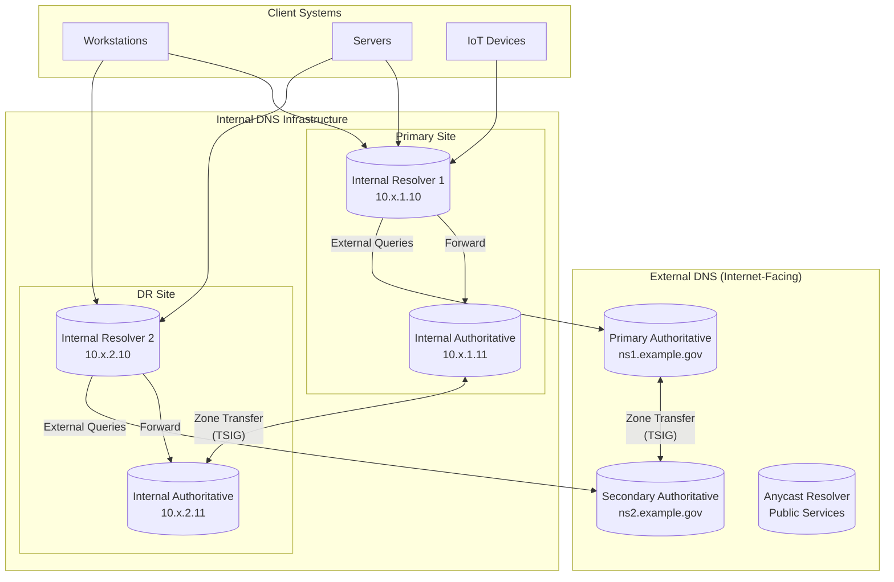
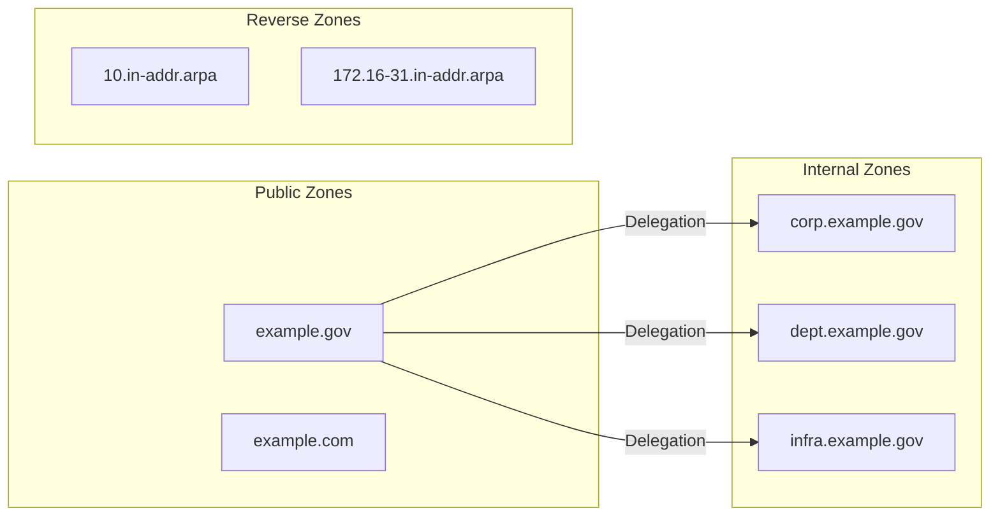
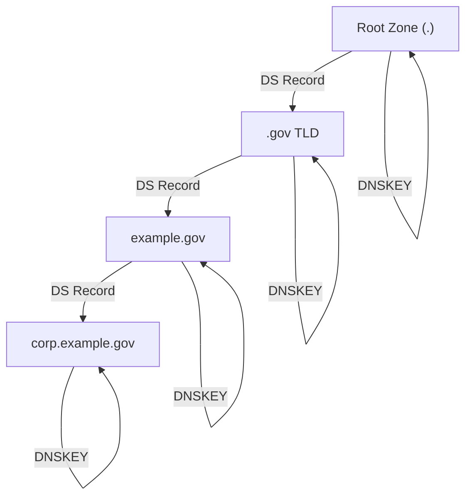
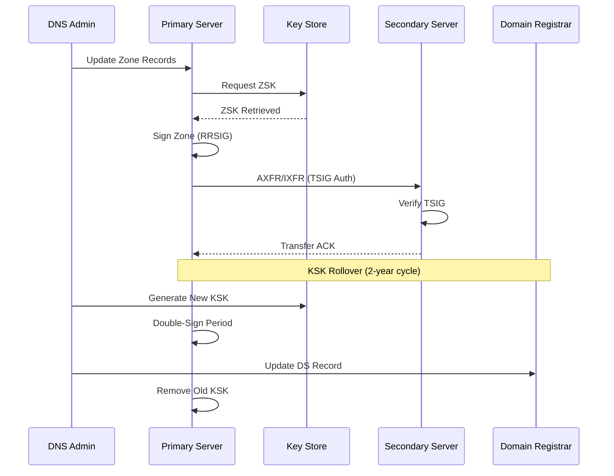
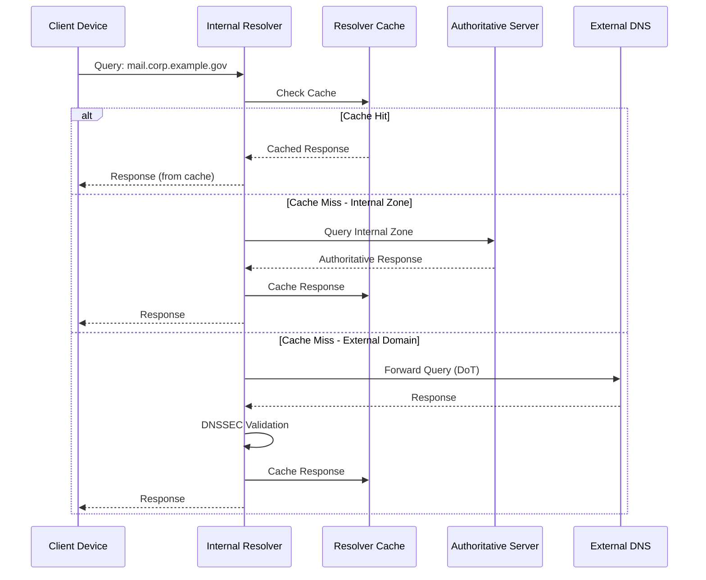
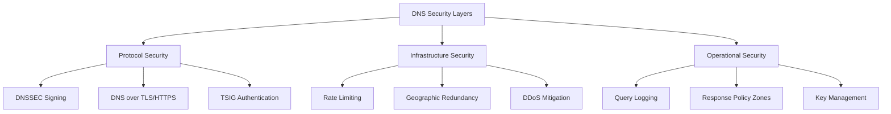

# DNS Standards and Architecture

## Overview

This document establishes the Domain Name System (DNS) standards for municipal network infrastructure. DNS provides the foundational name resolution service that enables users and applications to locate network resources using human-readable domain names rather than numerical IP addresses.

Authoritative DNS servers are maintained for municipal domains, and recursive resolvers are operated for internal name resolution. All DNS infrastructure follows IETF standards with security extensions (DNSSEC) to protect against cache poisoning and spoofing attacks. These standards ensure reliable, secure, and performant name resolution across all departments and facilities.

DNS architecture directly impacts network availability—a DNS outage effectively renders network services inaccessible even when underlying connectivity remains functional. The standards herein prioritize redundancy, security validation, and response time to maintain continuous service delivery for critical municipal operations.

## Standards References

| Standard | Title | Ratification Date | Scope |
|----------|-------|-------------------|-------|
| RFC 1035 | Domain Names - Implementation and Specification | November 1987 | Core DNS protocol operations |
| RFC 2181 | Clarifications to the DNS Specification | July 1997 | Protocol clarifications and updates |
| RFC 4034 | Resource Records for DNS Security Extensions | March 2005 | DNSSEC record types (DNSKEY, RRSIG, DS, NSEC) |
| RFC 4035 | Protocol Modifications for DNS Security Extensions | March 2005 | DNSSEC validation and signing procedures |
| RFC 5155 | DNS Security (DNSSEC) Hashed Authenticated Denial of Existence | March 2008 | NSEC3 for zone enumeration prevention |
| RFC 6891 | Extension Mechanisms for DNS (EDNS(0)) | April 2013 | Extended DNS for larger responses |
| RFC 7858 | Specification for DNS over TLS | May 2016 | Encrypted DNS transport |
| RFC 8484 | DNS Queries over HTTPS (DoH) | October 2018 | HTTPS-based DNS resolution |
| RFC 8945 | Secret Key Transaction Authentication for DNS (TSIG) | November 2020 | Zone transfer authentication |
| NIST SP 800-81-2 | Secure Domain Name System Deployment Guide | September 2013 | Federal DNS security guidance (Rev. 3 draft April 2025 — update when final) |

## DNS Architecture

### Hierarchical DNS Design

### Zone Architecture

## DNS Server Specifications

### Authoritative Server Requirements

| Specification | Requirement | Rationale |
|---------------|-------------|-----------|
| **Minimum Instances** | 2 per zone (geographically separated) | RFC 2182 recommends 2+ authoritative servers |
| **Zone Signing** | DNSSEC with NSEC3 | Prevents cache poisoning per RFC 4035 |
| **Key Algorithm** | ECDSAP256SHA256 (Algorithm 13) | Current NIST recommendation, smaller signatures |
| **ZSK Rollover** | 90 days | Balance security and operational overhead |
| **KSK Rollover** | 2 years | Align with DS record TTL at registrar |
| **Zone Transfer** | TSIG-authenticated (HMAC-SHA256) | Prevent unauthorized zone transfers |
| **Response Time** | < 50ms (local), < 150ms (remote) | User experience threshold |
| **Query Capacity** | 10,000 QPS minimum | Handle peak municipal traffic |

### Recursive Resolver Requirements

| Specification | Requirement | Rationale |
|---------------|-------------|-----------|
| **DNSSEC Validation** | Mandatory | Verify signature chain to root |
| **Negative Caching** | RFC 2308 compliant | Reduce load from NXDOMAIN queries |
| **EDNS0 Buffer Size** | 1232 bytes minimum | Accommodate DNSSEC responses |
| **Rate Limiting** | 100 QPS per source IP | Mitigate DNS amplification |
| **Response Policy Zones** | Supported | Enable threat intelligence integration |
| **Query Logging** | Enabled with 90-day retention | Security incident investigation |
| **Upstream Transport** | DNS over TLS (RFC 7858) | Encrypt external queries |

## DNSSEC Implementation

### Trust Chain Architecture

### Key Management Standards

| Key Type | Algorithm | Size | Rollover Period | Storage |
|----------|-----------|------|-----------------|---------|
| **Key Signing Key (KSK)** | ECDSAP256SHA256 | 256-bit | 2 years | HSM or offline |
| **Zone Signing Key (ZSK)** | ECDSAP256SHA256 | 256-bit | 90 days | Automated rotation |
| **TSIG Key** | HMAC-SHA256 | 256-bit | 1 year | Secure key store |

### DNSSEC Signing Workflow

## DNS Query Flow

### Resolution Process

## Industry Adoption Data

| Metric | Adoption Rate | Source | Year |
|--------|---------------|--------|------|
| DNSSEC-signed .gov domains | 92% | GSA | 2025 |
| Government DNS over TLS deployment | 78% | CISA | 2025 |
| Enterprise DNSSEC validation | 71% | ISC | 2024 |
| Anycast DNS adoption (large networks) | 89% | DNS-OARC | 2024 |
| EDNS0 compliance | 99%+ | APNIC | 2025 |
| Municipal DNS redundancy (2+ servers) | 94% | MS-ISAC | 2024 |

## Cost-Performance Analysis

### 15-Year Total Cost of Ownership

| Cost Category | Self-Hosted | Managed Service | Hybrid Model |
|---------------|-------------|-----------------|--------------|
| **Infrastructure** | $180,000 | $0 | $90,000 |
| **Software/Licensing** | $45,000 | Included | $22,500 |
| **Annual Operations** | $525,000 | $750,000 | $450,000 |
| **Training/Certification** | $60,000 | $15,000 | $45,000 |
| **Security Tools** | $90,000 | Included | $45,000 |
| **Disaster Recovery** | $120,000 | Included | $60,000 |
| **15-Year Total** | $1,020,000 | $765,000 | $712,500 |

**Recommended Model**: Hybrid—internal authoritative servers with managed recursive resolution for external queries provides optimal control over municipal data while leveraging provider scale for external resolution.

### Performance Benchmarks

| Metric | Target | Municipal Baseline | Enterprise Best Practice |
|--------|--------|-------------------|-------------------------|
| Internal query latency | < 10ms | 15ms | 5ms |
| External query latency | < 100ms | 150ms | 50ms |
| Availability | 99.99% | 99.9% | 99.999% |
| DNSSEC validation rate | 100% | 85% | 100% |
| Cache hit ratio | > 80% | 65% | 90% |

## Security Considerations

### NIST SP 800-53 Control Mapping

| Control ID | Control Name | DNS Implementation |
|------------|--------------|-------------------|
| **SC-20** | Secure Name/Address Resolution Service (Authoritative Source) | DNSSEC signing on all authoritative zones |
| **SC-21** | Secure Name/Address Resolution Service (Recursive or Caching Resolver) | DNSSEC validation enabled on all resolvers |
| **SC-22** | Architecture and Provisioning for Name/Address Resolution Service | Redundant servers, geographic separation |
| **SC-8** | Transmission Confidentiality and Integrity | DNS over TLS for external queries |
| **AU-2** | Audit Events | Query logging with 90-day retention |
| **AU-6** | Audit Review, Analysis, and Reporting | DNS analytics for anomaly detection |
| **SI-4** | Information System Monitoring | Response Policy Zones for threat blocking |
| **CP-9** | Information System Backup | Zone file backup with TSIG-authenticated transfers |

### DNS Security Best Practices

### Threat Mitigation Matrix

| Threat | Mitigation | Standard Reference |
|--------|------------|-------------------|
| Cache Poisoning | DNSSEC validation | RFC 4035 |
| Zone Transfer Hijacking | TSIG authentication | RFC 8945 |
| DNS Amplification | Response rate limiting | BCP 38 |
| Query Eavesdropping | DNS over TLS | RFC 7858 |
| Zone Enumeration | NSEC3 records | RFC 5155 |
| Rogue DNS Server | DHCP option 6 control | Network segmentation |

## Implementation Guidelines

### Deployment Checklist

- [ ] **Infrastructure Provisioning**
  - [ ] Deploy minimum 2 authoritative servers per zone
  - [ ] Deploy minimum 2 recursive resolvers per site
  - [ ] Implement geographic separation for redundancy
  - [ ] Configure anycast addressing for public resolvers

- [ ] **DNSSEC Configuration**
  - [ ] Generate KSK and ZSK key pairs
  - [ ] Sign all authoritative zones
  - [ ] Submit DS records to parent zone
  - [ ] Enable DNSSEC validation on resolvers
  - [ ] Configure automated ZSK rollover

- [ ] **Security Hardening**
  - [ ] Enable DNS over TLS for upstream queries
  - [ ] Configure TSIG for zone transfers
  - [ ] Implement query rate limiting
  - [ ] Deploy Response Policy Zones
  - [ ] Enable comprehensive query logging

- [ ] **Monitoring and Operations**
  - [ ] Configure DNS health monitoring
  - [ ] Set up DNSSEC expiration alerts
  - [ ] Implement query analytics dashboard
  - [ ] Document runbooks for common issues
  - [ ] Schedule regular security assessments

### Zone Naming Standards

| Zone Type | Naming Convention | Example |
|-----------|-------------------|---------|
| Public authoritative | [domain].gov | example.gov |
| Internal services | corp.[domain].gov | corp.example.gov |
| Department-specific | [dept].dept.[domain].gov | police.dept.example.gov |
| Infrastructure | infra.[domain].gov | infra.example.gov |
| Reverse (IPv4) | [octet].in-addr.arpa | 10.in-addr.arpa |
| Reverse (IPv6) | [nibble].ip6.arpa | 8.b.d.0.1.0.0.2.ip6.arpa |

### TTL Standards

| Record Type | TTL Value | Rationale |
|-------------|-----------|-----------|
| SOA Minimum | 3600 (1 hour) | Negative caching duration |
| NS Records | 86400 (24 hours) | Delegation stability |
| A/AAAA Records | 3600 (1 hour) | Balance freshness and load |
| MX Records | 3600 (1 hour) | Email routing stability |
| CNAME Records | 3600 (1 hour) | Alias resolution |
| TXT Records | 3600 (1 hour) | SPF/DKIM updates |
| SRV Records | 3600 (1 hour) | Service discovery |

## Procurement Pass/Fail Checklist

Use this checklist to evaluate any DNS server or service before purchase. Every **Required** item must pass. If any Required item fails, the server/service is **not approved** for procurement.

### DNS Server/Service Procurement Checklist

| # | Requirement | Required | Pass | Fail |
|---|-------------|----------|------|------|
| 1 | DNSSEC signing with NSEC3 support | **Yes** | ☐ | ☐ |
| 2 | DNSSEC validation on recursive resolvers | **Yes** | ☐ | ☐ |
| 3 | DNS over TLS (DoT) support (RFC 7858) | **Yes** | ☐ | ☐ |
| 4 | TSIG with HMAC-SHA256 for zone transfers | **Yes** | ☐ | ☐ |
| 5 | EDNS0 support with minimum 1232-byte UDP payload | **Yes** | ☐ | ☐ |
| 6 | Query logging with 90-day retention capability | **Yes** | ☐ | ☐ |
| 7 | Local query response time under 50ms | **Yes** | ☐ | ☐ |
| 8 | Minimum 2 server instances with geographic separation | **Yes** | ☐ | ☐ |

### Results

| Outcome | Action |
|---------|--------|
| All Required items pass | **Approved for procurement** |
| Any Required item fails | **Not approved — do not purchase** |
| Questions about a specific device | Contact Network Engineering (ITI Networking Team) |

### How to Verify Requirements

| Checklist Item | Where to Find |
|----------------|---------------|
| DNSSEC with NSEC3 | Product documentation, DNSSEC feature list |
| DNSSEC validation | Recursive resolver configuration guide |
| DNS over TLS | Protocol support documentation, RFC 7858 compliance |
| TSIG HMAC-SHA256 | Zone transfer security documentation |
| EDNS0 1232-byte | DNS server configuration, EDNS0 settings |
| Query logging 90-day | Logging configuration, storage/retention settings |
| <50ms response time | Performance benchmarks, vendor sizing guide |
| Geographic separation | Deployment architecture documentation, hosting options |

## References

1. Internet Engineering Task Force, "Domain Names - Implementation and Specification," RFC 1035, November 1987. https://www.rfc-editor.org/rfc/rfc1035

2. Internet Engineering Task Force, "Resource Records for the DNS Security Extensions," RFC 4034, March 2005. https://www.rfc-editor.org/rfc/rfc4034

3. Internet Engineering Task Force, "Protocol Modifications for the DNS Security Extensions," RFC 4035, March 2005. https://www.rfc-editor.org/rfc/rfc4035

4. Internet Engineering Task Force, "DNS Security (DNSSEC) Hashed Authenticated Denial of Existence," RFC 5155, March 2008. https://www.rfc-editor.org/rfc/rfc5155

5. Internet Engineering Task Force, "Extension Mechanisms for DNS (EDNS(0))," RFC 6891, April 2013. https://www.rfc-editor.org/rfc/rfc6891

6. Internet Engineering Task Force, "Specification for DNS over Transport Layer Security (TLS)," RFC 7858, May 2016. https://www.rfc-editor.org/rfc/rfc7858

7. Internet Engineering Task Force, "DNS Queries over HTTPS (DoH)," RFC 8484, October 2018. https://www.rfc-editor.org/rfc/rfc8484

8. Internet Engineering Task Force, "Secret Key Transaction Authentication for DNS (TSIG)," RFC 8945, November 2020. https://www.rfc-editor.org/rfc/rfc8945

9. National Institute of Standards and Technology, "Secure Domain Name System (DNS) Deployment Guide," NIST SP 800-81-2, September 2013. https://csrc.nist.gov/publications/detail/sp/800-81/2/final

10. National Institute of Standards and Technology, "Security and Privacy Controls for Information Systems and Organizations," NIST SP 800-53 Rev. 5, September 2020. https://csrc.nist.gov/publications/detail/sp/800-53/rev-5/final

## Cross-References

| Document | Relationship |
|----------|--------------|
| [DHCP Standards](dhcp-standards.md) | DHCP option 6 delivering DNS server addresses |
| [IP Addressing Standards](../layer3/ip-addressing.md) | Forward/reverse zone alignment with IP allocation |
| [NTP Standards](ntp-standards.md) | Accurate timestamps for DNSSEC signature validation |
| [Network Segmentation](../security/network-segmentation.md) | DNS server placement within security zones |

---

*For questions regarding DNS standards, contact the ITI Networking Team.*
