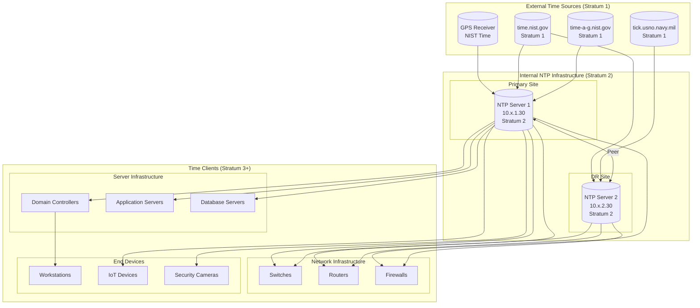
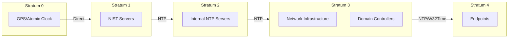
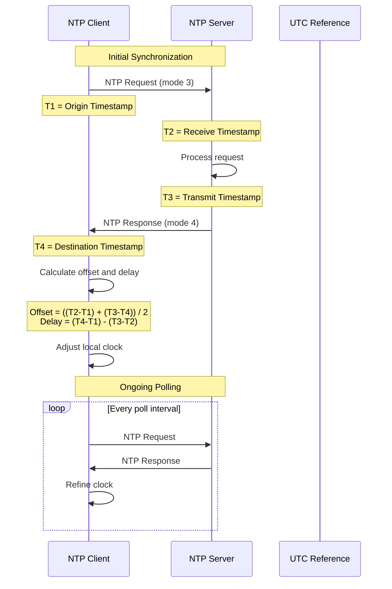
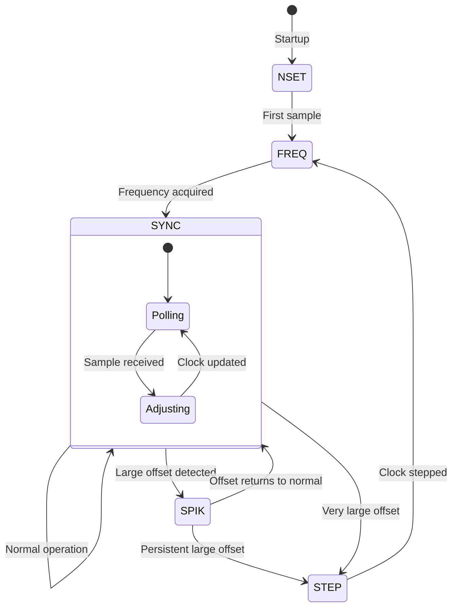
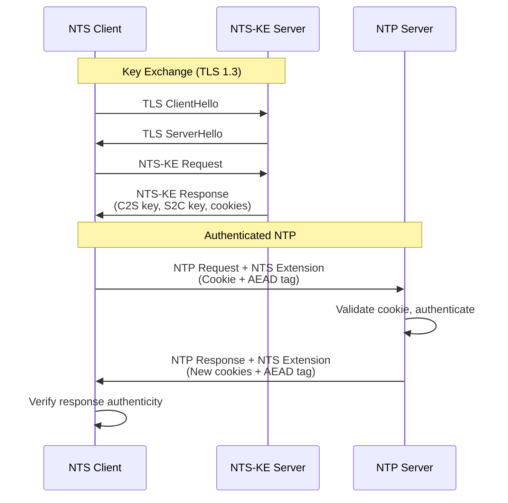
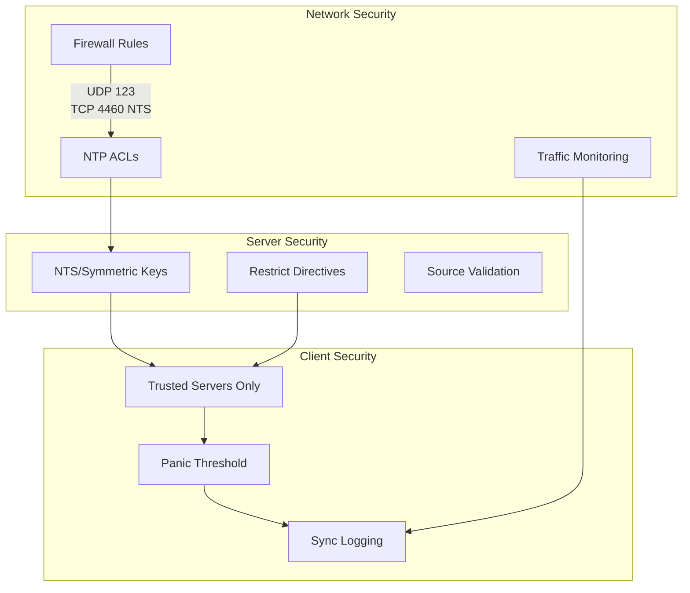
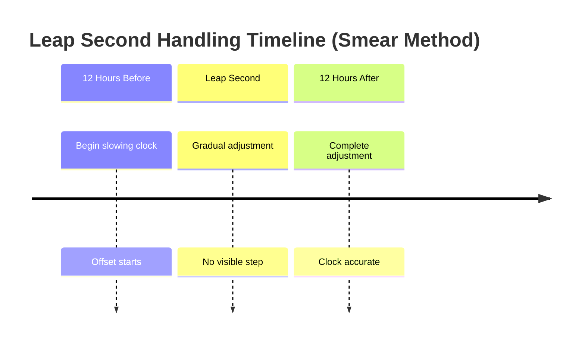

# NTP Standards and Time Synchronization

## Overview

This document establishes the Network Time Protocol (NTP) standards for municipal network infrastructure. Accurate time synchronization is a foundational service that supports security logging, authentication protocols, database transactions, and regulatory compliance across all municipal systems.

A hierarchical NTP infrastructure is operated with internal stratum 2 servers synchronized to trusted stratum 1 sources. All network devices, servers, and endpoints synchronize to internal NTP servers, ensuring consistent timestamps across the organization for forensic analysis, audit trails, and distributed system coordination.

Time accuracy requirements vary by system function—financial transactions and legal records require millisecond precision, while general office systems tolerate greater variance. These standards define appropriate synchronization hierarchies and accuracy targets for each use case while implementing security controls against time-based attacks.

## Standards References

| Standard | Title | Ratification Date | Scope |
|----------|-------|-------------------|-------|
| RFC 5905 | Network Time Protocol Version 4 | June 2010 | NTPv4 specification |
| RFC 8633 | Network Time Protocol Best Current Practices | July 2019 | NTP deployment guidance |
| RFC 7384 | Security Requirements of Time Protocols in Packet Switched Networks | October 2014 | Time protocol security |
| RFC 8915 | Network Time Security for the Network Time Protocol | September 2020 | NTS authentication |
| RFC 7822 | Network Time Protocol Version 4 (NTPv4) Extension Fields | March 2016 | NTPv4 extensions |
| RFC 5906 | Network Time Protocol Version 4: Autokey Specification | June 2010 | NTP authentication (deprecated) |
| ITU-T G.8272 | Timing Characteristics of Primary Reference Time Clocks | November 2018 | PRTC specifications |
| NIST SP 800-53 | Security and Privacy Controls | September 2020 | AU-8 Time Stamps control |
| CJIS Security Policy | Criminal Justice Information Services | 2024 | Law enforcement time requirements |

## NTP Architecture

### Hierarchical Time Distribution



### Stratum Hierarchy



## NTP Server Specifications

### Server Requirements

| Specification | Requirement | Rationale |
|---------------|-------------|-----------|
| **Minimum Instances** | 2 (geographically separated) | Eliminate single point of failure |
| **Stratum Level** | Stratum 2 | Sync to trusted stratum 1 sources |
| **Upstream Sources** | Minimum 4 stratum 1 servers | NTP selection algorithm requires multiple sources |
| **Accuracy Target** | < 10ms to UTC | Support security and compliance requirements |
| **Protocol Version** | NTPv4 (RFC 5905) | Current standard with security extensions |
| **Authentication** | NTS (RFC 8915) or symmetric key | Prevent time spoofing attacks |
| **Monitoring** | Offset, jitter, reach tracking | Early detection of synchronization issues |
| **Leap Second Handling** | Smear or step (documented) | Prevent application issues |

### Upstream Source Selection

| Source Category | Examples | Use Case |
|-----------------|----------|----------|
| **NIST Internet Time** | time.nist.gov, time-a-g.nist.gov | Primary government reference |
| **USNO** | tick.usno.navy.mil, tock.usno.navy.mil | Secondary government reference |
| **GPS Receiver** | Local GPS disciplined clock | Highest accuracy, network-independent |
| **Regional Pool** | 0.us.pool.ntp.org | Backup diverse sources |

**Recommended Configuration**: 4 upstream sources minimum
- 2 NIST servers (diverse geographic locations)
- 1 USNO server
- 1 GPS receiver or regional pool server

### Client Configuration by Device Type

| Device Category | Polling Interval | Accuracy Requirement | Source |
|-----------------|------------------|---------------------|--------|
| **Domain Controllers** | 64-1024 seconds | < 1 second | Internal NTP servers |
| **Network Infrastructure** | 64-1024 seconds | < 1 second | Internal NTP servers |
| **Servers (Critical)** | 64-1024 seconds | < 100ms | Internal NTP servers |
| **Servers (Standard)** | 256-2048 seconds | < 1 second | Internal NTP servers |
| **Workstations** | Windows default | < 2 seconds | Domain Controllers |
| **IoT/Embedded** | 1024-4096 seconds | < 5 seconds | Internal NTP servers |
| **Security Cameras** | 64-1024 seconds | < 1 second | Internal NTP servers |

## Time Synchronization Protocols

### NTPv4 vs Alternatives

| Protocol | Accuracy | Security | Use Case |
|----------|----------|----------|----------|
| **NTPv4** | < 1ms (LAN) | NTS available | Standard infrastructure |
| **PTP (IEEE 1588)** | < 1µs | MACsec | Financial, industrial |
| **SNTP** | < 100ms | None built-in | Simple embedded devices |
| **W32Time** | < 2s (default) | Kerberos | Windows domain members |

**Standard**: NTPv4 for all infrastructure; W32Time acceptable for domain-joined workstations via PDC emulator synchronization chain.

### NTP Operation



### Clock Discipline Algorithm



## Security Considerations

### NTS (Network Time Security)



### NIST SP 800-53 Control Mapping

| Control ID | Control Name | NTP Implementation |
|------------|--------------|-------------------|
| **AU-8** | Time Stamps | All systems sync to authoritative source |
| **AU-8(1)** | Synchronization with Authoritative Source | Internal NTP servers sync to NIST |
| **AU-8(2)** | Secondary Authoritative Source | Multiple upstream sources configured |
| **SC-45** | System Time Synchronization | NTPv4 with authentication |
| **SC-45(1)** | Synchronization with Authoritative Source | Stratum 1 sources documented |
| **SC-45(2)** | Secondary Authoritative Source | Geographic diversity of sources |

### Threat Mitigation

| Threat | Attack Vector | Mitigation | Control |
|--------|---------------|------------|---------|
| Time Spoofing | Man-in-the-middle | NTS authentication | Network/Server |
| Delay Attack | Packet manipulation | Multiple diverse sources | Architecture |
| DDoS on NTP | Amplification attack | Rate limiting, BCP 38 | Network |
| Rogue NTP Server | Unauthorized server | Firewall rules, NTS | Network/Policy |
| Clock Stepping | Large offset injection | Panic threshold (1000s) | Server config |
| Replay Attack | Packet capture/replay | NTS unique cookies | Protocol |

### Security Configuration



### Firewall Requirements

| Direction | Source | Destination | Port | Purpose |
|-----------|--------|-------------|------|---------|
| Outbound | NTP servers | Stratum 1 sources | UDP 123 | Upstream sync |
| Outbound | NTP servers | NTS-KE servers | TCP 4460 | NTS key exchange |
| Inbound | Internal networks | NTP servers | UDP 123 | Client queries |
| Deny | External | Internal NTP | UDP 123 | Block external queries |

## Industry Adoption Data

| Metric | Adoption Rate | Source | Year |
|--------|---------------|--------|------|
| NTPv4 deployment | 94% | ISC | 2025 |
| NTS adoption (enterprise) | 28% | IETF | 2025 |
| Authenticated NTP (any method) | 52% | SANS | 2024 |
| Multiple upstream sources (4+) | 67% | NTP Pool Project | 2024 |
| GPS-backed stratum 1 | 34% | Enterprise networks | 2024 |
| Windows domain time sync | 99% | Microsoft | 2024 |

## Cost-Performance Analysis

### 15-Year Total Cost of Ownership

| Cost Category | Software NTP | Appliance | GPS-Backed |
|---------------|--------------|-----------|------------|
| **Hardware** | $10,000 | $60,000 | $120,000 |
| **Software/Licensing** | $0 | $45,000 | $30,000 |
| **Installation** | $5,000 | $15,000 | $45,000 |
| **Annual Operations** | $75,000 | $45,000 | $60,000 |
| **Training** | $15,000 | $22,500 | $30,000 |
| **15-Year Total** | $105,000 | $187,500 | $315,000 |

**Recommendation**: Software-based NTP (ntpd/chrony) on dedicated VMs provides best cost-performance for municipal requirements. GPS-backed stratum 1 recommended only for facilities requiring sub-millisecond accuracy or network-independent time (911 centers, financial systems).

### Accuracy vs Cost Trade-off

| Accuracy Target | Solution | Approximate Cost | Use Case |
|-----------------|----------|------------------|----------|
| < 1µs | PTP with GPS grandmaster | $50,000+ | Financial trading |
| < 1ms | GPS-disciplined NTP server | $15,000-30,000 | Critical infrastructure |
| < 10ms | Software NTP, stratum 2 | $5,000-10,000 | Standard enterprise |
| < 100ms | SNTP or basic NTP | Minimal | IoT, non-critical |
| < 2s | Windows domain time | Included | Domain workstations |

## Implementation Guidelines

### Deployment Checklist

- [ ] **Server Deployment**
  - [ ] Deploy primary NTP server (stratum 2)
  - [ ] Deploy secondary NTP server (different site)
  - [ ] Configure peer relationship between servers
  - [ ] Configure minimum 4 upstream stratum 1 sources
  - [ ] Verify stratum level and accuracy

- [ ] **Security Configuration**
  - [ ] Enable NTS or symmetric key authentication
  - [ ] Configure restrict directives (limit query sources)
  - [ ] Set panic threshold (1000 seconds)
  - [ ] Configure firewall rules
  - [ ] Enable NTP logging

- [ ] **Client Configuration**
  - [ ] Configure network infrastructure (switches, routers, firewalls)
  - [ ] Configure server infrastructure
  - [ ] Configure domain controllers (PDC emulator as time source)
  - [ ] Verify workstation sync via domain
  - [ ] Configure IoT and embedded devices

- [ ] **Monitoring**
  - [ ] Set up offset monitoring (alert > 100ms)
  - [ ] Monitor upstream reachability
  - [ ] Track stratum level changes
  - [ ] Alert on authentication failures
  - [ ] Create time sync dashboard

- [ ] **Documentation**
  - [ ] Document server configurations
  - [ ] Document upstream sources and contacts
  - [ ] Create runbook for sync failures
  - [ ] Document leap second handling procedure

### Configuration Examples

#### NTP Server (Stratum 2) - ntp.conf

```
# Upstream Stratum 1 Sources
server time.nist.gov iburst prefer
server time-a-g.nist.gov iburst
server tick.usno.navy.mil iburst
server 0.us.pool.ntp.org iburst

# Peer with secondary NTP server
peer ntp2.corp.example.gov

# Security restrictions
restrict default kod limited nomodify nopeer noquery
restrict 127.0.0.1
restrict ::1
restrict 10.0.0.0 mask 255.0.0.0 nomodify nopeer  # Internal networks

# Drift file
driftfile /var/lib/ntp/ntp.drift

# Logging
logfile /var/log/ntp.log
statsdir /var/log/ntpstats/
statistics loopstats peerstats clockstats
filegen loopstats file loopstats type day enable
filegen peerstats file peerstats type day enable

# Leap seconds file
leapfile /usr/share/zoneinfo/leap-seconds.list
```

#### Network Device Configuration

```
! Configure NTP servers
ntp server 10.x.1.30 prefer
ntp server 10.x.2.30

! Enable NTP authentication
ntp authenticate
ntp authentication-key 1 md5 [key-string]
ntp trusted-key 1
ntp server 10.x.1.30 key 1

! Set timezone
clock timezone CST -6
clock summer-time CDT recurring

! Enable NTP logging
ntp logging
```

### Monitoring Thresholds

| Metric | Warning | Critical | Action |
|--------|---------|----------|--------|
| Offset from UTC | > 50ms | > 500ms | Investigate source |
| Jitter | > 10ms | > 100ms | Check network path |
| Reach (reachability) | < 377 | < 177 | Check connectivity |
| Stratum change | Any change | Stratum > 4 | Verify sources |
| Authentication failures | Any | Repeated | Security review |

### Leap Second Handling

| Method | Description | Recommended For |
|--------|-------------|-----------------|
| **Step** | Insert/delete second at midnight UTC | Legacy systems |
| **Smear** | Distribute over 24 hours | Modern applications, databases |
| **Ignore** | Let NTP correct naturally | Non-critical systems |

**Standard**: Leap second smearing for database and application servers; step correction acceptable for network infrastructure.



## Compliance Requirements

### CJIS Security Policy

Law enforcement systems accessing FBI CJIS data require:
- Time synchronization within 1 second of NIST
- Audit logs with accurate timestamps
- Documented time source chain

### PCI DSS

Payment card systems require:
- Synchronized time across all system components
- NTP or equivalent technology
- Documentation of time synchronization settings

### HIPAA

Healthcare systems require:
- Audit trails with accurate timestamps
- Consistent time across all systems
- Protection of time synchronization integrity

## Procurement Pass/Fail Checklist

Use this checklist to evaluate any NTP server or time synchronization service before purchase. Every **Required** item must pass. If any Required item fails, the server/service is **not approved** for procurement.

### NTP Server/Service Procurement Checklist

| # | Requirement | Required | Pass | Fail |
|---|-------------|----------|------|------|
| 1 | NTPv4 (RFC 5905) protocol support | **Yes** | ☐ | ☐ |
| 2 | NTS (Network Time Security, RFC 8915) authentication | **Yes** | ☐ | ☐ |
| 3 | Stratum 2 accuracy within 10ms of UTC | **Yes** | ☐ | ☐ |
| 4 | Minimum 4 upstream Stratum 1 source connections | **Yes** | ☐ | ☐ |
| 5 | Geographic separation of NTP server instances | **Yes** | ☐ | ☐ |
| 6 | Peer relationship support between NTP servers | **Yes** | ☐ | ☐ |
| 7 | Leap second handling (leap smearing or step) | **Yes** | ☐ | ☐ |

### Results

| Outcome | Action |
|---------|--------|
| All Required items pass | **Approved for procurement** |
| Any Required item fails | **Not approved — do not purchase** |
| Questions about a specific device | Contact Network Engineering (ITI Networking Team) |

### How to Verify Requirements

| Checklist Item | Where to Find |
|----------------|---------------|
| NTPv4 support | Product documentation, protocol version specification |
| NTS authentication | NTS feature documentation, RFC 8915 compliance |
| Stratum 2 accuracy | Timing accuracy specifications, monitoring capabilities |
| 4 upstream Stratum 1 | Configuration guide, upstream source management |
| Geographic separation | Deployment architecture, hosting locations |
| Peer relationships | NTP peering configuration, clustering documentation |
| Leap second handling | Time management documentation, leap second policy |

## References

1. Internet Engineering Task Force, "Network Time Protocol Version 4: Protocol and Algorithms Specification," RFC 5905, June 2010. https://www.rfc-editor.org/rfc/rfc5905

2. Internet Engineering Task Force, "Network Time Protocol Best Current Practices," RFC 8633, July 2019. https://www.rfc-editor.org/rfc/rfc8633

3. Internet Engineering Task Force, "Security Requirements of Time Protocols in Packet Switched Networks," RFC 7384, October 2014. https://www.rfc-editor.org/rfc/rfc7384

4. Internet Engineering Task Force, "Network Time Security for the Network Time Protocol," RFC 8915, September 2020. https://www.rfc-editor.org/rfc/rfc8915

5. Internet Engineering Task Force, "Network Time Protocol Version 4 (NTPv4) Extension Fields," RFC 7822, March 2016. https://www.rfc-editor.org/rfc/rfc7822

6. National Institute of Standards and Technology, "Security and Privacy Controls for Information Systems and Organizations," NIST SP 800-53 Rev. 5, September 2020. https://csrc.nist.gov/publications/detail/sp/800-53/rev-5/final

7. NIST, "NIST Internet Time Servers." https://www.nist.gov/pml/time-and-frequency-division/time-distribution/internet-time-service-its

8. Criminal Justice Information Services, "CJIS Security Policy," Version 5.9.2, 2024. https://www.fbi.gov/services/cjis/cjis-security-policy-resource-center

9. ITU-T, "Timing characteristics of primary reference time clocks," G.8272, November 2018.

10. IEEE, "IEEE Standard for a Precision Clock Synchronization Protocol for Networked Measurement and Control Systems," IEEE 1588-2019, 2019.

## Cross-References

| Document | Relationship |
|----------|--------------|
| [DNS Standards](dns-standards.md) | Accurate timestamps for DNSSEC signature validation |
| [802.1X Implementation](../security/802.1x-implementation.md) | Time-accurate logging for authentication events |
| [Network Segmentation](../security/network-segmentation.md) | NTP server placement within management zone |
| [Switch Specifications](../ethernet/switch-specifications.md) | NTP client configuration on managed switches |

---

*For questions regarding NTP standards, contact the ITI Networking Team.*
