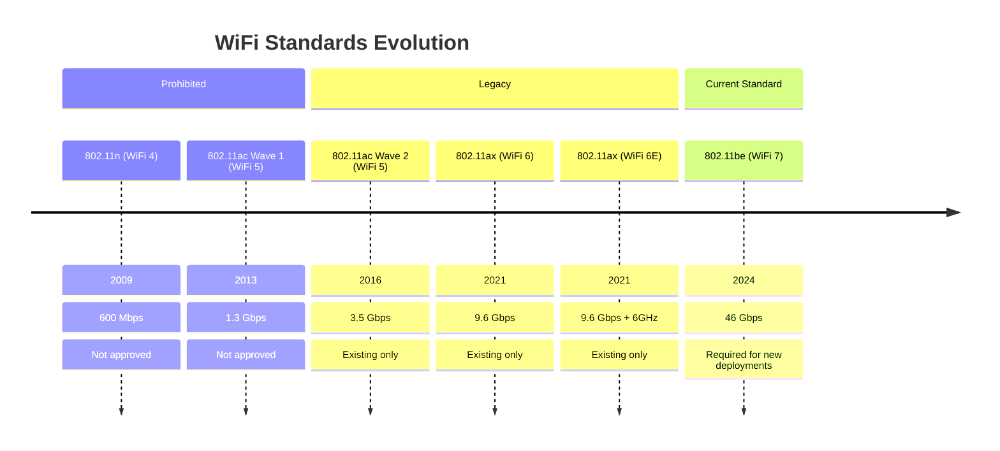
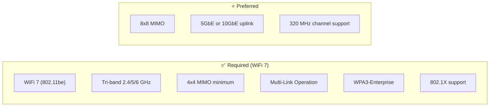
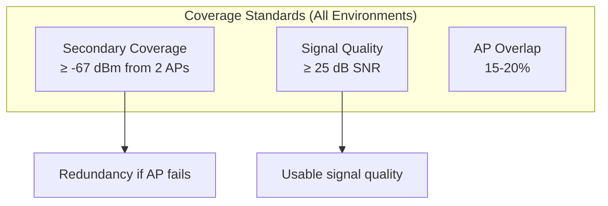
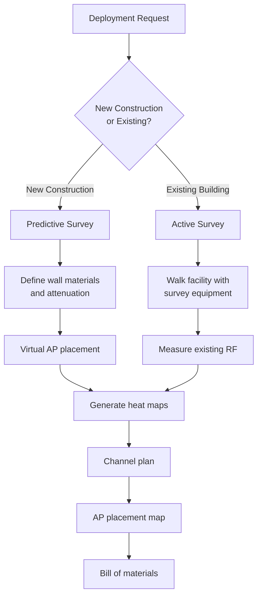
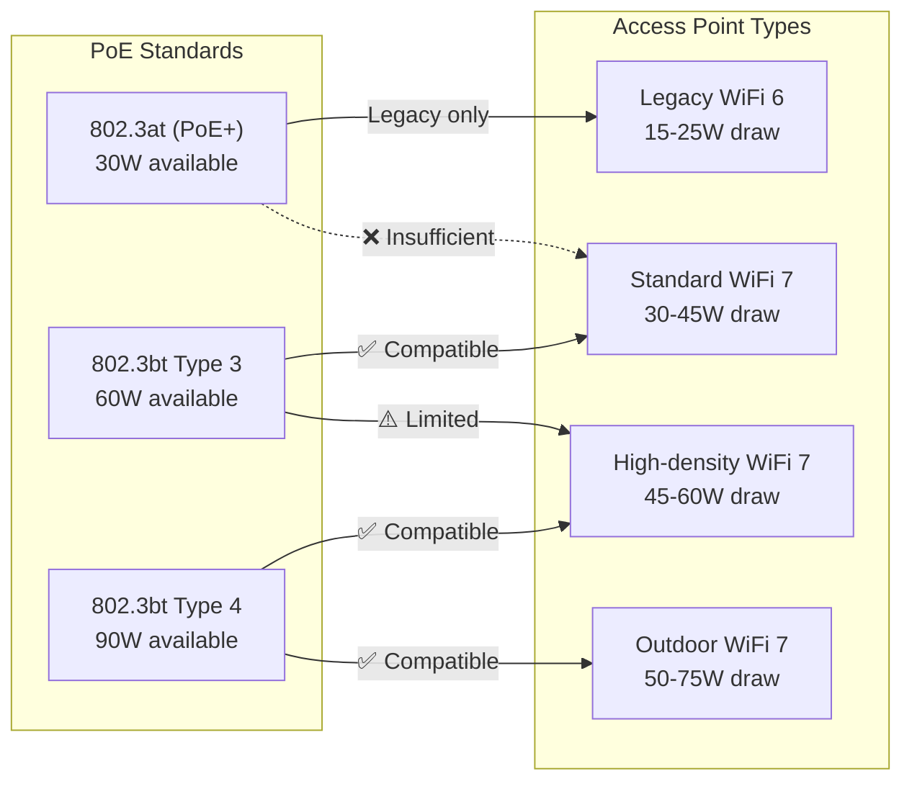
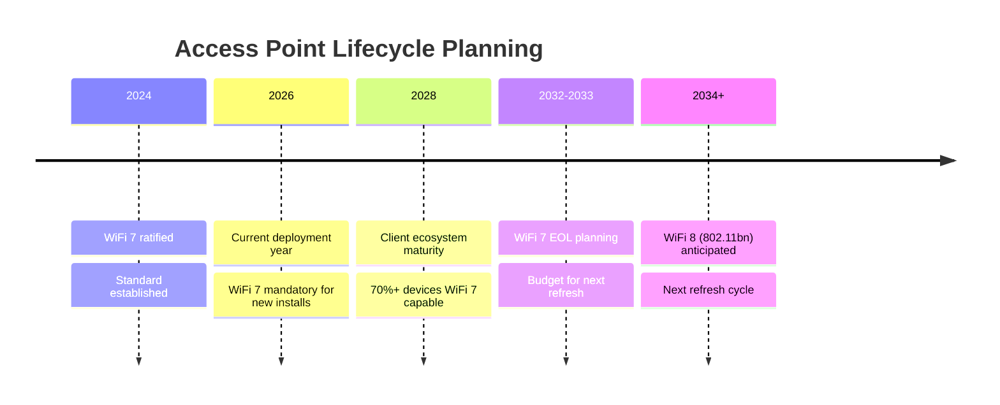

# Wireless Access Point Specifications

## Overview

This document defines the minimum specifications and placement guidelines for wireless access points deployed in municipal facilities. All requirements are based on IEEE 802.11 standards to ensure vendor neutrality, interoperability, and long-term supportability.

**Current Standard: WiFi 7 (IEEE 802.11be)** — Mandatory for all new deployments effective 2026.

## Standards References

| Standard | Title | Ratification Date | Marketing Name |
|----------|-------|-------------------|----------------|
| IEEE 802.11be-2024 | Extremely High Throughput WLAN | January 2024 | WiFi 7 |
| IEEE 802.11ax-2021 | High Efficiency WLAN | February 2021 | WiFi 6/6E |
| IEEE 802.11-2020 | Wireless LAN MAC and PHY | December 2020 | Base standard |
| IEEE 802.11w-2009 | Protected Management Frames | September 2009 | PMF |
| IEEE 802.3bt-2018 | PoE++ (4PPoE) | September 2018 | Up to 90W |
| IEEE 802.3at-2009 | PoE+ | September 2009 | Up to 30W |
| Wi-Fi Alliance WPA3 | WPA3 Specification | June 2018 | WPA3-Enterprise |

## WiFi Generation Overview

### WiFi 7 Mandatory Adoption Rationale

| Justification | Technical Basis |
|---------------|-----------------|
| **Multi-Link Operation (MLO)** | Simultaneous transmission across 2.4/5/6 GHz bands with seamless failover—critical for mission-critical municipal operations |
| **Infrastructure Lifecycle** | 6-7 year AP lifecycle means 2026 purchases serve until 2032-2033 when WiFi 7 clients are ubiquitous |
| **320 MHz Channels** | Maximum spectrum utilization in 6 GHz band (3 non-overlapping channels) |
| **Preamble Puncturing** | Transmit around interference rather than abandoning channel—improves reliability |
| **Deterministic Latency** | Sub-5ms latency targets for real-time applications (VoIP, video, public safety) |
| **4096-QAM** | 20% throughput efficiency improvement over WiFi 6/6E |

## Configuration Limits

### Maximum SSIDs per Access Point

> **Hard Limit: 4 SSIDs maximum per access point.**

This limit applies to all AP models, vendors, and deployment scenarios. Exceeding 4 SSIDs causes measurable performance degradation due to beacon overhead and management frame amplification.

| Configuration | Limit | Enforcement |
|---------------|-------|-------------|
| SSIDs per AP | **4 maximum** | Mandatory — no exceptions |
| Current deployment | 4 SSIDs configured | At capacity |

**Technical basis:** Each SSID consumes 2-3% airtime on 2.4 GHz (legacy rates) for beacon transmission alone. Additional overhead from probe responses, authentication, and association frames compounds with client density. Industry consensus identifies 20% management overhead as the degradation threshold—4 SSIDs stays below this; 5+ SSIDs exceeds it.

**Vendor consensus:** Cisco, Aruba, Juniper Mist, Meraki, and Extreme all recommend ≤4 SSIDs per AP in their design guidance.

See [SSID Standards — SSID Count Limits](ssid-standards.md#ssid-count-limits) for complete technical justification.

## Minimum Specifications by Environment

### Standard Indoor Access Points

Required for office spaces, conference rooms, and general coverage.

| Specification | Minimum | Preferred | Standard Reference |
|---------------|---------|-----------|-------------------|
| WiFi generation | WiFi 7 (802.11be) | WiFi 7 (802.11be) | IEEE 802.11be-2024 |
| Frequency bands | 2.4 + 5 + 6 GHz (tri-band) | 2.4 + 5 + 6 GHz | IEEE 802.11be-2024 |
| Spatial streams | 4x4:4 MIMO | 8x8:8 MIMO | IEEE 802.11be-2024 |
| Maximum channel width | 160 MHz (5 GHz) / 320 MHz (6 GHz) | 320 MHz | IEEE 802.11be-2024 |
| Multi-Link Operation | Required | Required | IEEE 802.11be-2024 |
| OFDMA | Required | Required | IEEE 802.11be-2024 |
| MU-MIMO | DL + UL required | DL + UL | IEEE 802.11be-2024 |
| 4096-QAM | Required | Required | IEEE 802.11be-2024 |
| Preamble Puncturing | Required | Required | IEEE 802.11be-2024 |
| BSS Coloring | Required | Required | IEEE 802.11be-2024 |
| Uplink port | 2.5 Gbps minimum | 5 Gbps or 10 Gbps | IEEE 802.3-2022 |
| PoE requirement | 802.3bt Type 3 (60W) | 802.3bt Type 4 (90W) | IEEE 802.3bt-2018 |
| Security | WPA3-Enterprise | WPA3-Enterprise | Wi-Fi Alliance |
| Management | Cloud or controller | Cloud or controller | — |

### High-Density Access Points

Required for auditoriums, council chambers, public lobbies, and event spaces (>50 concurrent users).

| Specification | Requirement | Rationale |
|---------------|-------------|-----------|
| WiFi generation | WiFi 7 required | MLO + 320 MHz for capacity and reliability |
| Spatial streams | 8x8:8 MIMO | Maximum throughput for high-density |
| Channel width | 320 MHz (6 GHz) | Full spectrum utilization |
| Uplink port | 10 GbE required | Backhaul for 320 MHz channels |
| PoE requirement | 802.3bt Type 4 (90W) | High-performance radio power |
| Client capacity | ≥1000 associations | High-density support |
| Concurrent clients | ≥400 active | Simultaneous users |
| MLO links | Minimum 2 simultaneous | Reliability requirement |

### Outdoor Access Points

Required for building exteriors, parking areas, and outdoor public spaces.

| Specification | Requirement | Standard Reference |
|---------------|-------------|-------------------|
| WiFi generation | WiFi 7 required | IEEE 802.11be-2024 |
| Frequency bands | 2.4 + 5 + 6 GHz (tri-band) | IEEE 802.11be-2024 |
| Multi-Link Operation | Required | IEEE 802.11be-2024 |
| Enclosure rating | IP67 minimum | IEC 60529 |
| Operating temperature | -30°C to 60°C | — |
| Wind survival | 165 mph (265 km/h) | Hurricane rating for Gulf Coast |
| Antenna type | External directional or omnidirectional | — |
| Uplink port | 2.5 GbE minimum | IEEE 802.3-2022 |
| PoE requirement | 802.3bt Type 4 (90W) | Heater and high-power radios |
| Mounting | Pole or wall mount with security hardware | — |
| Lightning protection | Integrated or external surge protection | — |

#### Outdoor AP Cabling Requirements

All outdoor AP installations must comply with the [Outdoor Installation Requirements](../ethernet/cabling-standards.md#outdoor-installation-requirements) in the Structured Cabling Standards. Key requirements:

| Requirement | Specification |
|-------------|---------------|
| Pathway | Conduit required for all permanent installations |
| Conduit type | RMC/IMC below 12 ft; Schedule 80 PVC with metal transition above 12 ft |
| Wall penetration | Modular mechanical seal (Link-Seal or equivalent) |
| Surge protection | **Required at both ends** (device and switch/panel) |
| Cable jacket | Outdoor-rated (CMX/CMXT/direct burial) even inside conduit |
| Grounding | Per NEC 250 and TIA-607-D; NFPA 780 for public safety facilities |
| Security hardware | Torx or hex-socket screws on accessible enclosures |
| Contractor | Licensed low-voltage contractor required |

**Temporary outdoor AP deployments** (events, construction) may use IP67 weatherproof jack enclosures for a maximum of 6 months.

## Industry Adoption Data

### WiFi 7 Enterprise Adoption

| Metric | Value | Source | Year |
|--------|-------|--------|------|
| WiFi 7 enterprise deployments | 31% of new installations | 650 Group Enterprise WiFi Report | 2026 |
| WiFi 6E enterprise deployments | 42% of new installations | 650 Group Enterprise WiFi Report | 2026 |
| WiFi 7 client devices shipped | 28% of new devices | IDC Mobility Report | 2026 |
| WPA3-Enterprise adoption | 71% of enterprises | Ponemon Wireless Security Study | 2025 |
| Cloud-managed AP adoption | 74% of organizations | Enterprise Wireless Report | 2025 |

### Municipal WiFi Trends

| Practice | Adoption | Notes |
|----------|----------|-------|
| WiFi 7 standard for new deployments | 24% | Early adopter municipalities |
| WiFi 6E standard for new deployments | 51% | Current majority standard |
| Centralized management platform | 96% | Cloud or on-premise controller |
| Site survey requirement | 82% | Predictive or active survey |
| 6 GHz band deployment | 67% | Capacity and interference benefits |

### WiFi 7 Client Ecosystem Trajectory

| Device Category | WiFi 7 Support (2026) | Projected (2028) |
|-----------------|----------------------|------------------|
| Flagship smartphones | 85% | 99% |
| Business laptops | 45% | 90% |
| Consumer laptops | 25% | 75% |
| Tablets | 30% | 70% |
| IoT/embedded | 5% | 25% |

## Cost-Performance Analysis

### Access Point TCO by Generation

#### Assumptions
- Deployment: 50 access points
- Lifecycle: 7 years (extended due to WiFi 7 capabilities)
- PoE power cost: $0.10/kWh
- Backhaul upgrade costs included for WiFi 7

#### WiFi 6 vs WiFi 6E vs WiFi 7 Comparison

| Cost Category | WiFi 6 (802.11ax) | WiFi 6E | WiFi 7 (802.11be) |
|---------------|-------------------|---------|-------------------|
| Equipment (per AP) | $650 | $950 | $1,400 |
| 50-AP equipment total | $32,500 | $47,500 | $70,000 |
| Backhaul upgrades | $0 | $5,000 | $15,000 |
| Annual power (50 APs) | $1,400 | $1,800 | $2,200 |
| Client capacity | 200/AP | 300/AP | 500/AP |
| Total capacity (50 APs) | 10,000 clients | 15,000 clients | 25,000 clients |
| Maintenance (annual) | $3,250 | $4,750 | $7,000 |
| **7-Year TCO** | **$65,050** | **$98,350** | **$149,400** |
| **Cost per client capacity** | **$6.51** | **$6.56** | **$5.98** |
| **Useful life remaining (2033)** | 0 years | 1-2 years | 3-4 years |

### Total Cost of Ownership Justification

| Factor | WiFi 6E (2026 Purchase) | WiFi 7 (2026 Purchase) |
|--------|-------------------------|------------------------|
| Refresh required | 2032-2033 | 2033-2035 |
| Client compatibility at EOL | Declining | Peak adoption |
| MLO reliability benefit | None | Immediate for capable clients |
| 320 MHz channel utilization | Not supported | Full 6 GHz optimization |
| **Lifecycle-adjusted cost** | Higher (earlier refresh) | Lower (extended useful life) |

**Recommendation:** WiFi 7 delivers the lowest cost-per-client-capacity and extends infrastructure useful life by 2+ years compared to WiFi 6E. The higher initial investment is offset by deferred refresh costs and superior performance as client ecosystem matures.

## Placement Guidelines

### Coverage Requirements

> **Design Standard:** All deployments must achieve **-67 dBm secondary coverage** (signal from at least 2 APs) with **25 dB minimum SNR** throughout occupied spaces. See [WiFi Design Standards](design-standards.md) for complete requirements.

| Requirement | Threshold | Standard Reference |
|-------------|-----------|-------------------|
| Secondary coverage RSSI | ≥ -67 dBm from 2nd strongest AP | Design Standards |
| Minimum SNR | ≥ 25 dB | Design Standards |
| Coverage overlap | 15-20% between adjacent APs | BICSI TDMM |
| Dead zones | None permitted in occupied spaces | Design Standards |

**Channel Width by Band:**

| Band | Standard Width | High-Density Width |
|------|---------------|-------------------|
| 2.4 GHz | 20 MHz only | 20 MHz |
| 5 GHz | 40-80 MHz | 20-40 MHz |
| 6 GHz | 160-320 MHz | 80-160 MHz |

**Cross-Reference:** For complete design requirements including floor plan submission, review SLA, validation survey procedures, and remediation process, see [WiFi Design Standards](design-standards.md).

### Mounting Standards

| Environment | Mount Type | Height | Orientation |
|-------------|------------|--------|-------------|
| Drop ceiling | T-bar clip or above-tile mount | 9-12 ft (2.7-3.6 m) | Antennas down |
| Hard ceiling | Direct mount or junction box | 9-12 ft (2.7-3.6 m) | Antennas down |
| Wall mount | Wall bracket (high mount preferred) | 8-10 ft (2.4-3.0 m) | Antennas perpendicular |
| Outdoor pole | Pole mount with security bolts | 12-20 ft (3.6-6.1 m) | Per coverage design |
| Outdoor wall | Wall bracket, weather-sealed | 10-15 ft (3.0-4.6 m) | Per coverage design |

### Site Survey Requirements

**All deployments require a site survey:**

#### Survey Deliverables

| Deliverable | Required | Description |
|-------------|----------|-------------|
| Coverage heat maps | ✅ | 2.4 GHz and 5 GHz (6 GHz if WiFi 6E) |
| AP placement map | ✅ | Coordinates and mounting details |
| Channel plan | ✅ | Non-overlapping channel assignments |
| Interference report | ✅ | Existing WiFi and non-WiFi interference |
| Bill of materials | ✅ | AP models, mounts, cabling |
| Power requirements | ✅ | PoE budget per switch |

## Power Requirements

### PoE Standards Compatibility

| AP Category | Typical Power Draw | Minimum PoE | Recommended PoE |
|-------------|-------------------|-------------|-----------------|
| Standard indoor WiFi 7 | 30-45W | 802.3bt Type 3 | 802.3bt Type 3 |
| High-density WiFi 7 | 45-60W | 802.3bt Type 3 | 802.3bt Type 4 |
| WiFi 7 (8x8 MIMO) | 55-70W | 802.3bt Type 4 | 802.3bt Type 4 |
| Outdoor WiFi 7 (no heater) | 35-50W | 802.3bt Type 3 | 802.3bt Type 4 |
| Outdoor WiFi 7 (with heater) | 50-75W | 802.3bt Type 4 | 802.3bt Type 4 |

**Critical:** WiFi 7 access points require 802.3bt PoE infrastructure. 802.3at (PoE+) switches are insufficient and will result in disabled radios or boot failure. Budget for switch upgrades when planning WiFi 7 deployments.

### Infrastructure Upgrade Requirements

| Existing Infrastructure | Required Upgrade |
|------------------------|------------------|
| 802.3at (PoE+) switches | Replace with 802.3bt switches |
| 1 GbE access ports | Upgrade to 2.5/5/10 GbE |
| Cat5e cabling | Verify Cat6 minimum for 2.5GbE; Cat6A for 5/10GbE |

> **Cross-Reference: Multi-Gig Port Mandate**
>
> Effective 2026, **all** new switch access ports (not just AP ports) must support 2.5 GbE minimum. Switches with 1 GbE-only access ports are prohibited for new deployments. This policy ensures infrastructure readiness for WiFi 7 backhaul and emerging high-bandwidth devices. See [Switch Specifications — Multi-Gig Port Mandate](../ethernet/switch-specifications.md#multi-gig-port-mandate-effective-2026) for full details.

> **Cross-Reference: Backup Power Planning**
>
> For UPS sizing, use **60W as the conservative per-AP planning figure** (covers the full WiFi 7 operational range of 30-75W). This value, combined with 80% port utilization and NEC 125% derating, determines UPS VA requirements. See [Backup Power Standards — Power Budget Calculations](../ethernet/backup-power-standards.md#power-budget-calculations) for formulas and reference configurations.

## Security Requirements

### Minimum Security Configuration

| Requirement | Standard | Implementation |
|-------------|----------|----------------|
| Enterprise authentication | WPA3-Enterprise | IEEE 802.1X with RADIUS |
| Guest network encryption | **OWE (Enhanced Open)** | Per-client encryption, no password |
| Corporate/IoT encryption | AES-GCMP-256 / AES-CCMP-128 | Per WPA3 specification |
| Management frame protection | PMF required | IEEE 802.11w (all SSIDs) |
| Rogue AP detection | Required | Continuous scanning |
| Wireless IDS/IPS | Recommended | Threat detection |
| Client isolation | Per SSID policy | Guest and IoT networks |

**OWE Requirement (Effective 2026):** All guest SSIDs must implement OWE (Opportunistic Wireless Encryption). Traditional open (unencrypted) guest networks are prohibited. See [OWE Enhanced Open Standards](../security/owe-enhanced-open.md).

### NIST Alignment

| NIST SP 800-53 Control | Implementation |
|------------------------|----------------|
| AC-18: Wireless Access | WPA3-Enterprise, 802.1X |
| AC-18(1): Authentication and Encryption | EAP-TLS with certificates |
| IA-3: Device Identification | 802.1X device authentication |
| SC-8: Transmission Confidentiality | WPA3 encryption (corporate/IoT), OWE (guest) |
| SC-40: Wireless Link Protection | PMF (802.11w) required |

## Reliability and Lifecycle

### Expected Service Life

| Component | Expected Life | Replacement Trigger |
|-----------|---------------|---------------------|
| Indoor WiFi 7 AP | 6-8 years | Next-generation standard or failure |
| Outdoor WiFi 7 AP | 6-8 years | Environmental degradation or failure |
| 802.3bt PoE switches | 8-10 years | Capacity or feature requirements |
| Cat6A cabling | 15+ years | Physical damage |
| Antennas | 10+ years | Physical damage |
| Mounting hardware | 10+ years | Corrosion (outdoor) |

### Lifecycle Management

| Phase | Timeframe | Status |
|-------|-----------|--------|
| Current generation (WiFi 7) | 2024-2032 | ✅ **Required for new deployments** |
| Previous generation (WiFi 6/6E) | 2021-2027 | ⚠️ Legacy (existing installations only) |
| Previous generation (WiFi 5) | 2013-2024 | ❌ Prohibited |

### Multi-Link Operation Reliability Benefits

| Failure Scenario | Traditional WiFi | WiFi 7 with MLO |
|------------------|------------------|-----------------|
| 5 GHz interference spike | Connection degrades/drops | Traffic shifts to 2.4/6 GHz seamlessly |
| Radar detection (DFS) | Channel switch, brief outage | Traffic continues on non-DFS links |
| Microwave interference (2.4 GHz) | Degraded performance | Traffic uses 5/6 GHz links |
| Single radio failure | Service interruption | Remaining radios maintain connectivity |

**MLO is critical for municipal operations** including 911 dispatch, public safety communications, and council chamber proceedings where connectivity interruptions are unacceptable.

## Procurement Pass/Fail Checklist

Use this checklist to evaluate wireless access points before purchase. Every **Required** item must pass. If any Required item fails, the AP is **not approved** for procurement.

### Wireless Access Point Procurement Checklist

| # | Requirement | Required | Pass | Fail |
|---|-------------|----------|------|------|
| 1 | WiFi 7 (IEEE 802.11be) certified / Wi-Fi CERTIFIED 7 | **Yes** | ☐ | ☐ |
| 2 | Tri-band radio (2.4 GHz + 5 GHz + 6 GHz) | **Yes** | ☐ | ☐ |
| 3 | 4x4:4 MIMO minimum spatial streams | **Yes** | ☐ | ☐ |
| 4 | Multi-Link Operation (MLO) support | **Yes** | ☐ | ☐ |
| 5 | WPA3-Enterprise support | **Yes** | ☐ | ☐ |
| 6 | 2.5 GbE uplink port minimum | **Yes** | ☐ | ☐ |
| 7 | IEEE 802.3bt Type 3 PoE (60W) support | **Yes** | ☐ | ☐ |
| 8 | Protected Management Frames (PMF / 802.11w) mandatory mode | **Yes** | ☐ | ☐ |
| 9 | OWE (Enhanced Open) support for guest SSID | **Yes** | ☐ | ☐ |
| 10 | IP67 enclosure rating (outdoor models only) | **Conditional** | ☐ | ☐ |

### Results

| Outcome | Action |
|---------|--------|
| All Required items pass | **Approved for procurement** |
| Any Required item fails | **Not approved — do not purchase** |
| Questions about a specific AP | Contact Network Engineering (ITI Networking Team) |

### How to Verify Requirements

| Checklist Item | Where to Find |
|----------------|---------------|
| WiFi 7 / Wi-Fi CERTIFIED 7 | Wi-Fi Alliance product finder (wi-fi.org), AP datasheet |
| Tri-band radio | AP datasheet, radio specifications |
| 4x4 MIMO | AP datasheet, spatial stream specifications |
| MLO support | AP datasheet, WiFi 7 feature list |
| WPA3-Enterprise | AP security specifications, Wi-Fi Alliance certification |
| 2.5 GbE uplink | AP datasheet, Ethernet port specifications |
| 802.3bt Type 3 | AP datasheet, power specifications |
| PMF mandatory mode | AP security specifications, 802.11w support documentation |
| OWE support | AP security specifications, Enhanced Open feature listing |
| IP67 rating | AP datasheet, environmental specifications (outdoor models) |

## References

1. IEEE 802.11be-2024, "IEEE Standard for Information Technology—Telecommunications and Information Exchange between Systems—Local and Metropolitan Area Networks—Specific Requirements—Part 11: Wireless LAN Medium Access Control (MAC) and Physical Layer (PHY) Specifications—Amendment 8: Enhancements for Extremely High Throughput (EHT)," IEEE, January 2024.
2. IEEE 802.11ax-2021, "IEEE Standard for Information Technology—Telecommunications and Information Exchange between Systems—Local and Metropolitan Area Networks—Specific Requirements—Part 11: Wireless LAN Medium Access Control (MAC) and Physical Layer (PHY) Specifications—Amendment 1: Enhancements for High-Efficiency WLAN," IEEE, February 2021.
3. IEEE 802.11-2020, "IEEE Standard for Information Technology—Telecommunications and Information Exchange between Systems—Local and Metropolitan Area Networks—Specific Requirements—Part 11: Wireless LAN Medium Access Control (MAC) and Physical Layer (PHY) Specifications," IEEE, December 2020.
4. IEEE 802.3bt-2018, "IEEE Standard for Ethernet Amendment 2: Physical Layer and Management Parameters for Power over Ethernet over 4 Pairs," IEEE, September 2018.
5. Wi-Fi Alliance, "WPA3 Specification Version 3.0," Wi-Fi Alliance, December 2020.
6. Wi-Fi Alliance, "Wi-Fi CERTIFIED 7," Wi-Fi Alliance, January 2024. https://www.wi-fi.org/discover-wi-fi/wi-fi-certified-7
7. NIST SP 800-153, "Guidelines for Securing Wireless Local Area Networks (WLANs)," NIST, February 2012.
8. NIST SP 800-53 Rev. 5, "Security and Privacy Controls for Information Systems and Organizations," NIST, September 2020.

## Cross-References

| Document | Relationship |
|----------|--------------|
| [Design Standards](design-standards.md) | AP placement and coverage design workflow |
| [Deployment Procedures](deployment-procedures.md) | AP installation and post-deployment validation |
| [SSID Standards](ssid-standards.md) | 4-SSID limit and SSID-to-VLAN mappings |
| [Cabling Standards](../ethernet/cabling-standards.md) | Outdoor AP cabling and weatherproofing |
| [Switch Specifications](../ethernet/switch-specifications.md) | Multi-gig uplink and PoE power sourcing |
| [Backup Power Standards](../ethernet/backup-power-standards.md) | 60W per-AP power planning figure for UPS sizing |

---

*For questions about these standards, open an issue or contact the ITI Networking Team.*
