# Wireless Access Point Specifications

## Overview

This document defines the minimum specifications and placement guidelines for wireless access points deployed in City of New Orleans facilities. All requirements are based on IEEE 802.11 standards to ensure vendor neutrality, interoperability, and long-term supportability.

## Standards References

| Standard | Title | Ratification Date | Marketing Name |
|----------|-------|-------------------|----------------|
| IEEE 802.11ax-2021 | High Efficiency WLAN | February 2021 | WiFi 6/6E |
| IEEE 802.11ac-2013 | Very High Throughput | December 2013 | WiFi 5 |
| IEEE 802.11-2020 | Wireless LAN MAC and PHY | December 2020 | Base standard |
| IEEE 802.11w-2009 | Protected Management Frames | September 2009 | PMF |
| IEEE 802.11i-2004 | Security Enhancements | July 2004 | WPA2 basis |
| IEEE 802.3bt-2018 | PoE++ (4PPoE) | September 2018 | Up to 90W |
| IEEE 802.3at-2009 | PoE+ | September 2009 | Up to 30W |
| Wi-Fi Alliance WPA3 | WPA3 Specification | June 2018 | WPA3-Enterprise |

## WiFi Generation Overview

## Minimum Specifications by Environment

### Standard Indoor Access Points

Required for office spaces, conference rooms, and general coverage.

| Specification | Minimum | Preferred | Standard Reference |
|---------------|---------|-----------|-------------------|
| WiFi generation | WiFi 6 (802.11ax) | WiFi 6E | IEEE 802.11ax-2021 |
| Frequency bands | 2.4 GHz + 5 GHz | 2.4 + 5 + 6 GHz | IEEE 802.11ax-2021 |
| Spatial streams | 2x2:2 MIMO | 4x4:4 MIMO | IEEE 802.11ax-2021 |
| Maximum PHY rate | 2.4 Gbps | 4.8 Gbps | IEEE 802.11ax-2021 |
| OFDMA | Required | Required | IEEE 802.11ax-2021 |
| MU-MIMO | DL required | DL + UL | IEEE 802.11ax-2021 |
| BSS Coloring | Required | Required | IEEE 802.11ax-2021 |
| Target Wake Time | Required | Required | IEEE 802.11ax-2021 |
| Uplink port | 1 Gbps minimum | 2.5 Gbps | IEEE 802.3-2022 |
| PoE requirement | 802.3at (PoE+) | 802.3bt (PoE++) | IEEE 802.3at/bt |
| Security | WPA3-Enterprise | WPA3-Enterprise | Wi-Fi Alliance |
| Management | Cloud or controller | Cloud or controller | — |

### High-Density Access Points

Required for auditoriums, public lobbies, and event spaces (>50 concurrent users).

| Specification | Requirement | Rationale |
|---------------|-------------|-----------|
| WiFi generation | WiFi 6E required | 6 GHz band for capacity |
| Spatial streams | 4x4:4 MIMO | Higher throughput |
| Uplink port | 2.5 GbE or 5 GbE | Backhaul capacity |
| PoE requirement | 802.3bt (PoE++) | Higher power draw |
| Client capacity | ≥500 associations | High-density support |
| Concurrent clients | ≥200 active | Simultaneous users |

### Outdoor Access Points

Required for building exteriors, parking areas, and outdoor public spaces.

| Specification | Requirement | Standard Reference |
|---------------|-------------|-------------------|
| WiFi generation | WiFi 6 minimum | IEEE 802.11ax-2021 |
| Enclosure rating | IP67 minimum | IEC 60529 |
| Operating temperature | -30°C to 60°C | — |
| Wind survival | 165 mph (265 km/h) | — |
| Antenna type | External directional or omnidirectional | — |
| Mounting | Pole or wall mount with security hardware | — |
| Lightning protection | Integrated or external surge protection | — |

## Industry Adoption Data

### WiFi 6/6E Enterprise Adoption

| Metric | Value | Source | Year |
|--------|-------|--------|------|
| WiFi 6 enterprise deployments | 72% of new installations | 650 Group Enterprise WiFi Report | 2025 |
| WiFi 6E enterprise deployments | 34% of new installations | 650 Group Enterprise WiFi Report | 2025 |
| WPA3-Enterprise adoption | 61% of enterprises | Ponemon Wireless Security Study | 2024 |
| Cloud-managed AP adoption | 67% of organizations | Gartner Wireless Infrastructure Report | 2024 |

### Municipal WiFi Trends

| Practice | Adoption | Notes |
|----------|----------|-------|
| WiFi 6 standard for new deployments | 89% | Most municipalities specify WiFi 6 |
| Centralized management platform | 94% | Cloud or on-premise controller |
| Site survey requirement | 78% | Predictive or active survey |

## Cost-Performance Analysis

### Access Point TCO by Generation

#### Assumptions
- Deployment: 50 access points
- Lifecycle: 6 years (per IEEE 802.11 amendment cycle)
- PoE power cost: $0.10/kWh

#### WiFi 5 vs WiFi 6 vs WiFi 6E Comparison

| Cost Category | WiFi 5 (802.11ac) | WiFi 6 (802.11ax) | WiFi 6E |
|---------------|-------------------|-------------------|---------|
| Equipment (per AP) | $400 | $650 | $950 |
| 50-AP equipment total | $20,000 | $32,500 | $47,500 |
| Annual power (50 APs) | $1,100 | $1,400 | $1,800 |
| Client capacity | 100/AP | 200/AP | 300/AP |
| Total capacity (50 APs) | 5,000 clients | 10,000 clients | 15,000 clients |
| Maintenance (annual) | $2,000 | $3,250 | $4,750 |
| **6-Year TCO** | **$38,600** | **$60,400** | **$86,800** |
| **Cost per client capacity** | **$7.72** | **$6.04** | **$5.79** |

**Recommendation:** WiFi 6 provides the optimal balance of cost and capability for standard deployments. WiFi 6E should be specified for high-density venues where the additional 6 GHz capacity justifies the premium.

## Placement Guidelines

### Coverage Requirements

| Environment | Target RSSI | Minimum SNR | Channel Width | Overlap |
|-------------|-------------|-------------|---------------|---------|
| Office/cubicle | ≥-65 dBm | ≥25 dB | 40 MHz (5 GHz) | 15-20% |
| Conference room | ≥-60 dBm | ≥30 dB | 40 MHz (5 GHz) | 20% |
| Public lobby | ≥-67 dBm | ≥20 dB | 20-40 MHz | 15% |
| Auditorium | ≥-65 dBm | ≥25 dB | 20 MHz (density) | 20% |
| Outdoor | ≥-70 dBm | ≥20 dB | 20 MHz | 10-15% |

### Mounting Standards

| Environment | Mount Type | Height | Orientation |
|-------------|------------|--------|-------------|
| Drop ceiling | T-bar clip or above-tile mount | 9-12 ft (2.7-3.6 m) | Antennas down |
| Hard ceiling | Direct mount or junction box | 9-12 ft (2.7-3.6 m) | Antennas down |
| Wall mount | Wall bracket (high mount preferred) | 8-10 ft (2.4-3.0 m) | Antennas perpendicular |
| Outdoor pole | Pole mount with security bolts | 12-20 ft (3.6-6.1 m) | Per coverage design |
| Outdoor wall | Wall bracket, weather-sealed | 10-15 ft (3.0-4.6 m) | Per coverage design |

### Site Survey Requirements

**All deployments require a site survey:**

#### Survey Deliverables

| Deliverable | Required | Description |
|-------------|----------|-------------|
| Coverage heat maps | ✅ | 2.4 GHz and 5 GHz (6 GHz if WiFi 6E) |
| AP placement map | ✅ | Coordinates and mounting details |
| Channel plan | ✅ | Non-overlapping channel assignments |
| Interference report | ✅ | Existing WiFi and non-WiFi interference |
| Bill of materials | ✅ | AP models, mounts, cabling |
| Power requirements | ✅ | PoE budget per switch |

## Power Requirements

### PoE Standards Compatibility

```mermaid
graph LR
    subgraph POE_TYPES["PoE Standards"]
        AT["802.3at (PoE+)<br/>30W available"]
        BT["802.3bt Type 3<br/>60W available"]
        BT4["802.3bt Type 4<br/>90W available"]
    end

    subgraph AP_TYPES["Access Point Types"]
        STD["Standard WiFi 6<br/>15-25W draw"]
        PERF["High-performance<br/>25-35W draw"]
        OUTDOOR["Outdoor + heater<br/>40-60W draw"]
    end

    AT -->|"✅ Compatible"| STD
    BT -->|"✅ Compatible"| STD
    BT -->|"✅ Compatible"| PERF
    BT4 -->|"✅ Compatible"| OUTDOOR
    AT -.->|"⚠️ Limited features"| PERF
```

| AP Category | Typical Power Draw | Minimum PoE | Recommended PoE |
|-------------|-------------------|-------------|-----------------|
| Standard indoor WiFi 6 | 15-20W | 802.3at (PoE+) | 802.3at |
| High-performance WiFi 6 | 20-30W | 802.3at (PoE+) | 802.3bt |
| WiFi 6E tri-band | 25-35W | 802.3bt | 802.3bt |
| Outdoor (no heater) | 20-30W | 802.3bt | 802.3bt |
| Outdoor (with heater) | 40-60W | 802.3bt Type 4 | 802.3bt Type 4 |

**Note:** Insufficient PoE may result in disabled radios or reduced functionality. Always verify power requirements before deployment.

## Security Requirements

### Minimum Security Configuration

| Requirement | Standard | Implementation |
|-------------|----------|----------------|
| Enterprise authentication | WPA3-Enterprise | IEEE 802.1X with RADIUS |
| Encryption | AES-GCMP-256 | Per WPA3 specification |
| Management frame protection | PMF required | IEEE 802.11w |
| Rogue AP detection | Required | Continuous scanning |
| Wireless IDS/IPS | Recommended | Threat detection |
| Client isolation | Per SSID policy | Guest and IoT networks |

### NIST Alignment

| NIST SP 800-53 Control | Implementation |
|------------------------|----------------|
| AC-18: Wireless Access | WPA3-Enterprise, 802.1X |
| AC-18(1): Authentication and Encryption | EAP-TLS with certificates |
| IA-3: Device Identification | 802.1X device authentication |
| SC-8: Transmission Confidentiality | WPA3 encryption |
| SC-40: Wireless Link Protection | PMF (802.11w) required |

## Reliability and Lifecycle

### Expected Service Life

| Component | Expected Life | Replacement Trigger |
|-----------|---------------|---------------------|
| Indoor AP | 5-7 years | New WiFi generation or failure |
| Outdoor AP | 5-7 years | Environmental degradation or failure |
| Antennas | 10+ years | Physical damage |
| Mounting hardware | 10+ years | Corrosion (outdoor) |

### Lifecycle Management

| Phase | Timeframe | Status |
|-------|-----------|--------|
| Current generation (WiFi 6/6E) | 2021-2027 | ✅ Supported |
| Previous generation (WiFi 5) | 2013-2024 | ⚠️ Legacy only |
| Next generation (WiFi 7) | 2024+ | 🔄 Evaluate 2026 |

## References

1. IEEE 802.11ax-2021, "IEEE Standard for Information Technology—Telecommunications and Information Exchange between Systems—Local and Metropolitan Area Networks—Specific Requirements—Part 11: Wireless LAN Medium Access Control (MAC) and Physical Layer (PHY) Specifications—Amendment 1: Enhancements for High-Efficiency WLAN," IEEE, February 2021.
2. IEEE 802.11-2020, "IEEE Standard for Information Technology—Telecommunications and Information Exchange between Systems—Local and Metropolitan Area Networks—Specific Requirements—Part 11: Wireless LAN Medium Access Control (MAC) and Physical Layer (PHY) Specifications," IEEE, December 2020.
3. IEEE 802.3bt-2018, "IEEE Standard for Ethernet Amendment 2: Physical Layer and Management Parameters for Power over Ethernet over 4 Pairs," IEEE, September 2018.
4. Wi-Fi Alliance, "WPA3 Specification Version 3.0," Wi-Fi Alliance, December 2020.
5. NIST SP 800-153, "Guidelines for Securing Wireless Local Area Networks (WLANs)," NIST, February 2012.
6. NIST SP 800-53 Rev. 5, "Security and Privacy Controls for Information Systems and Organizations," NIST, September 2020.

---

*For questions about these standards, open an issue or contact the ITI Networking Team.*
