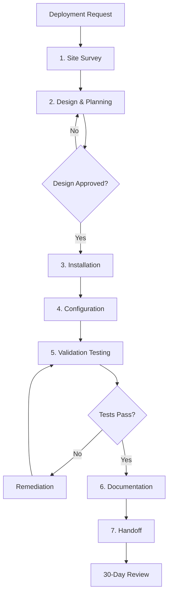
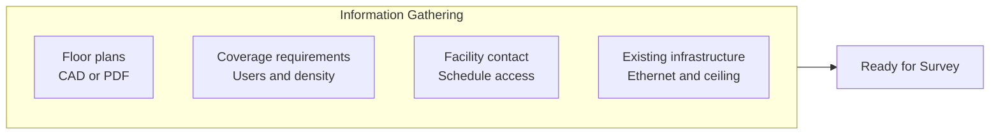
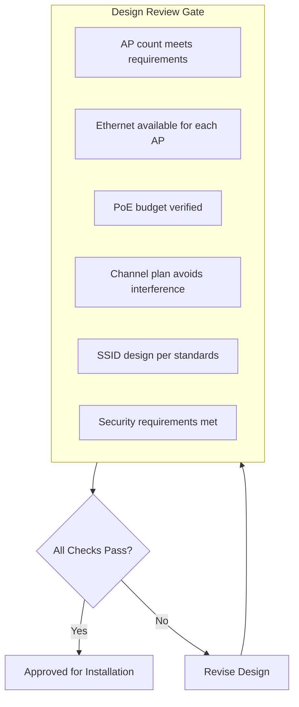
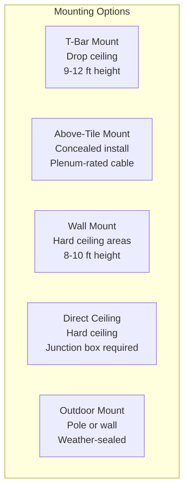
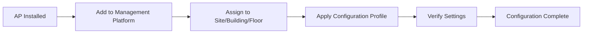
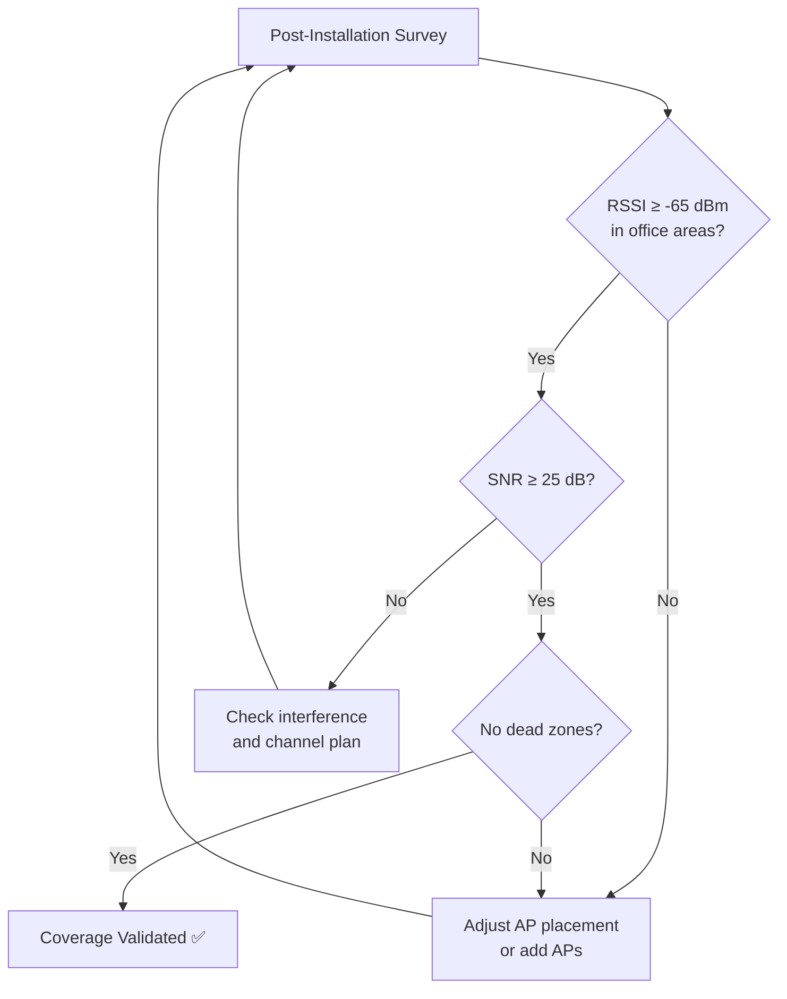
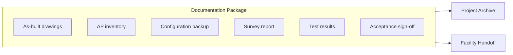
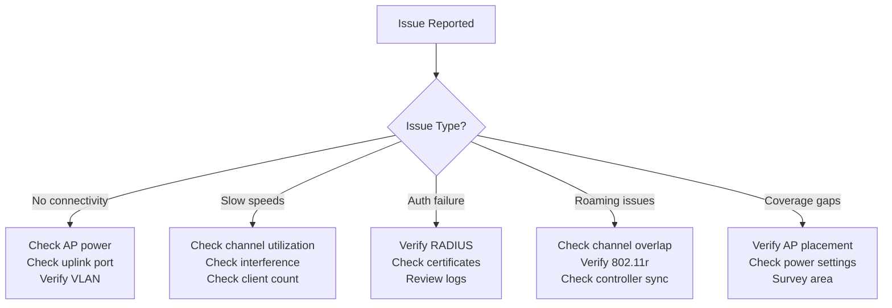

# WiFi Deployment Procedures

## Overview

This document defines the standard procedures for deploying wireless networks in City of New Orleans facilities. All deployments follow BICSI best practices and require documented site surveys, design approvals, and validation testing before handoff.

## Standards References

| Standard | Title | Date | Scope |
|----------|-------|------|-------|
| BICSI TDMM 14th Ed. | Telecommunications Distribution Methods Manual | 2018 | Deployment best practices |
| TIA-569-E | Telecommunications Pathways and Spaces | June 2019 | Physical installation |
| TIA-606-C | Administration Standard | February 2017 | Labeling and documentation |
| IEEE 802.11-2020 | Wireless LAN Standard | December 2020 | Technical requirements |
| NIST SP 800-153 | Guidelines for Securing WLANs | February 2012 | Security validation |

## Deployment Workflow

## Phase 1: Site Survey

### Pre-Survey Requirements

| Requirement | Description | Responsible |
|-------------|-------------|-------------|
| Floor plans | Current CAD or PDF drawings | Facility manager |
| User density | Expected concurrent users per area | Project manager |
| Coverage areas | Rooms requiring WiFi | Project manager |
| Existing drops | Available Ethernet locations | ITI Network Team |
| Ceiling access | Type and accessibility | Facility manager |
| Site contact | Person to escort surveyor | Facility manager |

### Survey Types

#### Predictive Survey (New Construction/Renovation)

| Step | Activity | Deliverable |
|------|----------|-------------|
| 1 | Import floor plans to survey software | Calibrated floor plan |
| 2 | Define wall materials and attenuation | Material database |
| 3 | Place virtual APs based on requirements | AP placement map |
| 4 | Generate coverage predictions | Heat maps |
| 5 | Create channel plan | Channel assignments |

#### Active Survey (Existing Buildings)

| Step | Activity | Deliverable |
|------|----------|-------------|
| 1 | Walk facility with survey equipment | RF measurements |
| 2 | Measure existing WiFi and interference | Interference report |
| 3 | Identify RF challenges | Problem area list |
| 4 | Document mounting locations | Photo documentation |
| 5 | Verify cable paths | Pathway assessment |

### Survey Deliverables Checklist

| Deliverable | Required | Format |
|-------------|----------|--------|
| Coverage heat maps (2.4 GHz) | ✅ | PDF/PNG |
| Coverage heat maps (5 GHz) | ✅ | PDF/PNG |
| Coverage heat maps (6 GHz) | If WiFi 6E | PDF/PNG |
| AP placement map with coordinates | ✅ | PDF + coordinates |
| Channel plan | ✅ | Spreadsheet |
| Interference report | ✅ | PDF |
| Bill of materials | ✅ | Spreadsheet |
| Mounting details per AP | ✅ | Photo + notes |
| Power requirements | ✅ | PoE budget calc |

---

## Phase 2: Design and Planning

### Design Review Checklist

| Check | Criteria | Standard Reference |
|-------|----------|-------------------|
| Coverage | ≥-65 dBm in office areas | BICSI TDMM |
| Capacity | AP count supports user density | Site survey |
| Cabling | Cat6A to each AP location | TIA-568.2-D |
| PoE | Switch budget ≥ total AP power draw | IEEE 802.3at/bt |
| Channels | No co-channel interference | IEEE 802.11 |
| SSIDs | Per [SSID Standards](ssid-standards.md) | Internal |
| Security | WPA3, 802.1X configured | NIST SP 800-153 |

### Approval Process

| Step | Action | Responsible | Timeline |
|------|--------|-------------|----------|
| 1 | Submit design package | Contractor/Vendor | — |
| 2 | Technical review | ITI Network Team | 5 business days |
| 3 | Address feedback | Contractor/Vendor | As needed |
| 4 | Written approval | ITI Network Team | 2 business days |
| 5 | Schedule installation | Project manager | Coordinate with facility |

---

## Phase 3: Installation

### Pre-Installation Checklist

| Item | Verification | Status |
|------|--------------|--------|
| All equipment received | Inventory check | ☐ |
| Serial numbers documented | Asset tracking | ☐ |
| Network ports active | Port test | ☐ |
| PoE verified | Power delivery test | ☐ |
| Ceiling/wall access confirmed | Physical inspection | ☐ |
| Installation window scheduled | Calendar confirmed | ☐ |
| Facility contact available | Contact verified | ☐ |

### Mounting Standards

Per TIA-569-E pathway requirements:

| Location | Mount Type | Height | Cable Requirement |
|----------|------------|--------|-------------------|
| Drop ceiling (standard) | T-bar clip | 9-12 ft | Plenum (CMP) if above ceiling |
| Drop ceiling (concealed) | Above-tile mount | 9-12 ft | Plenum (CMP) required |
| Hard ceiling | Direct mount/junction box | 9-12 ft | Standard or plenum per code |
| Wall (indoor) | Wall bracket | 8-10 ft | Per local code |
| Outdoor (pole) | Pole mount, tamper-resistant | 12-20 ft | Outdoor-rated, UV-resistant |
| Outdoor (wall) | Wall bracket, sealed | 10-15 ft | Outdoor-rated |

### Cabling Requirements

| Requirement | Standard | Notes |
|-------------|----------|-------|
| Cable category | Cat6A minimum | Per [Cabling Standards](../ethernet/cabling-standards.md) |
| Plenum rating | CMP if above drop ceiling | Per local fire code |
| Cable length | ≤100 meters total | TIA-568.2-D |
| Service loop | 3-5 feet at AP location | For future maintenance |
| Labeling | Both ends per TIA-606-C | AP-[Building]-[Location] |
| Cable management | Velcro ties, J-hooks | No zip ties on Cat6A |

### Installation Quality Checklist

| Item | Requirement | Verified |
|------|-------------|----------|
| AP mounted at correct location | Per design map | ☐ |
| AP oriented correctly | Antennas facing coverage area | ☐ |
| Mounting hardware secure | No movement when touched | ☐ |
| Cable properly routed | Bend radius maintained | ☐ |
| Cable properly terminated | Tested and labeled | ☐ |
| Service loop present | 3-5 feet minimum | ☐ |
| AP powered on | LED indicates normal | ☐ |
| AP visible in management | Shows online status | ☐ |
| Photo documentation | Before and after | ☐ |

---

## Phase 4: Configuration

### Controller/Cloud Management Setup

| Step | Action | Verification |
|------|--------|--------------|
| 1 | Add AP to management platform | AP appears in inventory |
| 2 | Assign to correct site/building/floor | Location accurate |
| 3 | Apply SSID profile | SSIDs per [SSID Standards](ssid-standards.md) |
| 4 | Apply RF profile | Channels and power per design |
| 5 | Apply security profile | WPA3, 802.1X configured |
| 6 | Enable features | Fast roaming, band steering |

### Per-AP Configuration Checklist

| Setting | Requirement | Verified |
|---------|-------------|----------|
| AP name | `AP-[Building]-[Location]` | ☐ |
| Location | Correct site/building/floor | ☐ |
| SSIDs | All required SSIDs assigned | ☐ |
| Channel (5 GHz) | Per channel plan | ☐ |
| Channel (2.4 GHz) | Per channel plan (1, 6, or 11) | ☐ |
| Transmit power | Per design or auto | ☐ |
| VLAN tagging | Native + tagged correct | ☐ |
| 802.1X | RADIUS servers configured | ☐ |
| Management IP | Assigned and reachable | ☐ |

---

## Phase 5: Validation Testing

### Coverage Validation

| Test | Target | Tool | Pass Criteria |
|------|--------|------|---------------|
| RSSI (office) | ≥-65 dBm | Survey tool | All areas covered |
| RSSI (conference) | ≥-60 dBm | Survey tool | High-priority rooms |
| SNR | ≥25 dB | Survey tool | Adequate signal quality |
| Dead zones | None | Walk test | Continuous coverage |
| Channel interference | Minimal | Spectrum analyzer | Co-channel ≤-85 dBm |

### Performance Testing

| Test | Target | Method | Pass Criteria |
|------|--------|--------|---------------|
| Throughput | ≥100 Mbps | iPerf3 to wired server | 90% of tests pass |
| Latency | ≤20 ms | Ping to gateway | Average ≤20 ms |
| Jitter | ≤10 ms | Continuous ping | 95th percentile |
| Roaming | ≤150 ms | Roaming test app | Seamless handoff |
| Client capacity | Per design | Load test | No degradation at target |

### Security Testing

| Test | Requirement | Method | Pass Criteria |
|------|-------------|--------|---------------|
| SSID verification | Only approved SSIDs | Survey scan | No rogue SSIDs |
| 802.1X auth | Successful authentication | Test client | Correct VLAN assigned |
| Guest portal | Portal redirect works | Test client | Terms required |
| Client isolation | Clients cannot reach each other | Ping test | No response |
| PMF | Management frames protected | Capture analysis | Encrypted |
| Rogue AP detection | System detects rogues | Test with rogue | Alert generated |

### Validation Report Template

| Section | Contents |
|---------|----------|
| Executive summary | Pass/fail status, key findings |
| Coverage results | Heat maps with RSSI values |
| Performance results | Throughput, latency, roaming data |
| Security results | Authentication and isolation tests |
| Issues found | List with severity |
| Remediation | Actions taken or required |
| Sign-off | Tester name, date, signature |

---

## Phase 6: Documentation

### Required Documentation Package

| Document | Format | Retention |
|----------|--------|-----------|
| As-built drawings | PDF + CAD | Permanent |
| AP inventory (serial, MAC, location) | Spreadsheet | Permanent |
| Configuration backup | Platform export | 7 years |
| Post-installation survey | PDF | 7 years |
| Validation test results | PDF | 7 years |
| Photos | JPEG/PNG | 7 years |
| Acceptance sign-off | PDF (signed) | Permanent |

### AP Inventory Template

| Field | Example | Required |
|-------|---------|----------|
| AP Name | AP-CH-LOBBY-01 | ✅ |
| Serial Number | ABC123456789 | ✅ |
| MAC Address | AA:BB:CC:DD:EE:FF | ✅ |
| Model | [Model identifier] | ✅ |
| Location (Building) | City Hall | ✅ |
| Location (Floor) | 1 | ✅ |
| Location (Area) | Main Lobby | ✅ |
| Coordinates | X: 125, Y: 340 | ✅ |
| Mount Type | T-bar ceiling | ✅ |
| Switch/Port | CH-IDF1-SW1/Gi1/0/24 | ✅ |
| Installation Date | 2026-02-15 | ✅ |
| Installer | [Name] | ✅ |

---

## Phase 7: Handoff and Support

### Handoff Checklist

| Item | Action | Verified |
|------|--------|----------|
| Documentation complete | All items in package | ☐ |
| Management access | Credentials transferred | ☐ |
| Facility contact trained | Basic troubleshooting | ☐ |
| Escalation path | Support contacts documented | ☐ |
| Warranty info | Registration confirmed | ☐ |
| 30-day review | Scheduled | ☐ |

### Post-Deployment Support

| Period | Support Level | Activities |
|--------|---------------|------------|
| 0-30 days | Full project support | Address any issues |
| 30-day review | Scheduled meeting | Review metrics, optimize |
| 31-90 days | Priority support | Quick response to issues |
| 90+ days | Standard support | Normal SLA |

### 30-Day Review Agenda

| Topic | Discussion Points |
|-------|-------------------|
| User feedback | Any complaints or issues reported |
| Performance metrics | Throughput, latency, client counts |
| Coverage issues | Dead zones or weak areas identified |
| Authentication issues | 802.1X or portal problems |
| RF optimization | Channel or power adjustments needed |
| Documentation updates | Any as-built changes |
| Project closure | Sign-off on completion |

---

## Troubleshooting Quick Reference

| Symptom | First Steps | Escalation |
|---------|-------------|------------|
| No connectivity | Verify AP power and LED, check switch port, verify VLAN | Network team |
| Slow speeds | Check channel utilization, client count, interference | Wireless specialist |
| Auth failure | Verify RADIUS server, check user/device in AD, review logs | Security team |
| Roaming problems | Verify channel plan, check 802.11r/k/v, controller sync | Wireless specialist |
| Poor coverage | Compare to survey, check power settings, rescan area | Site survey |
| Intermittent issues | Check for interference, review client logs, spectrum analysis | Wireless specialist |

## Industry Adoption Data

### Deployment Best Practices Adoption

| Practice | Adoption Rate | Source | Year |
|----------|---------------|--------|------|
| Pre-deployment site survey | 78% | BICSI Survey | 2024 |
| Post-deployment validation | 72% | BICSI Survey | 2024 |
| Centralized management | 94% | Gartner Wireless Report | 2024 |
| Documentation package required | 85% | Municipal IT Survey | 2024 |

## References

1. BICSI TDMM, 14th Edition, "Telecommunications Distribution Methods Manual," BICSI, 2018.
2. TIA-569-E, "Telecommunications Pathways and Spaces," TIA, June 2019.
3. TIA-606-C, "Administration Standard for Telecommunications Infrastructure," TIA, February 2017.
4. IEEE 802.11-2020, "Wireless LAN Medium Access Control (MAC) and Physical Layer (PHY) Specifications," IEEE, December 2020.
5. NIST SP 800-153, "Guidelines for Securing Wireless Local Area Networks (WLANs)," NIST, February 2012.

---

*For questions about these procedures, open an issue or contact the ITI Networking Team.*
