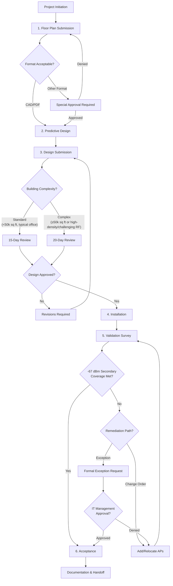
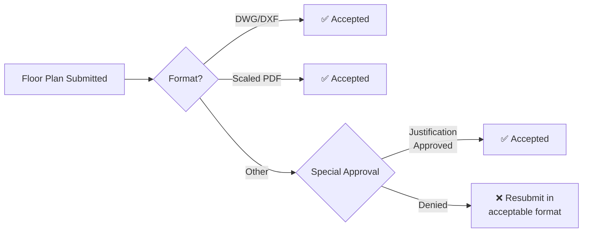
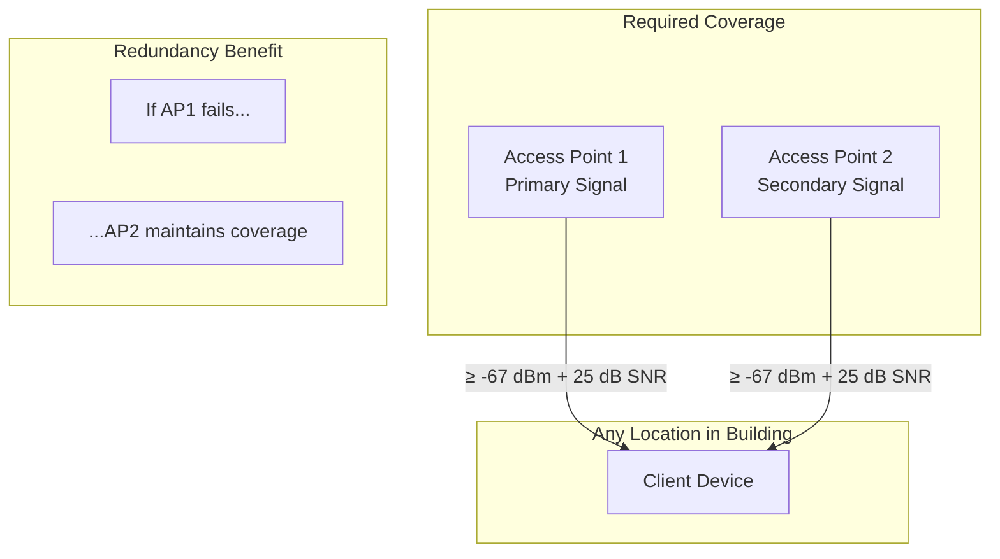
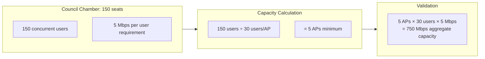
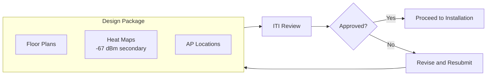
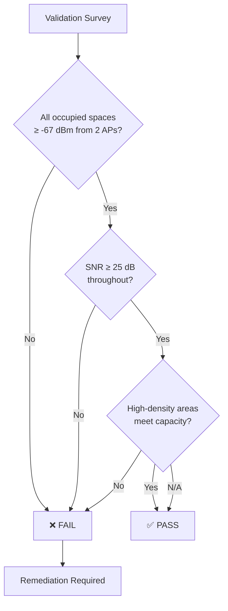
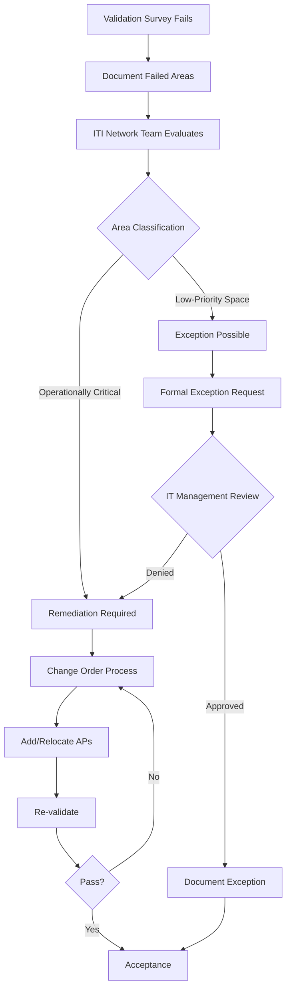
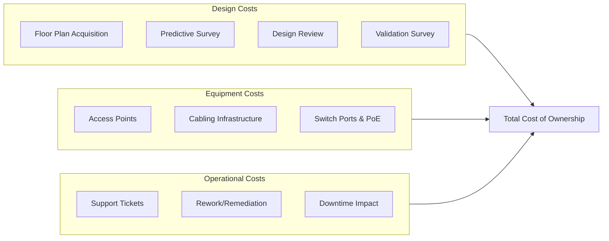

# Wireless Network Design Standards

## Overview

This document defines the mandatory requirements for designing wireless networks in City of New Orleans facilities. All WiFi deployments—new construction, renovation, or expansion—must follow this design standard to ensure consistent, reliable coverage across municipal buildings.

**Core Requirement:** All wireless designs must provide **-67 dBm secondary coverage** with **25 dB minimum SNR** throughout occupied spaces. Secondary coverage means every location is served by at least two access points meeting these thresholds, ensuring continuity if any single AP fails.

## Applicability

This standard applies to:
- All municipal buildings regardless of type or size
- New construction projects
- Major renovations affecting wireless infrastructure
- WiFi expansion or refresh projects
- Both contractor-designed and ITI-designed deployments

## Standards References

| Standard | Title | Relevance |
|----------|-------|-----------|
| IEEE 802.11-2020 | Wireless LAN Standard | Technical coverage requirements |
| IEEE 802.11be-2024 | WiFi 7 (EHT) | Current AP standard |
| BICSI TDMM 15th Ed. | Telecommunications Distribution Methods Manual | Design best practices |
| TIA-569-E | Pathways and Spaces | Physical infrastructure |
| ANSI/TIA-1179 | Healthcare Telecom Infrastructure | Healthcare facility requirements |
| NIST SP 800-153 | Guidelines for Securing WLANs | Security design principles |

## Design Workflow

### Workflow Phases Summary

| Phase | Owner | Deliverable | Timeline |
|-------|-------|-------------|----------|
| 1. Floor Plan Submission | Facility/Project Manager | Electronic floor plans per floor | Before design |
| 2. Predictive Design | Designer (contractor or ITI) | Heat maps, AP locations | Per project schedule |
| 3. Design Submission & Review | Designer → ITI | Design package | 15-20 business days |
| 4. Installation | Contractor/ITI | Installed APs | Per project schedule |
| 5. Validation Survey | Designer/ITI | Post-install measurements | After installation |
| 6. Acceptance | ITI | Sign-off or exception | After validation |

---

## Phase 1: Floor Plan Submission

### Purpose

Electronic building plans are required for accurate predictive wireless design. Floor plans enable RF engineers to model signal propagation, identify construction materials, and place access points optimally before installation.

### Submission Requirements

| Requirement | Specification |
|-------------|---------------|
| Format (preferred) | CAD files (DWG, DXF) |
| Format (acceptable) | Scaled PDF floor plans |
| Format (special approval) | Other scaled formats with written justification |
| Scope | One plan per floor |
| Scale | Must include scale reference or dimensions |
| Content | Walls, doors, windows, ceiling type, intended use of spaces |

### Format Acceptance Criteria

### CAD File Benefits

| Benefit | Impact |
|---------|--------|
| Direct import to survey tools | Reduced design time, higher accuracy |
| Accurate wall placement | Precise attenuation modeling |
| Layer separation | Easy identification of wall types |
| Dimensional accuracy | Correct AP spacing calculations |

### When PDF Is Acceptable

PDF floor plans are acceptable when:
- Building predates CAD documentation
- CAD files unavailable from original architect
- Renovation scope is limited (single floor or area)

PDF submissions must include a scale bar or room dimensions for calibration.

---

## Phase 2: Coverage Design Requirements

### Primary Design Criterion: Secondary Coverage

> **Mandatory Requirement:** All occupied spaces must achieve **-67 dBm signal strength from at least two access points** with **25 dB minimum signal-to-noise ratio (SNR)**.

This two-AP redundancy requirement—known as secondary coverage—ensures wireless continuity if any single access point fails.

### Coverage Thresholds

| Parameter | Requirement | Standard Reference |
|-----------|-------------|-------------------|
| RSSI (secondary) | ≥ -67 dBm from 2nd strongest AP | BICSI TDMM |
| SNR | ≥ 25 dB | IEEE 802.11-2020 |
| Coverage overlap | 15-20% between adjacent APs | BICSI TDMM |
| Dead zones | None permitted in occupied spaces | — |

### Secondary Coverage Explained

The -67 dBm threshold is the enterprise standard that balances reliable connectivity with practical AP density, ensuring "very good" reliability while avoiding the excessive AP counts required for -65 dBm coverage.

### Wall Attenuation

RF designers shall use professional judgment when modeling wall attenuation values based on construction materials. The mandatory validation survey verifies design accuracy; material modeling errors are corrected through remediation.

---

## High-Density Space Requirements

### Definition

A high-density space is any area expecting **50 or more concurrent wireless users**. These spaces require capacity-based design in addition to coverage-based design.

### Examples of High-Density Spaces

| Space Type | Typical Capacity | Design Consideration |
|------------|------------------|----------------------|
| Council chambers | 100-300 users | Public meetings, live streaming |
| Auditoriums | 200-500 users | Events, presentations |
| Public lobbies | 50-200 users | Visitor traffic, queuing |
| Training rooms | 50-100 users | Simultaneous device use |
| Conference centers | 100-500 users | Large meetings, conventions |
| Recreation centers | 50-200 users | Public programs |

### High-Density Design Criteria

In addition to -67 dBm secondary coverage, high-density spaces must meet:

| Requirement | Specification | Rationale |
|-------------|---------------|-----------|
| Users per AP | **30 maximum** | Ensures adequate airtime per client |
| Bandwidth per user | **5 Mbps minimum** | Supports HD video conferencing |
| Aggregate per AP | 150 Mbps minimum | 30 users × 5 Mbps |

### Capacity Calculation Example

### High-Density AP Placement

| Consideration | Guidance |
|---------------|----------|
| Mounting height | Lower mounting (8-10 ft) to reduce cell size |
| Channel width | 20-40 MHz to maximize channel reuse |
| Power levels | Reduced power to minimize co-channel interference |
| 6 GHz preference | Prioritize 6 GHz band for capacity (WiFi 7 clients) |

**Cross-reference:** High-density spaces must use high-density access points per [Access Point Specifications](access-point-specs.md#high-density-access-points).

---

## Phase 3: Design Submission and Review

### Required Deliverables

All wireless designs must include the following deliverables for ITI review:

| Deliverable | Description | Format |
|-------------|-------------|--------|
| Floor plans | Electronic building plans per floor | CAD (preferred) or PDF |
| Heat maps | Predictive coverage showing -67 dBm secondary threshold | PDF/PNG per floor, per band |
| AP locations | Proposed access point placement with coordinates | PDF or spreadsheet |
| Power budget | UPS sizing per IDF using 60W/AP conservative planning figure | Spreadsheet |

### Heat Map Requirements

Heat maps must clearly demonstrate:

| Element | Requirement |
|---------|-------------|
| Coverage threshold | -67 dBm secondary coverage displayed |
| All bands | 2.4 GHz, 5 GHz, and 6 GHz maps |
| SNR overlay | 25 dB SNR threshold (separate or combined) |
| Legend | Clear color scale with dBm values |
| AP markers | Proposed AP locations visible on maps |

### Review Timeline

| Building Classification | Criteria | Review SLA |
|------------------------|----------|------------|
| Standard | < 50,000 sq ft AND typical office environment | **15 business days** |
| Complex | ≥ 50,000 sq ft OR high-density spaces OR challenging RF environment | **20 business days** |

### Challenging RF Environments

The following qualify as challenging RF environments (20-day review):

- Historic buildings with unusual construction
- Warehouses or industrial facilities
- Buildings with significant RF interference sources
- Multi-tenant facilities with existing wireless
- Healthcare facilities (ANSI/TIA-1179 compliance required)

### Design Responsibility

| Project Type | Designer | ITI Role |
|--------------|----------|----------|
| Capital projects | External contractor/vendor | Review and approve |
| Small projects | ITI Network Team | Design and implement |
| Refresh/expansion | Either, per project scope | Review if external |

---

## Phase 5: Validation Survey

### Purpose

A post-installation validation survey is **mandatory for all wireless deployments** regardless of size. The validation survey confirms that the as-built installation meets the -67 dBm secondary coverage requirement with 25 dB SNR.

### Validation Survey Requirement

> **No wireless deployment is accepted without a passing validation survey or approved exception.**

### Survey Methodology

| Requirement | Specification |
|-------------|---------------|
| Survey type | Active site survey (walk test) |
| Equipment | Professional RF survey tool |
| Measurement interval | Continuous or grid-based (≤15 ft spacing) |
| Bands measured | 2.4 GHz, 5 GHz, 6 GHz |
| Client device | Survey device or representative client |

### Pass/Fail Criteria

| Criterion | Threshold | Result if Not Met |
|-----------|-----------|-------------------|
| Secondary coverage | ≥ -67 dBm from 2nd strongest AP | Fail |
| SNR | ≥ 25 dB | Fail |
| Dead zones | None in occupied spaces | Fail |
| High-density capacity | Per design (if applicable) | Fail |

### Validation Deliverables

| Deliverable | Description |
|-------------|-------------|
| Coverage heat maps | As-built measurements showing actual RSSI |
| SNR maps | Signal-to-noise ratio throughout facility |
| Comparison report | Predictive vs. actual coverage |
| Pass/fail summary | Areas meeting/not meeting requirements |
| Photo documentation | Installed AP locations |

### Survey Tools

This standard is tool-agnostic. Any professional RF survey tool capable of the following is acceptable:

- Active site survey with continuous or grid measurement
- Heat map generation with configurable thresholds
- Secondary coverage visualization
- SNR measurement and display
- Report generation with pass/fail criteria

---

## Remediation and Exception Process

### When Validation Fails

If any area fails to meet -67 dBm secondary coverage or 25 dB SNR, the following process applies:

### Remediation Path

For operationally necessary areas that fail validation:

| Step | Action | Responsibility |
|------|--------|----------------|
| 1 | Document specific failed areas with measurements | Designer/Surveyor |
| 2 | Propose remediation (additional or relocated APs) | Designer |
| 3 | Submit change order request | Project Manager |
| 4 | Approve change order | ITI + Procurement |
| 5 | Implement remediation | Contractor/ITI |
| 6 | Re-validate affected areas | Designer/ITI |
| 7 | Confirm pass | ITI |

### Exception Path

For low-priority spaces where coverage gaps are acceptable:

| Step | Action | Responsibility |
|------|--------|----------------|
| 1 | Document specific failed areas with measurements | Designer/Surveyor |
| 2 | Submit formal exception request | Project Manager |
| 3 | Provide written business justification | Facility Manager |
| 4 | Review and approve/deny | **IT Management** |
| 5 | Document approved exception | ITI |

### Exception Request Requirements

Formal exception requests must include:

| Element | Description |
|---------|-------------|
| Location | Specific rooms/areas not meeting standard |
| Measurements | Actual RSSI and SNR values documented |
| Justification | Business reason coverage is not required |
| Facility concurrence | Facility manager acknowledgment |
| Risk acceptance | Statement accepting limited coverage |

### Spaces Potentially Eligible for Exception

| Space Type | Typical Justification |
|------------|----------------------|
| Mechanical rooms | Unoccupied, equipment only |
| Storage closets | Infrequent access, no wireless need |
| Elevator shafts | Transient occupancy |
| Stairwells | Limited occupancy time |
| Parking structures | Separate design consideration |

**Note:** Exceptions are not automatic. Each request requires IT management approval with documented justification.

---

## Total Cost of Ownership Justification

### Purpose

This section provides economic justification for the WiFi Design Standard requirements. The upfront investment in proper design processes yields significant long-term savings through reduced rework, improved reliability, and extended infrastructure lifecycle.

### Cost Model Components

### Design Process Cost Analysis

#### With Design Standard (Recommended)

| Cost Element | Per-Building Estimate | Notes |
|--------------|----------------------|-------|
| Floor plan acquisition | $0-500 | Often available from facilities |
| Predictive design | $1,500-3,000 | Professional RF design |
| ITI design review | Internal labor | 15-20 days review cycle |
| Validation survey | $1,000-2,500 | Post-installation verification |
| **Total design cost** | **$2,500-6,000** | One-time per project |

#### Without Design Standard (Ad-Hoc)

| Cost Element | Per-Building Estimate | Notes |
|--------------|----------------------|-------|
| Initial deployment | $500-1,500 | Minimal planning |
| Coverage complaints | $2,000-5,000 | Troubleshooting, user impact |
| Rework (add APs) | $3,000-8,000 | Unplanned equipment + labor |
| Re-cabling | $2,000-6,000 | Pathways not planned |
| Repeat site visits | $1,500-4,000 | Multiple trips |
| **Total ad-hoc cost** | **$9,000-24,500** | Often exceeds planned approach |

### Secondary Coverage Cost Impact

| Design Approach | AP Density | Equipment Cost (50k sq ft) | Reliability |
|-----------------|------------|---------------------------|-------------|
| Primary only (-67 dBm) | ~1 AP/2,500 sq ft | $28,000 (20 APs) | Single point of failure |
| **Secondary (-67 dBm)** | **~1 AP/1,800 sq ft** | **$39,200 (28 APs)** | **Redundant coverage** |
| Cost difference | +40% APs | +$11,200 | Eliminates outage risk |

### Reliability ROI

| Metric | Without Redundancy | With Secondary Coverage |
|--------|-------------------|------------------------|
| Single AP failure impact | Coverage hole, user complaints | Seamless continuity |
| Mean time to restore | 4-24 hours (dispatch, replace) | 0 hours (redundant AP) |
| User productivity loss | $500-2,000 per incident | $0 |
| Annual AP failures (50 APs) | ~2-3 failures | ~2-3 failures |
| **Annual outage cost** | **$1,000-6,000** | **$0** |

### Lifecycle Cost Comparison (7-Year Model)

#### Assumptions
- Building size: 50,000 sq ft typical municipal office
- AP lifecycle: 7 years (WiFi 7 standard)
- AP cost: $1,400 per unit (WiFi 7)
- Labor rate: $85/hour
- Support ticket cost: $150 per incident

#### With Design Standard

| Cost Category | Year 0 | Years 1-7 (Annual) | 7-Year Total |
|---------------|--------|-------------------|--------------|
| Design process | $5,000 | $0 | $5,000 |
| Equipment (28 APs) | $39,200 | $0 | $39,200 |
| Installation | $8,400 | $0 | $8,400 |
| Support tickets | — | $600 | $4,200 |
| AP failures/replacement | — | $800 | $5,600 |
| Rework | $0 | $0 | $0 |
| **Total** | **$52,600** | **$1,400** | **$62,400** |

#### Without Design Standard (Ad-Hoc)

| Cost Category | Year 0 | Years 1-7 (Annual) | 7-Year Total |
|---------------|--------|-------------------|--------------|
| Design process | $1,000 | $0 | $1,000 |
| Equipment (20 APs initial) | $28,000 | $0 | $28,000 |
| Installation | $6,000 | $0 | $6,000 |
| Support tickets | — | $3,000 | $21,000 |
| AP failures/replacement | — | $600 | $4,200 |
| Rework (Year 1-2) | — | $12,000 | $12,000 |
| Re-cabling | — | $4,000 | $4,000 |
| Productivity loss | — | $2,000 | $14,000 |
| **Total** | **$35,000** | **$5,600** | **$90,200** |

### 7-Year TCO Summary

| Approach | 7-Year TCO | Cost per Sq Ft |
|----------|------------|----------------|
| **With Design Standard** | **$62,400** | **$1.25/sq ft** |
| Without Design Standard | $90,200 | $1.80/sq ft |
| **Savings** | **$27,800 (31%)** | **$0.55/sq ft** |

### Intangible Benefits

| Benefit | Impact |
|---------|--------|
| User satisfaction | Reliable connectivity from day one |
| IT credibility | Fewer complaints, professional deployments |
| Compliance readiness | Documented designs support audits |
| Faster troubleshooting | Baseline documentation available |
| Predictable budgeting | Known costs vs. reactive spending |

### TCO Conclusion

The WiFi Design Standard increases upfront investment by approximately $17,600 per 50,000 sq ft building but reduces 7-year TCO by $27,800 (31%). The secondary coverage requirement adds equipment cost but eliminates single-point-of-failure risks, reducing support burden and user productivity loss over the infrastructure lifecycle.

**Investment payback period: 2-3 years** through avoided rework and reduced support costs.

---

## Industry Standards References

### IEEE Standards

| Standard | Title | Date | Relevance to Design Standard |
|----------|-------|------|------------------------------|
| IEEE 802.11-2020 | Wireless LAN Medium Access Control and Physical Layer Specifications | December 2020 | Base WLAN technical requirements, RSSI/SNR definitions |
| IEEE 802.11be-2024 | Extremely High Throughput (EHT) Amendment | January 2024 | WiFi 7 AP requirements, MLO reliability |
| IEEE 802.11k-2008 | Radio Resource Measurement | June 2008 | Client roaming optimization |
| IEEE 802.11r-2008 | Fast BSS Transition | July 2008 | Seamless roaming between APs |
| IEEE 802.11v-2011 | Wireless Network Management | February 2011 | Network-assisted roaming |

### BICSI Standards

| Standard | Title | Date | Relevance to Design Standard |
|----------|-------|------|------------------------------|
| BICSI TDMM 15th Edition | Telecommunications Distribution Methods Manual | 2024 | Wireless design methodology, coverage thresholds, secondary coverage definition |
| BICSI WLAN Design Reference Manual | Wireless LAN Design | 2019 | RF design best practices, site survey procedures |

**BICSI TDMM Coverage Guidance:**
> "Secondary coverage ensures that if the primary access point fails or is overloaded, a secondary access point provides adequate signal strength for client connectivity. A minimum of -67 dBm from a secondary AP is recommended for enterprise deployments."
> — BICSI TDMM 15th Edition

### TIA Standards

| Standard | Title | Date | Relevance to Design Standard |
|----------|-------|------|------------------------------|
| TIA-569-E | Telecommunications Pathways and Spaces | June 2019 | Physical infrastructure for AP mounting |
| TIA-568.2-D | Balanced Twisted-Pair Cabling | September 2018 | Cabling to AP locations |
| TIA-606-C | Administration Standard | February 2017 | Documentation and labeling |
| ANSI/TIA-1179 | Healthcare Facility Telecommunications Infrastructure | 2019 | Healthcare-specific wireless requirements |

**ANSI/TIA-1179 Wireless Guidance:**
> "Healthcare facilities shall provide wireless coverage with sufficient overlap to support roaming medical devices and ensure no coverage gaps exist in patient care areas."
> — ANSI/TIA-1179, Section 8.3

### NIST Standards

| Standard | Title | Date | Relevance to Design Standard |
|----------|-------|------|------------------------------|
| NIST SP 800-153 | Guidelines for Securing Wireless Local Area Networks | February 2012 | Security design principles |
| NIST SP 800-53 Rev. 5 | Security and Privacy Controls | September 2020 | AC-18 Wireless Access controls |

### Industry Best Practice Citations

| Source | Guidance | Alignment |
|--------|----------|-----------|
| Cisco WLAN Design Guide | "Design for -67 dBm edge of cell with 15-20% overlap" | Aligned |
| Aruba Validated Reference Design | "Secondary coverage of -70 dBm minimum recommended for high-availability" | Exceeds (we require -67 dBm) |
| Ekahau Design Guidelines | "25 dB SNR minimum for voice-grade wireless" | Aligned |
| CWNA Study Guide (CWNP) | "Secondary coverage ensures redundancy; -67 dBm typical enterprise threshold" | Aligned |

---

## Cross-References

This design standard integrates with existing City of New Orleans network documentation:

| Document | Relationship |
|----------|--------------|
| [Access Point Specifications](access-point-specs.md) | Hardware requirements for APs specified in designs |
| [Deployment Procedures](deployment-procedures.md) | Installation workflow following design approval |
| [SSID Standards](ssid-standards.md) | SSID configuration applied to deployed APs |
| [WPA3 Enterprise Standards](../security/wpa3-enterprise.md) | Security configuration requirements |
| [OWE Enhanced Open Standards](../security/owe-enhanced-open.md) | Guest network encryption requirements |
| [Switch Specifications](../ethernet/switch-specifications.md) | Multi-gig port and PoE requirements for AP uplinks |
| [Cabling Standards](../ethernet/cabling-standards.md) | Cat6A cabling requirements to AP locations |
| [Backup Power Standards](../ethernet/backup-power-standards.md) | UPS sizing based on AP count and switch PoE budgets |

### Design Standard Compliance Checklist

| Requirement | Checkpoint | Reference |
|-------------|------------|-----------|
| Floor plans submitted | CAD or PDF per floor | Phase 1 |
| -67 dBm secondary coverage | Heat maps demonstrate | Phase 2 |
| 25 dB SNR minimum | Heat maps demonstrate | Phase 2 |
| High-density capacity (if applicable) | 30 users/AP, 5 Mbps/user | Phase 2 |
| AP locations documented | Coordinates provided | Phase 2 |
| Design review complete | ITI approval received | Phase 3 |
| Validation survey passed | As-built meets design | Phase 5 |
| Backup power verified | UPS sized per AP count and facility tier | [Backup Power Standards](../ethernet/backup-power-standards.md) |
| Exceptions documented (if any) | IT management approved | Phase 5 |

## Document History

| Version | Date | Author | Changes |
|---------|------|--------|---------|
| 1.0.0 | 2026-02-02 | ITI Network Team | Initial release |

## Infrastructure Readiness Pass/Fail Checklist

Use this checklist to verify design service provider qualifications before approving a WiFi design engagement. Every **Required** item must pass. If any Required item fails, the provider is **not approved for design work**.

### Design Service Provider Qualification Checklist

| # | Requirement | Required | Pass | Fail |
|---|-------------|----------|------|------|
| 1 | Professional RF design tools with predictive modeling | **Yes** | ☐ | ☐ |
| 2 | Capable of producing -67 dBm secondary coverage heat maps | **Yes** | ☐ | ☐ |
| 3 | Capable of producing 25 dB SNR overlay maps | **Yes** | ☐ | ☐ |
| 4 | Tri-band modeling including 6 GHz / 320 MHz channels | **Yes** | ☐ | ☐ |
| 5 | High-density venue capacity planning experience | **Conditional** | ☐ | ☐ |
| 6 | Post-install validation survey methodology | **Yes** | ☐ | ☐ |
| 7 | Design deliverables per submission requirements (see Design Submission section) | **Yes** | ☐ | ☐ |

### Results

| Outcome | Action |
|---------|--------|
| All Required items pass | **Approved for design engagement** |
| Any Required item fails | **Not approved — resolve before proceeding** |
| Questions about a specific requirement | Contact Network Engineering (ITI Networking Team) |

### How to Verify Requirements

| Checklist Item | Where to Find |
|----------------|---------------|
| Professional RF tools | Software license documentation, tool capabilities |
| -67 dBm heat maps | Sample deliverables, coverage design methodology |
| 25 dB SNR overlays | Sample deliverables, interference analysis capability |
| Tri-band / 320 MHz modeling | Software support for 6 GHz, channel width options |
| High-density planning | Past project references, capacity modeling methodology |
| Post-install validation | Validation methodology, sample survey reports |
| Design deliverables | Sample submission package, checklist compliance |

## References

1. IEEE 802.11-2020, "IEEE Standard for Information Technology—Wireless LAN Medium Access Control (MAC) and Physical Layer (PHY) Specifications," IEEE, December 2020.
2. IEEE 802.11be-2024, "IEEE Standard for Information Technology—Enhancements for Extremely High Throughput (EHT)," IEEE, January 2024.
3. BICSI, "Telecommunications Distribution Methods Manual (TDMM)," 14th Edition, BICSI, 2018.
4. TIA-569-E, "Telecommunications Pathways and Spaces," TIA, June 2019.
5. ANSI/TIA-1179, "Healthcare Facility Telecommunications Infrastructure Standard," TIA, 2019.
6. NIST SP 800-153, "Guidelines for Securing Wireless Local Area Networks (WLANs)," NIST, February 2012.
7. NIST SP 800-53 Rev. 5, "Security and Privacy Controls for Information Systems and Organizations," NIST, September 2020.

---

*For questions about these standards, open an issue or contact the ITI Networking Team.*
