# SSID and Wireless Security Standards

## Overview

This document defines the standard SSIDs, security configurations, and network segmentation requirements for City of New Orleans wireless networks. All configurations implement WPA3-Enterprise security and IEEE 802.1X authentication to ensure compliance with NIST guidelines.

## Standards References

| Standard | Title | Ratification Date | Scope |
|----------|-------|-------------------|-------|
| IEEE 802.11i-2004 | Security Enhancements | July 2004 | WPA2 security framework |
| IEEE 802.11w-2009 | Protected Management Frames | September 2009 | PMF/MFP |
| IEEE 802.1X-2020 | Port-Based Network Access Control | February 2020 | Authentication |
| Wi-Fi Alliance WPA3 | WPA3 Specification v3.0 | December 2020 | WPA3-Enterprise |
| IETF RFC 5216 | EAP-TLS | March 2008 | Certificate authentication |
| IETF RFC 7542 | Network Access Identifier | May 2015 | User identity format |
| NIST SP 800-153 | Guidelines for Securing WLANs | February 2012 | WLAN security |

## SSID Architecture

## Standard SSID Definitions

### SSID Summary Table

| SSID Name | Purpose | Security | Auth Method | VLAN | Broadcast |
|-----------|---------|----------|-------------|------|-----------|
| NOLA-CORP | City employee devices | WPA3-Enterprise | 802.1X EAP-TLS | 20 | Hidden |
| NOLA-GUEST | Visitor/public access | Open + Portal | Captive portal | 100 | Visible |
| NOLA-IOT | IoT devices | WPA3-Personal | Pre-shared key | 200 | Hidden |
| NOLA-SECURE | High-security systems | WPA3-Enterprise | 802.1X + certs | 50 | Hidden |

### Security Comparison

```mermaid
graph LR
    subgraph SECURITY_LEVELS["Security Levels"]
        HIGH["🔒 HIGH<br/>NOLA-SECURE<br/>NOLA-CORP"]
        MEDIUM["🔓 MEDIUM<br/>NOLA-IOT"]
        LOW["🌐 LOW<br/>NOLA-GUEST"]
    end

    HIGH -->|"WPA3-Enterprise<br/>802.1X + Certificates"| TRUSTED[Trusted Network Access]
    MEDIUM -->|"WPA3-Personal<br/>Managed PSK"| RESTRICTED[Restricted Access]
    LOW -->|"Captive Portal<br/>Terms acceptance"| INTERNET[Internet Only]
```

---

## SSID Detailed Specifications

### NOLA-CORP (Corporate)

**Purpose:** Primary network for city-owned devices and authenticated employees.

#### Configuration

| Setting | Value | Standard Reference |
|---------|-------|-------------------|
| Security protocol | WPA3-Enterprise | Wi-Fi Alliance WPA3 |
| Encryption | AES-GCMP-256 | IEEE 802.11i |
| Authentication | 802.1X EAP-TLS | RFC 5216 |
| PMF (802.11w) | Required | IEEE 802.11w-2009 |
| RADIUS server | Primary + Secondary | RFC 2865 |
| VLAN assignment | 20 (CORP) | IEEE 802.1Q |
| Bands | 5 GHz preferred, 2.4 GHz available | — |
| Broadcast SSID | Hidden | Security best practice |
| Client isolation | Disabled | Inter-client communication allowed |
| Fast roaming | 802.11r (FT) enabled | IEEE 802.11r-2008 |
| Band steering | Enabled (prefer 5 GHz) | — |

#### Authentication Flow

---

### NOLA-GUEST (Guest)

**Purpose:** Internet access for visitors, contractors, and personal devices.

#### Configuration

| Setting | Value | Rationale |
|---------|-------|-----------|
| Security protocol | Open (OWE preferred) | Guest simplicity |
| Captive portal | Required | Terms acceptance |
| Terms of use | Legal acceptance required | Liability |
| Session timeout | 8 hours | Daily re-acceptance |
| VLAN assignment | 100 (GUEST) | Isolated network |
| Bands | 2.4 GHz and 5 GHz | Maximum compatibility |
| Broadcast SSID | Visible | Guest discovery |
| Client isolation | Enabled | Prevent client-to-client |
| Bandwidth limit | 10 Mbps down / 5 Mbps up | Fair use |

#### Network Restrictions

```mermaid
flowchart LR
    GUEST_CLIENT[Guest Device] --> GUEST_VLAN[VLAN 100]
    GUEST_VLAN --> FIREWALL{Firewall Rules}
    FIREWALL -->|"✅ Allowed"| INTERNET[Internet]
    FIREWALL -->|"❌ Blocked"| CORP[Corporate Networks]
    FIREWALL -->|"❌ Blocked"| MGMT[Management Networks]
    FIREWALL -->|"❌ Blocked"| PRINTERS[Printers]
```

| Access | Status | Notes |
|--------|--------|-------|
| Internet | ✅ Allowed | Via content filter |
| Corporate resources | ❌ Blocked | No internal access |
| Printers | ❌ Blocked | Security isolation |
| DNS | ✅ Filtered | Malware/phishing protection |
| Other guest clients | ❌ Blocked | Client isolation enabled |

---

### NOLA-IOT (Internet of Things)

**Purpose:** Connected devices including sensors, displays, and smart building systems.

#### Configuration

| Setting | Value | Rationale |
|---------|-------|-----------|
| Security protocol | WPA3-Personal (SAE) | Device compatibility |
| Encryption | AES-CCMP-128 | Standard encryption |
| Pre-shared key | Rotated quarterly | Managed via secure process |
| PMF (802.11w) | Required | Management frame protection |
| VLAN assignment | 200 (IOT) | Isolated from corporate |
| Bands | 2.4 GHz only | IoT device compatibility |
| Broadcast SSID | Hidden | Reduce attack surface |
| Client isolation | Enabled | Prevent lateral movement |
| Bandwidth limit | 5 Mbps down / 2 Mbps up | IoT requirements minimal |

#### Access Controls

```mermaid
flowchart TD
    IOT_DEVICE[IoT Device] --> IOT_VLAN[VLAN 200]
    IOT_VLAN --> ACL{Access Control List}
    ACL -->|"✅ Allowed"| CLOUD[Specific Cloud Services]
    ACL -->|"✅ Allowed"| NTP[Time Servers]
    ACL -->|"✅ Allowed"| DNS[DNS Servers]
    ACL -->|"❌ Blocked"| CORP_NET[Corporate Network]
    ACL -->|"❌ Blocked"| INTERNET[General Internet]
    ACL -->|"❌ Blocked"| OTHER_IOT[Other IoT Devices]
```

---

### NOLA-SECURE (Restricted)

**Purpose:** High-security systems requiring enhanced authentication.

#### Configuration

| Setting | Value | Rationale |
|---------|-------|-----------|
| Security protocol | WPA3-Enterprise 192-bit | Maximum security |
| Encryption | AES-GCMP-256 | Suite B cryptography |
| Authentication | 802.1X EAP-TLS | Certificate required |
| PMF (802.11w) | Required | Management frame protection |
| Additional | MAC allowlist | Defense in depth |
| VLAN assignment | 50 (SECURE) | Restricted network |
| Bands | 5 GHz only | Performance and security |
| Broadcast SSID | Hidden | Reduce visibility |
| Client isolation | Disabled | Authorized inter-client |
| Certificate requirement | User + Device | Dual certificate validation |

---

## Industry Adoption Data

### Enterprise Wireless Security Adoption

| Security Feature | Adoption Rate | Source | Year |
|------------------|---------------|--------|------|
| WPA3-Enterprise | 61% of enterprises | Ponemon Wireless Security Study | 2024 |
| 802.1X authentication | 84% of enterprise WiFi | EMA Network Management Report | 2024 |
| Certificate-based auth (EAP-TLS) | 52% of 802.1X deployments | Gartner Identity Report | 2024 |
| Guest network isolation | 94% of organizations | Gartner Network Security Survey | 2023 |
| PMF (802.11w) enabled | 67% of enterprise APs | Wi-Fi Alliance Survey | 2024 |

### Municipal Wireless Security

| Practice | Adoption | Notes |
|----------|----------|-------|
| Separate guest SSID | 98% | Nearly universal |
| IoT network isolation | 76% | Growing requirement |
| WPA3 deployment | 54% | Accelerating adoption |

## Security Requirements

### WPA3 Security Features

### Authentication Requirements by SSID

| SSID | Method | Certificate | MFA | RADIUS Required |
|------|--------|-------------|-----|-----------------|
| NOLA-CORP | EAP-TLS | Device cert | Via cert | Yes |
| NOLA-SECURE | EAP-TLS | User + Device | Via cert + PIN | Yes |
| NOLA-IOT | PSK (SAE) | No | No | No |
| NOLA-GUEST | Portal | No | No | Optional |

### RADIUS Configuration

| Setting | Primary | Secondary |
|---------|---------|-----------|
| Server type | Network Policy Server or equivalent | Same |
| Authentication port | UDP 1812 | UDP 1812 |
| Accounting port | UDP 1813 | UDP 1813 |
| Shared secret | 32+ characters | Different from primary |
| EAP types | EAP-TLS only | EAP-TLS only |
| Certificate validation | Required | Required |
| VLAN assignment | Dynamic via RADIUS attribute | Same |

## RF and Channel Settings

### Channel Planning

| Band | Channel Width | Recommended Channels |
|------|---------------|---------------------|
| 2.4 GHz | 20 MHz only | 1, 6, 11 (non-overlapping) |
| 5 GHz (non-DFS) | 40 MHz | 36/40, 44/48, 149/153, 157/161 |
| 5 GHz (DFS) | 40 MHz | Use if non-DFS exhausted |
| 6 GHz (WiFi 6E) | 80 MHz | Per site survey |

### Power Settings

| Setting | Recommendation |
|---------|----------------|
| Transmit power | Automatic (RRM) preferred |
| Minimum power | Set to prevent coverage holes |
| Maximum power | Based on site survey |
| Power save | WMM Power Save enabled |

## Rate Limiting

| SSID | Download | Upload | Rationale |
|------|----------|--------|-----------|
| NOLA-CORP | Unlimited | Unlimited | Business productivity |
| NOLA-GUEST | 10 Mbps | 5 Mbps | Fair use, prevent abuse |
| NOLA-IOT | 5 Mbps | 2 Mbps | IoT needs minimal bandwidth |
| NOLA-SECURE | Unlimited | Unlimited | Security systems priority |

## Cost-Performance Analysis

### Security Implementation Costs

| Component | Initial Cost | Annual Cost | Notes |
|-----------|--------------|-------------|-------|
| RADIUS server (2x redundant) | $0 (included with AD) | $0 | Windows NPS or similar |
| Certificate Authority | $0 (internal CA) | $2,000 | PKI maintenance |
| Captive portal | $5,000 | $1,000 | Cloud or on-premise |
| Wireless management | $15,000 | $8,000 | Controller or cloud |
| **Total (50 APs)** | **$20,000** | **$11,000** | — |
| **Per-AP annual cost** | — | **$220** | — |

### Security ROI

| Benefit | Estimated Annual Value |
|---------|------------------------|
| Prevented breaches (802.1X) | $50,000-500,000 |
| Compliance (NIST, CJIS) | Required |
| Reduced support (certificate auth) | $10,000 |
| Guest network liability protection | Risk mitigation |

## NIST Alignment

| NIST SP 800-53 Control | Implementation |
|------------------------|----------------|
| AC-18: Wireless Access | WPA3-Enterprise on all corporate SSIDs |
| AC-18(1): Authentication and Encryption | EAP-TLS with AES-GCMP-256 |
| AC-18(3): Disable Wireless | Guest/IoT isolation, no corporate access |
| AC-18(4): Restrict Configuration | Centralized wireless management |
| AC-18(5): Antennas and Power | Site survey-based configuration |
| IA-3: Device Identification | 802.1X device certificates |
| SC-8: Transmission Confidentiality | WPA3 encryption on all SSIDs |
| SC-40: Wireless Link Protection | PMF (802.11w) required |

## References

1. IEEE 802.11i-2004, "Amendment 6: Medium Access Control (MAC) Security Enhancements," IEEE, July 2004.
2. IEEE 802.11w-2009, "Amendment 4: Protected Management Frames," IEEE, September 2009.
3. IEEE 802.1X-2020, "Port-Based Network Access Control," IEEE, February 2020.
4. Wi-Fi Alliance, "WPA3 Specification Version 3.0," Wi-Fi Alliance, December 2020.
5. IETF RFC 5216, "The EAP-TLS Authentication Protocol," IETF, March 2008.
6. NIST SP 800-153, "Guidelines for Securing Wireless Local Area Networks (WLANs)," NIST, February 2012.
7. NIST SP 800-53 Rev. 5, "Security and Privacy Controls for Information Systems and Organizations," NIST, September 2020.

---

*For questions about these standards, open an issue or contact the ITI Networking Team.*
