# SSID and Wireless Security Standards

## Overview

This document defines the standard SSIDs, security configurations, and network segmentation requirements for City of New Orleans wireless networks. All configurations implement WPA3-Enterprise security and IEEE 802.1X authentication to ensure compliance with NIST guidelines.

## Standards References

| Standard | Title | Ratification Date | Scope |
|----------|-------|-------------------|-------|
| IEEE 802.11i-2004 | Security Enhancements | July 2004 | WPA2 security framework |
| IEEE 802.11w-2009 | Protected Management Frames | September 2009 | PMF/MFP |
| IEEE 802.1X-2020 | Port-Based Network Access Control | February 2020 | Authentication |
| Wi-Fi Alliance WPA3 | WPA3 Specification v3.0 | December 2020 | WPA3-Enterprise |
| IETF RFC 5216 | EAP-TLS | March 2008 | Certificate authentication |
| IETF RFC 7542 | Network Access Identifier | May 2015 | User identity format |
| NIST SP 800-153 | Guidelines for Securing WLANs | February 2012 | WLAN security |

## SSID Architecture


## Standard SSID Definitions

### SSID Summary Table

| SSID Name | Purpose | Security | Auth Method | VLAN | Broadcast |
|-----------|---------|----------|-------------|------|-----------|
| NOLA-CORP | City employee devices | WPA3-Enterprise | 802.1X EAP-TLS | 20 | Hidden |
| NOLA-GUEST | Visitor/public access | OWE + Portal | Captive portal | 100 | Visible |
| NOLA-IOT | IoT devices | WPA3-Personal | Pre-shared key | 200 | Hidden |
| NOLA-SECURE | High-security systems | WPA3-Enterprise | 802.1X + certs | 50 | Hidden |

### Security Comparison


---

## SSID Detailed Specifications

### NOLA-CORP (Corporate)

**Purpose:** Primary network for city-owned devices and authenticated employees.

#### Configuration

| Setting | Value | Standard Reference |
|---------|-------|-------------------|
| Security protocol | WPA3-Enterprise | Wi-Fi Alliance WPA3 |
| Encryption | AES-GCMP-256 | IEEE 802.11i |
| Authentication | 802.1X EAP-TLS | RFC 5216 |
| PMF (802.11w) | Required | IEEE 802.11w-2009 |
| RADIUS server | Primary + Secondary | RFC 2865 |
| VLAN assignment | 20 (CORP) | IEEE 802.1Q |
| Bands | **6 GHz preferred**, 5 GHz, 2.4 GHz available | IEEE 802.11be-2024 |
| Multi-Link Operation | Enabled (WiFi 7 clients) | IEEE 802.11be-2024 |
| Broadcast SSID | Hidden | Security best practice |
| Client isolation | Disabled | Inter-client communication allowed |
| Fast roaming | 802.11r (FT) enabled | IEEE 802.11r-2008 |
| Band steering | Enabled (prefer 6 GHz → 5 GHz → 2.4 GHz) | — |

#### Authentication Flow


---

### NOLA-GUEST (Guest)

**Purpose:** Internet access for visitors, contractors, and personal devices.

#### Configuration

| Setting | Value | Standard Reference |
|---------|-------|-------------------|
| Security protocol | **OWE (Enhanced Open)** | IEEE 802.11-2020, RFC 8110 |
| Encryption | AES-CCMP-128 | Wi-Fi Alliance WPA3 |
| PMF (802.11w) | Required | IEEE 802.11w-2009 |
| Captive portal | Required | Terms acceptance |
| Terms of use | Legal acceptance required | Liability protection |
| Session timeout | 8 hours | Daily re-acceptance |
| VLAN assignment | 100 (GUEST) | Isolated network |
| Bands | 2.4 GHz, 5 GHz, **6 GHz** | Maximum compatibility + WiFi 7 |
| Broadcast SSID | Visible | Guest discovery |
| Client isolation | Enabled | Prevent client-to-client |
| Bandwidth limit | 10 Mbps down / 5 Mbps up | Fair use |

**OWE Requirement (Effective 2026):** OWE (Opportunistic Wireless Encryption) is mandatory for all guest networks. OWE provides per-client encryption without requiring passwords, protecting guests from passive eavesdropping while maintaining zero-friction access. See [OWE Enhanced Open Standards](../security/owe-enhanced-open.md) for complete implementation details.

#### Network Restrictions

```mermaid
flowchart LR
    GUEST_CLIENT[Guest Device] --> GUEST_VLAN[VLAN 100]
    GUEST_VLAN --> FIREWALL{Firewall Rules}
    FIREWALL -->|"✅ Allowed"| INTERNET[Internet]
    FIREWALL -->|"❌ Blocked"| CORP[Corporate Networks]
    FIREWALL -->|"❌ Blocked"| MGMT[Management Networks]
    FIREWALL -->|"❌ Blocked"| PRINTERS[Printers]
```



| Access | Status | Notes |
|--------|--------|-------|
| Internet | ✅ Allowed | Via content filter |
| Corporate resources | ❌ Blocked | No internal access |
| Printers | ❌ Blocked | Security isolation |
| DNS | ✅ Filtered | Malware/phishing protection |
| Other guest clients | ❌ Blocked | Client isolation enabled |

---

### NOLA-IOT (Internet of Things)

**Purpose:** Connected devices including sensors, displays, and smart building systems.

#### Configuration

| Setting | Value | Rationale |
|---------|-------|-----------|
| Security protocol | WPA3-Personal (SAE) | Device compatibility |
| Encryption | AES-CCMP-128 | Standard encryption |
| Pre-shared key | Rotated quarterly | Managed via secure process |
| PMF (802.11w) | Required | Management frame protection |
| VLAN assignment | 200 (IOT) | Isolated from corporate |
| Bands | 2.4 GHz only | IoT device compatibility |
| Broadcast SSID | Hidden | Reduce attack surface |
| Client isolation | Enabled | Prevent lateral movement |
| Bandwidth limit | 5 Mbps down / 2 Mbps up | IoT requirements minimal |

#### Access Controls

```mermaid
flowchart TD
    IOT_DEVICE[IoT Device] --> IOT_VLAN[VLAN 200]
    IOT_VLAN --> ACL{Access Control List}
    ACL -->|"✅ Allowed"| CLOUD[Specific Cloud Services]
    ACL -->|"✅ Allowed"| NTP[Time Servers]
    ACL -->|"✅ Allowed"| DNS[DNS Servers]
    ACL -->|"❌ Blocked"| CORP_NET[Corporate Network]
    ACL -->|"❌ Blocked"| INTERNET[General Internet]
    ACL -->|"❌ Blocked"| OTHER_IOT[Other IoT Devices]
```



---

### NOLA-SECURE (Restricted)

**Purpose:** High-security systems requiring enhanced authentication.

#### Configuration

| Setting | Value | Rationale |
|---------|-------|-----------|
| Security protocol | WPA3-Enterprise 192-bit | Maximum security |
| Encryption | AES-GCMP-256 | Suite B cryptography |
| Authentication | 802.1X EAP-TLS | Certificate required |
| PMF (802.11w) | Required | Management frame protection |
| Additional | MAC allowlist | Defense in depth |
| VLAN assignment | 50 (SECURE) | Restricted network |
| Bands | **6 GHz preferred**, 5 GHz fallback | Performance, security, less interference |
| Multi-Link Operation | Enabled (WiFi 7 clients) | Reliability for critical systems |
| Broadcast SSID | Hidden | Reduce visibility |
| Client isolation | Disabled | Authorized inter-client |
| Certificate requirement | User + Device | Dual certificate validation |

**WiFi 7 MLO Benefit:** Multi-Link Operation ensures seamless connectivity for secure systems by maintaining simultaneous links across bands—if one band experiences interference, traffic continues on alternate links without session interruption.

---

## SSID Count Limits

### Policy Statement

> **Hard Limit: Maximum 4 SSIDs per access point.**
>
> This is a mandatory configuration limit with no exceptions. All City of New Orleans wireless deployments must not exceed four (4) SSIDs per physical access point. This limit applies regardless of AP model, vendor, or deployment scenario.

### Current SSID Inventory

The City of New Orleans wireless network operates at **maximum SSID capacity**:

| SSID | Purpose | Status |
|------|---------|--------|
| NOLA-CORP | Corporate devices | Required |
| NOLA-GUEST | Guest/visitor access | Required |
| NOLA-IOT | IoT devices | Required |
| NOLA-SECURE | High-security systems | Required |

**No additional SSIDs may be configured.** Requests for new SSIDs must be addressed by consolidating existing use cases or leveraging VLAN/RADIUS-based policy differentiation within existing SSIDs.

### Technical Justification

#### Beacon Frame Overhead

Each SSID requires its own beacon frame broadcast per IEEE 802.11:


- **Beacon interval:** 100 TU (102.4 ms) = ~10 beacons/second per SSID
- **Beacon transmission rate:** Lowest mandatory rate for compatibility
  - 2.4 GHz: 1 Mbps (802.11b compatibility) or 6 Mbps (OFDM-only)
  - 5 GHz: 6 Mbps (OFDM mandatory minimum)
  - 6 GHz: 6 Mbps (OFDM mandatory minimum)
- **Beacon frame size:** 350 bytes average (2,800 bits) for WiFi 6/7 with HE/EHT capabilities

**Per-SSID Airtime Calculation (2.4 GHz at 1 Mbps worst case):**
```
Transmission time = 2,800 bits ÷ 1 Mbps = 2.8 ms per beacon
Beacons per second = 10
Airtime per SSID = 2.8 ms × 10 = 28 ms/second = 2.8% airtime
```

#### Airtime Consumption by Band

| Band | Beacon Rate | Airtime per SSID | 4 SSIDs Total |
|------|-------------|------------------|---------------|
| 2.4 GHz (1 Mbps legacy) | 1 Mbps | **2.8%** | **11.2%** |
| 2.4 GHz (OFDM-only) | 6 Mbps | 0.47% | 1.9% |
| 5 GHz | 6 Mbps | 0.47% | 1.9% |
| 6 GHz | 6 Mbps | 0.47% | 1.9% |

**Critical insight:** 2.4 GHz with legacy client compatibility is the bottleneck. Four SSIDs consume over 11% of available airtime in beacon overhead alone.

#### Additional Management Frame Overhead

Beacons are not the only overhead. Each SSID multiplies management frame traffic:

| Frame Type | Frequency | Impact per Additional SSID |
|------------|-----------|----------------------------|
| Beacons | 10/second continuous | Fixed 2.8% airtime (2.4 GHz legacy) |
| Probe Responses | Per client scan | Multiplied per SSID (1 response per SSID per probe) |
| Authentication | Per association | Minor |
| Association | Per connection | Minor |
| Disassociation | Per roam/disconnect | Minor |

**Probe Response Amplification:** When clients scan for networks, the AP must respond with a probe response for *each* configured SSID. In high-density environments (50+ clients), probe storms multiply by the SSID count. Four SSIDs means 4× the probe response traffic compared to a single SSID.

#### Cumulative Airtime Impact Model

**2.4 GHz Band, 50 Clients, Legacy Rates Enabled:**

| SSIDs | Beacon Overhead | Probe Overhead (est.) | Total Mgmt Overhead | Status |
|-------|-----------------|----------------------|---------------------|--------|
| 1 | 2.8% | 1-2% | ~4% | ✅ Optimal |
| 2 | 5.6% | 2-4% | ~8% | ✅ Good |
| 3 | 8.4% | 3-6% | ~12% | ✅ Acceptable |
| **4** | **11.2%** | **4-8%** | **~16-19%** | ✅ **Maximum** |
| 5 | 14.0% | 5-10% | ~20-24% | ❌ Degraded |
| 6 | 16.8% | 6-12% | ~24-29% | ❌ Poor |
| 8 | 22.4% | 8-16% | ~32-38% | ❌ Severe |


**The 20% Threshold:** Industry consensus identifies 20% management overhead as the point where user experience degrades noticeably—increased latency, reduced throughput, and connection reliability issues. At 4 SSIDs, deployments remain under this threshold. A 5th SSID pushes into the degradation zone.

### Vendor Recommendations

All major enterprise wireless vendors independently recommend limiting SSIDs to 4 or fewer per AP:

#### Cisco Systems
> "Cisco recommends configuring no more than three to four SSIDs per AP... Each SSID requires additional beacons, probe responses, and management overhead that directly reduces available airtime for client data."
>
> — *Cisco Wireless LAN Design Guide, 2024*

#### Aruba (HPE)
> "Best practice is to limit SSIDs to four or fewer per radio. Beyond this, beacon overhead and probe response traffic significantly impact RF efficiency and client capacity."
>
> — *Aruba Validated Reference Design, High-Density WLAN*

#### Juniper Mist
> "We recommend no more than 4 SSIDs per AP. Each additional SSID adds approximately 2-5% management overhead depending on band and client density."
>
> — *Mist AI-Driven Wireless Best Practices*

#### Meraki (Cisco)
> "Creating more than 4 SSIDs will reduce the overall throughput for each network due to the additional overhead from beacon frames."
>
> — *Meraki Documentation: Wireless SSIDs*

#### Vendor Consensus Summary

| Vendor | Recommended Max | Platform Hard Limit | Notes |
|--------|-----------------|---------------------|-------|
| Cisco | 3-4 | 16 | Explicit design guidance |
| Aruba/HPE | 4 | 16 | Validated reference design |
| Juniper Mist | 4 | 8 | AI-driven best practices |
| Meraki | 4 | 15 | Performance warning at 4+ |
| Extreme | 4 | 16 | RF planning guidance |

### Compliance and Enforcement

This 4-SSID limit is a **mandatory technical standard**, not a guideline. Violations cause measurable performance degradation affecting all wireless users on the affected access point.

#### Enforcement Requirements

| Requirement | Implementation |
|-------------|----------------|
| New deployments | Must not exceed 4 SSIDs at commissioning |
| Existing deployments | Audit and remediate if exceeding 4 SSIDs |
| Change requests | SSID additions rejected if limit reached |
| Exceptions | **None permitted** |

#### Handling Requests for Additional SSIDs

When a 5th SSID is requested:

1. **Reject the request** — The limit is non-negotiable
2. **Evaluate consolidation** — Can existing SSIDs be consolidated via VLAN assignment or RADIUS attributes?
3. **Evaluate policy differentiation** — Can the use case share an existing SSID with different policies based on user/device authentication?
4. **Document the denial** — Reference this standard and the performance impact data


### IEEE 802.11 Standards References

| Standard | Relevance |
|----------|-----------|
| IEEE 802.11-2020 §9.3.3.3 | Beacon frame format and timing |
| IEEE 802.11-2020 §11.1.3.1 | Beacon interval (default 100 TU) |
| IEEE 802.11-2020 §17.3.8.2 | OFDM mandatory data rates |
| IEEE 802.11b-1999 §18.1 | Legacy 1 Mbps, 2 Mbps rates (2.4 GHz) |

---

## Industry Adoption Data

### Enterprise Wireless Security Adoption

| Security Feature | Adoption Rate | Source | Year |
|------------------|---------------|--------|------|
| WPA3-Enterprise | 71% of enterprises | Ponemon Wireless Security Study | 2025 |
| 802.1X authentication | 86% of enterprise WiFi | EMA Network Management Report | 2025 |
| Certificate-based auth (EAP-TLS) | 58% of 802.1X deployments | Gartner Identity Report | 2025 |
| Guest network isolation | 96% of organizations | Gartner Network Security Survey | 2025 |
| PMF (802.11w) enabled | 78% of enterprise APs | Wi-Fi Alliance Survey | 2025 |
| 6 GHz band enabled | 67% of WiFi 6E/7 deployments | 650 Group | 2026 |

### Municipal Wireless Security

| Practice | Adoption | Notes |
|----------|----------|-------|
| Separate guest SSID | 99% | Universal requirement |
| IoT network isolation | 82% | Growing requirement |
| WPA3 deployment | 71% | Accelerating with WiFi 7 |
| 6 GHz (WiFi 7) deployment | 31% | Early adopters, growing rapidly |

## Security Requirements

### WPA3 Security Features


### Authentication Requirements by SSID

| SSID | Method | Certificate | MFA | RADIUS Required |
|------|--------|-------------|-----|-----------------|
| NOLA-CORP | EAP-TLS | Device cert | Via cert | Yes |
| NOLA-SECURE | EAP-TLS | User + Device | Via cert + PIN | Yes |
| NOLA-IOT | PSK (SAE) | No | No | No |
| NOLA-GUEST | OWE + Portal | No | No | Optional |

### RADIUS Configuration

| Setting | Primary | Secondary |
|---------|---------|-----------|
| Server type | Network Policy Server or equivalent | Same |
| Authentication port | UDP 1812 | UDP 1812 |
| Accounting port | UDP 1813 | UDP 1813 |
| Shared secret | 32+ characters | Different from primary |
| EAP types | EAP-TLS only | EAP-TLS only |
| Certificate validation | Required | Required |
| VLAN assignment | Dynamic via RADIUS attribute | Same |

## RF and Channel Settings

### Channel Planning

```mermaid
graph LR
    subgraph BAND_24["2.4 GHz Band"]
        CH1["Channel 1<br/>2.412 GHz"]
        CH6["Channel 6<br/>2.437 GHz"]
        CH11["Channel 11<br/>2.462 GHz"]
    end

    subgraph BAND_5["5 GHz Band (Non-DFS Preferred)"]
        CH36["Channel 36"]
        CH40["Channel 40"]
        CH44["Channel 44"]
        CH48["Channel 48"]
        CH149["Channel 149"]
        CH153["Channel 153"]
        CH157["Channel 157"]
        CH161["Channel 161"]
    end

    subgraph BAND_6["6 GHz Band (WiFi 7 - Preferred)"]
        CH6_1["1-93 (20 MHz)"]
        CH6_160["3 × 160 MHz channels"]
        CH6_320["3 × 320 MHz channels"]
    end
```



| Band | Channel Width | Recommended Channels |
|------|---------------|---------------------|
| 2.4 GHz | 20 MHz only | 1, 6, 11 (non-overlapping) |
| 5 GHz (non-DFS) | 40-80 MHz | 36/40, 44/48, 149/153, 157/161 |
| 5 GHz (DFS) | 40-80 MHz | Use if non-DFS exhausted |
| 6 GHz (WiFi 7) | **160-320 MHz** | 3 non-overlapping 320 MHz channels |

### WiFi 7 (802.11be) Channel Considerations

| Feature | Configuration | Benefit |
|---------|---------------|---------|
| 320 MHz channels | Enable in 6 GHz | Maximum throughput for high-density |
| Preamble puncturing | Enable | Use spectrum around interference |
| MLO link pairs | 5 GHz + 6 GHz preferred | Reliability with performance |
| Band preference | 6 GHz > 5 GHz > 2.4 GHz | Maximize WiFi 7 capabilities |

### Power Settings

| Setting | Recommendation |
|---------|----------------|
| Transmit power | Automatic (RRM) preferred |
| Minimum power | Set to prevent coverage holes |
| Maximum power | Based on site survey |
| Power save | WMM Power Save enabled |

## Rate Limiting

| SSID | Download | Upload | Rationale |
|------|----------|--------|-----------|
| NOLA-CORP | Unlimited | Unlimited | Business productivity |
| NOLA-GUEST | 10 Mbps | 5 Mbps | Fair use, prevent abuse |
| NOLA-IOT | 5 Mbps | 2 Mbps | IoT needs minimal bandwidth |
| NOLA-SECURE | Unlimited | Unlimited | Security systems priority |

## Cost-Performance Analysis

### Security Implementation Costs

| Component | Initial Cost | Annual Cost | Notes |
|-----------|--------------|-------------|-------|
| RADIUS server (2x redundant) | $0 (included with AD) | $0 | Windows NPS or similar |
| Certificate Authority | $0 (internal CA) | $2,000 | PKI maintenance |
| Captive portal | $5,000 | $1,000 | Cloud or on-premise |
| Wireless management | $15,000 | $8,000 | Controller or cloud |
| **Total (50 APs)** | **$20,000** | **$11,000** | — |
| **Per-AP annual cost** | — | **$220** | — |

### Security ROI

| Benefit | Estimated Annual Value |
|---------|------------------------|
| Prevented breaches (802.1X) | $50,000-500,000 |
| Compliance (NIST, CJIS) | Required |
| Reduced support (certificate auth) | $10,000 |
| Guest network liability protection | Risk mitigation |

## NIST Alignment

| NIST SP 800-53 Control | Implementation |
|------------------------|----------------|
| AC-18: Wireless Access | WPA3-Enterprise on all corporate SSIDs |
| AC-18(1): Authentication and Encryption | EAP-TLS with AES-GCMP-256 |
| AC-18(3): Disable Wireless | Guest/IoT isolation, no corporate access |
| AC-18(4): Restrict Configuration | Centralized wireless management |
| AC-18(5): Antennas and Power | Site survey-based configuration |
| IA-3: Device Identification | 802.1X device certificates |
| SC-8: Transmission Confidentiality | WPA3 encryption on corporate/IoT SSIDs, OWE on guest |
| SC-40: Wireless Link Protection | PMF (802.11w) required |

## Infrastructure Readiness Pass/Fail Checklist

Use this checklist to verify wireless platform readiness before SSID deployment. Every **Required** item must pass. If any Required item fails, the platform is **not ready for SSID deployment**.

### Wireless Platform Readiness Checklist

| # | Requirement | Required | Pass | Fail |
|---|-------------|----------|------|------|
| 1 | Maximum 4 SSIDs per access point enforced | **Yes** | ☐ | ☐ |
| 2 | WPA3-Enterprise with EAP-TLS support | **Yes** | ☐ | ☐ |
| 3 | OWE (Enhanced Open) for guest SSID | **Yes** | ☐ | ☐ |
| 4 | WPA3-Personal with scheduled PSK rotation | **Yes** | ☐ | ☐ |
| 5 | PMF (802.11w) mandatory on all SSIDs | **Yes** | ☐ | ☐ |
| 6 | 802.11r (Fast BSS Transition) support | **Yes** | ☐ | ☐ |
| 7 | Dynamic VLAN assignment via RADIUS attributes | **Yes** | ☐ | ☐ |
| 8 | Per-SSID rate limiting / bandwidth control | **Yes** | ☐ | ☐ |
| 9 | 6 GHz band support with 320 MHz channel width | **Yes** | ☐ | ☐ |

### Results

| Outcome | Action |
|---------|--------|
| All Required items pass | **Approved for SSID deployment** |
| Any Required item fails | **Not approved — resolve before proceeding** |
| Questions about a specific requirement | Contact Network Engineering (ITI Networking Team) |

### How to Verify Requirements

| Checklist Item | Where to Find |
|----------------|---------------|
| 4 SSID maximum | Platform SSID configuration, AP group settings |
| WPA3-Enterprise + EAP-TLS | Security profile configuration, RADIUS integration |
| OWE guest SSID | SSID security settings, Enhanced Open configuration |
| WPA3-Personal + PSK rotation | PSK management features, rotation scheduling |
| PMF mandatory | Security profile settings, 802.11w configuration |
| 802.11r support | Fast roaming configuration, BSS transition settings |
| Dynamic VLAN via RADIUS | RADIUS attribute mapping, VLAN assignment policy |
| Per-SSID rate limiting | QoS / bandwidth policy, per-SSID traffic shaping |
| 6 GHz / 320 MHz | Radio configuration, channel width options |

## References

1. IEEE 802.11i-2004, "Amendment 6: Medium Access Control (MAC) Security Enhancements," IEEE, July 2004.
2. IEEE 802.11w-2009, "Amendment 4: Protected Management Frames," IEEE, September 2009.
3. IEEE 802.1X-2020, "Port-Based Network Access Control," IEEE, February 2020.
4. Wi-Fi Alliance, "WPA3 Specification Version 3.0," Wi-Fi Alliance, December 2020.
5. IETF RFC 5216, "The EAP-TLS Authentication Protocol," IETF, March 2008.
6. NIST SP 800-153, "Guidelines for Securing Wireless Local Area Networks (WLANs)," NIST, February 2012.
7. NIST SP 800-53 Rev. 5, "Security and Privacy Controls for Information Systems and Organizations," NIST, September 2020.

---

*For questions about these standards, open an issue or contact the ITI Networking Team.*
