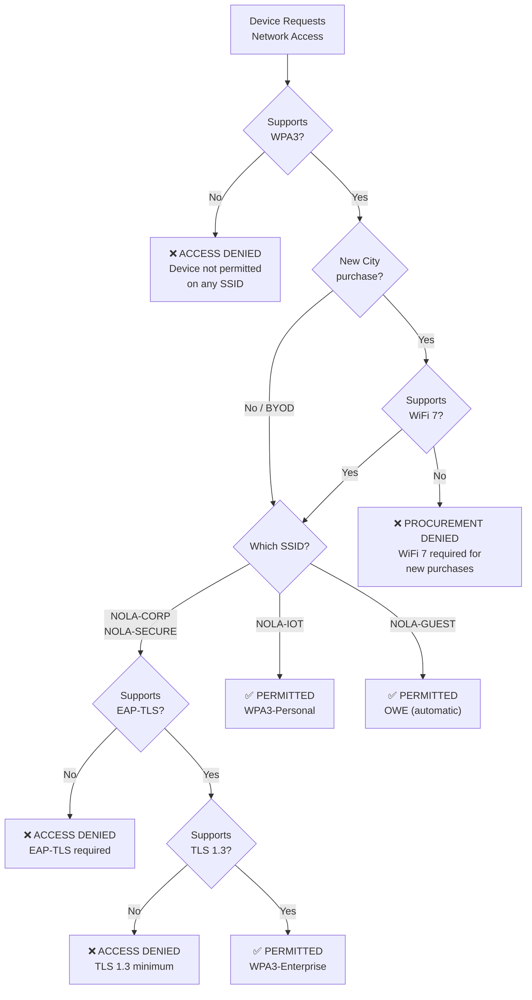

# Wireless Client Requirements

## Overview

This document defines the mandatory requirements for any wireless client device connecting to City of New Orleans networks. It serves as the authoritative reference for device compatibility, procurement decisions, and client onboarding procedures. All wireless client devices must support WPA3. There are no exceptions, waivers, or alternative access paths for devices that do not meet this requirement.

## Executive Summary

**For department heads and procurement staff:**

Every wireless device on the City network must support WPA3 encryption. If a device does not support WPA3, it cannot connect — period. When purchasing new wireless devices (laptops, tablets, phones, printers, cameras, or any other wireless equipment), the device must also support WiFi 7 (802.11be). Use the [Procurement Pass/Fail Checklist](#procurement-passfail-checklist) at the end of this document to verify any device before purchase.

**Quick reference:**

| Rule | Requirement |
|------|-------------|
| Existing devices | Must support WPA3 |
| New purchases | Must support WPA3 **and** WiFi 7 |
| Authentication (NOLA-CORP, NOLA-SECURE) | EAP-TLS with client certificate |
| Authentication (NOLA-IOT) | WPA3-Personal (pre-shared key) |
| Authentication (NOLA-GUEST) | OWE (automatic, no password) |
| Exceptions | **None** |

## Standards References

| Standard | Title | Ratification Date | Scope |
|----------|-------|-------------------|-------|
| IEEE 802.11be-2024 | Extremely High Throughput WLAN | January 2024 | WiFi 7 client PHY/MAC |
| IEEE 802.11ax-2021 | High Efficiency WLAN | February 2021 | WiFi 6/6E backward compatibility |
| IEEE 802.11w-2009 | Protected Management Frames | September 2009 | PMF client support |
| IEEE 802.11k-2008 | Radio Resource Measurement | June 2008 | Neighbor reports |
| IEEE 802.11r-2008 | Fast BSS Transition | July 2008 | Fast roaming |
| IEEE 802.11v-2011 | Wireless Network Management | February 2011 | BSS transition management |
| Wi-Fi Alliance WPA3 v3.3 | WPA3 Specification | July 2024 | Client security certification |
| IETF RFC 8446 | TLS 1.3 | August 2018 | Minimum transport security |
| IETF RFC 5216 | EAP-TLS Authentication Protocol | March 2008 | Certificate-based EAP |
| NIST SP 800-53 Rev. 5 | Security Controls | September 2020 | Federal security requirements |
| NIST SP 800-153 | Guidelines for Securing WLANs | February 2012 | WLAN security guidance |

## Mandatory Requirements

### Policy Statements

> **Policy 1 — WPA3 Required (No Exceptions):** All wireless client devices connecting to any City of New Orleans SSID must support WPA3 (Personal, Enterprise, or OWE as applicable). Devices limited to WPA2 or earlier are prohibited from network access. There are no exceptions, waivers, or alternative access paths.

> **Policy 2 — WiFi 7 Required for New Procurements:** All wireless client devices purchased by the City after the effective date of this policy must support IEEE 802.11be (WiFi 7). This includes laptops, tablets, phones, printers, cameras, and all other wirelessly-connected equipment. Existing City-owned devices that support WPA3 but predate WiFi 7 remain permitted until end-of-life replacement. Personal/BYOD devices are exempt from the WiFi 7 procurement requirement but must still meet the WPA3 requirement.

> **Policy 3 — EAP-TLS Certificate Authentication:** All devices connecting to NOLA-CORP or NOLA-SECURE must support EAP-TLS with X.509v3 client certificates. No other EAP method is permitted per the 2026 authentication policy.

> **Policy 4 — TLS 1.3 Minimum:** All EAP-TLS sessions must use TLS 1.3 (RFC 8446) as the minimum transport protocol version. TLS 1.2 and earlier are prohibited.

### Decision Flowchart



## Supported Operating Systems and Minimum Versions

### General-Purpose Devices

| Operating System | Minimum Version | WPA3 Support | WPA3-Enterprise 192-bit | EAP-TLS | WiFi 7 Support | Procurement Eligible |
|------------------|-----------------|--------------|------------------------|---------|----------------|----------------------|
| Windows | 10 (1903) | Yes | No | Yes | No | No |
| Windows | 11 (23H2+) | Yes | Yes | Yes | Yes (WiFi 7 hardware required) | Yes |
| macOS | 10.15 Catalina | Yes | Yes | Yes | No | No |
| macOS | 15 Sequoia+ | Yes | Yes | Yes | Yes (M4+ hardware) | Yes |
| iOS | 13.0 | Yes | Yes | Yes | No | No |
| iOS | 18.0+ | Yes | Yes | Yes | Yes (iPhone 16+) | Yes |
| iPadOS | 13.0 | Yes | Yes | Yes | No | No |
| iPadOS | 18.0+ | Yes | Yes | Yes | Yes (M4 iPads) | Yes |
| Android | 10 | Yes (device dependent) | No | Yes | No | No |
| Android | 14+ | Yes | Yes | Yes | Yes (device dependent) | Conditional |
| ChromeOS | 89 | Yes | Yes | Yes | No | No |
| ChromeOS | 130+ | Yes | Yes | Yes | Yes (select devices) | Conditional |
| Linux | Kernel 5.0+ / wpa_supplicant 2.10+ | Yes (driver dependent) | Yes | Yes | Yes (Kernel 6.5+ / mt7925, ath12k) | Conditional |

**Procurement Eligibility Notes:**

- **Yes** — Device meets both WPA3 and WiFi 7 requirements for new purchases.
- **No** — Device supports WPA3 (permitted on network) but lacks WiFi 7 (cannot be newly purchased by the City).
- **Conditional** — The operating system supports WiFi 7, but hardware varies by device model. The specific device must be verified to contain a WiFi 7 radio before procurement approval.

### Android Fragmentation Advisory

Android WPA3 support varies significantly by manufacturer and device model. While Android 10+ includes WPA3 framework support, actual functionality depends on the wireless chipset and driver implementation. Enterprise WPA3 support on Android is approximately 87% compared to 99% on iOS (Wi-Fi Alliance, 2024). All Android devices should be individually verified for WPA3 compliance before deployment on City networks.

## Supported IoT and Embedded Device Categories

All IoT devices must support WPA3. Devices that cannot demonstrate WPA3 support are not permitted on the wireless network. Consider wired Ethernet (PoE) as an alternative for devices that lack WPA3 capability.

IoT devices connect to NOLA-IOT (WPA3-Personal) unless they support EAP-TLS, in which case they may connect to NOLA-CORP.

| Device Category | WPA3-Capable Chipset Families | WiFi Generation Available | Minimum Firmware Era | Notes |
|-----------------|-------------------------------|---------------------------|----------------------|-------|
| Network Printers / MFPs | Chipsets with Wi-Fi CERTIFIED WPA3 (2024+ models) | WiFi 6 / 6E / 7 | 2024+ | Verify WPA3-Personal or Enterprise on spec sheet; many pre-2023 models lack support |
| IP Security Cameras | SoCs with WPA3-Personal support | WiFi 6 / 6E | 2024+ | Outdoor models must also meet IP67 per cabling standards; prefer wired PoE where feasible |
| Building Automation Controllers | Industrial-grade modules with WPA3-Personal | WiFi 6 | 2025+ | Limited availability; verify with manufacturer before procurement |
| VoIP Handsets (Wireless) | Handsets with Wi-Fi CERTIFIED WPA3 and 802.11r support | WiFi 6 / 6E / 7 | 2024+ | Fast roaming (802.11r) critical for call handoff; verify PMF support |
| Digital Signage / Displays | Embedded SoCs with WPA3-Personal | WiFi 6 / 6E | 2024+ | Prefer wired connection where available |
| Environmental Sensors | Low-power modules with WPA3-Personal | WiFi 6 (HaLow where applicable) | 2025+ | Smallest device category with WPA3 support; verify individually |
| Medical / Health Devices | Chipsets with WPA3-Enterprise and FIPS validation | WiFi 6 / 6E | 2024+ | Must meet HIPAA requirements if handling PHI; require EAP-TLS on NOLA-CORP |

### IoT WPA3 Adoption Data

| Metric | Value | Source | Year |
|--------|-------|--------|------|
| IoT devices with WPA3 support | 23% | Ponemon IoT Security Study | 2024 |
| IoT devices with WiFi 7 support | 5% | IDC Mobility Report | 2026 |
| Projected IoT WiFi 7 support | 25% | IDC Mobility Report | 2028 (projected) |

> **Guidance:** The low WPA3 adoption rate among IoT devices (23%) means most legacy IoT devices will not qualify for the City wireless network. For devices that cannot meet the WPA3 requirement, wired Ethernet with 802.1X or MAB authentication is the recommended alternative. See [802.1X Implementation](../security/802.1x-implementation.md) for wired device authentication standards.

## Client Configuration Requirements

This section consolidates all client-side settings required for successful network onboarding. IT staff should use this as a single reference when configuring any wireless device for the City network.

### Authentication Requirements

| Setting | NOLA-CORP | NOLA-SECURE | NOLA-IOT | NOLA-GUEST |
|---------|-----------|-------------|----------|------------|
| Security mode | WPA3-Enterprise | WPA3-Enterprise 192-bit | WPA3-Personal (SAE) | OWE (Enhanced Open) |
| Authentication | EAP-TLS | EAP-TLS | Pre-shared key | None (automatic) |
| Client certificate | X.509v3 with client auth EKU | X.509v3 with client auth EKU (ECDSA P-384 or RSA 3072+) | N/A | N/A |
| Server certificate validation | Full chain + CRL/OCSP | Full chain + CRL/OCSP | N/A | N/A |
| TLS version | TLS 1.3 minimum (RFC 8446) | TLS 1.3 minimum (RFC 8446) | N/A | N/A |
| Key length | RSA 2048+ or ECC P-256+ | ECDSA P-384 or RSA 3072+ (CNSA 2.0) | N/A | N/A |
| Certificate enrollment | City PKI infrastructure | City PKI infrastructure | IT-managed rotation | N/A |

### Security Settings (All SSIDs)

| Setting | Required Value | Applicable SSIDs | Standard Reference |
|---------|----------------|-------------------|-------------------|
| Protected Management Frames (PMF) | **Mandatory** (not optional) | All | IEEE 802.11w-2009 |
| Transition Disable | **Enabled** | NOLA-CORP, NOLA-SECURE, NOLA-IOT | Wi-Fi Alliance WPA3 |
| TLS minimum version | **TLS 1.3** | NOLA-CORP, NOLA-SECURE | RFC 8446 |

### Roaming Settings

| Setting | Required Value | Applicable SSIDs | Standard Reference |
|---------|----------------|-------------------|-------------------|
| IEEE 802.11k (Neighbor Reports) | **Enabled** | All | IEEE 802.11k-2008 |
| IEEE 802.11r (Fast BSS Transition) | **Enabled** | All (critical for VoIP) | IEEE 802.11r-2008 |
| IEEE 802.11v (BSS Transition Management) | **Enabled** | All | IEEE 802.11v-2011 |

### Band Preferences

| Priority | Band | Use Case |
|----------|------|----------|
| 1 (Preferred) | 6 GHz | WiFi 7 clients with MLO; maximum throughput and lowest latency |
| 2 (Secondary) | 5 GHz | WiFi 5/6/6E clients; primary band for non-WiFi 7 devices |
| 3 (Tertiary) | 2.4 GHz | IoT devices and legacy compatibility only |

- **Multi-Link Operation (MLO):** Enabled on WiFi 7 clients for simultaneous multi-band connectivity. MLO provides seamless failover if one band experiences interference.

### Per-SSID Onboarding Checklist

#### NOLA-CORP Onboarding

- [ ] Verify device supports WPA3-Enterprise
- [ ] Verify device supports TLS 1.3
- [ ] Enroll device certificate via City PKI (X.509v3, client auth EKU)
- [ ] Configure EAP-TLS as authentication method
- [ ] Enable server certificate validation with full chain + CRL/OCSP
- [ ] Set PMF to mandatory
- [ ] Enable 802.11k/r/v roaming protocols
- [ ] Set band preference: 6 GHz > 5 GHz > 2.4 GHz
- [ ] Test authentication and VLAN assignment (VLAN 20)

#### NOLA-SECURE Onboarding

- [ ] Verify device supports WPA3-Enterprise 192-bit mode
- [ ] Verify device supports TLS 1.3
- [ ] Enroll user **and** device certificates via City PKI (ECDSA P-384 or RSA 3072+)
- [ ] Configure EAP-TLS as authentication method
- [ ] Enable server certificate validation with full chain + CRL/OCSP
- [ ] Set PMF to mandatory (BIP-GMAC-256)
- [ ] Enable 802.11k/r/v roaming protocols
- [ ] Set band preference: 6 GHz > 5 GHz
- [ ] Verify MAC is on NOLA-SECURE allowlist
- [ ] Test authentication and VLAN assignment (VLAN 50)

#### NOLA-IOT Onboarding

- [ ] Verify device supports WPA3-Personal (SAE)
- [ ] Configure pre-shared key (obtain from IT)
- [ ] Set PMF to mandatory
- [ ] Verify device connects to VLAN 200
- [ ] Confirm client isolation is active

#### NOLA-GUEST (No Configuration Required)

- OWE encryption is negotiated automatically by compatible devices
- Users must accept captive portal terms of use
- No certificates, passwords, or IT configuration needed

## Procurement Pass/Fail Checklist

Use this checklist to evaluate any wireless device before purchase. Every **Required** item must pass. If any Required item fails, the device is **not approved** for procurement.

### Wireless Device Procurement Checklist

| # | Requirement | Required | Pass | Fail |
|---|-------------|----------|------|------|
| 1 | Device supports WPA3 (Personal or Enterprise) | **Yes** | ☐ | ☐ |
| 2 | Device supports IEEE 802.11be (WiFi 7) | **Yes** | ☐ | ☐ |
| 3 | Device supports Protected Management Frames (PMF / 802.11w) | **Yes** | ☐ | ☐ |
| 4 | Device supports EAP-TLS authentication (if connecting to NOLA-CORP or NOLA-SECURE) | **Conditional** | ☐ | ☐ |
| 5 | Device supports TLS 1.3 (RFC 8446) | **Yes** | ☐ | ☐ |
| 6 | Device supports 802.11k/r/v roaming protocols | **Yes** | ☐ | ☐ |
| 7 | Device operates on 5 GHz and/or 6 GHz bands | **Yes** | ☐ | ☐ |
| 8 | Manufacturer provides current firmware/driver updates | **Yes** | ☐ | ☐ |
| 9 | Wi-Fi Alliance certification (WPA3 and/or WiFi 7) | **Yes** | ☐ | ☐ |

### Results

| Outcome | Action |
|---------|--------|
| All Required items pass | **Approved for procurement** |
| Any Required item fails | **Not approved — do not purchase** |
| Questions about a specific device | Contact Network Engineering (ITI Networking Team) |

### How to Verify Requirements

| Checklist Item | Where to Find |
|----------------|---------------|
| WPA3 support | Device spec sheet, Wi-Fi Alliance product finder |
| WiFi 7 (802.11be) | Device spec sheet, "Wi-Fi CERTIFIED 7" logo |
| PMF support | Included with WPA3 certification |
| EAP-TLS | OS documentation, device management capabilities |
| TLS 1.3 | OS version (see Supported OS table above) |
| 802.11k/r/v | Device spec sheet, OS documentation |
| Band support | Device spec sheet, radio specifications |
| Firmware updates | Manufacturer support policy, update history |
| Wi-Fi Alliance certification | wi-fi.org product finder |

## NIST Alignment

### NIST SP 800-53 Control Mapping

| Control ID | Control Name | Client Requirement Implementation |
|------------|--------------|-----------------------------------|
| AC-18 | Wireless Access | WPA3 required for all client devices |
| AC-18(1) | Authentication and Encryption | EAP-TLS with TLS 1.3, AES-GCMP-256 |
| IA-2 | Identification and Authentication | EAP-TLS client certificates |
| IA-3 | Device Identification and Authentication | Device certificates (NOLA-CORP/SECURE), WPA3-Personal (NOLA-IOT) |
| IA-5 | Authenticator Management | Certificate lifecycle via City PKI |
| SC-8 | Transmission Confidentiality | WPA3 encryption on all SSIDs |
| SC-12 | Cryptographic Key Management | TLS 1.3 key exchange, PMK derivation |
| SC-13 | Cryptographic Protection | AES-GCMP-256, CNSA 2.0 (192-bit mode) |
| SC-40 | Wireless Link Protection | PMF (802.11w) mandatory on all clients |

### NIST SP 800-153 Compliance

| Requirement | Client-Side Response |
|-------------|---------------------|
| Use strong encryption | WPA3 mandatory — no WPA2 fallback permitted |
| Implement mutual authentication | EAP-TLS with server and client certificates |
| Protect management frames | PMF required on all devices |
| Verify server identity | Full certificate chain validation with CRL/OCSP |

## Troubleshooting Guide

### Common Client Issues

| Symptom | Likely Cause | Resolution |
|---------|--------------|------------|
| Device cannot see City SSIDs | Device lacks WPA3 support | Verify OS version meets minimum; update or replace device |
| WPA3 association fails | PMF not enabled on client | Enable PMF in wireless settings; update driver |
| EAP-TLS authentication fails | Certificate expired or invalid | Re-enroll device certificate via City PKI |
| TLS handshake fails | Client using TLS 1.2 or earlier | Update OS to version supporting TLS 1.3 |
| Slow roaming between APs | 802.11r not enabled | Enable Fast BSS Transition in client wireless settings |
| Cannot connect to NOLA-SECURE | Missing 192-bit mode support | Verify OS and hardware support WPA3-Enterprise 192-bit |
| Android device intermittent failures | Chipset/driver WPA3 incompatibility | Verify device-specific WPA3 support; consider alternative device |
| IoT device cannot connect | Device lacks WPA3-Personal (SAE) | Device is not permitted; use wired Ethernet alternative |

### Client Diagnostic Flow

```mermaid
flowchart TD
    ISSUE[Client Cannot Connect] --> Q1{Device supports<br/>WPA3?}
    Q1 -->|No| FIX1["Device not permitted<br/>Upgrade or replace"]
    Q1 -->|Yes| Q2{Correct SSID<br/>selected?}

    Q2 -->|No| FIX2["Select appropriate SSID<br/>per device type"]
    Q2 -->|Yes| Q3{Certificate<br/>enrolled?<br/>(CORP/SECURE)}

    Q3 -->|No| FIX3["Enroll via City PKI"]
    Q3 -->|N/A (IOT/GUEST)| Q5{PSK or OWE<br/>configured?}
    Q3 -->|Yes| Q4{TLS 1.3<br/>supported?}

    Q4 -->|No| FIX4["Update OS to<br/>TLS 1.3 support"]
    Q4 -->|Yes| Q6{PMF<br/>enabled?}

    Q5 -->|No| FIX5["Configure PSK or<br/>verify OWE support"]
    Q5 -->|Yes| Q6

    Q6 -->|No| FIX6["Enable PMF in<br/>wireless settings"]
    Q6 -->|Yes| Q7{Roaming<br/>issues?}

    Q7 -->|Yes| FIX7["Enable 802.11k/r/v"]
    Q7 -->|No| ESCALATE["Escalate to<br/>Network Engineering"]
```

## Industry Adoption Data

### WPA3 Client Support Statistics

| Platform | WPA3 Support Rate | Source | Year |
|----------|-------------------|--------|------|
| Enterprise Windows (managed) | 98% | Wi-Fi Alliance | 2024 |
| Enterprise macOS | 96% | Wi-Fi Alliance | 2024 |
| Enterprise iOS | 99% | Wi-Fi Alliance | 2024 |
| Android (enterprise) | 87% | Wi-Fi Alliance | 2024 |
| IoT devices | 23% | Ponemon IoT Security Study | 2024 |

### WiFi 7 Client Ecosystem (2026)

| Device Category | WiFi 7 Support (2026) | Projected (2028) | Source |
|-----------------|----------------------|------------------|--------|
| Flagship smartphones | 85% | 99% | IDC Mobility Report, 2026 |
| Business laptops | 45% | 90% | IDC Mobility Report, 2026 |
| Consumer laptops | 25% | 75% | IDC Mobility Report, 2026 |
| Tablets | 30% | 70% | IDC Mobility Report, 2026 |
| IoT/embedded | 5% | 25% | IDC Mobility Report, 2026 |

## Cross-References

| Document | Relevance |
|----------|-----------|
| [WPA3-Enterprise Standards](../security/wpa3-enterprise.md) | WPA3 cipher suites, 192-bit mode, transition mode |
| [802.1X Implementation](../security/802.1x-implementation.md) | EAP-TLS certificate requirements, RADIUS configuration |
| [OWE Enhanced Open Standards](../security/owe-enhanced-open.md) | OWE for NOLA-GUEST, client compatibility |
| [Access Point Specifications](access-point-specs.md) | WiFi 7 AP requirements, band configuration |
| [SSID Standards](ssid-standards.md) | SSID definitions, security modes, VLAN assignments |
| [Design Standards](design-standards.md) | Coverage thresholds, high-density design |
| [Deployment Procedures](deployment-procedures.md) | Site survey validation with representative client devices |

## Document History

| Version | Date | Changes |
|---------|------|---------|
| 1.0.0 | 2026-02-04 | Initial release — WPA3 mandatory, WiFi 7 procurement requirement, client compatibility tables, IoT categories, procurement checklist |

## References

1. IEEE 802.11be-2024, "Enhancements for Extremely High Throughput (EHT)," IEEE, January 2024.
2. IEEE 802.11ax-2021, "Enhancements for High-Efficiency WLAN," IEEE, February 2021.
3. IEEE 802.11-2020, "Wireless LAN Medium Access Control (MAC) and Physical Layer (PHY) Specifications," IEEE, December 2020.
4. IEEE 802.11w-2009, "Protected Management Frames," IEEE, September 2009.
5. IEEE 802.11r-2008, "Fast Basic Service Set (BSS) Transition," IEEE, July 2008.
6. IEEE 802.11k-2008, "Radio Resource Measurement of Wireless LANs," IEEE, June 2008.
7. IEEE 802.11v-2011, "Wireless Network Management," IEEE, February 2011.
8. Wi-Fi Alliance, "WPA3 Specification Version 3.3," Wi-Fi Alliance, July 2024.
9. Wi-Fi Alliance, "Wi-Fi CERTIFIED 7," Wi-Fi Alliance, January 2024.
10. IETF RFC 8446, "The Transport Layer Security (TLS) Protocol Version 1.3," IETF, August 2018.
11. IETF RFC 5216, "The EAP-TLS Authentication Protocol," IETF, March 2008.
12. NIST SP 800-53 Rev. 5, "Security and Privacy Controls for Information Systems and Organizations," NIST, September 2020.
13. NIST SP 800-153, "Guidelines for Securing Wireless Local Area Networks (WLANs)," NIST, February 2012.
14. NSA, "Commercial National Security Algorithm Suite 2.0," NSA Cybersecurity, September 2022.

---

*For questions about these standards, open an issue or contact the ITI Networking Team.*
