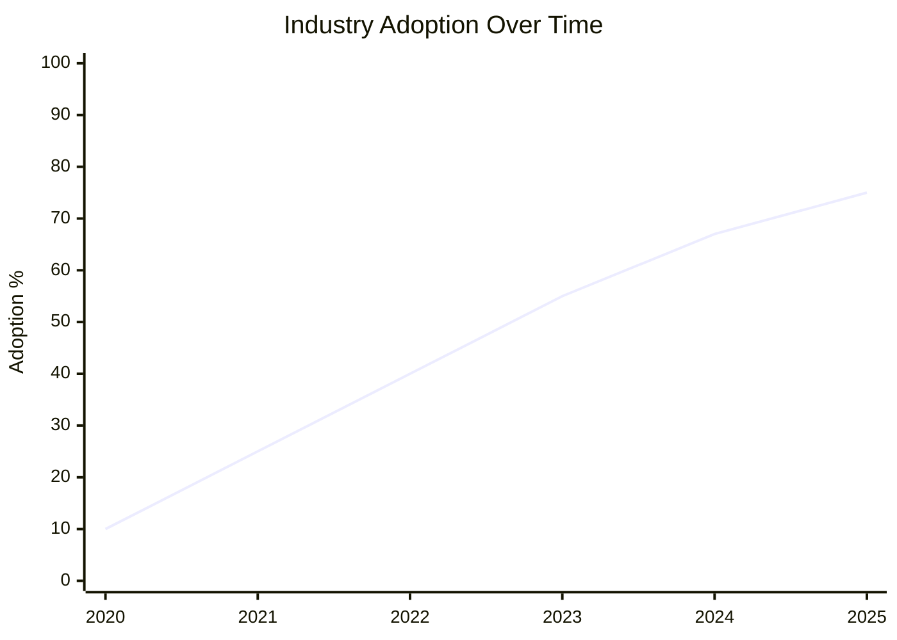
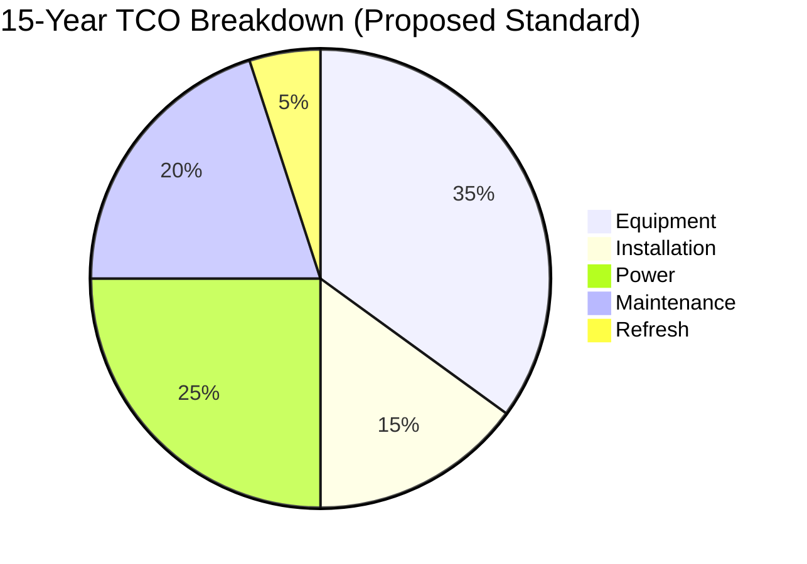
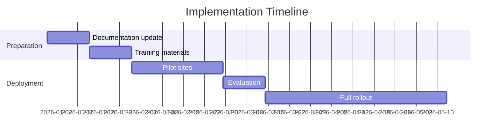
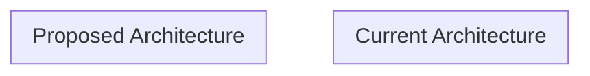

# RFC-NNNN: [Title]

**RFC Number:** RFC-NNNN (assigned by maintainer)  
**Title:** [Descriptive title]  
**Author(s):** [Name(s) and GitHub handle(s)]  
**Status:** Draft | Discussion | Review | Accepted | Rejected | Implemented  
**Created:** YYYY-MM-DD  
**Discussion Period Ends:** YYYY-MM-DD (30 days from Discussion start)  
**Last Updated:** YYYY-MM-DD

---

## Abstract

[2-3 sentence summary of what this RFC proposes]

---

## Motivation

[Why is this change needed? What problem does it solve?]

---

## Standards Reference

| Attribute | Value |
|-----------|-------|
| **Governing Body** | [IEEE / ANSI / TIA / IETF / ISO / NIST] |
| **Standard Number** | [e.g., IEEE 802.3bt-2018] |
| **Standard Title** | [Official title] |
| **Ratification Date** | [YYYY-MM-DD] |
| **Supersedes** | [Previous standard, if any] |
| **Superseded By** | [Newer standard, if any — N/A if current] |

---

## Industry Adoption

[Provide statistics on current industry adoption]

| Source | Statistic | Date |
|--------|-----------|------|
| [Survey/Report name] | [X% adoption] | [YYYY] |
| [Survey/Report name] | [X% adoption] | [YYYY] |

### Adoption Trend

---

## Cost-Performance Analysis

### Assumptions

- Deployment size: [X] units
- Lifecycle period: [X] years
- Labor rate: [Municipal average or specific rate]
- Power cost: [$X.XX/kWh]

### Comparison

| Cost Category | Current Standard | Proposed Standard | Difference |
|---------------|------------------|-------------------|------------|
| Equipment cost | $X | $X | +/-X% |
| Installation | $X | $X | +/-X% |
| Annual power | $X | $X | +/-X% |
| Annual maintenance | $X | $X | +/-X% |
| Refresh cycle (year) | X | X | +/-X years |
| **15-Year TCO** | **$X** | **$X** | **+/-X%** |
| **TCO/unit/year** | **$X** | **$X** | **+/-X%** |

### TCO Visualization

---

## Security Implications

### Security Comparison

| Security Feature | Current Standard | Proposed Standard |
|------------------|------------------|-------------------|
| [Feature 1] | [Yes/No/Level] | [Yes/No/Level] |
| [Feature 2] | [Yes/No/Level] | [Yes/No/Level] |
| [Feature 3] | [Yes/No/Level] | [Yes/No/Level] |

### NIST Alignment

[Describe how this standard aligns with relevant NIST guidelines]

| NIST Reference | Requirement | Compliance |
|----------------|-------------|------------|
| [SP 800-XX] | [Requirement] | ✅ / ⚠️ / ❌ |

### Known Vulnerabilities

[List any known vulnerabilities in the proposed standard and mitigations]

---

## Reliability Considerations

| Metric | Current Standard | Proposed Standard |
|--------|------------------|-------------------|
| Expected MTBF | [X hours] | [X hours] |
| Failure rate | [X%/year] | [X%/year] |
| Redundancy support | [Yes/No] | [Yes/No] |
| Failover time | [Xms] | [Xms] |

---

## Backwards Compatibility

[Describe compatibility with existing infrastructure]

### Migration Path

### Coexistence Period

[How long can current and proposed standards coexist?]

---

## Implementation Plan

### Timeline

### Resource Requirements

| Resource | Quantity | Notes |
|----------|----------|-------|
| Staff training hours | X | [Details] |
| Documentation updates | X pages | [Details] |
| Testing equipment | X | [Details] |

---

## Diagrams

### Architecture Diagram

### [Additional Diagrams as Needed]

[Add any other diagrams that help explain the proposal]

---

## References

1. [Standard body], "[Standard title]," [Standard number], [Year]. [URL if available]
2. [Author], "[Article/Report title]," [Publication], [Year]. [URL if available]
3. [Organization], "[Survey/Report title]," [Year]. [URL if available]

---

## Changelog

| Date | Author | Changes |
|------|--------|---------|
| YYYY-MM-DD | [Author] | Initial draft |

---

## Discussion

[This section will be populated during the Discussion phase with community feedback summaries]

### Community Feedback Summary

| Feedback Theme | Count | Resolution |
|----------------|-------|------------|
| [Theme 1] | X | [How addressed] |
| [Theme 2] | X | [How addressed] |

---

## Decision

**Status:** [Accepted / Rejected]  
**Decision Date:** YYYY-MM-DD  
**Decision Maker:** [Maintainer name]

### Rationale

[Explanation of why the RFC was accepted or rejected]

### Conditions (if any)

[Any conditions or modifications required for acceptance]

---

*RFC template version 1.0.0 — City of New Orleans Network Standards*
